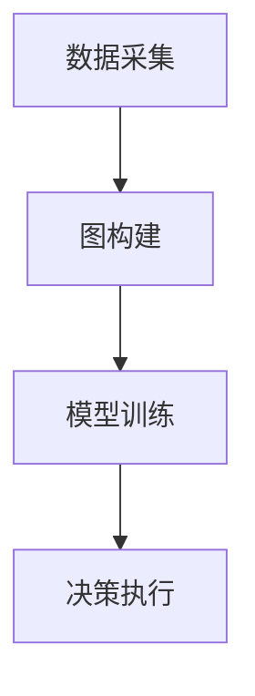
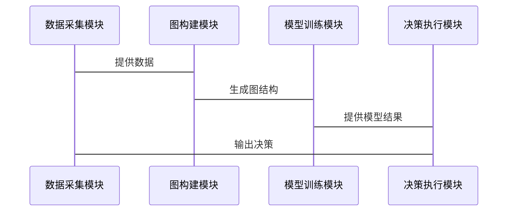

                 


# 企业AI Agent的图神经网络在组织网络优化中的应用

> 关键词：企业AI Agent，图神经网络，组织网络优化，网络架构设计，系统优化

> 摘要：本文探讨了企业AI Agent与图神经网络在组织网络优化中的应用，详细分析了图神经网络的核心算法，设计了AI Agent的系统架构，并通过项目实战展示了其应用价值。

---

# 第一部分: 背景与核心概念

## 第1章: 企业AI Agent与图神经网络概述

### 1.1 企业AI Agent的基本概念

#### 1.1.1 什么是企业AI Agent
企业AI Agent是一种能够感知环境、执行任务并做出决策的智能体，用于优化企业资源和流程。

#### 1.1.2 AI Agent的核心特征
- **自主性**：无需外部干预
- **反应性**：实时响应环境变化
- **目标导向**：基于目标执行任务
- **学习能力**：通过经验改进性能

#### 1.1.3 企业AI Agent的应用场景
- 供应链优化
- 资源分配
- 风险管理
- 客户服务

### 1.2 图神经网络的基本原理

#### 1.2.1 图论基础
- 图论概念：节点、边、图
- 表示关系：边的权重和方向

#### 1.2.2 神经网络基础
- 神经网络基本结构：输入层、隐藏层、输出层
- 网络训练：前向传播、反向传播

#### 1.2.3 图神经网络的定义与特点
- 图神经网络：处理图结构数据的神经网络
- 特点：
  - 处理复杂关系
  - 节点间关系建模
  - 全局信息聚合

### 1.3 企业AI Agent与图神经网络的结合

#### 1.3.1 图神经网络在企业AI Agent中的作用
- **数据建模**：企业结构和关系
- **决策支持**：基于图的特征
- **实时优化**：动态调整策略

#### 1.3.2 企业网络优化的背景与挑战
- 优化目标：效率、成本、资源分配
- 主要挑战：动态性、复杂性、实时性

#### 1.3.3 图神经网络在组织网络优化中的优势
- **全局视角**：考虑整体结构
- **局部细节**：捕捉细微变化
- **动态适应**：实时更新和调整

## 1.4 本章小结
本章介绍了企业AI Agent和图神经网络的基本概念，并分析了它们在组织优化中的结合和优势。

---

# 第二部分: 图神经网络的核心算法与实现

## 第2章: 图神经网络的核心算法

### 2.1 图卷积网络（GCN）

#### 2.1.1 GCN的基本原理
GCN将图的结构信息与节点特征结合，进行卷积操作。

#### 2.1.2 GCN的数学模型
$$ Y = A X X^T $$
其中，A是邻接矩阵，X是特征矩阵，Y是输出。

#### 2.1.3 GCN的实现步骤
1. **构建邻接矩阵**：表示节点间关系
2. **计算归一化矩阵**：处理权重和度
3. **执行前向传播**：计算节点表示

#### 2.1.4 GCN的Python代码实现
```python
import numpy as np

def compute_gcn(x, adj):
    normalized_adj = adj / (adj.sum(axis=1).reshape(-1, 1))
    output = np.dot(normalized_adj, x)
    return output
```

### 2.2 图注意力网络（GAT）

#### 2.2.1 GAT的基本原理
GAT通过注意力机制，赋予不同邻居节点不同权重。

#### 2.2.2 GAT的数学模型
$$ \alpha_{ij} = \text{softmax}(e^{a^T(x_i - x_j)}) $$
其中，α是注意力权重，a是可学习的参数。

#### 2.2.3 GAT的实现步骤
1. **计算注意力权重**
2. **计算加权和**
3. **前向传播**

#### 2.2.4 GAT的Python代码实现
```python
import torch

class GATLayer(torch.nn.Module):
    def __init__(self, in_features, out_features):
        super(GATLayer, self).__init__()
        self.w = torch.nn.Parameter(torch.zeros(in_features, out_features))
        self.a = torch.nn.Parameter(torch.zeros(1, out_features))

    def forward(self, x, adj):
        x = torch.mm(x, self.w)
        attention = torch.mul(x, self.a)
        attention = torch.sum(attention, dim=1)
        attention = torch.softmax(attention, dim=0)
        output = torch.mm(attention, x)
        return output
```

### 2.3 图嵌入与表示学习

#### 2.3.1 图嵌入的基本概念
- 图嵌入：节点的低维表示
- 表示学习：通过模型学习节点表示

#### 2.3.2 图嵌入的实现方法
- 基于GCN的嵌入
- 基于GAT的嵌入

#### 2.3.3 图嵌入在企业AI Agent中的应用
- 节点表示用于分类、聚类
- 边嵌入用于关系分析

### 2.4 本章小结
本章详细介绍了GCN和GAT的核心算法，并展示了它们的数学模型和代码实现。

---

# 第三部分: 企业AI Agent的系统架构与设计

## 第3章: 企业AI Agent的系统架构设计

### 3.1 系统功能设计

#### 3.1.1 问题场景介绍
- 需要优化的企业网络问题
- AI Agent的目标和任务

#### 3.1.2 系统功能模块划分
- 数据采集模块
- 图构建模块
- 模型训练模块
- 决策执行模块

#### 3.1.3 功能模块之间的关系
- 数据采集提供输入，图构建生成结构，模型训练生成表示，决策执行输出策略

### 3.2 系统架构设计

#### 3.2.1 系统架构图


#### 3.2.2 详细架构设计
- 数据采集模块：从数据库获取实时数据
- 图构建模块：生成邻接矩阵和边权重
- 模型训练模块：训练GCN或GAT模型
- 决策执行模块：根据模型输出制定策略

### 3.3 系统接口设计

#### 3.3.1 接口定义
- 数据输入接口：接收实时数据
- 模型调用接口：调用训练好的模型
- 决策输出接口：输出优化策略

#### 3.3.2 接口交互流程
1. 数据采集模块调用数据输入接口获取数据
2. 图构建模块调用模型调用接口生成图结构
3. 模型训练模块调用接口训练模型
4. 决策执行模块调用接口输出决策

### 3.4 系统交互设计

#### 3.4.1 系统交互序列图


### 3.5 本章小结
本章详细设计了企业AI Agent的系统架构，包括功能模块、接口设计和交互流程。

---

# 第四部分: 项目实战与案例分析

## 第4章: 项目实战

### 4.1 环境安装与配置

#### 4.1.1 安装Python和必要的库
- 安装Python 3.7+
- 安装PyTorch、numpy、networkx

#### 4.1.2 安装依赖管理工具
- 使用pip安装依赖

### 4.2 系统核心实现

#### 4.2.1 数据采集模块实现
```python
import networkx as nx

def build_graph(data):
    G = nx.Graph()
    for node in data['nodes']:
        G.add_node(node)
    for edge in data['edges']:
        G.add_edge(edge[0], edge[1], weight=edge[2])
    return G
```

#### 4.2.2 图神经网络实现
```python
class GCN(torch.nn.Module):
    def __init__(self, input_dim, hidden_dim):
        super(GCN, self).__init__()
        self.gc = GATLayer(input_dim, hidden_dim)
        self.relu = torch.nn.ReLU()

    def forward(self, x, adj):
        x = self.gc(x, adj)
        x = self.relu(x)
        return x
```

#### 4.2.3 决策执行模块实现
```python
def execute_decision(policy):
    # 根据策略执行决策
    pass
```

### 4.3 项目案例分析

#### 4.3.1 案例背景介绍
- 某企业需要优化供应链网络
- 使用AI Agent和图神经网络进行优化

#### 4.3.2 数据分析与预处理
- 数据清洗
- 特征提取

#### 4.3.3 模型训练与优化
- 训练GCN模型
- 调整超参数

#### 4.3.4 模型评估与分析
- 评估指标：准确率、召回率
- 模型效果分析

### 4.4 本章小结
本章通过实际项目展示了企业AI Agent的实现过程，包括环境配置、模块实现和案例分析。

---

# 第五部分: 最佳实践与总结

## 第5章: 最佳实践

### 5.1 小结与总结
- 企业AI Agent在组织网络优化中的应用价值
- 图神经网络的优势和局限性

### 5.2 注意事项
- 数据质量：保证数据准确性和完整性
- 模型选择：根据场景选择合适算法
- 可解释性：确保决策可解释
- 安全性：保护数据和模型安全

### 5.3 拓展阅读
- 图神经网络的最新研究
- AI Agent的其他应用场景

## 5.4 结束语
企业AI Agent结合图神经网络为企业组织优化提供了新的可能性，未来随着技术进步，应用前景广阔。

---

# 作者：AI天才研究院/AI Genius Institute & 禅与计算机程序设计艺术 /Zen And The Art of Computer Programming

---

这篇博客文章详细探讨了企业AI Agent与图神经网络在组织网络优化中的应用，通过理论分析、算法实现和项目实战，全面展示了其技术优势和实际应用价值。

