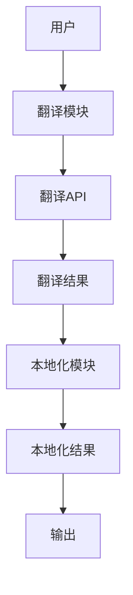

                 


# 企业AI Agent的多语言翻译与本地化功能

## 关键词
- 企业AI Agent
- 多语言翻译
- 本地化功能
- 神经机器翻译
- 系统架构设计

## 摘要
随着全球化进程的加速，企业AI Agent在多语言环境下的应用变得越来越重要。本文详细探讨了企业AI Agent的多语言翻译与本地化功能，从核心概念、算法原理、系统架构到项目实战，全面解析了实现多语言翻译与本地化的关键技术与实践。通过实际案例分析和详细代码实现，本文为读者提供了从理论到实践的完整指南。

---

# 第一章: 企业AI Agent的多语言翻译与本地化概述

## 1.1 企业AI Agent的基本概念

### 1.1.1 AI Agent的定义与特点
AI Agent（人工智能代理）是一种能够感知环境、自主决策并执行任务的智能实体。企业AI Agent通常用于企业内部的自动化流程、客户交互、数据处理等场景。其特点包括：
- **自主性**：能够独立决策。
- **反应性**：能够实时感知环境变化。
- **目标导向性**：专注于完成特定任务。

### 1.1.2 多语言翻译的需求背景
在全球化背景下，企业需要与来自不同语言环境的用户、客户和合作伙伴进行交互。多语言翻译功能能够帮助AI Agent理解并生成多种语言的文本，满足跨语言交流的需求。

### 1.1.3 本地化功能的重要性
本地化不仅仅是语言的转换，还包括文化、习俗、习惯等的适配。本地化功能能够提升用户体验，使AI Agent在不同地区表现出符合当地习惯的行为和表达。

---

## 1.2 问题背景与目标

### 1.2.1 当前企业级AI Agent的挑战
- **语言障碍**：不同地区的用户使用不同的语言，增加了沟通的复杂性。
- **文化差异**：简单的语言翻译无法涵盖文化差异带来的问题。
- **技术实现难度**：多语言翻译和本地化需要复杂的技术支持。

### 1.2.2 多语言翻译的核心问题
- **翻译准确性**：如何保证机器翻译的准确性和流畅性。
- **语言多样性**：支持多种语言的翻译，包括小语种和方言。

### 1.2.3 本地化功能的目标与意义
- **提升用户体验**：使AI Agent在不同地区的用户中表现一致。
- **增强竞争力**：通过本地化功能，企业能够更好地满足客户需求。

---

# 第二章: 多语言翻译的核心原理

## 2.1 多语言翻译的基本原理

### 2.1.1 翻译模型的输入输出结构
- **输入**：源语言文本。
- **输出**：目标语言文本。

### 2.1.2 翻译的准确性与流畅性
- **准确性**：翻译结果与原意一致。
- **流畅性**：翻译后的文本读起来自然流畅。

## 2.2 本地化的核心要素

### 2.2.1 本地化与翻译的区别
- **翻译**：仅处理语言的转换。
- **本地化**：包括文化、习俗等的适配。

### 2.2.2 文化适配性的重要性
- **日期格式**：不同地区的日期表示方式不同。
- **货币单位**：不同地区的货币符号和单位不同。

---

# 第三章: 多语言翻译与本地化的技术实现

## 3.1 翻译模型的选择与优化

### 3.1.1 基于规则的翻译与统计机器翻译
- **基于规则的翻译**：根据预定义的语法规则进行翻译。
- **统计机器翻译**：基于大量的双语对照语料库，利用统计模型进行翻译。

### 3.1.2 神经机器翻译的原理
神经机器翻译（NMT）是一种基于深度学习的翻译方法。其核心思想是将源语言文本表示为一个向量，然后通过解码器生成目标语言文本。

### 3.1.3 模型训练中的挑战与解决方案
- **数据稀疏性**：小语种数据不足。
- **模型调优**：通过数据增强、调整模型结构等方法提升翻译质量。

---

# 第四章: 系统架构与实现

## 4.1 系统功能模块划分

### 4.1.1 翻译模块
- **输入处理**：接收源语言文本。
- **翻译处理**：调用翻译API进行翻译。
- **输出处理**：返回目标语言文本。

### 4.1.2 本地化模块
- **文化适配**：调整日期、货币等格式。
- **语言适配**：根据用户语言选择合适的翻译结果。

## 4.2 系统架构设计

### 4.2.1 系统功能设计
- **用户输入**：用户输入源语言文本。
- **翻译处理**：调用翻译API。
- **本地化处理**：调整结果以适应目标语言的文化习惯。

### 4.2.2 系统架构图


## 4.3 项目实战

### 4.3.1 环境安装
- **Python**：安装Python 3.8及以上版本。
- **TensorFlow**：安装TensorFlow和Keras。

### 4.3.2 核心代码实现

```python
import tensorflow as tf
from tensorflow.keras.layers import Input, LSTM, Dense
from tensorflow.keras.models import Model

# 定义编码器
def create_encoder(vocab_size, embedding_dim, units):
    inputs = Input(shape=(None,))
    embeddings = tf.keras.layers.Embedding(vocab_size, embedding_dim)(inputs)
    lstm, state_h, state_c = LSTM(units, return_sequences=True, return_state=True)(embeddings)
    encoder_model = Model(inputs=inputs, outputs=lstm)
    return encoder_model, state_h, state_c

# 定义解码器
def create_decoder(vocab_size, embedding_dim, units):
    inputs = Input(shape=(None,))
    embeddings = tf.keras.layers.Embedding(vocab_size, embedding_dim)(inputs)
    lstm, state_h, state_c = LSTM(units, return_sequences=True, return_state=True)(embeddings)
    dense = Dense(vocab_size, activation='softmax')(lstm)
    decoder_model = Model(inputs=inputs, outputs=dense)
    return decoder_model

# 编码器和解码器的连接
encoder_model, state_h, state_c = create_encoder(...)
decoder_model = create_decoder(...)
```

### 4.3.3 代码应用解读与分析
- **编码器**：将源语言文本编码为向量。
- **解码器**：将编码后的向量解码为目标语言文本。
- **连接**：编码器的输出作为解码器的输入。

## 4.4 实际案例分析

### 4.4.1 案例背景
- **公司**：一家跨国企业。
- **需求**：实现AI Agent的多语言翻译和本地化功能。

### 4.4.2 实施步骤
- **需求分析**：确定支持的语言种类和本地化的具体要求。
- **技术实现**：选择合适的翻译和本地化技术。
- **测试与优化**：进行功能测试和性能优化。

---

# 第五章: 最佳实践与小结

## 5.1 最佳实践 tips
- **选择合适的翻译技术**：根据需求选择神经机器翻译或统计机器翻译。
- **文化适配性测试**：确保本地化结果符合目标地区的文化习惯。

## 5.2 小结
企业AI Agent的多语言翻译与本地化功能是全球化背景下企业智能化发展的必要能力。通过本文的分析和实践，读者可以深入了解实现这一功能的关键技术与方法。

## 5.3 注意事项
- **数据安全**：处理用户数据时需注意隐私保护。
- **性能优化**：确保翻译和本地化功能的高效运行。

## 5.4 拓展阅读
- **神经机器翻译的最新进展**：了解最新的研究成果和应用。
- **本地化工具与平台**：探索市场上现有的本地化工具和平台。

---

# 作者：AI天才研究院 & 禅与计算机程序设计艺术

---

感谢您的耐心阅读，希望本文对您理解和实现企业AI Agent的多语言翻译与本地化功能有所帮助。

