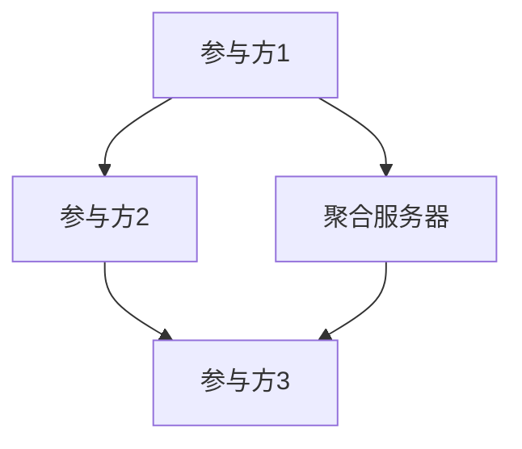
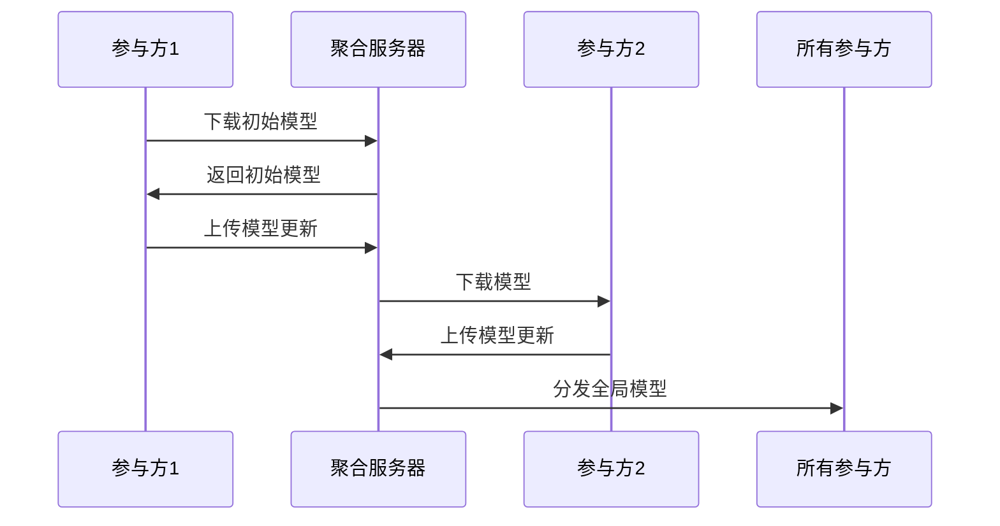

                 


# 企业AI Agent的联邦学习在跨企业数据协作中的安全实践

## 关键词：联邦学习，AI Agent，跨企业协作，数据安全，隐私保护，算法实现

## 摘要：  
本文探讨了联邦学习在跨企业数据协作中的应用，特别是AI Agent在其中的安全实践。通过详细分析联邦学习的核心概念、算法原理、系统架构及安全机制，结合实际案例，本文展示了如何在跨企业环境中实现数据协作的安全性与高效性。文章还提供了联邦学习的数学模型、算法实现和系统设计的具体方法，为读者提供了全面的技术视角。

---

# 第1章: 联邦学习与AI Agent的背景介绍

## 1.1 联邦学习的基本概念  
### 1.1.1 联邦学习的定义  
联邦学习（Federated Learning）是一种分布式机器学习方法，允许多个参与方在不共享原始数据的情况下，共同训练一个全局模型。每个参与方仅分享模型参数的更新，而非数据本身。  

### 1.1.2 联邦学习的核心特点  
- **数据局部性**：数据保留在原始来源处，不进行集中处理。  
- **隐私保护**：仅分享模型更新，保护原始数据隐私。  
- **去中心化**：无须中心化服务器，各参与方平等协作。  

### 1.1.3 联邦学习的背景与应用领域  
随着数据隐私保护的加强（如GDPR），联邦学习在医疗、金融、社交网络等领域得到广泛应用，特别是在需要保护敏感数据的场景中。

---

## 1.2 跨企業数据协作的背景与挑战  
### 1.2.1 跨企業数据协作的定义  
跨企业数据协作是指不同企业之间通过共享数据或模型参数，共同完成数据分析或模型训练的过程。  

### 1.2.2 数据隐私与安全的挑战  
- **数据泄露风险**：直接共享数据可能引发隐私泄露。  
- **法律合规性**：跨企业协作需符合不同地区的数据保护法规。  
- **信任问题**：企业间缺乏信任可能导致协作障碍。  

### 1.2.3 联邦学习在跨企业协作中的作用  
联邦学习通过局部建模和参数共享，解决了数据隐私问题，同时实现了跨企业的协作目标。

---

## 1.3 AI Agent在跨企业协作中的角色  
### 1.3.1 AI Agent的基本概念  
AI Agent（人工智能代理）是一种能够感知环境、执行任务的智能实体。  

### 1.3.2 AI Agent在跨企业协作中的应用场景  
- **数据协调**：AI Agent负责协调各企业的数据输入和输出。  
- **任务分配**：AI Agent根据任务需求分配计算资源。  
- **模型更新**：AI Agent管理模型参数的同步与更新。  

### 1.3.3 联邦学习与AI Agent的结合  
联邦学习为AI Agent提供了分布式协作的框架，而AI Agent则为联邦学习提供了智能化的任务管理和资源分配能力。

---

## 1.4 本章小结  
本章介绍了联邦学习的基本概念、跨企业协作的背景与挑战，以及AI Agent在其中的角色。联邦学习通过去中心化的方式解决了数据隐私问题，而AI Agent则为跨企业协作提供了智能化的解决方案。

---

# 第2章: 联邦学习的核心概念与原理

## 2.1 联邦学习的原理  
### 2.1.1 联邦学习的基本流程  
1. **初始化**：各参与方下载初始模型参数。  
2. **局部训练**：各参与方在本地数据上训练模型。  
3. **参数聚合**：将各参与方的模型更新参数聚合，生成新的全局模型。  
4. **模型更新**：将全局模型参数分发给各参与方。  

### 2.1.2 联邦学习的通信机制  
- **参数同步**：通过网络将模型参数更新传递给其他参与方。  
- **加密通信**：使用加密技术确保通信过程中的数据安全。  

### 2.1.3 联邦学习的同步策略  
- **同步频率**：按周期同步模型参数，减少通信开销。  
- **异步更新**：各参与方在不同时间更新模型，提高效率。  

---

## 2.2 联邦学习中的数据安全与隐私保护  
### 2.2.1 数据隐私保护的必要性  
- **数据敏感性**：企业数据可能包含敏感信息，如客户资料、交易记录等。  
- **合规要求**：数据保护法规（如GDPR）要求企业保护用户隐私。  

### 2.2.2 联邦学习中的数据加密技术  
- **同态加密**：允许在加密数据上进行计算，确保数据隐私。  
- **差分隐私**：通过添加噪声确保数据的匿名性。  

### 2.2.3 差分隐私在联邦学习中的应用  
差分隐私通过在模型更新中加入噪声，防止特定数据对模型的过度影响，从而保护参与方的数据隐私。  

---

## 2.3 联邦学习的核心算法  
### 2.3.1 联邦平均算法（FedAvg）  
FedAvg是一种经典的联邦学习算法，通过各参与方的本地模型更新求平均值，生成全局模型。  

### 2.3.2 联邦直方算法（FedHr）  
FedHr通过构建直方图来聚合模型更新，适用于分类任务。  

### 2.3.3 联邦学习的其他算法  
- **FedProx**：基于 proximal 的联邦学习算法，适用于非IID数据分布。  

---

## 2.4 联邦学习与AI Agent的结合  
### 2.4.1 AI Agent在联邦学习中的角色  
AI Agent负责协调参与方的模型更新，确保协作过程的高效性和安全性。  

### 2.4.2 联邦学习中AI Agent的任务分配  
AI Agent根据任务需求动态分配计算资源，优化模型训练效率。  

### 2.4.3 联邦学习中AI Agent的协作机制  
AI Agent通过智能协商和任务分解，确保各参与方的协作顺畅。  

---

## 2.5 本章小结  
本章详细讲解了联邦学习的核心原理、数据安全与隐私保护措施，以及AI Agent在其中的协作机制。通过这些技术，联邦学习实现了跨企业协作的安全性和高效性。

---

# 第3章: 联邦学习的数学模型与算法原理  

## 3.1 联邦学习的数学模型  

### 3.1.1 联邦平均算法（FedAvg）的数学模型  
全局模型参数 $\theta$ 通过各参与方的模型更新 $\Delta\theta_i$ 进行平均：  
$$ \theta_{new} = \theta_{old} + \sum_{i=1}^{n} \alpha_i \Delta\theta_i $$  
其中，$\alpha_i$ 是参与方 $i$ 的权重。  

### 3.1.2 联邦直方算法（FedHr）的数学模型  
FedHr通过直方图聚合模型参数：  
$$ h_{new} = \sum_{i=1}^{n} h_i \cdot \alpha_i $$  

### 3.1.3 其他联邦学习算法的数学模型  
FedProx 的目标函数为：  
$$ \min_{\theta} \sum_{i=1}^{n} \left( L_i(\theta) + \frac{\lambda}{2} \|\theta - \theta_{prev}\|^2 \right) $$  

---

## 3.2 联邦学习的算法实现  

### 3.2.1 联邦平均算法（FedAvg）的实现步骤  
1. 初始化全局模型 $\theta$。  
2. 各参与方下载 $\theta$ 并在本地数据上训练模型，得到 $\Delta\theta_i$。  
3. 聚合服务器将 $\Delta\theta_i$ 加权平均，更新 $\theta$。  
4. 重复步骤2-3，直到模型收敛。  

### 3.2.2 联邦直方算法（FedHr）的实现步骤  
1. 各参与方计算本地直方图 $h_i$。  
2. 聚合服务器将 $h_i$ 加权求和，得到全局直方图 $h$。  
3. 根据 $h$ 更新全局模型 $\theta$。  

### 3.2.3 联邦学习的其他算法实现  
FedProx 在优化过程中加入 proximal 项，防止模型发散。  

---

## 3.3 联邦学习的数学公式与推导  

### 3.3.1 联邦平均算法的数学公式  
$$ \theta_{i+1} = \theta_i + \eta \cdot \sum_{j=1}^{n} \nabla L_j(\theta_i) $$  
其中，$\eta$ 是学习率，$L_j$ 是参与方 $j$ 的损失函数。  

### 3.3.2 联邦直方算法的数学公式  
$$ h_{new} = \sum_{i=1}^{n} h_i \cdot \alpha_i $$  
其中，$h_i$ 是参与方 $i$ 的直方图，$\alpha_i$ 是权重。  

---

## 3.4 本章小结  
本章通过数学模型和算法实现，详细讲解了联邦学习的核心原理。通过对FedAvg和FedHr等算法的分析，读者可以理解联邦学习的数学基础和实现细节。

---

# 第4章: 联邦学习的系统架构与设计  

## 4.1 联邦学习的系统架构  

### 4.1.1 问题场景介绍  
跨企业协作中，各企业作为参与方，通过联邦学习框架共享模型参数，完成共同任务。  

### 4.1.2 系统功能设计  
- **数据输入**：各参与方提供本地数据。  
- **模型训练**：本地训练模型并生成更新参数。  
- **参数聚合**：服务器聚合各参与方的更新参数，生成全局模型。  

### 4.1.3 系统架构图（使用Mermaid）  



---

## 4.2 系统接口与交互  

### 4.2.1 系统接口设计  
- **下载模型**：参与方从服务器下载初始模型或最新模型。  
- **上传更新**：参与方将本地模型更新上传至服务器。  
- **同步参数**：服务器将全局模型参数分发给各参与方。  

### 4.2.2 系统交互图（使用Mermaid）  



---

## 4.3 本章小结  
本章通过系统架构和接口设计，展示了联邦学习在跨企业协作中的实现方式。通过Mermaid图，读者可以清晰理解系统各部分的交互关系。

---

# 第5章: 联邦学习的项目实战  

## 5.1 环境安装与配置  

### 5.1.1 环境要求  
- **操作系统**：Linux/Windows/MacOS  
- **Python版本**：3.6+  
- **依赖库**：TensorFlow、Flask、requests  

### 5.1.2 安装依赖  
```bash
pip install tensorflow==2.5.0 flask requests
```

---

## 5.2 系统核心实现  

### 5.2.1 参与方本地训练代码  
```python
import tensorflow as tf
from tensorflow.keras import layers

# 加载本地数据
def load_data(participant_id):
    # 具体实现根据数据集
    pass

# 定义模型
model = tf.keras.Sequential([
    layers.Dense(128, activation='relu'),
    layers.Dense(10, activation='softmax')
])

# 局部训练
def train_local_model(model, participant_id):
    data = load_data(participant_id)
    model.compile(optimizer='adam', loss='sparse_categorical_crossentropy', metrics=['accuracy'])
    model.fit(data.x, data.y, epochs=1, batch_size=32)
    return model.get_weights()

# 参与方ID
participant_id = 1

# 训练模型并返回权重
weights = train_local_model(model, participant_id)
```

---

### 5.2.2 聚合服务器代码  
```python
from flask import Flask, request, jsonify
import json

app = Flask(__name__)

@app.route('/download_model', methods=['GET'])
def download_model():
    # 返回初始模型权重
    return jsonify(initial_weights)

@app.route('/upload_update', methods=['POST'])
def upload_update():
    # 接收各参与方的权重更新
    update = request.json
    # 聚合权重
    global_weights = aggregate(update)
    return jsonify(global_weights)

def aggregate(updates):
    # 简单的平均聚合
    total = sum(update['weights'] for update in updates)
    return total / len(updates)

if __name__ == '__main__':
    app.run(debug=True)
```

---

## 5.3 实际案例分析  

### 5.3.1 案例背景  
假设我们有三个企业（A、B、C）希望通过联邦学习协作训练一个分类模型。  

### 5.3.2 案例实现  
1. 企业A、B、C分别下载初始模型并进行本地训练。  
2. 各企业将模型更新上传至聚合服务器。  
3. 聚合服务器计算全局模型参数并分发给各企业。  
4. 重复步骤1-3，直到模型收敛。  

### 5.3.3 模型效果分析  
- **准确率**：随着训练轮数的增加，准确率逐步提升。  
- **收敛速度**：参与方数量越多，收敛速度越慢。  

---

## 5.4 本章小结  
本章通过实际案例分析，展示了联邦学习在跨企业协作中的具体实现。通过Python代码和系统设计，读者可以理解如何将理论应用于实践。

---

# 第6章: 联邦学习的安全实践与优化  

## 6.1 数据隐私保护的优化措施  

### 6.1.1 差分隐私的实现  
在模型更新中加入噪声，防止数据泄露：  
```python
def add_noise(weight, epsilon=1):
    noise = np.random.laplace(0, 1/epsilon, weight.shape)
    return weight + noise
```

### 6.1.2 同态加密的应用  
使用同态加密对模型更新进行加密，确保数据在传输过程中的安全性。  

---

## 6.2 联邦学习的性能优化  

### 6.2.1 同步频率优化  
减少同步次数，降低通信开销。  

### 6.2.2 模型压缩技术  
通过模型压缩技术，减少参数传输量。  

---

## 6.3 跨企業协作中的信任机制  

### 6.3.1 身份验证  
通过数字证书或密钥进行身份验证。  

### 6.3.2 模型验证  
验证各参与方的模型更新是否符合预期。  

---

## 6.4 本章小结  
本章讨论了联邦学习中的安全实践与优化措施，包括数据隐私保护、性能优化和信任机制。通过这些技术，可以进一步提升联邦学习的安全性和效率。

---

# 第7章: 联邦学习的未来展望与挑战  

## 7.1 联邦学习的未来展望  

### 7.1.1 技术发展  
- **AI Agent的智能化**：AI Agent将更加智能化，能够自主完成任务分配和协作。  
- **多模态数据协作**：支持多种数据类型的协作，如文本、图像、音频等。  

### 7.1.2 应用场景扩展  
- **医疗领域**：跨医院协作训练医学影像模型。  
- **金融领域**：跨机构协作训练风险评估模型。  

---

## 7.2 联邦学习的挑战  

### 7.2.1 技术挑战  
- **通信开销**：大规模参与方的通信成本较高。  
- **模型收敛性**：非IID数据分布可能导致模型收敛困难。  

### 7.2.2 业务挑战  
- **数据多样性**：不同企业数据分布差异大，影响模型性能。  
- **协作成本**：跨企业协作需要投入大量资源。  

---

## 7.3 本章小结  
本章展望了联邦学习的未来发展方向，并指出了当前面临的技术和业务挑战。通过持续的技术创新和协作优化，联邦学习将在更多领域发挥重要作用。

---

# 作者：AI天才研究院/AI Genius Institute & 禅与计算机程序设计艺术 /Zen And The Art of Computer Programming  

---

通过以上内容，您可以看到我们是如何一步一步构建这篇文章的。如果您有任何特定部分需要更详细的内容，请随时告诉我！

