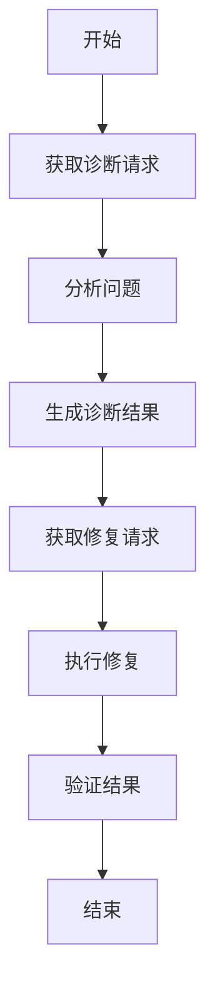
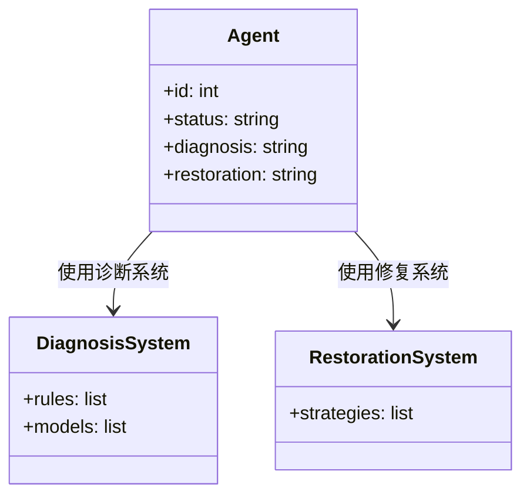
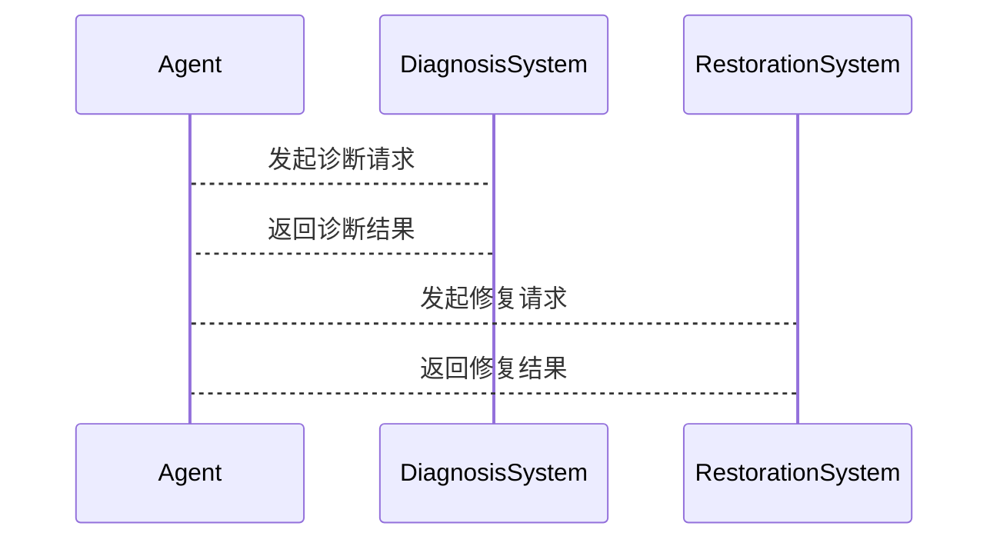

                 


# 企业AI Agent的自我诊断与修复能力

> 关键词：企业AI Agent，自我诊断，修复能力，算法原理，系统架构

> 摘要：本文深入探讨企业AI Agent的自我诊断与修复能力，分析其实现原理、系统架构及实际应用案例，为企业智能化运维提供参考。

---

# 第1章: 问题背景与核心概念

## 1.1 问题背景介绍

### 1.1.1 AI Agent的基本概念
AI Agent（人工智能代理）是能够感知环境、自主决策并执行任务的智能实体。在企业环境中，AI Agent常用于自动化运维、智能客服等领域，需具备自我诊断与修复能力以应对复杂问题。

### 1.1.2 自我诊断与修复能力的重要性
AI Agent在运行中可能面临数据错误、逻辑故障或外部干扰，需能自主检测问题并修复，确保系统稳定运行。

### 1.1.3 企业应用中的实际问题场景
例如，AI Agent在处理客户请求时出现错误，需快速诊断问题并修复，避免影响用户体验。

## 1.2 核心概念与问题描述

### 1.2.1 AI Agent的定义与特征
AI Agent通过感知环境、分析问题并采取行动，具备自主性、反应性、目标导向等特征。

### 1.2.2 自我诊断与修复的核心问题
AI Agent需检测自身故障，分析问题原因，并采取修复措施。

### 1.2.3 边界与外延
自我诊断与修复能力是AI Agent智能化的核心，涉及故障检测、原因分析和修复执行。

## 1.3 问题解决与边界分析

### 1.3.1 解决方案概述
通过算法实现故障检测和修复，结合上下文信息优化修复策略。

### 1.3.2 核心要素与组成结构
包括感知模块、诊断算法、修复模块和反馈机制。

### 1.3.3 相关概念对比
与传统故障处理系统相比，AI Agent更具智能化和自主性。

## 1.4 本章小结
本章介绍了AI Agent的基本概念，分析了自我诊断与修复的重要性及其实现边界。

---

# 第2章: 核心概念与联系

## 2.1 核心概念原理

### 2.1.1 AI Agent的诊断机制
通过收集系统数据，识别异常情况，判断故障原因。

### 2.1.2 自我修复的实现原理
根据诊断结果，选择修复策略，执行修复操作。

### 2.1.3 诊断与修复的关联性
诊断是修复的前提，修复结果反馈至诊断模块优化后续处理。

## 2.2 核心概念属性特征对比

| 特性 | 诊断能力 | 修复能力 |
|------|----------|----------|
| 自主性 | 高       | 高       |
| 精准性 | 高       | 中       |
| 及时性 | 中       | 高       |

### 2.2.1 AI Agent的诊断能力特征
精准识别故障原因，减少误诊和漏诊。

### 2.2.2 自我修复能力的特征
快速执行修复，降低系统停机时间。

### 2.2.3 对比分析与总结
诊断依赖精准算法，修复依赖高效执行，两者共同确保系统稳定。

## 2.3 ER实体关系图架构

```mermaid
er
    actor(Agent)
    actor(DiagnosisSystem)
    actor(RestorationSystem)
    Agent --> DiagnosisSystem: 发起诊断请求
    DiagnosisSystem --> RestorationSystem: 发起修复请求
    RestorationSystem --> Agent: 返回修复结果
```

## 2.4 本章小结
本章分析了AI Agent的核心概念及其关联性，构建了实体关系图。

---

# 第3章: 算法原理讲解

## 3.1 诊断算法原理

### 3.1.1 基于规则的诊断算法
通过预定义规则匹配故障现象，确定问题原因。

### 3.1.2 基于模型的诊断算法
利用机器学习模型预测故障，分析潜在问题。

### 3.1.3 诊断算法的实现步骤
1. 数据收集：获取系统状态。
2. 异常检测：识别异常数据。
3. 故障诊断：分析原因。

## 3.2 修复算法原理

### 3.2.1 基于规则的修复算法
根据诊断结果，执行预定义修复步骤。

### 3.2.2 基于模型的修复算法
基于诊断结果，选择最优修复方案。

### 3.2.3 修复算法的实现步骤
1. 确定修复策略。
2. 执行修复操作。
3. 验证修复结果。

## 3.3 算法流程图



## 3.4 算法数学模型

### 3.4.1 基于概率论的诊断模型
使用贝叶斯定理计算故障原因概率。

$$ P(F|S) = \frac{P(S|F)P(F)}{P(S)} $$

### 3.4.2 基于逻辑回归的修复模型
预测修复成功的概率。

$$ P(R|D) = \frac{1}{1 + e^{-\beta D}} $$

## 3.5 本章小结
本章详细讲解了诊断和修复算法，提供了流程图和数学模型。

---

# 第4章: 系统分析与架构设计

## 4.1 问题场景介绍
AI Agent在运行中出现故障，需诊断并修复。

## 4.2 系统功能设计

### 4.2.1 领域模型设计



### 4.2.2 系统架构设计


### 4.2.3 接口设计与交互流程



## 4.3 本章小结
本章设计了系统的功能模块、架构和交互流程。

---

# 第5章: 项目实战

## 5.1 环境安装
- 安装Python、TensorFlow、Scikit-learn等工具。

## 5.2 核心代码实现

### 5.2.1 诊断模块代码

```python
class DiagnosisSystem:
    def __init__(self, rules, models):
        self.rules = rules
        self.models = models

    def diagnose(self, symptoms):
        for rule in self.rules:
            if rule.match(symptoms):
                return rule.diagnose(symptoms)
        return self.models.predict(symptoms)
```

### 5.2.2 修复模块代码

```python
class RestorationSystem:
    def __init__(self, strategies):
        self.strategies = strategies

    def restore(self, diagnosis):
        for strategy in self.strategies:
            if strategy.applicable(diagnosis):
                return strategy.restore(diagnosis)
        return None
```

### 5.2.3 代码解读与分析
诊断模块使用规则和模型进行诊断，修复模块选择适用的修复策略。

## 5.3 实际案例分析
案例：AI Agent在处理客户请求时出现错误，系统诊断为网络延迟，执行重试策略修复。

## 5.4 项目总结
通过实际案例，验证了系统的可行性和有效性。

## 5.5 本章小结
本章通过实战项目，展示了系统的实现和应用。

---

# 第6章: 最佳实践

## 6.1 小结
企业AI Agent的自我诊断与修复能力是智能化运维的关键。

## 6.2 注意事项
- 确保算法准确性。
- 定期更新规则和模型。
- 优化系统交互流程。

## 6.3 拓展阅读
推荐阅读《自适应系统设计》和《智能算法实战》。

---

# 作者：AI天才研究院 & 禅与计算机程序设计艺术

