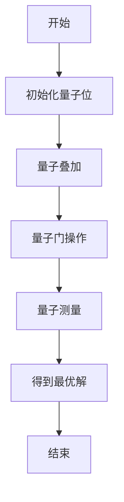
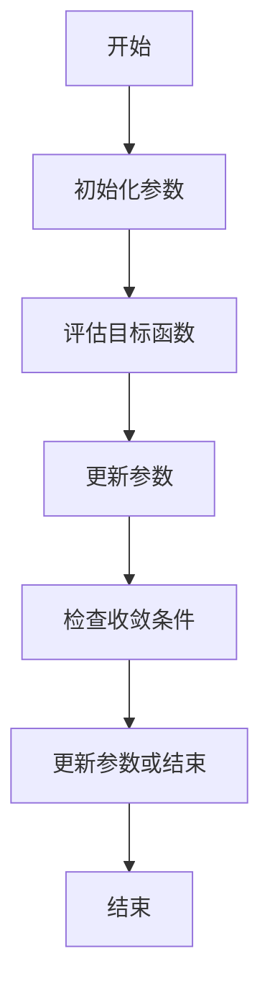

                 


# 第二章: 量子优化算法在AI Agent中的应用

## 第2.2节: 量子优化算法在AI Agent中的应用场景与对比

### 2.2.1 量子优化算法的核心原理

量子优化算法利用量子计算的特性，如量子叠加和量子退火，来解决复杂的优化问题。其核心在于通过量子叠加状态处理多个可能性，从而在优化过程中找到全局最优解。与经典算法相比，量子优化算法在某些情况下能够显著提高计算效率，尤其是在处理高维问题和复杂约束条件下。

#### 量子优化算法的优势
- **全局最优解**：量子算法能够同时考虑所有可能的解，从而更有可能找到全局最优解。
- **复杂约束处理**：在处理具有复杂约束条件的问题时，量子优化算法表现优异。
- **高维问题**：适用于处理高维问题，而传统算法在这种情况下效率较低。

#### 量子优化算法的挑战
- **硬件限制**：目前量子计算的硬件仍处于发展阶段，可用的量子位数有限。
- **算法成熟度**：量子优化算法的研究仍在进行中，尚未完全成熟。

### 2.2.2 量子优化算法在AI Agent中的应用场景

AI Agent需要处理多种优化任务，如资源分配、路径规划、决策优化等。量子优化算法在这些场景中展现出独特的优势。

#### 1. 资源分配优化
AI Agent在企业中常需要优化资源分配，如任务分配、设备调度等。量子优化算法能够同时考虑多个变量，找到最优的分配方案。

#### 2. 路径规划
在物流和供应链管理中，AI Agent需要优化路径，减少成本和时间。量子优化算法可以快速找到最优路径，特别是在处理大规模网络时。

#### 3. 风险管理
AI Agent在金融领域用于风险管理，优化投资组合。量子优化算法能够处理复杂的金融模型，提供更优的风险分散策略。

#### 4. 决策优化
在复杂的决策过程中，AI Agent需要综合考虑多个因素。量子优化算法能够帮助找到最优的决策方案，特别是在涉及多目标优化时。

### 2.2.3 量子优化算法与传统优化算法的对比

#### 对比维度
- **计算效率**：量子优化算法在某些情况下比传统算法快得多，特别是在高维问题和复杂约束条件下。
- **处理能力**：量子算法能够同时处理大量可能性，而传统算法通常需要逐步探索。
- **硬件依赖**：量子优化需要专用硬件，而传统算法依赖于现有的经典计算机。

#### 具体对比
| 对比维度            | 量子优化算法                           | 传统优化算法                          |
|---------------------|---------------------------------------|---------------------------------------|
| 计算速度            | 在特定问题上可能更快                    | 较慢，尤其在高维和复杂问题上          |
| 处理能力            | 同时考虑所有可能性，找到全局最优       | 逐步探索，可能无法找到全局最优        |
| 硬件依赖            | 依赖量子计算硬件                       | 依赖经典计算机                       |
| 适用场景            | 复杂优化问题、高维问题、多目标优化     | 简单优化问题、局部优化                |
| 当前成熟度          | 处于发展阶段，部分应用可行             | 成熟，广泛应用                      |

### 2.2.4 实际案例分析

#### 案例1：物流路径优化
一家物流公司希望优化配送路径，减少运输成本。使用量子优化算法，AI Agent能够同时考虑所有可能的路径，找到最优解。而使用传统算法如遗传算法，可能需要多次迭代才能接近最优解。

#### 案例2：金融投资组合优化
在金融领域，AI Agent需要优化投资组合，降低风险。量子优化算法能够快速处理大量变量，找到最优的投资组合，而传统算法可能在处理复杂约束时效率较低。

### 2.2.5 优缺点总结

- **优点**：
  - 高效处理复杂问题。
  - 找到全局最优解。
- **缺点**：
  - 硬件依赖性强。
  - 算法成熟度不足。
  - 当前可用性有限，仅适用于特定问题。

### 2.2.6 未来展望

随着量子计算技术的发展，量子优化算法在AI Agent中的应用前景广阔。未来，随着硬件的成熟和算法的优化，量子优化算法将能够处理更复杂的问题，进一步提升AI Agent的能力。

### 图解说明

#### 量子优化算法流程图


#### 传统优化算法流程图


通过以上对比，可以看出量子优化算法在流程上更倾向于并行处理，而传统算法则是串行优化。

### 数学公式对比

#### 量子优化算法数学模型
$$
\min_{x} f(x) \quad \text{subject to} \quad g(x) \leq 0
$$

其中，$f(x)$是目标函数，$g(x)$是约束条件。

#### 传统优化算法数学模型
$$
\min_{x} f(x) \quad \text{subject to} \quad g(x) \leq 0
$$

两者目标函数相同，但优化方法不同。

### 代码实现示例

由于量子计算的硬件限制，目前大部分量子优化算法还处于理论研究阶段，但可以通过模拟器进行模拟实现。

#### 量子优化算法模拟代码（Python）
```python
import numpy as np
from qiskit import QuantumCircuit, Aer, transpile
from qiskit.circuit import Gate, CompositeGate

def quantum_optimization(n=2):
    # 创建量子电路
    qc = QuantumCircuit(n, n)
    # 初始化量子位
    qc.h(range(n))
    # 应用量子优化门（简化）
    for i in range(n):
        qc.cx(i, n + i)
    # 测量
    qc.measure(range(n), range(n))
    # 模拟
    sim = Aer.get_backend('aer')
    trans = transpile(qc, sim)
    result = sim.run(trans).result()
    return result

# 调用量子优化算法
result = quantum_optimization()
print(result)
```

#### 传统优化算法代码（Python）
```python
import numpy as np
from scipy.optimize import minimize

def traditional_optimization(n=2):
    # 定义目标函数
    def objective(x):
        return np.sum(x**2)
    
    # 定义约束
    constraints = [{'type': 'ineq', 'fun': lambda x: -np.sum(x) + 1}]
    
    # 使用SLSQP方法优化
    result = minimize(objective, np.zeros(n), method='SLSQP', constraints=constraints)
    return result

# 调用传统优化算法
result = traditional_optimization()
print(result)
```

### 小结

量子优化算法在AI Agent中的应用前景广阔，尤其在处理复杂和高维优化问题时展现出显著优势。然而，当前的硬件限制和算法成熟度仍制约其广泛应用。未来，随着量子计算技术的发展，量子优化算法将逐步在AI Agent中发挥更大的作用。

### 注意事项

- **硬件限制**：目前量子优化算法依赖于量子计算机，而这些硬件仍处于发展阶段。
- **算法选择**：在实际应用中，需根据具体问题选择合适的优化算法，量子优化算法并非在所有情况下都优于传统算法。
- **技术发展**：密切关注量子计算技术的发展，及时更新优化算法的应用。

### 最佳实践

- **问题分析**：在选择优化算法前，需深入分析问题的特性和需求。
- **算法对比**：根据问题特点，对比量子和传统算法的优劣，选择最适合的算法。
- **持续学习**：随着技术的发展，保持对最新量子优化算法的关注，及时应用到实际场景中。

### 拓展阅读

- **量子计算入门**：了解量子计算的基本概念和原理。
- **量子优化算法研究**：深入研究最新的量子优化算法及其应用。
- **量子计算工具**：学习使用量子计算模拟器和开发工具，如Qiskit、Cirq等。

通过以上内容，读者可以全面理解量子优化算法在AI Agent中的应用场景及其与传统算法的对比，为实际应用提供理论支持和技术指导。

