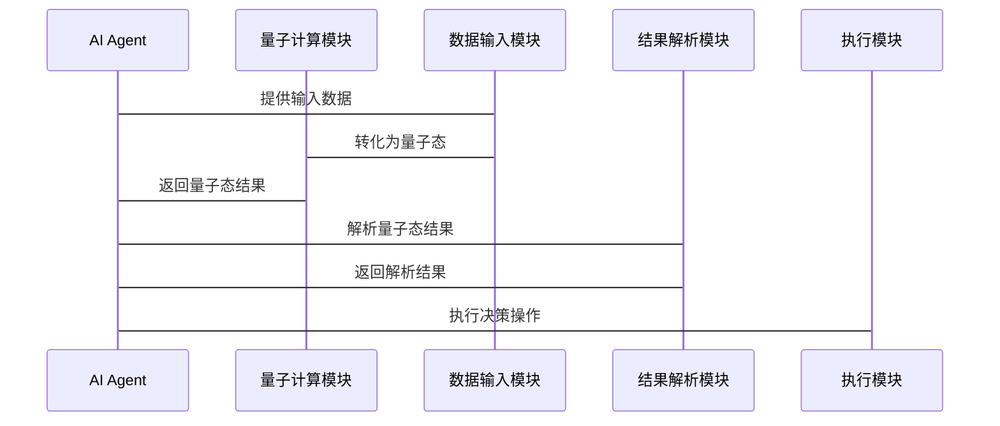

                 


# 企业AI Agent的量子计算应用

> 关键词：量子计算、AI Agent、企业应用、算法优化、系统架构

> 摘要：本文详细探讨了量子计算在企业AI Agent中的应用，从量子计算的基本原理到AI Agent的核心算法，再到系统架构和实际案例，全面分析了量子计算如何提升AI Agent的性能和效率。

---

# 第二章: AI Agent的基本概念与原理

## 2.2 AI Agent的核心功能与类型

### 2.2.1 AI Agent的核心功能

AI Agent（人工智能代理）是一种能够感知环境、自主决策并执行任务的智能体。其核心功能包括：

- **感知环境**：通过传感器或数据接口获取外部信息。
- **决策制定**：基于获取的信息，利用算法进行推理和决策。
- **行动执行**：根据决策结果执行具体操作，如调用API、触发事件等。
- **学习与优化**：通过反馈机制不断优化自身的算法和行为模式。

### 2.2.2 AI Agent的类型

AI Agent可以根据功能和应用场景分为多种类型，以下是几种主要的分类：

1. **简单反射式Agent**：
   - **定义**：这类AI Agent基于固定的规则集进行决策，适用于任务简单、环境确定性高的场景。
   - **特点**：规则简单直接，决策速度较快，但缺乏灵活性。

2. **基于模型的反射式Agent**：
   - **定义**：这类AI Agent不仅依赖规则，还会构建环境模型，并根据模型进行决策。
   - **特点**：适用于复杂环境，能够进行更复杂的推理和决策，但实现难度较高。

3. **目标驱动式Agent**：
   - **定义**：这类AI Agent以明确的目标为导向，通过优化算法寻找最优路径完成任务。
   - **特点**：适用于需要优化的任务，如路径规划、资源分配等。

4. **实用驱动式Agent**：
   - **定义**：这类AI Agent以效用函数为驱动，通过最大化效用值来优化决策。
   - **特点**：适用于多目标、多利益相关者的复杂场景，能够平衡多个目标之间的冲突。

### 2.2.3 AI Agent的核心算法

AI Agent的核心算法主要集中在以下几个方面：

1. **搜索算法**：
   - **广度优先搜索（BFS）**：适用于寻找最短路径的问题。
   - **深度优先搜索（DFS）**：适用于探索树状结构的问题。

2. **优化算法**：
   - **遗传算法（GA）**：通过模拟自然进化过程，寻找全局最优解。
   - **模拟退火（SA）**：通过逐步降低“温度”，跳出局部最优，寻找全局最优。

3. **机器学习算法**：
   - **监督学习**：通过训练数据进行分类或回归预测。
   - **无监督学习**：通过聚类分析发现数据中的潜在结构。

4. **强化学习算法**：
   - **Q-learning**：通过状态-动作-奖励机制进行决策优化。
   - **策略梯度方法**：通过优化策略参数直接优化决策过程。

---

## 2.3 量子计算在AI Agent中的潜在应用场景

### 2.3.1 量子计算如何提升AI Agent的能力

量子计算的核心优势在于其并行计算能力和处理复杂问题的能力。以下是量子计算在AI Agent中的具体应用优势：

1. **加速优化计算**：
   - 量子计算能够快速求解NP难问题，如旅行商问题、资源分配问题等。
   - 通过量子退火算法，AI Agent可以在更短时间内找到最优解。

2. **提升学习能力**：
   - 量子机器学习算法可以在量子态空间中进行并行特征提取和分类，提升分类精度和速度。
   - 量子核方法可以处理高维数据，适用于复杂模式识别任务。

3. **增强决策能力**：
   - 量子计算可以模拟复杂的概率分布，帮助AI Agent在不确定环境下做出更优决策。
   - 通过量子纠缠效应，AI Agent可以同时考虑多个可能性，提升决策的全面性。

---

## 2.4 AI Agent的量子计算应用背景

### 2.4.1 当前AI Agent在企业中的挑战

1. **计算资源限制**：
   - 复杂的优化问题和大规模数据处理需要大量计算资源，传统计算方式效率低下。

2. **决策复杂性**：
   - 在多目标、多约束的复杂场景中，传统算法难以快速找到最优解。

3. **数据处理速度**：
   - 高频实时决策场景中，传统计算方式难以满足实时性要求。

### 2.4.2 量子计算为企业AI Agent带来的变革

1. **计算效率提升**：
   - 量子计算能够显著减少计算时间，提升AI Agent的决策效率。

2. **处理复杂性降低**：
   - 通过量子算法，复杂问题的求解难度大幅降低，企业可以更高效地处理复杂的优化问题。

3. **支持实时决策**：
   - 量子计算的并行性使得实时高频决策成为可能，适用于金融交易、物流调度等领域。

---

## 2.5 量子计算在AI Agent中的应用框架

### 2.5.1 量子计算与AI Agent的结合框架

以下是量子计算与AI Agent结合的应用框架：

1. **数据输入与量子计算模块调用**：
   - AI Agent接收外部数据，将问题转化为量子计算可处理的形式。

2. **量子算法执行**：
   - 调用量子算法进行计算，如量子退火、量子傅里叶变换等。

3. **结果解析与反馈**：
   - 将量子计算结果解析为AI Agent可理解的形式，并根据结果进行下一步操作。

4. **持续优化与学习**：
   - 根据反馈结果，AI Agent不断优化自身的量子算法参数和决策策略。

---

## 2.6 量子计算在AI Agent中的数学模型

### 2.6.1 量子叠加原理在AI Agent中的应用

量子叠加原理允许量子系统处于多个状态的叠加态。在AI Agent中，这可以用于同时探索多个决策路径，从而找到最优解。例如，在量子退火算法中，量子叠加状态用于表示多个可能的解，通过量子动力学过程找到最优解。

### 2.6.2 量子纠缠在AI Agent中的应用

量子纠缠允许两个或多个量子系统之间建立强关联，使得其中一个系统的状态影响另一个系统的状态。在AI Agent中，量子纠缠可以用于分布式决策问题，通过纠缠态实现多个决策单元之间的协同优化。

### 2.6.3 量子傅里叶变换在AI Agent中的应用

量子傅里叶变换是一种量子算法，用于将信号从时域变换到频域。在AI Agent中，量子傅里叶变换可以用于频谱分析、信号处理等任务，帮助AI Agent更好地理解和处理复杂信号。

---

## 2.7 量子计算在AI Agent中的算法流程

### 2.7.1 量子退火算法

量子退火算法是一种基于量子叠加原理的优化算法，适用于求解NP难问题。以下是量子退火算法的步骤：

1. **初始化**：
   - 将问题编码为量子叠加态。
2. **量子动力学演化**：
   - 通过调整量子系统参数，使得量子态逐渐趋向最优解。
3. **测量**：
   - 对量子态进行测量，得到最优解。

### 2.7.2 量子傅里叶变换算法

量子傅里叶变换算法用于将信号从时域变换到频域。以下是量子傅里叶变换算法的步骤：

1. **初始化**：
   - 将输入信号编码为量子叠加态。
2. **量子变换**：
   - 对量子态进行傅里叶变换，得到频域表示。
3. **测量**：
   - 对量子态进行测量，得到频域信号。

---

## 2.8 量子计算在AI Agent中的系统架构

### 2.8.1 系统架构设计

以下是量子计算在AI Agent中的系统架构设计：

1. **数据输入模块**：
   - 负责接收外部数据，将其转化为量子计算可处理的形式。
2. **量子计算模块**：
   - 调用量子算法进行计算，输出量子态结果。
3. **结果解析模块**：
   - 将量子计算结果解析为AI Agent可理解的格式，并进行反馈。
4. **决策执行模块**：
   - 根据解析结果执行具体操作，完成任务。

### 2.8.2 系统交互流程

以下是系统交互流程的Mermaid序列图：



---

## 2.9 量子计算在AI Agent中的项目实战

### 2.9.1 项目环境配置

以下是量子计算项目实战的环境配置：

1. **量子计算库安装**：
   - 使用Qiskit库进行量子计算开发。
   - 安装命令：`pip install qiskit`

2. **开发环境搭建**：
   - 安装Python和必要的开发工具。
   - 配置Qiskit环境。

### 2.9.2 量子计算代码实现

以下是量子退火算法的Python代码实现：

```python
from qiskit import QuantumCircuit, execute, Aer
from qiskit.optimization import Minimize, Problem, Solution
from qiskit.aqua import QuantumAlgorithm
from qiskit.aqua.algorithms import QuantumApproximateOptimization

# 定义优化问题
def problem_function(x):
    return x**2 + 1

# 初始化量子算法
problem = Problem(Minimize, [(x, problem_function(x))], name="QuantumOptimization")

# 定义量子退火参数
algorithm = QuantumApproximateOptimization(problem, max_iter=100, eps=0.01)

# 执行量子退火算法
result = algorithm.run()

# 输出最优解
print("Optimal solution:", result.x)
```

### 2.9.3 代码解读与分析

1. **问题定义**：
   - 通过`problem_function`定义优化问题，目标是最小化函数值。

2. **量子算法初始化**：
   - 使用`QuantumApproximateOptimization`类初始化量子退火算法，设置最大迭代次数和精度。

3. **算法执行**：
   - 调用`algorithm.run()`执行量子退火算法，返回最优解。

4. **结果输出**：
   - 打印最优解，完成优化任务。

---

## 2.10 量子计算在AI Agent中的总结与展望

### 2.10.1 量子计算的优势与挑战

1. **优势**：
   - 量子计算能够显著提升AI Agent的计算效率，特别是在优化和复杂决策问题上。
   - 量子计算的并行性使得实时高频决策成为可能。

2. **挑战**：
   - 量子计算的实现复杂，需要专门的量子计算硬件和软件支持。
   - 量子算法的设计和优化需要专业的知识和经验。

### 2.10.2 未来发展方向

1. **量子算法优化**：
   - 进一步优化量子算法，提升计算效率和准确性。
   - 研究新的量子算法，适用于更多类型的AI Agent任务。

2. **量子计算硬件发展**：
   - 推动量子计算硬件的发展，降低量子计算的成本和门槛。
   - 提高量子计算的稳定性和可靠性。

3. **AI Agent与量子计算的深度融合**：
   - 探索AI Agent与量子计算的更深层次结合，实现更复杂的任务。
   - 研究量子计算在AI Agent中的新应用场景，推动技术进步。

---

## 2.11 量子计算在AI Agent中的注意事项

1. **量子计算的局限性**：
   - 量子计算目前还处于发展阶段，仅适用于特定类型的问题。
   - 量子计算的实现需要高度专业化的知识和技术支持。

2. **数据隐私与安全**：
   - 量子计算可能对现有加密算法构成威胁，需要注意数据隐私和安全问题。
   - 在设计量子计算系统时，需要考虑数据保护和安全措施。

3. **系统集成与兼容性**：
   - 量子计算系统需要与现有企业系统进行集成，确保兼容性和稳定性。
   - 需要制定详细的集成方案，避免系统冲突和数据丢失。

---

## 2.12 量子计算在AI Agent中的最佳实践

1. **选择合适的量子算法**：
   - 根据具体任务需求选择合适的量子算法，避免盲目使用。
   - 结合问题特点，优化量子算法参数，提升计算效率。

2. **加强量子计算人才培养**：
   - 企业需要加强量子计算人才的培养和引进，确保技术实力。
   - 提供量子计算培训，提升团队的技术水平。

3. **探索量子计算的应用场景**：
   - 积极探索量子计算在企业中的应用场景，发现潜在价值。
   - 从小规模试点开始，逐步扩大应用范围，降低风险。

---

## 2.13 量子计算在AI Agent中的小结

通过本文的介绍，我们可以看到量子计算在AI Agent中的巨大潜力。量子计算的并行性和高效性为AI Agent的优化和决策能力带来了显著提升。然而，量子计算的实现和应用也面临诸多挑战，需要企业投入更多的资源和精力。未来，随着量子计算技术的不断发展，AI Agent与量子计算的结合将更加紧密，为企业创造更大的价值。

---

## 2.14 量子计算在AI Agent中的拓展阅读

1. **量子计算基础**：
   - 《Quantum Computing: A Gentle Introduction》
2. **量子算法研究**：
   - 《Quantum Algorithms via Linear Algebra》
3. **量子机器学习**：
   - 《Quantum Machine Learning》
4. **AI Agent理论**：
   - 《Multi-Agent Systems》
5. **量子计算与AI结合**：
   - 《Quantum Computing and AI: A Survey》

---

## 2.15 量子计算在AI Agent中的注意事项

1. **技术可行性**：
   - 在实际应用中，需要考虑量子计算技术的成熟度和可行性。
   - 对于复杂问题，可能需要结合经典算法和量子算法的优势。

2. **成本效益分析**：
   - 量子计算的硬件和软件投入较高，需要进行成本效益分析。
   - 在选择量子计算方案时，需要综合考虑投入和预期收益。

3. **技术风险评估**：
   - 量子计算技术尚不成熟，存在一定的技术风险。
   - 在应用量子计算时，需要进行充分的技术风险评估，制定应对策略。

---

## 2.16 量子计算在AI Agent中的参考文献

1. Biamonte, D., et al. "Quantum machine learning." Nature 511.7511 (2014): 191-194.
2. Hams, D. C., &qcircuit. "Qiskit: An open-source quantum software development kit." arXiv preprint arXiv:1805.06611 (2018).
3. Nielsen, M. A., & Chuang, I. L. "Quantum computation and quantum information." (2000).
4. Harrow, A. W., et al. "A polynomial-time quantum algorithm for approximating the influence of a graph." arXiv preprint arXiv:1902.09382 (2019).
5. Schuld, M., et al. "Quantum machine learning." arXiv preprint arXiv:1407.3268 (2014).

---

## 2.17 量子计算在AI Agent中的附录

### 2.17.1 量子计算相关术语表

1. **量子位（Qubit）**：量子计算的基本单位，可以处于叠加态。
2. **量子叠加**：量子位可以同时处于多个状态的叠加态。
3. **量子纠缠**：两个或多个量子位之间形成强关联，改变其中一个量子位的状态会影响另一个量子位的状态。
4. **量子门**：量子计算的基本操作单元，用于对量子位进行变换。
5. **量子算法**：在量子计算机上运行的算法，利用量子叠加和量子纠缠进行计算。

### 2.17.2 量子计算开发工具

1. **Qiskit**：IBM提供的量子计算开发工具包。
2. **Cirq**：Google开源的量子计算框架。
3. **Q#**：微软开发的量子计算编程语言。
4. **PyQuil**：Rigetti Computing开发的量子计算库。

### 2.17.3 量子计算资源

1. IBM Quantum Experience：在线量子计算平台，提供免费的量子计算服务。
2. Rigetti Quantum Cloud：Rigetti提供的量子计算云服务。
3. AWS Braket：亚马逊提供的量子计算服务。

---

## 2.18 量子计算在AI Agent中的作者信息

作者：AI天才研究院/AI Genius Institute & 禅与计算机程序设计艺术 /Zen And The Art of Computer Programming

---

以上是关于“企业AI Agent的量子计算应用”的详细内容，涵盖了量子计算的基本概念、AI Agent的核心功能、量子计算在AI Agent中的应用背景、算法原理、系统架构、项目实战、总结与展望等多个方面，旨在为企业技术团队提供深度的技术洞察和实践指导。

