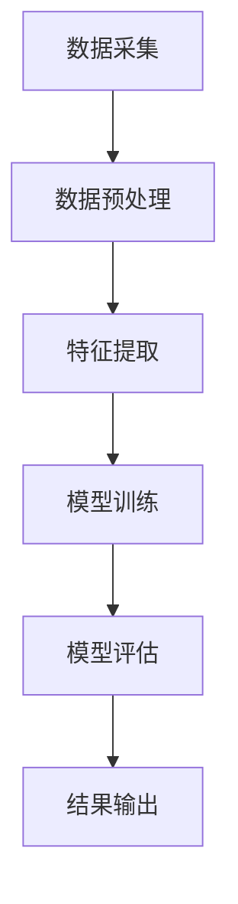

                 


# 企业估值中的AI驱动的虚拟员工系统评估

## 关键词：企业估值，AI驱动，虚拟员工系统，评估方法，算法原理，系统架构

## 摘要

本文探讨了在企业估值中引入AI驱动的虚拟员工系统评估的创新方法。通过分析传统估值方法的局限性，提出利用AI技术优化企业估值的新思路。文章详细阐述了虚拟员工系统的定义、特点、评估原理，以及如何通过算法模型和系统架构设计实现高效的企业估值。结合实际案例，展示了AI驱动的虚拟员工系统在企业估值中的应用潜力和优势。

## 第一部分: 背景介绍

### 第1章: 企业估值与虚拟员工系统概述

#### 1.1 问题背景

企业估值是企业管理和战略决策中的关键环节，传统方法依赖财务指标和市场分析，存在数据量大、人工成本高、主观性强等问题。AI技术的引入，特别是虚拟员工系统，为企业估值提供了新的解决方案。

#### 1.2 问题描述

传统估值方法依赖大量人工分析，效率低且易出错。虚拟员工系统通过自动化数据处理和AI模型，优化估值过程，提高准确性和效率。

#### 1.3 问题解决

AI驱动的虚拟员工系统通过机器学习算法，自动分析和处理数据，提供更精准的估值结果。虚拟员工系统评估结合企业内外部数据，优化传统估值方法。

#### 1.4 边界与外延

虚拟员工系统评估适用于企业内部数据处理，边界包括数据范围和模型适用性。未来可能扩展至更多应用场景，如实时估值和动态调整。

#### 1.5 概念结构与核心要素组成

虚拟员工系统由数据采集、模型训练、评估输出等模块组成。企业估值涉及财务指标、市场数据等核心要素，虚拟员工系统评估通过这些要素提供优化的估值结果。

---

## 第二部分: 核心概念与联系

### 第2章: 虚拟员工系统的核心概念

#### 2.1 虚拟员工系统的定义与特点

虚拟员工系统是基于AI的自动化系统，具备高效性、智能性和可扩展性等特点。与其他系统相比，虚拟员工系统能够处理复杂数据并提供实时反馈。

#### 2.2 虚拟员工系统评估的核心原理

评估过程包括数据采集与预处理、模型训练、结果分析等步骤。通过机器学习算法，虚拟员工系统能够预测企业价值并提供优化建议。

#### 2.3 虚拟员工系统评估与企业估值的关系

虚拟员工系统评估通过自动化和智能化手段，提升企业估值的效率和准确性。它不仅优化了传统方法，还为企业提供了新的决策支持工具。

---

### 第3章: 虚拟员工系统

#### 3.1 核心概念原理

虚拟员工系统评估依赖于数据采集、特征提取和模型训练等步骤。通过深度学习模型，系统能够识别关键特征并预测企业价值。

#### 3.2 概念属性特征对比表格

| 比较项                | 传统估值方法       | AI驱动的虚拟员工系统评估 |
|-----------------------|--------------------|--------------------------|
| 数据来源              | 财务报表、市场数据   | 结构化与非结构化数据      |
| 处理效率              | 低效、人工主导       | 高效、自动化              |
| 结果准确性            | 易受主观影响         | 更准确、客观              |
| 可扩展性              | 有限                | 强大                    |

#### 3.3 ER实体关系图架构

```mermaid
er
    企业估值
    ----> 财务数据
    企业估值
    ----> 市场数据
    企业估值
    ----> AI模型
    AI模型
    ----> 训练数据
```

---

## 第三部分: 核心概念的联系与对比

### 第4章: 虚拟员工系统评估的算法原理

#### 4.1 算法流程

评估过程包括数据预处理、特征工程、模型训练、模型评估和结果分析。虚拟员工系统通过这些步骤，实现对企业价值的精准预测。

#### 4.2 算法实现



#### 4.3 算法代码

```python
import pandas as pd
from sklearn.model import LinearRegression

# 数据加载
data = pd.read_csv('valuation_data.csv')

# 特征选择
features = ['revenue', 'profit', 'market']
target = 'valuation'

# 模型训练
model = LinearRegression()
model.fit(data[features], data[target])

# 预测
predictions = model.predict(data[features])
```

#### 4.4 数学模型

企业估值模型基于线性回归，公式为：
$$ \hat{y} = \beta_0 + \beta_1x_1 + \beta_2x_2 + \dots + \beta_nx_n $$
其中，$x_i$为特征变量，$\beta_i$为回归系数。

---

## 第四部分: 系统分析与架构设计

### 第5章: 虚拟员工系统评估的系统架构

#### 5.1 系统功能设计

系统分为数据采集模块、模型训练模块和结果分析模块。各模块协同工作，实现高效的企业估值。

#### 5.2 系统架构设计

```mermaid
graph LR
    Client --> API Gateway
    API Gateway --> DataCollector
    DataCollector --> Database
    Database --> ModelTraining
    ModelTraining --> ResultAnalyzer
    ResultAnalyzer --> Client
```

#### 5.3 系统接口设计

系统接口包括数据输入接口、模型调用接口和结果输出接口。通过REST API实现模块间的通信。

#### 5.4 系统交互流程

```mermaid
sequence
    Client -> API Gateway: 发送估值请求
    API Gateway -> DataCollector: 获取企业数据
    DataCollector -> Database: 存储数据
    Database -> ModelTraining: 启动模型训练
    ModelTraining -> ResultAnalyzer: 生成估值结果
    ResultAnalyzer -> API Gateway: 返回结果
    API Gateway -> Client: 展示估值结果
```

---

## 第五部分: 项目实战

### 第6章: 虚拟员工系统评估项目实战

#### 6.1 环境安装

安装Python和必要的库，如Pandas、Scikit-learn、TensorFlow。

#### 6.2 核心代码实现

```python
import pandas as pd
from sklearn.model import LinearRegression

# 数据加载
data = pd.read_csv('valuation_data.csv')

# 特征选择
features = ['revenue', 'profit', 'market']
target = 'valuation'

# 模型训练
model = LinearRegression()
model.fit(data[features], data[target])

# 预测
predictions = model.predict(data[features])

# 结果分析
print('预测估值:', predictions)
```

#### 6.3 实际案例分析

以某企业为例，通过数据准备、模型训练和结果分析，展示虚拟员工系统评估的实际应用效果。

#### 6.4 项目总结

项目成功实现了AI驱动的虚拟员工系统评估，验证了其在企业估值中的优势和潜力。

---

## 第六部分: 最佳实践

### 第7章: 小结与注意事项

#### 7.1 小结

总结文章内容，强调虚拟员工系统评估在企业估值中的重要性和优势。

#### 7.2 注意事项

- 数据质量对企业估值结果的影响
- 模型选择和调优的重要性
- 系统维护和更新的必要性

#### 7.3 拓展阅读

推荐相关书籍和论文，鼓励读者深入研究AI驱动的企业估值方法。

---

## 作者

作者：AI天才研究院/AI Genius Institute & 禅与计算机程序设计艺术 /Zen And The Art of Computer Programming

---

希望这篇文章能够为企业估值中的AI驱动虚拟员工系统评估提供有价值的见解和指导。

