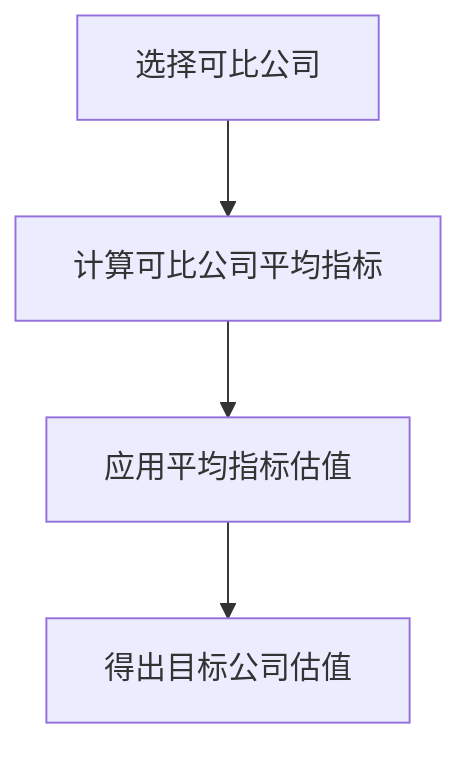
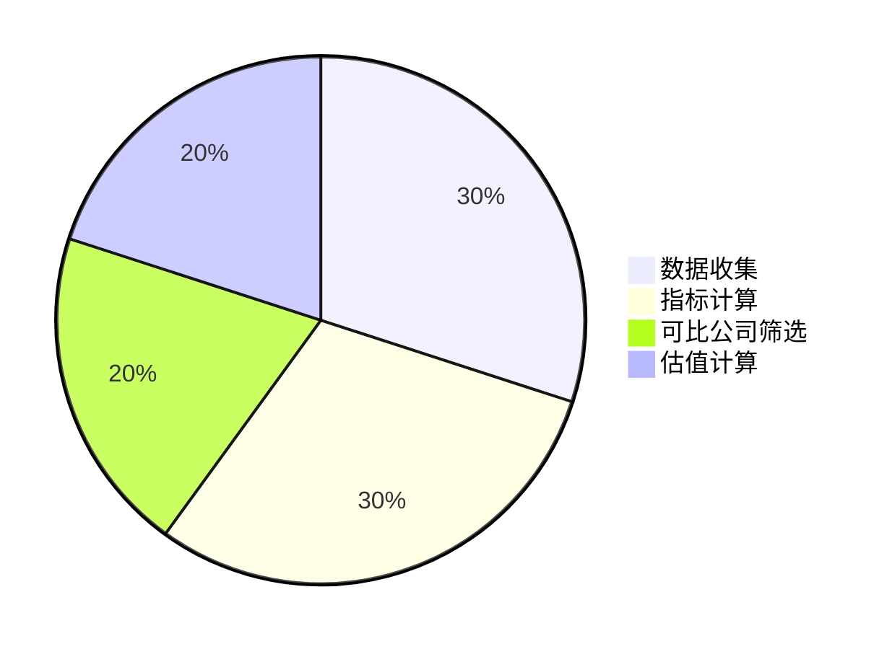

                 


# 企业估值中的相对估值法

## 关键词：相对估值法, 企业估值, 市盈率, 市净率, EV/EBITDA

## 摘要：  
相对估值法是一种基于可比公司分析的企业估值方法，通过比较目标公司与可比公司的关键财务指标来估算目标公司的价值。本文将详细探讨相对估值法的核心概念、算法原理、系统架构及实际应用，帮助读者全面理解并掌握这一重要的企业估值方法。

---

# 目录

1. [相对估值法的背景与基础](#相对估值法的背景与基础)
2. [相对估值法的核心概念](#相对估值法的核心概念)
3. [相对估值法的算法原理](#相对估值法的算法原理)
4. [相对估值法的系统架构](#相对估值法的系统架构)
5. [相对估值法的项目实战](#相对估值法的项目实战)
6. [相对估值法的最佳实践](#相对估值法的最佳实践)
7. [总结与展望](#总结与展望)

---

## 第一部分: 相对估值法的背景与基础

### 第1章: 相对估值法的定义与背景

#### 1.1 相对估值法的定义与核心概念
相对估值法是一种通过比较目标公司与可比公司在市场上的估值指标，来推断目标公司价值的方法。其核心在于利用市场已有的数据，通过可比公司的平均表现，估算目标公司的合理估值范围。

#### 1.2 相对估值法的历史发展与演变
相对估值法起源于20世纪初，随着金融市场的快速发展，逐渐成为企业估值的重要工具。早期的相对估值主要基于市盈率（P/E）指标，随着企业规模和复杂性的增加，引入了市净率（P/B）和企业价值倍数（EV/EBITDA）等指标，使得相对估值法更加多样化和精准化。

#### 1.3 相对估值法在企业估值中的作用
相对估值法能够快速提供目标公司的估值参考，特别适用于缺乏详细财务数据或市场环境复杂的情况。它通过可比公司的市场表现，反映了市场对类似公司的定价预期，从而帮助企业做出更合理的并购、融资和投资决策。

---

## 第二部分: 相对估值法的核心概念

### 第2章: 相对估值法的关键指标

#### 2.1 常见的相对估值指标
- **市盈率（P/E）**：公司股价与每股收益的比率，反映市场对公司盈利能力的预期。
- **市净率（P/B）**：公司股价与每股净资产的比率，适用于资产密集型行业。
- **企业价值倍数（EV/EBITDA）**：企业价值与息税折旧及摊销前利润的比率，适用于跨行业比较。

#### 2.2 各个指标的定义与计算方法
##### 2.2.1 市盈率（P/E）
公式：  
$$ P/E = \frac{Stock Price}{Earnings Per Share} $$  
应用场景：评估公司的盈利能力，尤其适用于净利润稳定的公司。

##### 2.2.2 市净率（P/B）
公式：  
$$ P/B = \frac{Stock Price}{Book Value Per Share} $$  
应用场景：适用于资产价值占主导地位的行业，如银行和房地产。

##### 2.2.3 企业价值倍数（EV/EBITDA）
公式：  
$$ EV = \frac{Market Capitalization + Debt - Cash}{EBITDA} $$  
应用场景：跨行业比较，尤其是企业规模和杠杆不同的公司。

#### 2.3 指标的优缺点对比
| 指标 | 优点 | 缺点 |
|------|------|------|
| P/E | 直接反映盈利能力 | 不适用于亏损公司 |
| P/B | 资产价值导向 | 无法反映收益能力 |
| EV/EBITDA | 跨行业比较 | 受EBITDA质量影响 |

---

## 第三部分: 相对估值法的算法原理

### 第3章: 相对估值法的算法流程

#### 3.1 算法步骤
1. **选择可比公司**：根据行业、规模等因素筛选与目标公司相似的公司。
2. **计算可比公司平均指标**：计算可比公司的平均市盈率、市净率或EV/EBITDA。
3. **应用平均指标估值**：将目标公司的财务指标乘以可比公司的平均倍数，得到估值区间。

#### 3.2 可视化流程图


#### 3.3 数学公式与示例
##### 示例：使用EV/EBITDA进行估值
目标公司EBITDA = 1000万元，可比公司平均EV/EBITDA = 8倍。
$$ EV = 8 \times 1000 = 8000万元 $$

---

## 第四部分: 相对估值法的系统架构

### 第4章: 系统架构设计

#### 4.1 系统功能模块
1. **数据收集模块**：获取目标公司和可比公司的财务数据。
2. **指标计算模块**：计算目标公司和可比公司的各项估值指标。
3. **可比公司筛选模块**：根据行业、规模等因素筛选可比公司。
4. **估值计算模块**：基于可比公司的平均指标，计算目标公司估值。

#### 4.2 系统架构图


#### 4.3 接口设计
- 输入接口：目标公司和可比公司的财务数据。
- 输出接口：目标公司的估值报告。

---

## 第五部分: 相对估值法的项目实战

### 第5章: 项目实战

#### 5.1 项目背景
假设我们需要为一家科技公司进行估值，选择5家同行业可比公司进行分析。

#### 5.2 环境配置
- **工具**：Python、Pandas、Matplotlib。
- **数据来源**：目标公司和可比公司的财务数据。

#### 5.3 核心代码实现
```python
import pandas as pd
import numpy as np

# 数据收集与预处理
df = pd.DataFrame({
    'Company': ['Company A', 'Company B', 'Company C', 'Company D', 'Company E'],
    'EV': [10000, 12000, 9000, 11000, 13000],
    'EBITDA': [500, 600, 450, 550, 650]
})

# 计算可比公司平均EV/EBITDA
avg_ev_ebitda = df['EV'].mean() / df['EBITDA'].mean()
print(f"Average EV/EBITDA: {avg_ev_ebitda}")

# 目标公司数据
target_ebitda = 700
target_ev = avg_ev_ebitda * target_ebitda
print(f"Target Company EV: {target_ev}")
```

#### 5.4 结果分析
目标公司的EV估计为：$$ EV = 10.5 \times 700 = 7350万元 $$

---

## 第六部分: 相对估值法的最佳实践

### 第6章: 最佳实践与注意事项

#### 6.1 选择可比公司的关键因素
- 行业一致性
- 规模相似性
- 财务结构相似性

#### 6.2 数据质量的重要性
确保可比公司的财务数据准确且具有可比性，避免因数据偏差影响估值结果。

#### 6.3 结合其他估值方法
相对估值法通常与绝对估值法（如DCF模型）结合使用，以提高估值的准确性。

#### 6.4 注意市场波动
市场环境的变化可能影响可比公司的估值指标，需定期更新数据。

---

## 第七部分: 总结与展望

### 第7章: 总结与展望

#### 7.1 本章总结
相对估值法是一种高效的企业估值方法，通过可比公司分析，为企业提供合理的估值参考。其关键在于选择合适的指标和可比公司，确保数据的准确性和相关性。

#### 7.2 未来展望
随着人工智能和大数据技术的发展，相对估值法将更加智能化和精准化，未来可能会出现更多基于机器学习的可比公司筛选和估值模型。

---

## 作者：AI天才研究院/AI Genius Institute & 禅与计算机程序设计艺术 /Zen And The Art of Computer Programming

