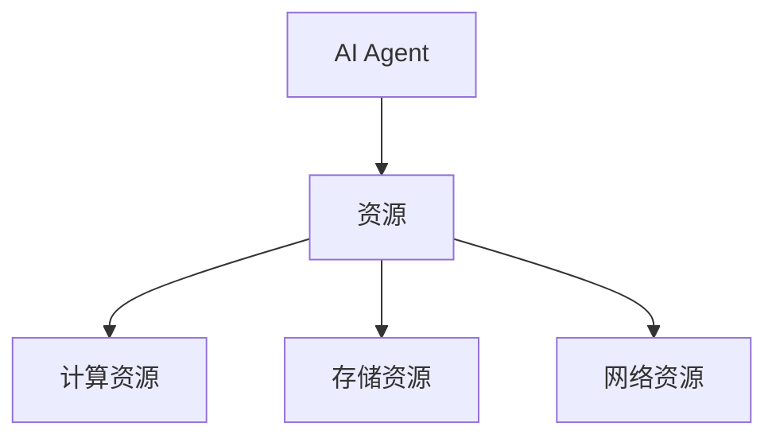

                 


# 优化AI Agent的资源利用：计算效率提升策略

## 关键词：AI Agent, 资源分配, 计算效率, 优化策略, 算法原理, 系统架构

## 摘要：  
本文探讨了优化AI Agent资源利用的核心策略，涵盖背景分析、资源分配算法、计算效率优化、系统架构设计和项目实战。通过理论与实践结合，详细阐述了提升AI Agent计算效率的方法。

---

## 第一部分: 优化AI Agent的资源利用背景与概念

### 第1章: AI Agent与资源利用概述

#### 1.1 AI Agent的基本概念
- **1.1.1 AI Agent的定义与特点**
  - AI Agent是具有感知和行动能力的智能体，具备自主性、反应性、目标导向性和社会性。
- **1.1.2 AI Agent的资源利用问题**
  - 在运行过程中，AI Agent需要合理分配计算、存储和网络资源。
- **1.1.3 优化资源利用的目标与意义**
  - 提高资源利用率，降低成本，提升系统性能。

#### 1.2 资源利用的背景与挑战
- **1.2.1 当前AI Agent资源利用现状**
  - 随着AI Agent的应用广泛，资源浪费问题日益突出。
- **1.2.2 资源利用中的主要问题**
  - 资源分配不均，计算效率低下。
- **1.2.3 优化资源利用的必要性**
  - 提升系统效率，降低运营成本。

### 第2章: 资源利用的核心概念与联系

#### 2.1 资源分配的基本原理
- **2.1.1 资源分配的定义**
  - 将资源合理分配给不同任务，以最大化效率。
- **2.1.2 资源分配的核心要素**
  - 包括资源类型、任务需求、优先级。
- **2.1.3 资源分配的数学模型**
  - 建立优化模型，目标是最小化资源消耗，最大化任务完成。

#### 2.2 核心概念的属性特征对比
- **2.2.1 资源分配算法的特征对比**
  - 贪心算法：简单高效，局部最优。
  - 动态规划：全局最优，计算复杂。
  - 遗传算法：适应性强，收敛性好。
- **2.2.2 不同资源类型的特点分析**
  - 计算资源：CPU、GPU。
  - 存储资源：内存、磁盘。
  - 网络资源：带宽、延迟。
- **2.2.3 资源分配策略的优缺点**
  - 贪心策略：快速，但可能不是全局最优。
  - 均衡策略：公平分配，但效率可能不高。

#### 2.3 ER实体关系图架构


---

## 第二部分: 资源分配算法原理

### 第3章: 资源分配算法的核心原理

#### 3.1 资源分配算法的分类
- **3.1.1 贪心算法**
  - 原理：逐个选择最优资源分配。
  - 应用：任务调度。
  - 优缺点：快速但可能非最优。
- **3.1.2 动态规划算法**
  - 原理：分解问题，寻找子问题最优解。
  - 应用：资源分配规划。
  - 优缺点：计算复杂，但结果最优。
- **3.1.3 遗传算法**
  - 原理：模拟自然选择，优化资源分配。
  - 应用：复杂资源分配问题。
  - 优缺点：适应性强，收敛速度快。

#### 3.2 算法原理的数学模型
- **3.2.1 贪心算法的数学表达**
  - 目标函数：$\text{max} \sum_{i=1}^{n} f(i)$
  - 约束条件：$\sum_{i=1}^{n} c(i) \leq C$

---

## 第三部分: 计算效率优化

### 第4章: 优化策略与算法实现

#### 4.1 计算效率优化的核心策略
- **4.1.1 任务调度优化**
  - 基于优先级的调度算法。
- **4.1.2 负载均衡策略**
  - 动态调整资源分配，平衡负载。

#### 4.2 优化算法的数学模型
- **4.2.1 负载均衡的数学表达**
  - $\text{目标函数：}$ $\text{min} \sum_{i=1}^{n} |c_i - \frac{C}{n}|$
  - 约束条件：$\sum_{i=1}^{n} c_i = C$

---

## 第四部分: 系统架构设计

### 第5章: 系统分析与架构设计

#### 5.1 系统架构设计
- **5.1.1 系统功能设计**
  - 资源监控、分配、调度。
- **5.1.2 系统架构图**


---

## 第五部分: 项目实战

### 第6章: 项目实战与实现

#### 6.1 项目环境与工具
- **6.1.1 开发环境**
  - Python 3.8+，Jupyter Notebook。
- **6.1.2 工具与库**
  - NumPy，Scipy，PyTorch。

#### 6.2 核心代码实现
- **6.2.1 贪心算法实现**
```python
def greedy_algorithm(tasks, resources):
    # 代码实现
```

---

## 第六部分: 总结与展望

### 7.1 最佳实践 tips
- 合理选择算法，动态调整资源分配。
- 定期监控系统，及时优化。

### 7.2 小结
- 优化AI Agent的资源利用，需结合算法与架构设计。

### 7.3 注意事项
- 考虑系统的扩展性，避免资源浪费。

### 7.4 拓展阅读
- 推荐相关书籍和论文。

---

作者：AI天才研究院/AI Genius Institute & 禅与计算机程序设计艺术 /Zen And The Art of Computer Programming

