                 


# 优化用户体验：智能助手设计的关键点

> 关键词：智能助手设计，用户体验优化，自然语言处理，对话管理，系统架构，项目实战

> 摘要：本文从智能助手设计的核心概念出发，系统性地分析了优化用户体验的关键点，包括智能助手的核心概念、算法原理、系统架构、项目实战等。通过实际案例分析和详细代码实现，深入探讨了智能助手设计中的技术难点和解决方案。本文旨在为智能助手的设计者和开发者提供一份全面的技术指南，帮助他们在实际项目中更好地优化用户体验。

---

# 第一部分：智能助手设计背景与核心概念

## 第1章：优化用户体验的核心概念

### 1.1 智能助手设计的背景与现状

#### 1.1.1 从传统助手到智能助手的演进
智能助手的设计经历了从简单工具到复杂系统的演变。传统助手主要依赖人工操作，而现代智能助手通过自然语言处理（NLP）和机器学习技术，能够理解用户的意图并提供智能化服务。这种演进使得用户体验更加便捷和高效。

#### 1.1.2 智能助手在现代技术中的地位
智能助手已成为人工智能技术的重要组成部分，广泛应用于智能家居、移动设备、客服系统等领域。它们通过语音交互、多轮对话等方式，为用户提供了全新的交互体验。

#### 1.1.3 用户体验优化的核心价值
用户体验（UX）是智能助手设计的核心目标。优化用户体验意味着提高系统的可用性、响应速度和准确性，让用户在与智能助手交互时感到自然和愉悦。

---

### 1.2 智能助手的核心概念与关键问题

#### 1.2.1 智能助手的定义与分类
智能助手是一种基于人工智能技术的交互系统，能够通过自然语言理解和生成，帮助用户完成任务或提供信息。根据功能和应用场景的不同，智能助手可以分为通用智能助手（如Siri、Alexa）和垂直领域智能助手（如医疗助手、金融助手）。

#### 1.2.2 用户体验优化的关键问题
在智能助手设计中，用户体验优化的关键问题包括：
1. **意图识别**：准确理解用户的意图。
2. **对话管理**：实现流畅的对话流程。
3. **反馈机制**：及时反馈用户操作结果。
4. **上下文理解**：处理多轮对话中的上下文信息。

#### 1.2.3 智能助手设计的边界与外延
智能助手的设计需要明确其边界和外延。边界是指智能助手的功能范围，而外延则是其与其他系统的接口和交互方式。例如，智能助手可能需要与后端服务、数据库或第三方API进行交互。

---

### 1.3 智能助手的核心要素与概念结构

#### 1.3.1 核心要素分析
智能助手的核心要素包括：
- **用户输入**：用户的自然语言输入。
- **意图识别**：将用户输入转换为具体意图。
- **对话管理**：根据意图生成响应。
- **系统输出**：将响应输出给用户。

#### 1.3.2 概念结构图
以下是智能助手的核心要素概念结构图：

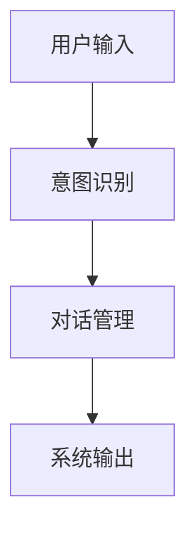

#### 1.3.3 核心要素对比表格
以下是智能助手与其他交互系统的对比表格：

| 特性                | 智能助手          | 传统助手          |
|---------------------|------------------|------------------|
| 输入方式            | 自然语言输入      | 文本或按钮输入     |
| 响应方式            | 自然语言输出      | 文本或按钮输出     |
| 智能性              | 高                | 低                |
| 适用场景            | 多领域            | 单一功能          |

---

## 第2章：智能助手设计的核心概念原理

### 2.1 核心概念的原理分析

#### 2.1.1 自然语言处理原理
自然语言处理（NLP）是智能助手的核心技术之一。其主要步骤包括：
1. **分词**：将输入文本分割成词语或短语。
2. **句法分析**：分析句子的语法结构。
3. **语义理解**：理解文本的语义含义。

以下是一个简单的NLP流程图：

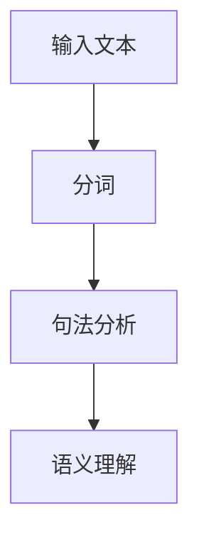

#### 2.1.2 对话管理机制
对话管理是智能助手的另一项核心技术。其主要步骤包括：
1. **状态识别**：识别当前对话的状态。
2. **意图预测**：预测用户的下一步意图。
3. **响应生成**：根据意图生成响应。

以下是一个对话管理流程图：

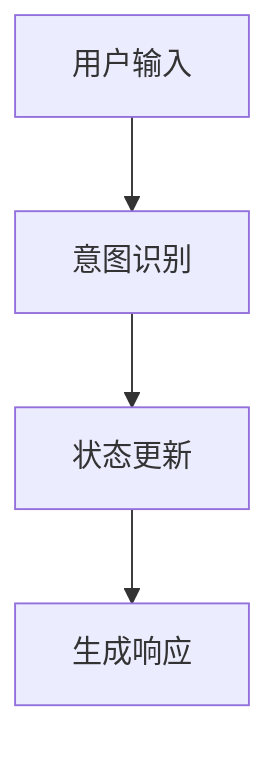

#### 2.1.3 用户意图识别算法
用户意图识别是智能助手设计中的关键问题。常见的意图识别算法包括：
- 基于规则的意图识别
- 基于机器学习的意图识别
- 基于深度学习的意图识别

以下是一个简单的意图识别代码示例：

```python
import nltk
from nltk.classify import NaiveBayesClassifier

# 示例数据
training_data = [
    ('what is your name', 'greeting'),
    ('hi there', 'greeting'),
    ('how are you?', 'greeting'),
    ('exit', 'exit'),
    ('close', 'exit'),
]

# 特征提取函数
def extract_features(text):
    return dict(nltk.word_tokenize(text))

# 训练模型
model = NaiveBayesClassifier.train(training_data)

# 预测意图
print(model.classify('hello'))
```

---

### 2.2 核心概念的特征对比

#### 2.2.1 不同智能助手设计方法的对比
以下是几种常见的智能助手设计方法的对比：

| 方法                | 基于规则的助手 | 基于机器学习的助手 | 基于深度学习的助手 |
|---------------------|----------------|--------------------|--------------------|
| 优点                | 实现简单        | 高准确性            | 更强的语义理解      |
| 缺点                | 适应性差        | 需大量数据          | 计算资源消耗大      |
| 适用场景            | 简单任务        | 中等复杂任务        | 复杂任务            |

#### 2.2.2 核心要素的属性特征分析
智能助手的核心要素具有以下属性特征：
- **意图识别的准确性**：准确识别用户的意图。
- **对话的流畅性**：对话过程自然流畅。
- **系统的响应速度**：快速响应用户输入。

#### 2.2.3 智能助手与传统助手的对比
以下是智能助手与传统助手的对比：

| 特性                | 智能助手          | 传统助手          |
|---------------------|------------------|------------------|
| 智能性              | 高                | 低                |
| 交互方式            | 自然语言输入      | 文本或按钮输入     |
| 适用场景            | 多领域            | 单一功能          |

---

## 2.3 ER实体关系图架构

以下是智能助手的实体关系图：

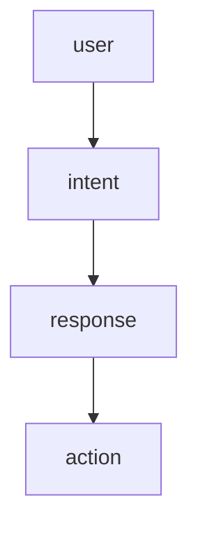

---

## 3章：智能助手设计的算法原理

### 3.1 自然语言处理算法

#### 3.1.1 NLP算法的流程图
以下是NLP算法的流程图：

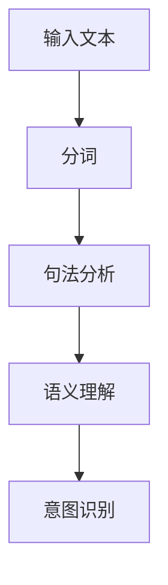

#### 3.1.2 基于Transformer的模型
基于Transformer的模型（如BERT）是当前NLP领域的主流模型。以下是其数学公式：

$$
\text{Attention}(Q, K, V) = \text{softmax}\left(\frac{QK^T}{\sqrt{d_k}}\right)V
$$

其中，$Q$、$K$、$V$分别是查询、键和值向量。

#### 3.1.3 示例代码实现
以下是基于Transformer的模型实现示例：

```python
import tensorflow as tf
from tensorflow.keras.layers import Dense, Dropout, MultiHeadAttention

# 定义Transformer层
class TransformerLayer(tf.keras.Model):
    def __init__(self, d_model, num_heads):
        super(TransformerLayer, self).__init__()
        self.attention = MultiHeadAttention(num_heads=num_heads, key_dim=d_model)
        self.dropout = Dropout(0.1)
    
    def call(self, x, training):
        attn_output, _ = self.attention(x, x)
        attn_output = self.dropout(attn_output, training=training)
        return attn_output
```

---

### 3.2 对话管理算法

#### 3.2.1 对话管理的流程图
以下是对话管理的流程图：


#### 3.2.2 基于状态机的对话管理
基于状态机的对话管理是一种常用方法。以下是其实现示例：

```python
def manage_dialogue(state, user_input):
    if state == 'greeting':
        if user_input == 'hello':
            return 'hello', 'acknowledge'
        else:
            return 'I did not understand. Please try again.', 'greeting'
    elif state == 'acknowledge':
        # 处理具体请求
        pass
```

#### 3.2.3 示例代码实现
以下是对话管理的示例代码：

```python
import re

def extract_intent(user_input):
    greeting_patterns = ['hello', 'hi', 'hey']
    if any(re.match(pattern, user_input) for pattern in greeting_patterns):
        return 'greeting'
    else:
        return 'unknown'
```

---

### 3.3 用户意图识别算法

#### 3.3.1 意图识别的流程图
以下是意图识别的流程图：

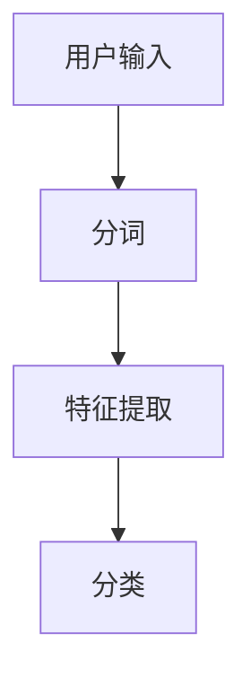

#### 3.3.2 基于机器学习的意图识别
基于机器学习的意图识别通常使用支持向量机（SVM）或随机森林（Random Forest）等算法。以下是其实现示例：

```python
from sklearn.svm import SVC

# 示例数据
training_data = [
    ('what is your name', 'greeting'),
    ('hi there', 'greeting'),
    ('how are you?', 'greeting'),
    ('exit', 'exit'),
    ('close', 'exit'),
]

# 特征提取函数
def extract_features(text):
    return dict(nltk.word_tokenize(text))

# 训练模型
model = SVC().fit([extract_features(text) for text, _ in training_data], [intent for _, intent in training_data])

# 预测意图
print(model.predict([extract_features('hello')]))
```

---

### 3.4 数学模型与公式

#### 3.4.1 Transformer模型的数学公式
以下是Transformer模型的数学公式：

$$
\text{Attention}(Q, K, V) = \text{softmax}\left(\frac{QK^T}{\sqrt{d_k}}\right)V
$$

其中，$Q$、$K$、$V$分别是查询、键和值向量。

#### 3.4.2 注意力机制的数学公式
以下是注意力机制的数学公式：

$$
\text{Attention}(x_i) = \text{softmax}\left(\frac{x_i x_j^T}{\sqrt{d_k}}\right)
$$

---

## 第4章：智能助手设计的系统分析与架构

### 4.1 问题场景介绍

#### 4.1.1 用户需求分析
用户需求分析是智能助手设计的第一步。通过分析用户的行为和反馈，可以确定智能助手的功能需求。

#### 4.1.2 系统目标设定
系统目标设定是智能助手设计的关键。例如：
- 实现高效的意图识别。
- 提供流畅的对话体验。
- 支持多轮对话。

#### 4.1.3 项目背景描述
项目背景描述需要明确智能助手的应用场景和目标用户。例如，设计一个医疗领域的智能助手，帮助用户查询疾病信息。

---

### 4.2 系统功能设计

#### 4.2.1 领域模型设计
领域模型设计是智能助手功能设计的核心。以下是示例：

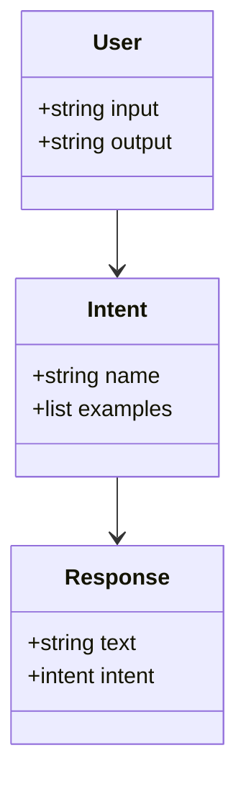

#### 4.2.2 功能模块划分
智能助手的功能模块通常包括：
- **输入模块**：接收用户输入。
- **处理模块**：解析用户输入并生成响应。
- **输出模块**：将响应输出给用户。

#### 4.2.3 功能流程图
以下是功能流程图：

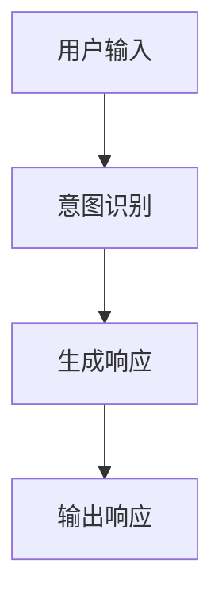

---

### 4.3 系统架构设计

#### 4.3.1 系统架构图
以下是智能助手的系统架构图：

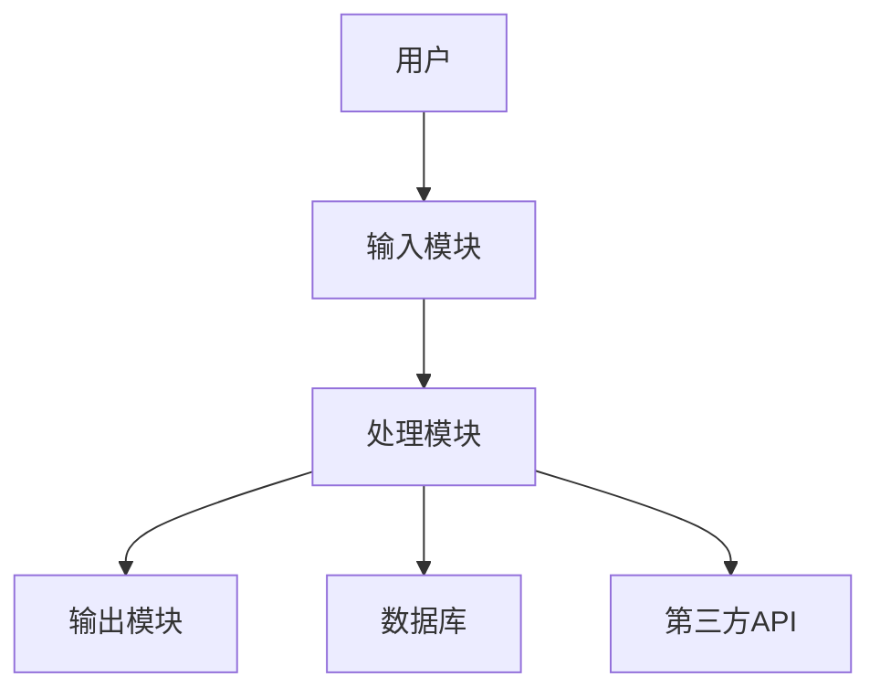

#### 4.3.2 模块交互设计
模块交互设计需要明确各个模块之间的接口和数据流。例如：
- 输入模块接收用户的自然语言输入。
- 处理模块解析输入并生成响应。
- 输出模块将响应输出给用户。

#### 4.3.3 架构实现细节
以下是架构实现细节：

```python
class InputModule:
    def receive_input(self):
        pass

class ProcessingModule:
    def process_input(self, input_text):
        pass

class OutputModule:
    def send_output(self, response):
        pass
```

---

### 4.4 系统接口设计

#### 4.4.1 接口定义
以下是智能助手的接口定义：

```python
interface AssistantInterface:
    def send_request(self, input_text):
        pass

    def receive_response(self):
        pass
```

#### 4.4.2 接口交互流程
以下是接口交互流程：

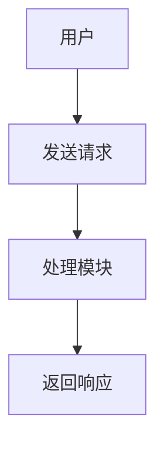

#### 4.4.3 接口实现代码
以下是接口实现代码：

```python
class AssistantImpl:
    def send_request(self, input_text):
        # 处理请求
        pass

    def receive_response(self):
        # 返回响应
        pass
```

---

### 4.5 系统交互设计

#### 4.5.1 交互流程图
以下是系统交互流程图：

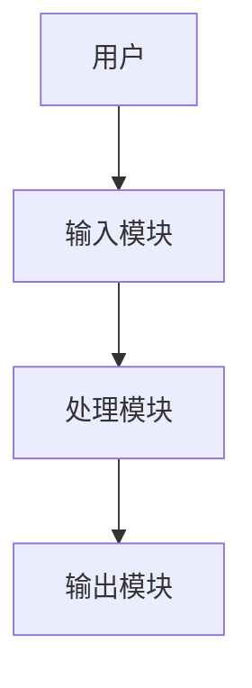

#### 4.5.2 交互设计规范
交互设计规范需要明确用户与系统之间的交互方式。例如：
- 用户通过语音或文本输入与智能助手交互。
- 系统在收到输入后，应在规定时间内返回响应。

#### 4.5.3 交互实现细节
以下是交互实现细节：

```python
def handle_input(user_input):
    # 处理用户输入
    pass
```

---

## 第5章：智能助手设计的项目实战

### 5.1 环境安装与代码实现

#### 5.1.1 环境安装
以下是智能助手开发所需的环境安装步骤：

1. **安装Python**：安装Python 3.8或更高版本。
2. **安装依赖库**：安装所需的第三方库，例如：
   ```bash
   pip install numpy nltk tensorflow
   ```

#### 5.1.2 系统核心实现源代码
以下是智能助手的核心实现代码：

```python
import nltk
from nltk.classify import NaiveBayesClassifier

# 示例数据
training_data = [
    ('what is your name', 'greeting'),
    ('hi there', 'greeting'),
    ('how are you?', 'greeting'),
    ('exit', 'exit'),
    ('close', 'exit'),
]

# 特征提取函数
def extract_features(text):
    return dict(nltk.word_tokenize(text))

# 训练模型
model = NaiveBayesClassifier.train(training_data)

# 预测意图
print(model.classify('hello'))
```

---

### 5.2 代码应用解读与分析

#### 5.2.1 代码实现细节
以下是代码实现细节：

```python
def extract_features(text):
    return dict(nltk.word_tokenize(text))
```

#### 5.2.2 代码应用解读
代码应用解读需要分析智能助手的核心功能，例如意图识别、对话管理等。

#### 5.2.3 代码分析
代码分析需要明确各个部分的功能和交互方式。例如，上述代码实现了基于Naive Bayes的意图识别。

---

### 5.3 实际案例分析和详细讲解剖析

#### 5.3.1 案例分析
以下是智能助手设计的一个实际案例：

**案例名称**：医疗智能助手  
**应用场景**：帮助用户查询疾病信息和预约医生。

#### 5.3.2 详细讲解剖析
以下是案例分析的详细讲解：

1. **需求分析**：明确用户的需求，例如查询疾病症状、预约医生等。
2. **系统设计**：设计系统的功能模块和交互流程。
3. **代码实现**：实现意图识别、对话管理和输出模块。

---

## 第6章：智能助手设计的总结与展望

### 6.1 项目小结

#### 6.1.1 核心内容总结
智能助手设计的核心内容包括：
- 智能助手的核心概念。
- 自然语言处理和对话管理算法。
- 系统架构设计与实现。

#### 6.1.2 关键点回顾
智能助手设计的关键点包括：
- 准确的意图识别。
- 流畅的对话管理。
- 高效的系统架构。

---

### 6.2 最佳实践 Tips

#### 6.2.1 设计建议
以下是智能助手设计的最佳实践建议：
1. **明确用户需求**：在设计智能助手之前，明确用户的需求和目标。
2. **选择合适的算法**：根据应用场景选择合适的NLP算法。
3. **优化系统性能**：通过优化算法和架构设计提高系统的响应速度和准确性。

#### 6.2.2 小结
智能助手设计是一个复杂而有趣的过程，需要综合运用自然语言处理、机器学习和系统架构设计等技术。

#### 6.2.3 注意事项
以下是智能助手设计的注意事项：
1. **保护用户隐私**：确保用户数据的安全性。
2. **处理边缘情况**：考虑用户的各种可能输入和场景。
3. **持续优化**：根据用户反馈不断优化智能助手的功能和性能。

---

### 6.3 拓展阅读

#### 6.3.1 推荐书籍
以下是推荐的书籍：
1. 《自然语言处理入门》
2. 《对话系统实战》
3. 《人工智能：一种现代的方法》

#### 6.3.2 推荐技术博客
以下是推荐的技术博客：
1. [XXX博客](https://example.com)
2. [YYY博客](https://example.com)

---

# 作者：AI天才研究院 & 禅与计算机程序设计艺术

---

**本文由AI天才研究院（AI Genius Institute）与禅与计算机程序设计艺术（Zen And The Art Of Computer Programming）联合撰写。**

