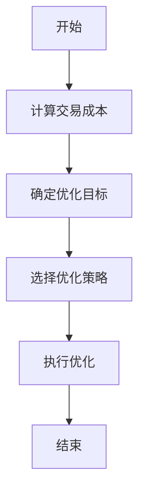
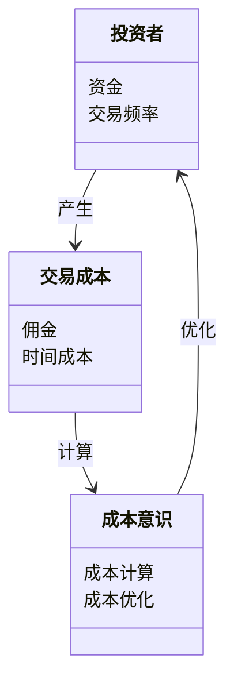
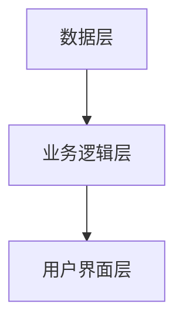
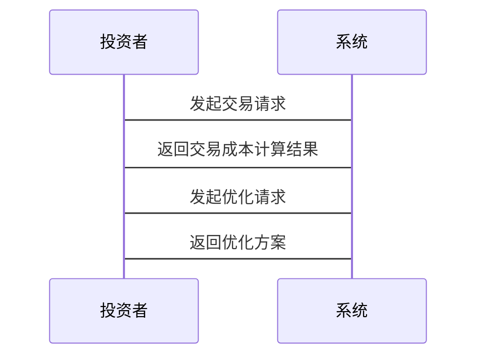

                 


# 《伯格的成本意识：在零佣金交易时代的重新定义》

> 关键词：零佣金交易、成本意识、投资策略、交易优化、系统架构、数学模型

> 摘要：伯格的成本意识理论在零佣金交易时代面临新的挑战和机遇。本文从成本意识的核心概念出发，探讨了零佣金交易下的成本优化策略，提出了基于数学模型的投资决策系统架构，并通过实际案例分析展示了成本意识在零佣金交易中的应用。

---

## 第一部分：背景介绍

### 第1章：零佣金交易时代的背景与挑战

#### 1.1 零佣金交易的兴起

- **1.1.1 传统佣金交易的局限性**  
  传统佣金交易模式下，投资者需要支付较高的交易佣金，这限制了中小投资者的活跃度，也影响了市场的流动性。随着互联网技术的发展和市场竞争的加剧，佣金逐渐被免除，零佣金交易模式应运而生。

- **1.1.2 零佣金交易的市场环境**  
  零佣金交易的兴起得益于技术的进步和市场的竞争，尤其是经纪商为了吸引客户而纷纷推出零佣金服务。然而，零佣金并不意味着零成本，投资者仍需关注隐性成本。

- **1.1.3 技术驱动下的交易变革**  
  零佣金交易依赖于高效的交易系统和数据处理能力。技术的进步使得高频交易、算法交易成为可能，同时也对成本控制提出了更高的要求。

#### 1.2 成本意识的重要性

- **1.2.1 成本意识的核心概念**  
  成本意识是指投资者对交易过程中各种成本的敏感性和认知程度。在零佣金时代，隐性成本（如时间成本、机会成本）变得尤为重要。

- **1.2.2 成本在交易中的影响**  
  成本直接影响投资收益，尤其是在频繁交易的情况下，成本的累积效应会显著影响最终收益。因此，如何有效控制成本成为投资者的核心竞争力。

- **1.2.3 零佣金时代成本控制的新维度**  
  在零佣金时代，隐性成本（如滑点、市场冲击）成为成本控制的关键。投资者需要更加精细地计算和优化这些成本。

#### 1.3 伯格成本意识理论的提出

- **1.3.1 理论的背景与意义**  
  伯格成本意识理论旨在帮助投资者在零佣金交易环境下优化成本结构，提升投资效率。

- **1.3.2 理论的核心观点**  
  伯格认为，成本意识不仅是对显性成本的关注，更是对隐性成本的预测和控制。通过科学的方法，投资者可以在零佣金时代实现成本的最小化。

- **1.3.3 理论的应用范围与边界**  
  伯格成本意识理论适用于各类投资者，尤其适合高频交易和算法交易场景。然而，该理论不适用于市场深度不足或流动性极低的市场。

---

## 第二部分：成本意识的核心概念

### 第2章：成本意识的理论框架

#### 2.1 成本意识的属性特征

- **2.1.1 成本的可变性**  
  成本会随着市场环境的变化而变化，尤其是在零佣金时代，隐性成本的波动性更大。

- **2.1.2 成本的隐含性**  
  隐性成本（如滑点、市场冲击）难以直接量化，但对投资收益的影响不容忽视。

- **2.1.3 成本的动态性**  
  成本在交易过程中是动态变化的，投资者需要实时监控和调整。

#### 2.2 成本意识与其他相关概念的对比

- **2.2.1 成本与收益的对比**  
  成本是收益的对冲因素，高成本会侵蚀收益，但过低的成本可能无法覆盖风险。

- **2.2.2 成本与风险的对比**  
  高风险通常伴随着高成本，但并非所有风险都可以通过成本控制来消除。

- **2.2.3 成本与效率的对比**  
  高效率可能意味着高成本，但通过优化成本结构可以在效率与成本之间找到平衡点。

#### 2.3 成本意识的ER实体关系图

```mermaid
erDiagram
    actor 投资者 {
        <属性> 资金
        <属性> 交易频率
    }
    actor 交易成本 {
        <属性> 佣金
        <属性> 时间成本
    }
    actor 成本意识 {
        <属性> 成本计算
        <属性> 成本优化
    }
    投资者 --> 交易成本 : 产生
    交易成本 --> 成本意识 : 计算
    成本意识 --> 投资者 : 优化
```

---

## 第三部分：零佣金交易下的成本优化策略

### 第3章：交易成本的构成与优化

#### 3.1 零佣金交易的成本构成

- **3.1.1 显性成本**  
  显性成本是指投资者在交易过程中直接支付的费用，如佣金、手续费等。在零佣金时代，显性成本几乎可以忽略不计。

- **3.1.2 隐性成本**  
  隐性成本包括滑点、市场冲击、机会成本等。这些成本难以直接量化，但对投资收益的影响更为显著。

- **3.1.3 综合成本**  
  综合成本是显性成本和隐性成本的总和，是投资者在零佣金时代需要重点关注的对象。

#### 3.2 成本优化的核心算法

- **3.2.1 优化算法的原理**  
  通过数学模型计算不同交易策略下的综合成本，并选择最优策略。

- **3.2.2 优化算法的实现**  
  使用动态规划或遗传算法等技术，对交易成本进行优化。

- **3.2.3 优化算法的数学模型**



---

## 第四部分：投资决策系统的系统架构

### 第4章：系统功能设计与实现

#### 4.1 系统功能设计

- **4.1.1 领域模型设计**  
  领域模型包括投资者、交易成本、成本意识等核心实体。



- **4.1.2 系统架构设计**  
  系统架构采用分层设计，包括数据层、业务逻辑层和用户界面层。



- **4.1.3 接口设计与交互流程**  
  通过RESTful API实现系统接口的设计，并使用序列图描述交互流程。



---

## 第五部分：实战案例

### 第5章：基于伯格成本意识的交易优化

#### 5.1 环境配置与数据准备

- 安装必要的Python库，如NumPy、Pandas、Matplotlib等。

#### 5.2 核心代码实现

```python
import numpy as np
import pandas as pd
import matplotlib.pyplot as plt

def calculate_slippage(volume, spread):
    return volume * spread

def optimize_cost(volumes, spreads):
    min_cost = float('inf')
    best_volume = 0
    for volume in volumes:
        for spread in spreads:
            cost = calculate_slippage(volume, spread)
            if cost < min_cost:
                min_cost = cost
                best_volume = volume
    return best_volume, min_cost

# 示例数据
volumes = [100, 200, 300]
spreads = [0.01, 0.02, 0.03]

best_volume, min_cost = optimize_cost(volumes, spreads)
print(f"最佳成交量：{best_volume}")
print(f"最小滑点成本：{min_cost}")
```

#### 5.3 案例分析与经验总结

- 通过实际案例分析，验证伯格成本意识理论在交易优化中的有效性，并总结经验教训。

---

## 第六部分：总结与展望

### 第6章：伯格成本意识的未来展望

#### 6.1 理论总结

- 伯格成本意识理论为投资者在零佣金时代提供了新的视角和工具。

#### 6.2 经验总结

- 成本意识不仅是对交易成本的计算，更是对投资策略的优化和调整。

#### 6.3 未来展望

- 随着人工智能和大数据技术的发展，成本意识将在投资决策中发挥更大的作用。未来的成本优化将更加智能化和个性化。

---

## 作者信息

作者：AI天才研究院/AI Genius Institute & 禅与计算机程序设计艺术 /Zen And The Art of Computer Programming

