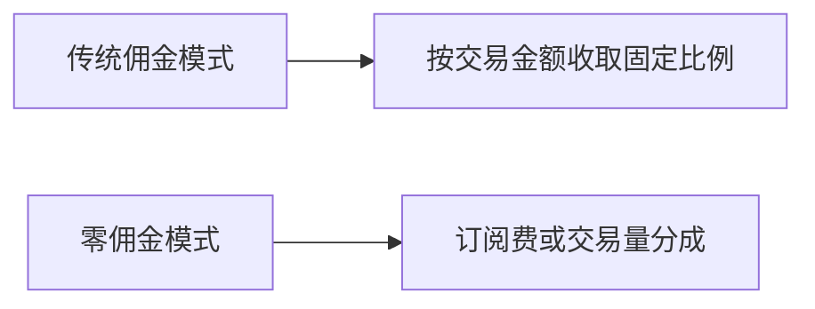

                 

# 《伯格的成本控制理念：在零佣金时代的新思考》

---

## 关键词  
伯格、成本控制、投资策略、零佣金、指数基金、风险管理、夏普比率

---

## 摘要  
本文深入探讨了投资大师伯格的成本控制理念，并结合零佣金时代的市场变化，分析了其在投资策略中的新应用。通过解析伯格的投资哲学、指数基金的成本优势以及风险管理的核心作用，本文为投资者提供了在零佣金环境下优化投资组合的实践指南。

---

## 正文

---

### 第一部分：伯格的成本控制理念概述

#### 第1章：伯格的投资哲学与方法

##### 1.1 伯格的投资哲学

**1.1.1 价值投资的核心理念**

伯格是价值投资的代表人物之一，他强调以低于内在价值的价格买入优质资产。他的核心理念是：

- **长期投资**：避免短期市场波动的干扰，通过长期持有优质资产获得收益。
- **价值导向**：寻找被市场低估的公司，关注企业的基本面，如盈利能力、财务健康和管理团队。

**公式：**

$$ \text{内在价值} = \sum_{t=1}^{n} \frac{CF_t}{(1 + r)^t} $$  

其中，$CF_t$ 是第 $t$ 年的现金流，$r$ 是折现率。

**1.1.2 投资策略**

伯格的投资策略可以总结为“买入并持有”，即通过长期持有优质资产，避免频繁交易带来的成本。他的策略强调：

- **分散投资**：通过投资多个资产类别降低风险。
- **低成本运作**：通过指数基金降低管理费和交易成本。

**1.1.3 成本控制的重要性**

伯格认为，投资成本是影响长期收益的关键因素之一。他提出了一个简单的公式：

$$ \text{总收益} = \text{市场回报} - \text{成本} $$  

这意味着，降低成本可以显著提高长期投资收益。

---

#### 第2章：伯格的投资方法论

##### 2.1 投资组合构建

伯格的投资组合构建方法基于以下原则：

- **分散化**：通过投资多个资产类别降低风险。
- **低成本**：选择费用低的指数基金或ETF。
- **长期持有**：避免频繁交易，减少交易成本。

**公式：**

$$ \text{夏普比率} = \frac{\text{投资组合的超额收益}}{\text{投资组合的波动率}} $$  

伯格的目标是通过低成本和分散化，提高投资组合的夏普比率。

---

### 第二部分：零佣金时代的投资环境

#### 第3章：零佣金模式的兴起

##### 3.1 零佣金模式的兴起

零佣金模式的兴起彻底改变了传统的佣金结构。以下是一些关键点：

- **佣金结构的演变**：
  - 传统佣金模式：按交易金额收取固定比例的佣金。
  - 零佣金模式：通过其他方式（如订阅费、交易量分成）收取佣金。
  
- **零佣金对市场的影响**：
  - 降低了中小投资者的交易成本。
  - 提高了市场的流动性。

**图表：佣金结构对比**

---

#### 第4章：零佣金时代的投资策略

##### 4.1 指数基金的成本优势

在零佣金时代，指数基金的成本优势更加显著。以下是指数基金的成本优势分析：

- **低成本**：指数基金的管理费用（ TER）通常低于主动管理型基金。
- **可预测性**：指数基金的费用结构透明，便于长期规划。
- **分散化**：指数基金通过分散投资降低风险。

**公式：**

$$ \text{总成本} = \text{管理费} + \text{交易成本} + \text{其他费用} $$  

伯格认为，通过选择低成本指数基金，投资者可以在零佣金时代进一步降低投资成本。

---

### 第三部分：伯格理念在零佣金时代的应用

#### 第5章：风险管理与成本控制

##### 5.1 风险管理的核心理念

在零佣金时代，风险管理仍然是投资的核心。伯格的风险管理理念包括：

- **分散化**：通过投资不同资产类别降低风险。
- **长期持有**：避免短期波动的影响。
- **定期 rebalancing**：定期调整投资组合以保持目标配置。

**图表：投资组合的再平衡流程**

---

#### 第6章：实际案例分析

##### 6.1 伯格的经典案例

**案例分析：伯格的指数基金投资**

伯格曾管理过一只著名的指数基金，以下是该基金的成本分析：

- **管理费**：0.18%
- **交易成本**：由于长期持有，交易成本接近零。
- **总成本**：约为 0.2%

**公式：**

$$ \text{总成本比率} = \frac{\text{总成本}}{\text{资产规模}} $$  

---

## 总结

伯格的成本控制理念在零佣金时代依然具有重要的指导意义。通过选择低成本指数基金、注重分散化和长期持有，投资者可以在零佣金环境下优化投资组合，实现更高的长期收益。

---

## 作者

**作者：AI天才研究院/AI Genius Institute & 禅与计算机程序设计艺术 /Zen And The Art of Computer Programming**

