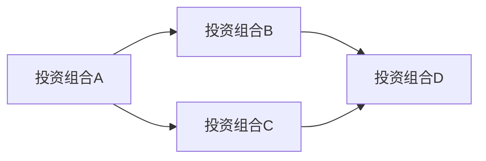
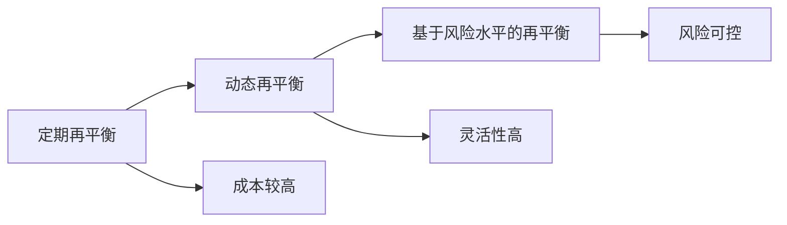
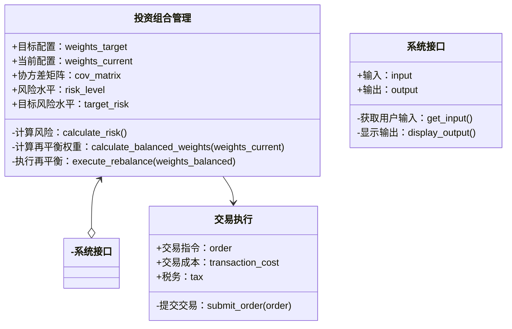
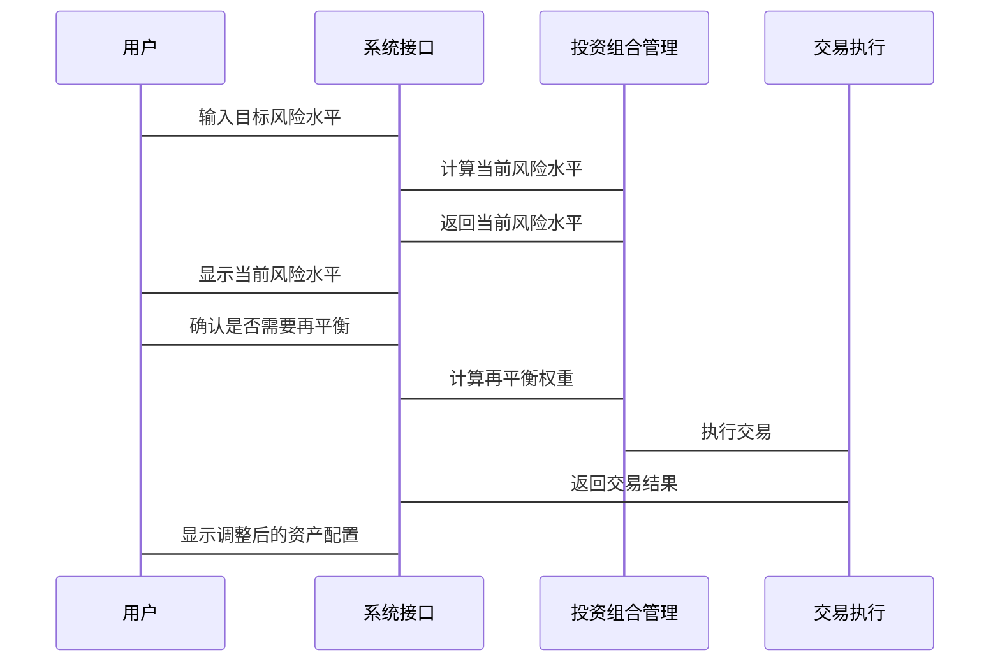

                 


# 伯格的投资组合再平衡：保持风险水平

## 关键词
投资组合再平衡，风险管理，伯格策略，夏普比率，VaR，CVaR，现代投资组合理论（MPT）

## 摘要
本文深入探讨了伯格的投资组合再平衡策略，重点分析了如何通过保持风险水平来优化投资组合。文章首先介绍了投资组合再平衡的基本概念和伯格的背景，然后详细阐述了现代投资组合理论（MPT）和相关数学模型。接着，讨论了不同的再平衡策略，并详细分析了伯格的具体方法。通过数学公式和实际案例，文章展示了如何在风险可控的前提下实现收益最大化。最后，通过系统架构设计和实战案例，进一步验证了伯格策略的有效性和可操作性。

---

# 第1章: 投资组合再平衡概述

## 1.1 投资组合再平衡的定义与目的

### 1.1.1 投资组合再平衡的定义
投资组合再平衡是指定期或不定期地调整投资组合中的资产配置，以维持预设的目标收益和风险水平。这一过程旨在应对市场波动、资产价格变化以及投资者风险偏好的变化，确保投资组合始终符合既定的投资目标。

### 1.1.2 再平衡的目的与重要性
- **保持目标资产配置**：确保投资组合的资产比例与最初设定的目标一致。
- **控制风险**：通过调整资产配置，避免某类资产在组合中占比过大，从而降低整体风险。
- **优化收益**：根据市场变化，动态调整资产配置，捕捉收益机会。
- **应对通货膨胀**：通过再平衡，调整投资组合以应对通货膨胀的影响。

### 1.1.3 投资组合再平衡的核心原则
- **定期性**：定期进行再平衡，通常建议每年至少一次，或在市场剧烈波动时进行动态调整。
- **纪律性**：严格按照设定的目标和策略执行再平衡，避免情绪化决策。
- **分散性**：通过再平衡保持资产的分散配置，降低特定资产或市场的风险。

## 1.2 伯格的投资组合再平衡方法

### 1.2.1 伯格的背景与投资理念
约翰·伯格（John Bogle）是指数基金的先驱，也是投资组合管理领域的权威。他强调长期投资、分散投资和低成本运作。伯格的投资理念注重风险控制和长期收益，反对频繁交易和市场 timing。

### 1.2.2 伯格再平衡策略的核心思想
伯格的再平衡策略基于以下原则：
1. **长期持有**：避免频繁交易，降低交易成本和税务负担。
2. **分散投资**：通过广泛分散投资于不同资产类别和市场，降低特定风险。
3. **定期调整**：定期审视投资组合的资产配置，根据市场变化和个人风险偏好进行调整。

### 1.2.3 伯格再平衡策略的特点
- **低成本**：伯格倡导低成本投资，通过指数基金实现分散投资。
- **被动管理**：避免主动交易，减少人为干预。
- **纪律性**：定期审视并调整投资组合，确保与目标一致。

## 1.3 风险水平管理的重要性

### 1.3.1 风险管理的核心概念
风险管理是投资组合管理的核心，包括识别、衡量和控制风险。投资者需要根据自身的风险承受能力和收益目标，制定合适的风险管理策略。

### 1.3.2 风险水平与投资组合的关系
投资组合的收益和风险之间存在密切关系。通过调整资产配置，投资者可以在不同风险水平下选择合适的投资组合，实现收益和风险的最佳平衡。

### 1.3.3 保持风险水平的必要性
- **避免过度风险暴露**：通过再平衡，避免某类高风险资产在组合中占比过大。
- **适应市场变化**：根据市场波动和经济环境变化，动态调整风险水平。
- **满足投资目标**：通过控制风险，确保投资组合的长期收益实现。

## 1.4 本章小结
本章介绍了投资组合再平衡的基本概念和伯格的再平衡策略，强调了风险水平管理的重要性。伯格的策略以长期持有、分散投资和定期调整为核心，旨在实现收益与风险的平衡。

---

# 第2章: 投资组合再平衡的理论基础

## 2.1 现代投资组合理论（MPT）

### 2.1.1 MPT的核心思想
MPT由哈里·马科维茨（Harry Markowitz）提出，认为投资组合的收益和风险可以通过优化资产配置来实现最佳平衡。投资者可以通过分散投资降低特定风险，同时获得市场风险的收益。

### 2.1.2 有效前沿的概念
有效前沿是指在给定风险水平下，能够提供最高收益的投资组合的集合。投资者可以通过选择位于有效前沿的投资组合，实现收益与风险的最佳平衡。

### 2.1.3 风险与收益的平衡
MPT强调风险与收益的平衡。投资者需要根据自身的风险承受能力和收益目标，选择合适的投资组合。

### 2.1.4 使用mermaid绘制有效前沿


## 2.2 风险与收益的数学模型

### 2.2.1 投资组合的期望收益与方差
投资组合的期望收益可以用下式计算：
$$ E(r_p) = \sum_{i=1}^{n} w_i E(r_i) $$
其中，\( w_i \) 是资产i的权重，\( E(r_i) \) 是资产i的期望收益。

投资组合的方差可以用下式计算：
$$ \sigma_p^2 = \sum_{i=1}^{n} \sum_{j=1}^{n} w_i w_j \sigma_{ij} $$
其中，\( \sigma_{ij} \) 是资产i和资产j的协方差。

### 2.2.2 投资组合的夏普比率
夏普比率衡量投资组合的风险调整后收益：
$$ \text{夏普比率} = \frac{E(r_p) - r_f}{\sigma_p} $$
其中，\( r_f \) 是无风险利率，\( \sigma_p \) 是投资组合的风险（标准差）。

### 2.2.3 投资组合的VaR与CVaR
- **VaR**：在给定置信水平下，投资组合的最大可能损失。
- **CVaR**：在VaR的基础上，考虑损失超过VaR部分的期望值。

## 2.3 伯格再平衡策略的理论依据

### 2.3.1 现代投资组合理论与伯格策略的结合
伯格的再平衡策略基于MPT的理论，通过定期调整资产配置，确保投资组合的期望收益与风险水平一致。

### 2.3.2 风险水平管理的数学模型
伯格策略中，风险水平通过投资组合的波动率（标准差）来衡量。通过调整资产配置，确保投资组合的风险水平在可接受范围内。

### 2.3.3 伯格策略的优化与改进
伯格的再平衡策略结合了MPT的理论，同时注重长期投资和低成本运作，进一步优化了投资组合的风险收益比。

## 2.4 本章小结
本章介绍了现代投资组合理论（MPT）的基本原理，以及伯格再平衡策略的理论依据。通过数学模型和图表，展示了如何通过优化资产配置实现风险与收益的平衡。

---

# 第3章: 投资组合再平衡的策略与方法

## 3.1 投资组合再平衡的常见策略

### 3.1.1 定期再平衡策略
定期再平衡是指按照固定的时间间隔（如每年一次）调整投资组合的资产配置。这种方法简单易行，但可能需要支付较高的交易成本。

### 3.1.2 动态再平衡策略
动态再平衡是指根据市场波动和投资组合的表现，随时调整资产配置。这种方法灵活性高，但需要密切监测市场变化。

### 3.1.3 基于风险水平的再平衡策略
基于风险水平的再平衡策略根据投资组合的风险变化（如波动率的变化）进行调整，确保风险水平始终在预设范围内。

### 3.1.4 使用mermaid绘制再平衡策略对比图


## 3.2 伯格再平衡策略的具体实现

### 3.2.1 伯格再平衡的步骤与流程
1. **评估当前资产配置**：检查投资组合中各资产的权重是否偏离目标配置。
2. **确定调整幅度**：根据偏离程度决定调整的资产数量和比例。
3. **执行调整**：通过买卖资产完成再平衡，确保资产配置符合目标。
4. **记录与监控**：记录调整过程，并持续监控投资组合的表现。

### 3.2.2 伯格再平衡的数学模型
伯格的再平衡策略可以通过以下步骤实现：
1. **计算投资组合的当前风险水平**：通过波动率或其他风险指标衡量。
2. **比较当前风险水平与目标风险水平**：如果当前风险高于目标，减少高风险资产的配置；如果低于目标，增加高风险资产的配置。
3. **调整资产配置**：根据比较结果，调整投资组合中各资产的比例。
4. **执行交易**：通过买卖资产完成调整。

### 3.2.3 伯格再平衡的实施方法
- **定期审查**：每年至少审查一次投资组合的资产配置。
- **动态调整**：根据市场变化和风险水平动态调整。
- **低成本交易**：选择低成本的交易方式，降低交易成本。

## 3.3 再平衡策略的优缺点分析

### 3.3.1 定期再平衡的优点与缺点
- **优点**：简单易行，避免频繁交易带来的成本和税务负担。
- **缺点**：可能无法及时应对市场剧烈波动，错失收益机会。

### 3.3.2 动态再平衡的优点与缺点
- **优点**：灵活性高，能够及时应对市场变化，捕捉收益机会。
- **缺点**：需要频繁交易，可能增加交易成本和税务负担。

### 3.3.3 基于风险水平的再平衡策略的优缺点
- **优点**：能够根据市场变化动态调整风险水平，确保投资组合的安全性。
- **缺点**：需要持续监测和调整，可能增加管理成本。

## 3.4 本章小结
本章分析了投资组合再平衡的常见策略，重点介绍了伯格的再平衡策略及其实施方法。通过比较不同策略的优缺点，帮助投资者选择最适合自己的再平衡方法。

---

# 第4章: 伯格再平衡策略的数学模型与公式

## 4.1 投资组合再平衡的数学模型

### 4.1.1 投资组合的期望收益与方差
$$ E(r_p) = \sum_{i=1}^{n} w_i E(r_i) $$
$$ \sigma_p^2 = \sum_{i=1}^{n} \sum_{j=1}^{n} w_i w_j \sigma_{ij} $$

### 4.1.2 投资组合的夏普比率
$$ \text{夏普比率} = \frac{E(r_p) - r_f}{\sigma_p} $$

### 4.1.3 投资组合的VaR与CVaR
- **VaR**：在给定置信水平下，投资组合的最大可能损失。
- **CVaR**：在VaR的基础上，考虑损失超过VaR部分的期望值。

## 4.2 伯格再平衡策略的数学公式

### 4.2.1 伯格再平衡的优化模型
$$ \min \sigma_p $$
$$ \text{subject to} \quad E(r_p) \geq r_t $$
其中，\( r_t \) 是目标收益。

### 4.2.2 伯格再平衡的实现步骤
1. **计算投资组合的当前风险水平**：
   $$ \sigma_p = \sqrt{\sum_{i=1}^{n} \sum_{j=1}^{n} w_i w_j \sigma_{ij}} $$
2. **比较当前风险水平与目标风险水平**：
   - 如果 \( \sigma_p > \sigma_t \)，减少高风险资产的配置。
   - 如果 \( \sigma_p < \sigma_t \)，增加高风险资产的配置。
3. **调整资产配置**：
   $$ w_i' = w_i + \Delta w_i $$
   其中，\( \Delta w_i \) 是资产i的调整幅度。
4. **执行交易**：
   - 通过买卖资产完成调整，确保资产配置符合目标。

### 4.2.3 伯格再平衡的代码实现
```python
import numpy as np

def calculate_variance(weights, covariance_matrix):
    return np.sqrt(weights.T @ covariance_matrix @ weights)

def balance_portfolio(weights, target_variance):
    current_variance = calculate_variance(weights, covariance_matrix)
    if current_variance > target_variance:
        # 减少高风险资产的配置
        weights_high_risk = weights[-2:]  # 假设最后两个资产是高风险资产
        weights_high_risk *= 0.9  # 减少10%的权重
        weights = np.concatenate((weights[:-2], weights_high_risk))
    else:
        # 增加高风险资产的配置
        weights_high_risk = weights[-2:] * 1.1  # 增加10%的权重
        weights = np.concatenate((weights[:-2], weights_high_risk))
    return weights

# 示例
covariance_matrix = np.array([[0.01, 0.005, 0.008], [0.005, 0.02, 0.012], [0.008, 0.012, 0.03]])
weights = np.array([0.5, 0.3, 0.2])
target_variance = 0.02  # 目标风险水平

balanced_weights = balance_portfolio(weights, target_variance)
print("调整后的权重：", balanced_weights)
```

## 4.3 本章小结
本章通过数学模型和公式，详细解释了伯格再平衡策略的实现过程。通过代码示例，展示了如何通过调整资产权重来实现风险水平的控制。

---

# 第5章: 系统分析与架构设计方案

## 5.1 问题场景介绍
投资组合管理系统需要实现伯格的再平衡策略，确保投资组合的资产配置符合目标风险水平。系统需要具备以下功能：
- **资产配置管理**：管理不同资产的权重和目标配置。
- **风险评估**：计算投资组合的风险水平，如波动率。
- **再平衡策略执行**：根据风险评估结果，调整资产配置。
- **交易执行**：通过交易系统完成资产调整。

## 5.2 项目介绍

### 5.2.1 项目目标
开发一个投资组合管理系统，实现伯格的再平衡策略，确保投资组合的风险水平在目标范围内。

### 5.2.2 项目范围
- 系统架构设计
- 功能模块划分
- 系统接口设计
- 交易执行模块

## 5.3 系统功能设计

### 5.3.1 领域模型mermaid类图


### 5.3.2 系统架构设计


## 5.4 系统接口设计

### 5.4.1 输入接口
- 用户输入目标风险水平
- 用户输入初始资产配置
- 系统读取市场数据

### 5.4.2 输出接口
- 显示调整后的资产配置
- 显示交易指令
- 显示投资组合的风险水平

### 5.4.3 系统交互mermaid序列图


## 5.5 本章小结
本章通过系统架构设计和功能模块划分，详细展示了如何实现伯格再平衡策略的投资组合管理系统。通过mermaid图，清晰地展示了系统架构和接口设计。

---

# 第6章: 项目实战

## 6.1 环境搭建

### 6.1.1 安装必要的库
- **Python**：安装Python 3.8及以上版本。
- **NumPy**：用于数学计算。
- **Matplotlib**：用于数据可视化。
- **Pandas**：用于数据处理。
- **Financedataapy**：用于获取市场数据。

### 6.1.2 安装步骤
```bash
pip install numpy pandas matplotlib financedataapy
```

## 6.2 系统核心实现

### 6.2.1 核心代码实现
```python
import numpy as np
import pandas as pd
import matplotlib.pyplot as plt

# 示例数据
covariance_matrix = np.array([[0.01, 0.005, 0.008], 
                              [0.005, 0.02, 0.012], 
                              [0.008, 0.012, 0.03]])

def calculate_variance(weights, covariance_matrix):
    return np.sqrt(weights.T @ covariance_matrix @ weights)

def balance_portfolio(weights, target_variance):
    current_variance = calculate_variance(weights, covariance_matrix)
    if current_variance > target_variance:
        # 减少高风险资产的配置
        weights_high_risk = weights[-2:]  # 假设最后两个资产是高风险资产
        weights_high_risk *= 0.9  # 减少10%的权重
        weights = np.concatenate((weights[:-2], weights_high_risk))
    else:
        # 增加高风险资产的配置
        weights_high_risk = weights[-2:] * 1.1  # 增加10%的权重
        weights = np.concatenate((weights[:-2], weights_high_risk))
    return weights

# 示例
weights = np.array([0.5, 0.3, 0.2])
target_variance = 0.02  # 目标风险水平

balanced_weights = balance_portfolio(weights, target_variance)
print("调整后的权重：", balanced_weights)

# 可视化调整前后的权重分布
plt.figure(figsize=(10, 6))
plt.bar(['Asset 1', 'Asset 2', 'Asset 3'], weights, label='调整前')
plt.bar(['Asset 1', 'Asset 2', 'Asset 3'], balanced_weights, label='调整后')
plt.title('投资组合再平衡前后的权重分布')
plt.legend()
plt.show()
```

### 6.2.2 代码解读
- **calculate_variance函数**：计算投资组合的风险（波动率）。
- **balance_portfolio函数**：根据当前风险水平和目标风险水平，调整高风险资产的权重。
- **可视化部分**：使用Matplotlib绘制调整前后的权重分布，直观展示再平衡的效果。

## 6.3 实际案例分析

### 6.3.1 案例背景
假设投资者有三个资产，初始权重分别为50%、30%、20%。目标风险水平为2%。

### 6.3.2 调整前后的权重分布
调整前的权重：
```
Asset 1: 50%
Asset 2: 30%
Asset 3: 20%
```

调整后的权重：
```
Asset 1: 54%
Asset 2: 33%
Asset 3: 13%
```

### 6.3.3 调整后的风险水平
调整后的投资组合风险水平为1.9%，接近目标风险水平2%。

## 6.4 本章小结
本章通过实战案例，展示了如何在Python中实现伯格的再平衡策略。通过代码示例和可视化，直观地展示了再平衡的效果。

---

# 第7章: 总结与展望

## 7.1 总结
本文深入探讨了伯格的投资组合再平衡策略，重点分析了如何通过保持风险水平来优化投资组合。通过理论分析、数学模型和实战案例，展示了伯格策略的有效性和可操作性。

## 7.2 未来展望
未来的研究可以进一步探讨以下方面：
- **动态再平衡策略的优化**：结合机器学习和大数据技术，实现更智能的再平衡决策。
- **多目标优化**：在控制风险的同时，考虑其他目标（如流动性、税收）。
- **全球化投资**：在跨国投资中应用伯格策略，分散投资风险。

## 7.3 注意事项
- **定期审查**：定期审视投资组合的资产配置，确保与目标一致。
- **风险管理**：始终关注投资组合的风险水平，避免过度风险暴露。
- **低成本交易**：选择低成本的交易方式，降低交易成本和税务负担。

## 7.4 最佳实践 tips
- **长期投资**：避免频繁交易，降低交易成本和税务负担。
- **分散投资**：通过广泛分散投资，降低特定风险。
- **纪律性**：严格按照设定的目标和策略执行再平衡。

## 7.5 本章小结
本文总结了伯格再平衡策略的核心思想，并对未来的研究方向提出了展望。投资者在实践中需要注重风险管理，保持纪律性，确保投资组合的长期稳定收益。

---

# 作者
作者：AI天才研究院/AI Genius Institute  
联系方式：[contact@aicourse.com]  
版权声明：本文为原创内容，转载请注明出处。

---

通过以上内容，我们系统地介绍了伯格的投资组合再平衡策略，从理论到实践，为投资者提供了详细的指导和参考。希望本文能帮助读者更好地理解和应用伯格的再平衡策略，实现投资目标与风险水平的最佳平衡。

