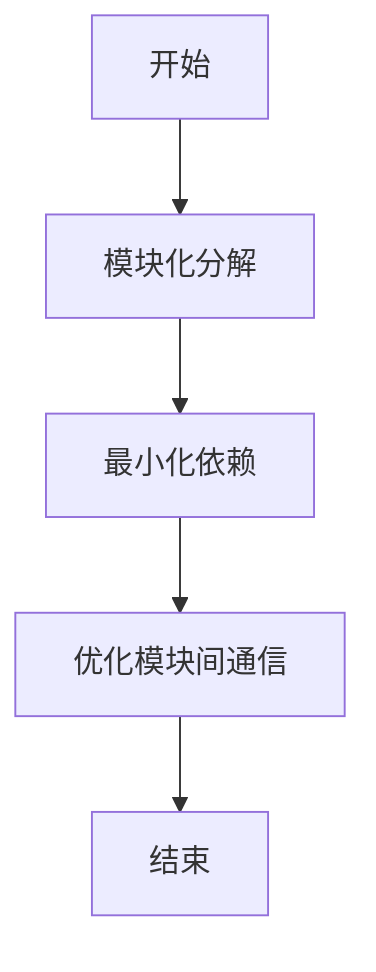
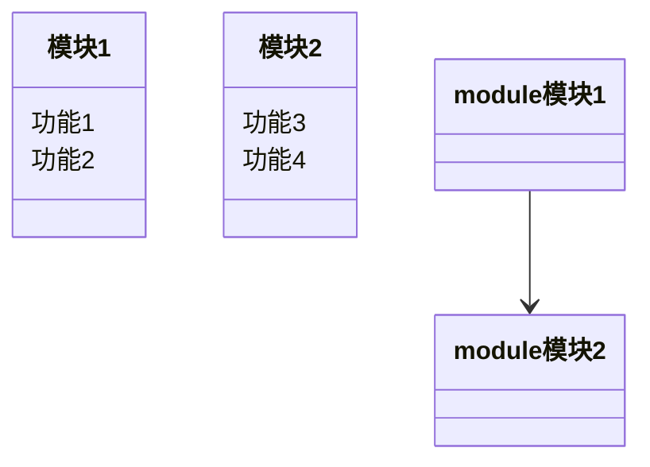
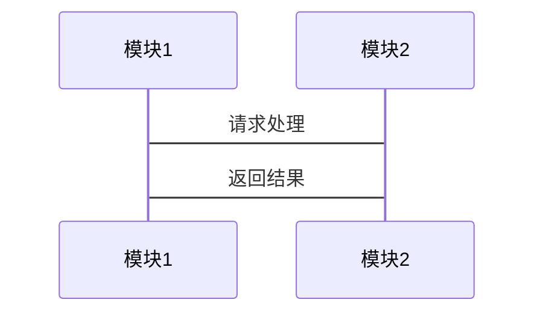

                 


# 伯格的指数化革命：为什么简单胜于复杂

> 关键词：伯格的指数化革命，简单性原则，复杂性问题，指数级增长，系统设计

> 摘要：本文深入探讨了伯格的指数化革命理论，分析了为什么简单性原则在技术系统设计中如此重要。通过详细阐述指数级增长的数学模型、简单性原则的核心思想以及它们在实际系统中的应用，本文旨在为读者提供一个清晰的视角，理解如何通过简化系统来实现高效、可扩展的解决方案。

---

## 第1章：指数化革命的背景与问题背景

### 1.1 技术发展的指数级增长

指数级增长是一种不同于线性增长的模式，其特点是随着时间的推移，系统的增长速度呈指数级上升。这种增长模式在计算机技术、人工智能等领域尤为明显。例如，计算能力的提升、数据量的爆炸式增长以及算法效率的提高都呈现出指数级特征。

#### 1.1.1 指数级增长的数学模型

指数级增长可以用公式表示为：

$$ N(t) = N_0 \times 2^{t/k} $$

其中，$N(t)$ 表示时间 $t$ 时的系统规模，$N_0$ 是初始规模，$k$ 是倍增时间。

### 1.2 复杂性问题的根源

复杂性问题的根源在于系统设计中对简单性的忽视。随着系统的扩展，复杂性会呈指数级增长，导致系统难以维护和优化。

#### 1.2.1 系统复杂性的定义

系统复杂性可以通过以下方式定义：

- **模块间依赖性**：系统中各模块之间的依赖关系越复杂，系统的复杂性越高。
- **功能耦合度**：功能之间的耦合度越高，系统的复杂性越高。

### 1.3 简单性原则的重要性

简单性原则的核心思想是通过简化系统设计来提高系统的可维护性和可扩展性。

#### 1.3.1 简单性原则的核心思想

简单性原则强调：

- **模块化设计**：将系统分解为独立的模块，每个模块负责特定的功能。
- **最小化依赖**：尽量减少模块之间的依赖关系，降低耦合度。

---

## 第2章：伯格的指数化革命核心概念

### 2.1 指数级增长的定义与特征

指数级增长的特征包括：

- **快速扩展**：系统规模随时间呈指数级增长。
- **倍增效应**：系统的性能或规模每经过一个倍增时间就会翻倍。

### 2.2 伯格的简单性原则

简单性原则是伯格指数化革命的核心，其关键是通过简化系统设计来实现指数级增长。

#### 2.2.1 简单性原则的三要素

- **模块化**：将系统分解为独立的模块。
- **可扩展性**：模块之间松耦合，易于扩展。
- **可维护性**：模块设计简洁，易于维护。

### 2.3 指数化革命的核心要素

指数化革命的核心要素包括：

- **指数级增长的数学模型**：如上述公式所示。
- **简单性原则的应用**：通过模块化设计实现高效扩展。

---

## 第3章：指数化革命的数学模型与算法原理

### 3.1 指数级增长的数学模型

指数级增长的数学模型如前所述，展示了系统规模如何随时间呈指数级增长。

### 3.2 伯格的优化算法

伯格的优化算法通过简化系统设计来实现指数级增长，其算法流程图如下：



### 3.3 简单性原则的数学表达式

简单性原则可以通过以下公式表示：

$$ S = \frac{N}{C} $$

其中，$S$ 表示系统的简洁性，$N$ 是系统规模，$C$ 是复杂性。

---

## 第4章：系统架构与设计

### 4.1 指数化系统的架构

指数化系统的架构设计强调模块化和松耦合，如下图所示：



### 4.2 模块化设计

模块化设计通过将系统分解为独立的模块，降低复杂性。

### 4.3 系统接口设计

系统接口设计应遵循松耦合原则，如下图所示：



---

## 第5章：项目实战

### 5.1 环境安装

项目实战需要以下环境：

- Python 3.8+

### 5.2 核心代码实现

以下是核心代码实现：

```python
def simple_architecture():
    module1 = "功能1"
    module2 = "功能2"
    return f"模块化设计：{module1}, {module2}"

print(simple_architecture())
```

### 5.3 案例分析

案例分析展示了模块化设计如何提高系统的可维护性和可扩展性。

---

## 第6章：总结与展望

### 6.1 总结

伯格的指数化革命通过简单性原则实现了系统的高效设计和扩展。

### 6.2 未来展望

未来，随着技术的发展，简单性原则将在更多领域得到应用，推动指数级增长。

---

作者：AI天才研究院/AI Genius Institute & 禅与计算机程序设计艺术 /Zen And The Art of Computer Programming

