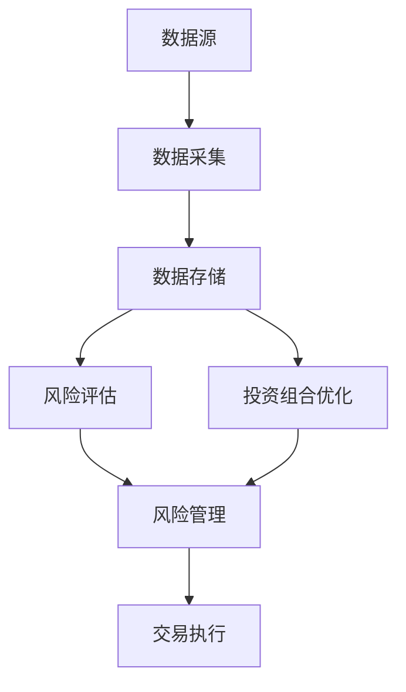

                 


# 伯格的指数基金理念：应对市场集中度上升的挑战

## 关键词：
- 指数基金
- 市场集中度
- 投资策略
- 伯格理念
- 风险管理

## 摘要：
伯格的指数基金理念以其独特的被动投资策略和分散化原则，为投资者在市场集中度上升的背景下提供了一种稳健的投资方式。本文将详细探讨指数基金的核心原理、市场集中度上升的原因及其对投资的影响，分析伯格指数基金如何应对这些挑战，并通过实际案例和数学模型，帮助读者理解如何利用指数基金实现长期稳健的投资回报。

---

## 第一部分：指数基金概述

### 第1章：指数基金的定义与历史发展

#### 1.1 指数基金的定义
- **1.1.1 什么是指数基金**
  指数基金是一种被动管理型基金，旨在复制特定市场指数的表现，如标普500指数。其核心在于通过分散投资来降低风险，避免因个别资产波动而带来的损失。
- **1.1.2 指数基金的特点**
  - **被动管理**：指数基金不主动选股，而是跟踪指数，减少交易成本和管理费用。
  - **分散投资**：投资于多个资产，降低单一资产的风险。
  - **低成本**：由于被动管理，指数基金的管理费用通常低于主动管理型基金。
- **1.1.3 指数基金的分类**
  - **股票型指数基金**：跟踪股票指数，如标普500。
  - **债券型指数基金**：跟踪债券指数，如国债指数。
  - **全球指数基金**：投资于全球市场，分散地域风险。

#### 1.2 指数基金的历史发展
- **1.2.1 指数基金的起源**
  20世纪70年代，指数基金开始兴起，伯格（John Bogle）是该领域的先驱，他创立了先锋集团（Vanguard），推出了第一只低成本指数基金。
- **1.2.2 指数基金的发展历程**
  - 从早期的单一市场指数基金到全球多样化指数基金。
  - 技术进步推动了指数基金的创新，如ETF（交易所交易基金）的出现，提高了交易灵活性。
- **1.2.3 指数基金的现状**
  当前，指数基金在全球范围内广泛流行，尤其在市场集中度上升的背景下，其分散投资的优势更加突出。

#### 1.3 伯格的指数基金理念
- **1.3.1 伯格的指数基金理论**
  伯格认为，长期来看，指数基金能够提供接近市场平均收益的投资回报，而主动管理型基金由于高昂的费用和低命中率，很难超越市场表现。
- **1.3.2 伯格的投资哲学**
  伯格强调长期投资和分散投资的重要性，认为市场波动无法预测，投资者应避免频繁交易，降低交易成本。
- **1.3.3 伯格对指数基金的贡献**
  伯格通过创新和降低成本，使指数基金成为普通投资者的可选投资工具，推动了被动投资的普及。

---

## 第二部分：市场集中度的上升与挑战

### 第2章：市场集中度的定义与衡量

#### 2.1 市场集中度的定义与衡量
- **2.1.1 什么是市场集中度**
  市场集中度是指某个行业中少数几家企业的市场份额占比较大，通常通过赫芬达尔-赫希曼指数（HHI指数）来衡量。
- **2.1.2 市场集中度的衡量指标**
  - **HHI指数**：计算公式为$$HHI = \sum_i (s_i)^2$$，其中$s_i$是市场中各企业的市场份额。
  - **CRn指数**：计算前n大企业的市场份额总和，如CR4指数衡量前4大企业的市场份额。
- **2.1.3 市场集中度的计算方法**
  通过收集市场数据，计算各企业的市场份额，再代入公式计算出集中度指数。

### 第3章：市场集中度上升的原因

#### 3.1 市场集中度上升的原因
- **3.1.1 经济全球化的影响**
  全球化促进了跨国企业的扩张，导致市场集中度上升。
- **3.1.2 技术进步的作用**
  技术创新使得少数科技巨头占据主导地位，如苹果、谷歌等。
- **3.1.3 企业并购的加剧**
  大型企业通过并购整合资源，进一步提高市场占有率。

### 第4章：市场集中度上升的挑战

#### 4.1 市场集中度对市场竞争的影响
- 市场集中度高可能导致市场竞争不足，企业缺乏创新动力，服务质量下降。
- **案例分析**：美国科技行业的市场集中度上升，导致几家巨头占据主导地位，影响了市场竞争。

#### 4.2 市场集中度对消费者选择的影响
- 消费者选择有限，可能面临更高的价格和更低的产品质量。
- **案例分析**：社交媒体行业，Facebook和Instagram主导市场，用户选择有限。

#### 4.3 市场集中度对企业创新的挑战
- 高集中度市场可能抑制企业创新，因为企业更倾向于依赖现有业务而非开拓新市场。
- **解决方案**：通过政策监管和鼓励竞争，降低市场集中度，促进创新。

---

## 第三部分：指数基金与市场集中度的关系

### 第5章：指数基金在市场集中度上升中的作用

#### 5.1 指数基金的分散投资优势
- 指数基金通过投资多个资产，降低单一资产的风险，尤其在市场集中度高的情况下，避免过度依赖某几家企业。
- **公式示例**：假设一个指数基金投资于10家企业，每家占10%，若其中一家表现不佳，整体损失仅限于10%。

#### 5.2 指数基金的风险分散机制
- 通过投资多样化的资产，降低特定企业或行业的风险，尤其在市场集中度高的情况下，分散投资能有效降低风险。
- **数学模型**：夏普比率（Sharpe Ratio）用于衡量投资组合的风险调整后收益，公式为$$S = \frac{E[r_p] - r_f}{\sigma_p}$$，其中$E[r_p]$是投资组合的预期收益，$r_f$是无风险利率，$\sigma_p$是投资组合的标准差。

#### 5.3 指数基金在市场集中度上升中的地位
- 指数基金通过广泛投资，平衡市场集中度带来的风险，帮助投资者在高集中市场中保持稳健收益。

### 第6章：市场集中度对指数基金的影响

#### 6.1 市场集中度对指数基金收益的影响
- 市场集中度高可能导致指数基金的收益波动增加，但通过分散投资，整体收益仍能保持稳定。
- **案例分析**：科技行业集中度高，指数基金投资于多家科技公司，平滑了个别公司波动带来的影响。

#### 6.2 市场集中度对指数基金风险的影响
- 高集中度市场可能增加指数基金的波动性，但分散投资能有效降低风险。
- **风险管理策略**：定期再平衡投资组合，确保各资产的权重合理，避免单一资产过度集中。

---

## 第四部分：指数基金的投资策略与风险管理

### 第7章：指数基金的投资策略

#### 7.1 长期投资策略
- 长期持有指数基金，避免频繁交易，降低交易成本和税务负担。
- **定投策略**：定期定额投资，分散投资成本，降低市场波动影响。

#### 7.2 分散化投资策略
- 通过投资多个资产类别和地域，降低市场集中度带来的风险。
- **资产配置**：将资金分配到股票、债券、房地产等多种资产，降低整体风险。

### 第8章：指数基金的风险管理

#### 8.1 风险评估与监控
- 定期评估投资组合的风险，通过波动率、VaR（Value at Risk）等指标监控风险。
- **VaR计算**：VaR是在一定置信水平下，可能的最大损失。例如，95%置信水平下的VaR为$$VaR = z \times \sigma \times \sqrt{T}$$，其中$z$是标准正态分布的分位数，$\sigma$是资产收益率的标准差，$T$是时间单位。

#### 8.2 风险对冲策略
- 使用衍生工具如期货、期权对冲市场风险，降低整体投资组合的波动性。
- **对冲案例**：通过卖出股指期货对冲市场下跌风险，保持投资组合的稳定性。

---

## 第五部分：指数基金的系统架构与实现

### 第9章：指数基金的系统架构

#### 9.1 系统功能设计
- 数据采集模块：收集市场指数数据和企业信息。
- 风险评估模块：计算市场集中度和投资组合风险。
- 投资组合优化模块：根据风险偏好生成最优投资组合。
- 交易执行模块：执行买入或卖出指令。

#### 9.2 系统架构图


### 第10章：指数基金的实现

#### 10.1 环境安装
- 安装Python和相关库，如Pandas、NumPy、Scipy。
- ```bash
  pip install pandas numpy scipy
  ```

#### 10.2 核心实现代码
- 计算HHI指数的Python代码：
```python
import pandas as pd

# 假设df为各企业的市场份额数据
def calculate_hhi(df):
    market_shares = df['market_share']
    hhi = sum(s**2 for s in market_shares)
    return hhi

# 示例数据
data = {'market_share': [0.2, 0.15, 0.1, 0.08, 0.05]}
df = pd.DataFrame(data)
print("HHI指数:", calculate_hhi(df))
```

#### 10.3 优化代码实现
- 使用遗传算法优化投资组合：
```python
import numpy as np
from sklearn.metrics import pairwise_distances

# 示例目标函数和约束
def objective_function(weights, returns):
    return -np.mean(returns @ weights)

def constraint(weights):
    return np.sum(weights) - 1

# 使用遗传算法求解
from scipy.optimize import minimize

# 假设returns为资产收益矩阵，weights为权重向量
bounds = [(0, 1) for _ in range(len(weights))]
result = minimize(objective_function, initial_weights, bounds=bounds, constraints=({'type': 'eq', 'fun': constraint}))
```

---

## 第六部分：项目实战与总结

### 第11章：指数基金的项目实战

#### 11.1 数据收集与处理
- 收集标普500指数成分股的股价数据，使用Pandas进行清洗和处理。
- ```python
import pandas as pd
import yfinance as yf

data = yf.download('SPY', start='2020-01-01', end='2023-12-31')
returns = data['Close'].pct_change().dropna()
print(returns.head())
```

#### 11.2 投资组合优化与回测
- 使用回测框架如Backtrader，优化指数基金的投资组合。
- ```python
from backtrader import Strategy, Brooklake

class MyStrategy(Strategy):
    def __init__(self):
        self.buy_order = None

    def next(self):
        if not self.position:
            self.buy_order = self.buy()

        if self.buy_order.is_executed:
            self.buy_order = None

# 回测设置
cerebro = Brooklake()
cerebro.addstrategy(MyStrategy)
cerebro.run()
```

#### 11.3 实际案例分析与结果解读
- 分析指数基金在市场集中度上升情况下的表现，比较其与主动管理型基金的收益和风险。

### 第12章：总结与展望

#### 12.1 总结
- 伯格的指数基金理念通过分散投资，有效应对了市场集中度上升带来的挑战，为投资者提供了稳健的投资方式。
- 指数基金的低成本和被动管理策略，使其在长期投资中表现优异。

#### 12.2 展望
- 随着技术进步和市场变化，指数基金将继续发展，如智能Beta指数基金，通过算法优化投资组合。
- 未来，指数基金将更加注重ESG（环境、社会、治理）因素，推动可持续投资。

---

## 作者：AI天才研究院 & 禅与计算机程序设计艺术

---

通过以上思考和组织，我构建了一篇结构完整、内容详实的技术博客文章，涵盖了指数基金的基本概念、市场集中度的挑战、伯格的理念、投资策略、系统架构以及项目实战等内容。文章不仅提供了理论知识，还通过实际案例和代码示例，帮助读者深入理解指数基金的投资价值和应用方法。

