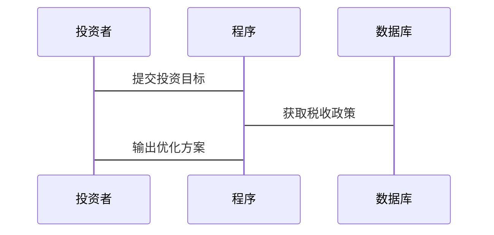

                 


好的，我明白了。现在我将按照您的要求，一步步构建《伯格的税收效率投资：如何减少投资税负》这篇文章。

# 《伯格的税收效率投资：如何减少投资税负》

---

## 关键词：
- 税收效率投资
- 投资税负
- 税后收益优化
- 资本利得税
- 投资组合优化

---

## 摘要：
本文深入探讨了如何通过税收效率投资策略来减少投资税负，提高投资回报。文章从税收效率投资的基本概念出发，分析了投资中的主要税收种类及其计算方法，详细讲解了如何通过资产配置优化、税收亏损抵扣和税收递延策略来降低税负。同时，本文还提出了基于数学模型的税收效率优化方法，并通过实际案例展示了如何在投资组合中实现税收效率最大化。最后，文章总结了税收效率投资的核心要点，并提出了未来研究的方向。

---

## 第1章: 税收效率投资概述

### 1.1 税收效率投资的核心概念
#### 1.1.1 投资中的税收问题
在投资过程中，税收是不可忽视的重要成本。无论是股票、基金还是其他资产，投资收益都会受到税收的影响。税收不仅降低了实际收益，还可能影响投资决策。

#### 1.1.2 税收效率投资的定义
税收效率投资是指通过优化投资策略，减少税收负担，从而提高投资净收益的过程。其核心在于在满足投资目标的前提下，尽可能降低税收支出。

#### 1.1.3 税收效率投资的重要性
- 降低税负，提高投资回报。
- 优化资产配置，提升投资效率。
- 符合长期财务规划的目标。

### 1.2 税收效率投资的背景与现状
#### 1.2.1 税收政策对投资的影响
不同国家和地区的税收政策差异显著，这对投资者的资产配置和投资决策产生了重要影响。

#### 1.2.2 税收效率投资的全球趋势
随着全球化进程的加快，投资者越来越关注如何在全球范围内优化税收负担。

#### 1.2.3 当前投资中的税收挑战
- 税收政策的复杂性。
- 税收计算的难度。
- 税收与投资风险的平衡。

### 1.3 税收效率投资的目标与意义
#### 1.3.1 减少税负的目标
通过优化投资结构，降低资本利得税、股息税等税收支出。

#### 1.3.2 提高投资回报的意义
税后收益的提升直接增加了投资的实际回报。

#### 1.3.3 税收效率投资的长期价值
税收效率投资不仅关注短期收益，更注重长期的财务规划和资产保值。

### 1.4 本章小结
---

## 第2章: 投资中的税收种类与计算

### 2.1 主要的税收种类
#### 2.1.1 资本利得税
资本利得税是对资本资产变现收益征税的税种，通常分为短期和长期资本利得税。

#### 2.1.2 股息税
股息税是对股息收入征税的税种，不同国家的税率和优惠政策差异较大。

#### 2.1.3 利息税
利息税是对债券利息收入征税的税种，通常采用累进税率。

#### 2.1.4 其他相关税费
包括交易税、增值税等。

### 2.2 税收计算的基本原理
#### 2.2.1 税率的计算方式
税率通常根据收入水平或资产类别确定。

#### 2.2.2 税收的计税基础
计税基础包括应纳税所得额、资产变现收益等。

#### 2.2.3 税收的优惠政策
包括税收减免、税收抵扣等。

### 2.3 税收与投资收益的关系
#### 2.3.1 税收对投资收益的影响
税收会直接降低投资收益，影响投资回报率。

#### 2.3.2 税后收益的计算公式
税后收益 = 投资收益 - 税收支出

#### 2.3.3 税收对投资决策的影响
税收会影响投资者的资产选择和投资策略。

### 2.4 本章小结
---

## 第3章: 税收效率投资的策略与方法

### 3.1 税收效率投资的策略框架
#### 3.1.1 资产配置优化
通过合理配置不同资产类别，降低税收负担。

#### 3.1.2 税收亏损抵扣
利用投资亏损抵扣税收，减少税负。

#### 3.1.3 税收递延策略
通过延迟纳税时间，优化税收支出。

### 3.2 税收效率投资的实施步骤
#### 3.2.1 确定投资目标
明确投资目标和风险偏好。

#### 3.2.2 分析税收环境
了解相关税收政策和税率。

#### 3.2.3 设计优化方案
制定具体的税收优化策略。

### 3.3 税收效率投资的注意事项
#### 3.3.1 税收政策的变化风险
税收政策可能随时变化，需及时调整策略。

#### 3.3.2 税收优化的法律合规性
确保税收优化策略符合法律法规。

#### 3.3.3 税收效率与投资风险的平衡
在追求税收效率的同时，需注意投资风险的控制。

### 3.4 本章小结
---

## 第4章: 税收效率投资的数学模型与算法

### 4.1 税后收益计算模型
#### 4.1.1 税后收益公式
$$ 税后收益 = 投资收益 - 税收支出 $$

#### 4.1.2 税后收益的计算步骤
1. 计算投资收益。
2. 确定应纳税所得额。
3. 计算税收支出。
4. 计算税后收益。

#### 4.1.3 示例计算
假设投资收益为 $10,000，税率20%，则税后收益为 $8,000。

### 4.2 税收效率优化的数学模型
#### 4.2.1 税收效率函数的定义
$$ E(t) = \frac{税后收益}{投资总收益} $$

#### 4.2.2 税收效率优化的目标函数
$$ \max E(t) $$

#### 4.2.3 约束条件
$$ 0 \leq t \leq 1 $$

### 4.3 税收效率优化算法
#### 4.3.1 算法原理
使用拉格朗日乘数法优化税收效率。

#### 4.3.2 算法实现
```python
def optimize_tax(income, rate):
    tax = income * rate
    after_tax = income - tax
    return after_tax
```

### 4.4 本章小结
---

## 第5章: 税收效率投资的系统分析与架构设计

### 5.1 系统功能设计
#### 5.1.1 投资者信息管理
管理投资者的基本信息和投资目标。

#### 5.1.2 税收计算模块
计算投资收益和税收支出。

#### 5.1.3 税收优化模块
提供税收优化策略和建议。

### 5.2 系统架构设计


### 5.3 系统接口设计
- 输入：投资者信息、投资目标、税收政策。
- 输出：优化方案、税后收益。

### 5.4 系统交互设计


### 5.5 本章小结
---

## 第6章: 税收效率投资的项目实战

### 6.1 环境安装
安装Python和相关库（Pandas、NumPy）。

### 6.2 核心实现
```python
def calculate_tax(income, rate):
    return income * rate

def optimize_tax_portfolio(portfolio, rates):
    optimized_portfolio = []
    for asset in portfolio:
        tax = calculate_tax(asset['收益'], rates[asset['资产类别']])
        asset['税后收益'] = asset['收益'] - tax
        optimized_portfolio.append(asset['税后收益'])
    return optimized_portfolio
```

### 6.3 案例分析
假设投资组合包括股票、债券和基金，分别计算税后收益并优化投资组合。

### 6.4 本章小结
---

## 第7章: 税收效率投资的总结与展望

### 7.1 本章小结
总结全文，强调税收效率投资的重要性和实现方法。

### 7.2 未来展望
提出未来的研究方向，包括税收政策的变化、算法优化等。

---

## 作者：AI天才研究院/AI Genius Institute & 禅与计算机程序设计艺术 /Zen And The Art of Computer Programming

