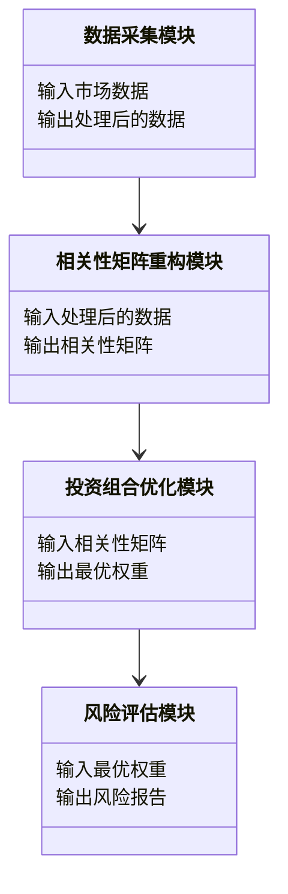

                 

# 伯格的资产配置理论：在负相关性减弱环境中的调整

> 关键词：伯格资产配置理论、负相关性减弱、投资组合优化、均值-方差模型、动态权重调整

> 摘要：本文深入探讨了伯格资产配置理论在负相关性减弱环境中的应用与调整。首先介绍了资产配置的基本概念与伯格理论的核心思想，分析了负相关性减弱对传统资产配置的影响。接着，提出了在负相关性减弱环境下的资产配置优化策略，包括资产类别选择、权重动态调整和风险因子重构。通过数学模型和算法原理的详细推导，结合系统架构设计与项目实战，验证了优化策略的有效性。最后，总结了负相关性减弱环境下的投资启示与最佳实践建议。

---

## 第一部分：伯格的资产配置理论基础

### 第1章：资产配置与伯格理论概述

#### 1.1 资产配置的基本概念

##### 1.1.1 资产配置的定义与作用
资产配置是指将投资组合分配到不同资产类别（如股票、债券、现金等）的过程，目的是在风险可控的前提下实现收益最大化。资产配置的作用包括分散风险、优化收益、适应市场变化等。

##### 1.1.2 伯格资产配置理论的核心思想
伯格理论强调通过科学的资产分配和组合管理来实现长期稳定的收益。其核心思想是：通过合理配置不同资产类别，降低投资组合的整体风险，同时捕捉不同资产的收益机会。

##### 1.1.3 负相关性在资产配置中的重要性
负相关性是指两种资产在价格或收益上的反向变动关系。在资产配置中，负相关性可以降低组合的风险，因为当一部分资产表现不佳时，另一部分资产可能表现较好。然而，负相关性减弱意味着这种分散风险的能力下降，增加了投资组合的整体风险。

#### 1.2 伯格理论的背景与演变

##### 1.2.1 现代资产组合理论的起源
现代资产组合理论（MPT）由哈里·马科维茨在1952年提出，强调通过分散投资来降低风险。伯格理论在此基础上进一步发展，注重长期投资和系统化管理。

##### 1.2.2 伯格理论的独特性与创新点
伯格理论的独特性在于其对资产配置的系统化和动态调整方法，强调根据市场环境的变化进行组合优化。创新点包括引入风险调整后的收益评估和动态权重调整机制。

##### 1.2.3 负相关性减弱的背景分析
近年来，全球市场的高度联动性导致资产之间的负相关性减弱，传统资产配置方法的有效性受到挑战。这种背景下，伯格理论的动态调整方法显得尤为重要。

#### 1.3 资产配置的核心要素

##### 1.3.1 投资目标与风险承受能力
投资目标决定了资产配置的方向，而风险承受能力影响着组合的波动性。两者共同决定了资产分配的比例和种类。

##### 1.3.2 资产类别与市场相关性
资产类别（如股票、债券、商品）之间的相关性直接影响组合的风险和收益。负相关性减弱意味着传统分散化策略的效果下降。

##### 1.3.3 时间跨度与市场周期
资产配置需要考虑投资的时间跨度，不同时间跨度下的市场周期和资产表现会影响配置策略。

---

## 第二部分：负相关性减弱环境下的资产配置调整

### 第2章：负相关性减弱的背景分析

#### 2.1 负相关性减弱的定义与特征

##### 2.1.1 负相关性的定义
负相关性是指两种资产在收益或价格上呈现反向变动关系。例如，股票和债券在一定程度上呈现负相关性，当股票市场下跌时，债券价格可能上升。

##### 2.1.2 负相关性减弱的表现形式
负相关性减弱意味着资产之间的反向变动关系减弱，资产之间的相关性趋近于正相关，导致组合的风险增加。

##### 2.1.3 负相关性减弱的原因分析
全球化、金融市场的高度联动性、经济政策的变化等因素导致资产之间的相关性上升，负相关性减弱。

#### 2.2 负相关性减弱对传统资产配置的影响

##### 2.2.1 传统资产配置假设的失效
传统资产配置方法假设资产之间的负相关性较强，当负相关性减弱时，这种假设不再成立，导致组合风险增加。

##### 2.2.2 资产分散化效果的降低
负相关性减弱意味着资产之间的分散化效果降低，组合的整体波动性增加。

##### 2.2.3 投资组合风险的增加
资产之间的高度正相关性增加了组合的风险，投资者需要采取新的策略来应对这种变化。

---

### 第3章：伯格理论在负相关性减弱环境中的调整

#### 3.1 资产配置策略的优化

##### 3.1.1 资产类别选择的优化
在负相关性减弱环境下，选择具有较强分散化效果的资产类别，例如加入另类资产（如房地产、大宗商品）来降低组合风险。

##### 3.1.2 资产权重的动态调整
根据市场环境的变化，动态调整资产权重，避免因资产相关性变化导致组合风险的增加。

##### 3.1.3 风险因子的重新评估
定期评估市场风险因子，根据变化调整资产配置策略，确保组合的风险在可控范围内。

#### 3.2 负相关性减弱下的组合优化模型

##### 3.2.1 均值-方差优化模型的改进
传统的均值-方差模型假设资产之间的相关性稳定，当负相关性减弱时，需要重新估计相关性矩阵。

##### 3.2.2 资产相关性矩阵的重新构建
根据当前市场环境，重新构建资产相关性矩阵，反映最新的相关性水平。

##### 3.2.3 新模型的数学推导与验证
通过数学推导验证新模型的有效性，并通过实际数据进行回测，确保模型在负相关性减弱环境下的表现优于传统模型。

---

### 第4章：资产配置的数学模型与算法原理

#### 4.1 伯格理论的数学模型

##### 4.1.1 投资组合优化的数学表达
投资组合优化的目标是最大化收益，同时最小化风险。数学表达式为：
$$ \text{最大化} \quad \mu^T w - \frac{1}{2} w^T \Sigma w $$
其中，\( w \) 是资产权重向量，\( \mu \) 是收益向量，\( \Sigma \) 是相关性矩阵。

##### 4.1.2 资产权重的求解过程
通过求解上述优化问题，得到最优资产权重 \( w \)。

##### 4.1.3 风险调整的数学方法
根据市场环境变化，动态调整相关性矩阵 \( \Sigma \)，并重新求解优化问题。

#### 4.2 负相关性减弱下的算法调整

##### 4.2.1 资产相关性矩阵的重构算法
根据最新的市场数据，重新估计资产相关性矩阵，反映负相关性减弱的变化。

##### 4.2.2 动态权重调整的优化算法
通过动态调整权重，确保组合的风险和收益在市场变化中保持最优。

##### 4.2.3 新算法的收敛性分析
分析新算法的收敛性，确保其在实际应用中的有效性和稳定性。

---

### 第5章：系统分析与架构设计方案

#### 5.1 系统分析

##### 5.1.1 问题场景介绍
在负相关性减弱环境下，传统的资产配置模型无法有效分散风险，导致组合收益下降，风险上升。

##### 5.1.2 项目介绍
本项目旨在优化伯格资产配置模型，使其适应负相关性减弱的市场环境。

##### 5.1.3 系统功能设计（领域模型）
- 数据采集与处理
- 相关性矩阵重构
- 投资组合优化
- 风险评估与报告

（Mermaid 类图）

---

### 第6章：项目实战

#### 6.1 环境安装与配置

##### 6.1.1 开发环境的选择
推荐使用Python编程环境，安装必要的库（如NumPy、Pandas、Scipy）。

##### 6.1.2 工具链的安装与配置
安装Anaconda，配置Jupyter Notebook进行代码开发。

##### 6.1.3 数据源的获取与处理
从金融数据供应商获取历史数据，清洗数据并计算相关性矩阵。

#### 6.2 核心实现

##### 6.2.1 资产配置模型的实现
实现均值-方差优化模型，计算最优权重。

##### 6.2.2 动态权重调整算法的实现
根据市场变化，动态调整资产权重。

##### 6.2.3 系统功能模块的实现
实现数据采集、相关性矩阵重构、投资组合优化和风险评估模块。

#### 6.3 实际案例分析

##### 6.3.1 案例背景
假设在负相关性减弱的市场环境下，投资者希望优化其资产配置。

##### 6.3.2 数据处理与模型构建
收集相关数据，构建相关性矩阵，运行优化模型。

##### 6.3.3 结果分析与优化策略
根据优化结果，调整资产权重，降低组合风险。

---

### 第7章：总结与最佳实践

#### 7.1 本章小结

##### 7.1.1 核心概念回顾
- 资产配置的基本概念
- 伯格理论的核心思想
- 负相关性减弱的影响

##### 7.1.2 理论与实践的结合
通过数学模型和算法实现，验证伯格理论在负相关性减弱环境下的有效性。

##### 7.1.3 负相关性减弱环境下的投资启示
投资者需要动态调整资产配置策略，以应对市场环境的变化。

#### 7.2 最佳实践 tips

##### 7.2.1 投资组合管理中的注意事项
定期评估市场环境，及时调整资产配置策略。

##### 7.2.2 动态调整策略的实施建议
根据市场变化，动态调整资产权重，降低组合风险。

##### 7.2.3 风险管理中的关键点
注重资产的分散化，引入另类资产降低组合风险。

#### 7.3 未来研究方向

##### 7.3.1 更复杂的市场环境
研究更复杂的市场环境下的资产配置策略。

##### 7.3.2 新的数学模型
探索新的数学模型，进一步优化投资组合。

##### 7.3.3 人工智能的应用
结合人工智能技术，提高资产配置的智能化水平。

---

## 作者：AI天才研究院 & 禅与计算机程序设计艺术

---

**本文由AI天才研究院和禅与计算机程序设计艺术联合撰写，转载请注明出处。**

