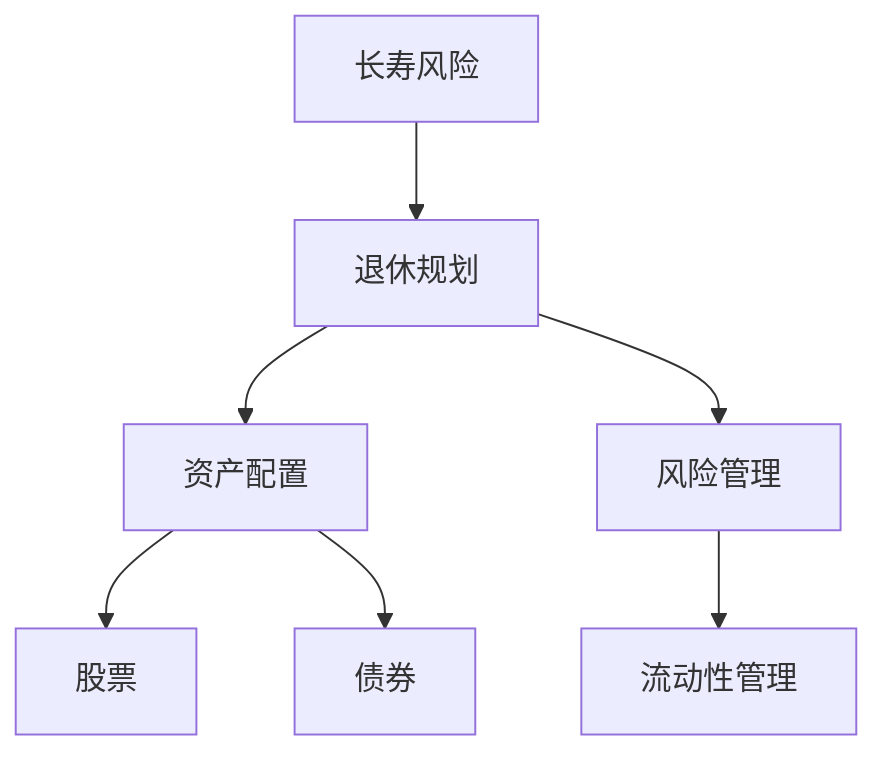
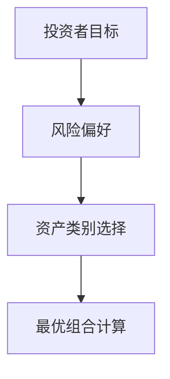
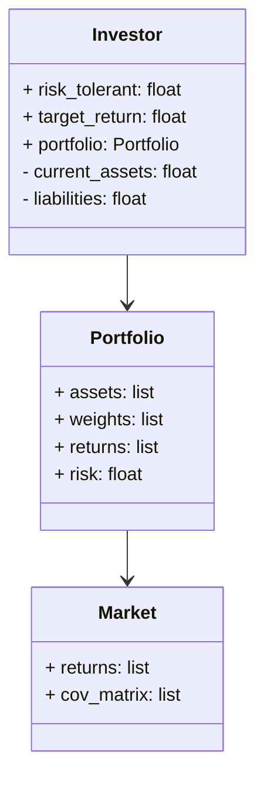
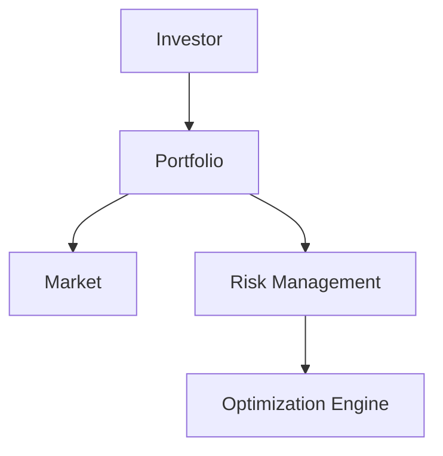

                 


# 伯格的退休投资建议：应对长寿风险的投资策略

## 关键词：退休投资、长寿风险、投资策略、资产配置、风险管理、财务规划、指数基金

## 摘要：本文将介绍伯格的退休投资理念，深入分析长寿风险对退休规划的影响，并结合现代投资组合理论，提出应对长寿风险的投资策略。通过优化资产配置和风险管理，帮助投资者在长寿时代实现稳健的财务规划。

---

# 第1章 长寿风险与退休投资概述

## 1.1 长寿风险的定义与影响

### 1.1.1 长寿风险的定义
长寿风险是指因人类寿命延长导致退休后支出超过预期收入的可能性。随着医疗技术的进步和生活水平的提高，人均寿命显著增加，这对退休规划提出了更高的要求。

### 1.1.2 长寿风险对个人财务的影响
- 增加退休后的生活支出时间，导致财务资源耗尽的风险上升。
- 需要更高的退休储蓄目标，以应对更长的退休期限。

### 1.1.3 长寿风险与退休规划的关系
退休规划的核心目标是确保在退休期间的财务安全。长寿风险的存在要求退休规划更加注重稳健性和可持续性。

## 1.2 伯格的退休投资建议背景

### 1.2.1 伯格的投资理念概述
伯格是指数基金之父，倡导通过低成本、分散化的投资策略实现长期稳健收益。

### 1.2.2 伯格对长寿风险的洞察
伯格意识到，随着寿命的延长，传统的固定收益退休策略已不足以应对不确定性。他提出，退休投资需要更加灵活和动态的调整。

### 1.2.3 伯格退休投资建议的核心目标
- 通过资产配置实现风险与收益的平衡。
- 在长寿风险下，确保退休资金的长期稳健。

## 1.3 长寿风险下的投资策略框架

### 1.3.1 生命周期投资模型
生命周期模型是根据投资者的生命周期阶段动态调整资产配置的策略。例如，年轻时增加股票配置，退休后逐步转向债券和现金。

### 1.3.2 资产配置与风险控制
通过分散投资降低风险，同时根据市场变化动态调整资产比例。

### 1.3.3 长寿风险下的投资组合优化
在长寿风险下，投资组合需要在收益和风险之间找到最佳平衡点，以确保长期资金的可持续性。

---

# 第2章 长寿风险与退休规划的核心概念

## 2.1 核心概念与联系

### 2.1.1 长寿风险的实体关系图


### 2.1.2 生命周期模型的数学表达
$$
V(t) = \max_{w} \left( \mu w^T r - \frac{1}{2} w^T \Sigma w \right)
$$
其中，\( V(t) \) 是效用函数，\( w \) 是资产权重，\( \mu \) 是期望收益，\( \Sigma \) 是收益矩阵。

### 2.1.3 资产配置与风险的关系
$$
\text{风险} = f(\text{资产配置比例}, \text{市场波动性})
$$`

## 2.2 算法原理讲解

### 2.2.1 现代投资组合理论（MPT）


### 2.2.2 资产配置优化算法
$$
\text{最优组合} = \argmin_{w} \sigma^2(w) \text{ s.t. } w \cdot \mu = \text{目标收益}
$$`

## 2.3 本章小结

---

# 第3章 长寿风险下的投资组合优化

## 3.1 数学模型与公式

### 3.1.1 生命周期模型的数学表达
$$
V(t) = \max_{w} \left( \mu w^T r - \frac{1}{2} w^T \Sigma w \right)
$$

### 3.1.2 风险调整后的资产配置
$$
w = \argmin_{w} \lambda \sigma^2(w) \text{ s.t. } w \cdot \mu = \text{目标收益}
$$`

## 3.2 投资组合优化的算法实现

### 3.2.1 Python代码实现
```python
import numpy as np
from scipy.optimize import minimize

def portfolio_optimization(returns, cov_matrix, target_return):
    n = len(cov_matrix)
    # 定义目标函数
    def objective(weights):
        return -weights.dot(returns)
    # 约束条件
    constraints = [
        {'type': 'eq', 'fun': lambda w: sum(w) - 1},
        {'type': 'eq', 'fun': lambda w: w.dot(returns) - target_return}
    ]
    # 边界条件
    bounds = [(0, 1) for _ in range(n)]
    # 优化
    result = minimize(objective, np.ones(n)/n, method='SLSQP', bounds=bounds, constraints=constraints)
    return result.x

# 示例数据
returns = np.array([0.1, 0.08, 0.05])
cov_matrix = np.array([
    [0.04, 0.02, 0.01],
    [0.02, 0.03, 0.01],
    [0.01, 0.01, 0.02]
])
target_return = 0.08

weights = portfolio_optimization(returns, cov_matrix, target_return)
print(weights)
```

### 3.2.2 代码解读与分析
- 代码实现了一个简单的投资组合优化模型，目标是最小化风险（标准差）并达到目标收益。
- 通过约束条件确保权重之和为1，并满足预期收益目标。
- 使用`SLSQP`方法求解优化问题。

## 3.3 系统分析与架构设计

### 3.3.1 系统功能设计


### 3.3.2 系统架构设计


## 3.4 本章小结

---

# 第4章 项目实战：基于长寿风险的投资组合优化

## 4.1 环境安装与配置
- Python 3.8+
- NumPy、SciPy、Matplotlib

## 4.2 核心实现代码

### 4.2.1 投资组合优化代码
```python
import numpy as np
from scipy.optimize import minimize

def portfolio_optimization(returns, cov_matrix, target_return):
    n = len(cov_matrix)
    def objective(weights):
        return (weights.dot(returns) - target_return)**2
    constraints = [
        {'type': 'eq', 'fun': lambda w: sum(w) - 1}
    ]
    bounds = [(0, 1) for _ in range(n)]
    result = minimize(objective, np.ones(n)/n, method='SLSQP', bounds=bounds, constraints=constraints)
    return result.x

returns = np.array([0.1, 0.08, 0.05])
cov_matrix = np.array([
    [0.04, 0.02, 0.01],
    [0.02, 0.03, 0.01],
    [0.01, 0.01, 0.02]
])
target_return = 0.08

weights = portfolio_optimization(returns, cov_matrix, target_return)
print(weights)
```

### 4.2.2 风险管理代码
```python
import numpy as np

def calculate_risk(weights, cov_matrix):
    variance = weights.dot(cov_matrix).dot(weights)
    return variance**0.5

risk = calculate_risk(weights, cov_matrix)
print(risk)
```

## 4.3 实际案例分析

### 4.3.1 案例背景
假设投资者有3种资产：股票、债券和现金，预期收益率分别为10%、8%和5%，协方差矩阵如上。

### 4.3.2 优化结果分析
通过优化，投资者可以在预期收益为8%的前提下，得到最低的风险权重。

## 4.4 项目小结

---

# 第5章 最佳实践与注意事项

## 5.1 最佳实践

### 5.1.1 定期调整投资组合
根据市场变化和个人财务状况，定期审视和调整资产配置。

### 5.1.2 保持长期视角
投资是马拉松而非短跑，需要耐心和纪律。

### 5.1.3 重视风险管理
在长寿风险下，风险管理是投资策略的核心。

## 5.2 小结

## 5.3 注意事项

### 5.3.1 避免过度杠杆
过高的杠杆会增加投资组合的波动性，尤其是在长寿风险下。

### 5.3.2 保持适度流动性
虽然长期投资强调分散化，但需要保留足够的流动性以应对突发情况。

## 5.4 拓展阅读

### 5.4.1 伯格的其他投资理念
- 持股分散化
- 长期投资

### 5.4.2 长寿风险下的保险产品
- 养老保险
- 年金

---

# 作者：AI天才研究院/AI Genius Institute  
# 《禅与计算机程序设计艺术》系列丛书

