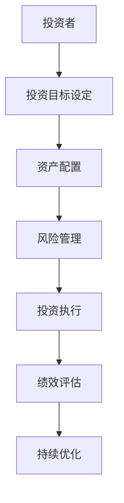

                 


# 伯格的长期投资理念：应对市场短期主义的挑战

> **关键词**：长期投资、价值投资、短期市场、复利效应、投资组合管理  
> **摘要**：本文深入探讨了伯格的长期投资理念，分析了其在应对市场短期主义挑战中的重要作用。通过价值投资、复利效应和投资组合管理的理论基础，结合实际案例和算法实现，展示了如何在短期波动中保持长期收益。文章还提供了系统的架构设计和投资实战策略，为读者提供了全面的指导。

---

## 第一部分：引言

### 第1章：伯格的投资哲学与长期投资理念

#### 1.1 伯格的生平简介
菲利普·费雪（Philip Fisher）是价值投资的先驱之一，其投资理念对伯克希尔·哈撒韦的巴菲特影响深远。伯格的投资哲学继承并发展了费雪的价值投资理论，强调长期持有优质资产，避免频繁交易。这种理念在市场波动中表现出色，尤其是在长期复利效应下，为投资者带来了稳定的收益。

#### 1.2 长期投资的重要性
在当前市场环境中，短期主义盛行，投资者往往被短期波动所左右，忽视了长期投资的价值。伯格的理念提醒我们，投资的目的是创造长期价值，而非追逐短期收益。通过长期持有优质资产，投资者能够充分利用复利效应，实现财富的稳步增长。

---

## 第二部分：长期投资的理论基础

### 第2章：价值投资理论

#### 2.1 价值投资的定义与核心原则
价值投资是一种以内在价值为导向的投资策略。伯格认为，市场价格经常偏离内在价值，而长期投资者应关注企业的基本面，寻找被低估的优质企业。以下是价值投资的核心原则：
- **内在价值**：企业未来现金流的现值，是衡量其价值的核心指标。
- **安全边际**：以低于内在价值的价格买入，以降低风险。
- **长期持有**：避免频繁交易，减少交易成本和心理干扰。

#### 2.2 价值投资与成长投资的对比
| 对比维度 | 价值投资 | 成长投资 |
|----------|----------|----------|
| 核心目标 | 寻找被低估的股票 | 寻找高成长性的股票 |
| 风险偏好 | 较低 | 较高 |
| 持股时间 | 长期 | 中长期 |
| 适用场景 | 市场波动较大时 | 市场增长稳定时 |

#### 2.3 伯格对价值投资的贡献
伯格在价值投资理论的基础上，进一步强调了分散投资和低成本的重要性。他提出，通过分散投资于多个优质企业，可以降低特定企业风险，同时降低整体投资组合的波动性。

---

### 第3章：复利效应与时间的价值

#### 3.1 复利效应的数学模型
复利效应是长期投资的核心驱动力。其数学公式为：
$$
FV = PV \times (1 + r)^t
$$
其中，FV是终值，PV是现值，r是年化收益率，t是时间（年）。

#### 3.2 时间在投资中的重要性
时间是长期投资的朋友。通过长期持有，复利效应得以充分发挥，即使年化收益率较低，也能累积出可观的收益。例如，以10%的年化收益率，20年后的复利收益为：
$$
FV = 1 \times (1 + 0.1)^{20} \approx 6.727
$$

#### 3.3 长期投资如何利用复利效应
- **选择优质资产**：优质资产通常具有更高的收益率。
- **长期持有**：避免频繁交易，确保复利效应的持续积累。
- **分散投资**：降低特定资产的风险，同时保持投资组合的稳定性。

---

## 第三部分：应对市场短期主义的挑战

### 第4章：短期市场的波动性与风险

#### 4.1 短期市场的波动性
短期市场波动主要由市场情绪和短期新闻驱动。这种波动性可能导致投资者做出非理性决策，如恐慌性抛售或贪婪性买入。

#### 4.2 短期市场对投资者心理的影响
市场波动会引发投资者的焦虑和贪婪，导致短期决策的失误。例如，2020年新冠疫情爆发期间，市场出现大幅波动，许多投资者因恐慌抛售股票，错失了后续反弹的机会。

#### 4.3 长期投资如何应对短期波动
- **保持冷静**：理解波动是市场的常态，避免因短期波动做出决策。
- **坚持长期策略**：专注于企业的基本面，避免被短期新闻左右。
- **定期审视投资组合**：根据市场变化调整资产配置，确保投资组合与长期目标一致。

---

## 第四部分：长期投资的系统架构设计

### 第5章：投资组合管理理论

#### 5.1 投资组合的定义与作用
投资组合是投资者持有的所有资产的集合，其目标是通过分散投资降低风险，同时实现收益最大化。

#### 5.2 马科维茨的有效前沿理论
马科维茨的有效前沿理论指出，对于给定的风险水平，存在一个最优的投资组合，该组合能够提供最高的预期收益。以下是有效前沿理论的核心步骤：
1. 确定可选资产及其预期收益和风险。
2. 计算各资产之间的协方差矩阵。
3. 通过优化算法找到最优组合。

#### 5.3 伯格的指数基金投资策略
伯格主张通过投资指数基金实现长期投资目标。指数基金的优势在于：
- **分散风险**：涵盖多个行业和企业，降低特定风险。
- **低成本**：指数基金的管理费用较低。
- **简单易行**：投资者无需选股，只需定期定额投资。

---

## 第五部分：项目实战与案例分析

### 第6章：伯格理念的实际应用

#### 6.1 选择优质资产
以苹果公司为例，分析其基本面和成长潜力。苹果公司拥有强大的现金流、高利润率和创新能力强等优势，符合价值投资的标准。

#### 6.2 构建投资组合
- **资产配置**：将资金分散投资于股票、债券、房地产等不同资产。
- **定期定额投资**：每月投入固定金额，避免因市场波动影响投资成本。

#### 6.3 投资组合的优化
- **定期审视**：每年检查投资组合的配置是否符合长期目标。
- **动态调整**：根据市场变化调整资产配置比例。

---

## 第六部分：结论

### 第7章：总结与展望

#### 7.1 伯格理念的总结
伯格的长期投资理念强调价值投资、复利效应和分散投资。通过长期持有优质资产，投资者能够抵御短期波动，实现财富的稳步增长。

#### 7.2 未来的挑战与机遇
随着市场的变化和技术的进步，长期投资面临新的挑战和机遇。例如，人工智能技术可以帮助投资者更好地识别优质资产和优化投资组合。

---

## 附录

### 附录A：相关数学公式

- **复利计算公式**：
$$
FV = PV \times (1 + r)^t
$$

- **马科维茨有效前沿的优化算法**：
$$
\min_w \frac{1}{2}w^T \Sigma w \quad \text{subject to} \quad \mu^T w = \mu_p, \quad \mathbf{1}^T w = 1
$$

### 附录B：投资组合管理系统架构图



### 附录C：Python代码实现

```python
import numpy as np

def compound_interest(pv, r, t):
    return pv * (1 + r) ** t

# 示例计算
pv = 10000
r = 0.07
t = 10
fv = compound_interest(pv, r, t)
print(f"终值：{fv:.2f}")
```

---

## 作者

**作者：AI天才研究院/AI Genius Institute & 禅与计算机程序设计艺术 /Zen And The Art of Computer Programming**

---

通过以上结构，我们可以系统地探讨伯格的长期投资理念，并将其应用于实际投资中。通过价值投资、复利效应和投资组合管理的理论支持，结合实际案例和系统设计，为投资者提供了全面的指导。

