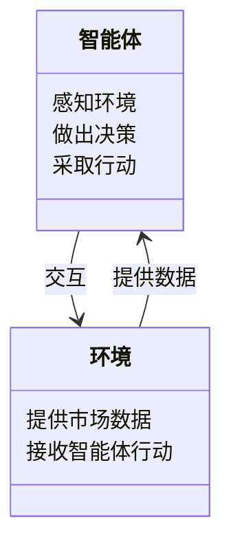
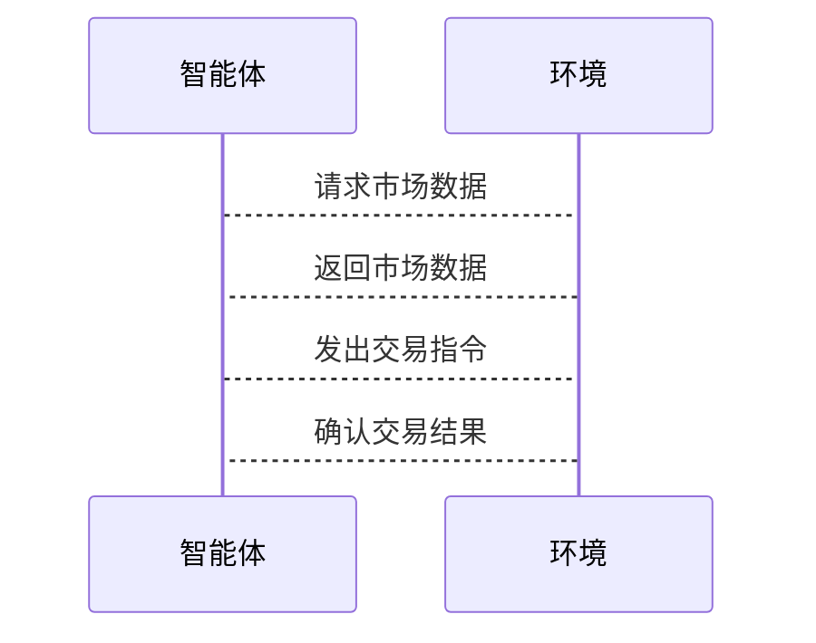

                 


# 使用多智能体系统识别市场异常和投资机会

**关键词**：多智能体系统、金融市场异常、投资机会识别、强化学习、分布式计算、自适应系统

**摘要**：本文详细探讨了如何利用多智能体系统来识别金融市场中的异常情况和投资机会。通过结合强化学习、分布式计算和自适应系统等技术，本文分析了金融市场的复杂性和动态性，提出了一种基于多智能体的解决方案，帮助投资者在复杂多变的市场环境中做出更明智的决策。

---

# 第一部分: 多智能体系统与金融市场概述

# 第1章: 多智能体系统与金融市场概述

## 1.1 多智能体系统的基本概念

### 1.1.1 多智能体系统的定义

多智能体系统（Multi-Agent System, MAS）是由多个智能体（Agent）组成的分布式系统，每个智能体都是一个能够感知环境、做出决策并采取行动的实体。与传统的单智能体系统相比，多智能体系统具有更强的协作能力和适应性。

### 1.1.2 多智能体系统的特征

- **分布式性**：多个智能体独立运行，协同完成任务。
- **协作性**：智能体之间通过通信和协作提高整体性能。
- **自适应性**：能够根据环境变化动态调整行为。
- **反应性**：智能体能够实时感知环境并做出反应。

### 1.1.3 多智能体系统与单智能体系统的区别

| 特性          | 多智能体系统             | 单智能体系统             |
|---------------|--------------------------|--------------------------|
| 结构          | 分布式                   | 集中式                   |
| 协作           | 高                      | 低                      |
| 灵活性         | 高                      | 低                      |
| 适应性         | 高                      | 低                      |

## 1.2 金融市场中的异常与投资机会

### 1.2.1 金融市场异常的表现形式

- **价格剧烈波动**：短时间内价格急剧上涨或下跌。
- **成交量异常**：成交量突然激增或骤减。
- **市场操纵迹象**：某些主体通过虚假交易 manipulate 市场。
- **突发事件影响**：如自然灾害、政治事件等对市场的影响。

### 1.2.2 投资机会的识别挑战

- **市场复杂性**：金融市场受多种因素影响，难以预测。
- **信息不对称**：投资者获取信息的渠道和速度不同。
- **动态变化**：市场环境随时可能发生变化，需要快速响应。

### 1.2.3 多智能体系统在金融市场中的优势

- **分布式计算能力**：能够同时处理大量数据。
- **协作与竞争**：通过协作发现潜在机会，通过竞争发现异常。
- **自适应性**：能够快速适应市场变化。

## 1.3 本章小结

本章介绍了多智能体系统的基本概念及其在金融市场中的应用。通过对比多智能体系统与单智能体系统的区别，阐述了多智能体系统在识别市场异常和投资机会方面的优势。

---

# 第二部分: 多智能体系统的核心概念与原理

# 第2章: 多智能体系统的核心概念

## 2.1 多智能体系统的组成要素

### 2.1.1 智能体

智能体是多智能体系统的基本单元，能够感知环境、做出决策并采取行动。智能体可以分为以下几种类型：

- **简单反应式智能体**：仅基于当前感知做出反应。
- **基于模型的智能体**：利用内部状态和环境模型做出决策。
- **目标驱动智能体**：根据目标驱动行为。

### 2.1.2 环境

环境是多智能体系统中智能体所处的外部世界，可以是金融市场、交通系统等。环境具有动态性、不确定性和复杂性。

### 2.1.3 目标

目标是智能体行动的方向和目的。智能体通过感知环境、调整策略来实现目标。

## 2.2 多智能体系统的核心原理

### 2.2.1 分布式计算

多智能体系统通过分布式计算将任务分解为多个智能体协同完成，提高了系统的并行性和效率。

### 2.2.2 协作与竞争

智能体之间可以通过协作提高整体性能，也可以通过竞争优化个体行为。

### 2.2.3 自适应与学习

智能体能够通过学习和适应环境变化，提高系统的灵活性和鲁棒性。

## 2.3 多智能体系统与金融市场的关系

### 2.3.1 金融市场中的多智能体应用场景

- **股票交易**：智能体可以实时分析市场数据，发现交易机会。
- **风险管理**：通过协作识别市场风险，制定风险管理策略。
- **市场预测**：利用多智能体系统的分布式计算能力，提高市场预测的准确性。

### 2.3.2 多智能体系统在金融决策中的作用

- **信息处理**：智能体能够快速处理大量市场数据。
- **决策优化**：通过协作和竞争，优化投资决策。
- **风险控制**：实时监控市场风险，采取应对措施。

## 2.4 本章小结

本章详细讲解了多智能体系统的核心概念，包括智能体、环境和目标，并分析了多智能体系统在金融市场的应用场景和作用。

---

# 第三部分: 多智能体系统的算法原理

# 第3章: 多智能体系统的算法基础

## 3.1 强化学习算法

### 3.1.1 Q-learning算法

Q-learning是一种经典的强化学习算法，通过智能体与环境的交互，学习最优策略。其数学模型如下：

$$ Q(s, a) = r + \gamma \max_{a'} Q(s', a') $$

其中，\( Q(s, a) \) 表示在状态 \( s \) 下采取动作 \( a \) 的价值，\( r \) 是奖励，\( \gamma \) 是折扣因子，\( s' \) 是下一个状态。

### 3.1.2 Deep Q-Network (DQN) 算法

DQN 是 Q-learning 的一种改进，通过深度神经网络近似 Q 值函数，能够处理高维状态空间。其核心思想是使用两个神经网络：一个用于评估当前状态，另一个用于目标网络。

### 3.1.3 多智能体系统中的强化学习应用

在金融市场中，智能体可以使用强化学习算法进行股票交易，通过不断试错，学习最优的买卖策略。

## 3.2 多智能体系统的博弈论应用

### 3.2.1 博弈论基础

博弈论是研究多个参与者之间策略互动的理论。在金融市场中，智能体之间的博弈可以通过纳什均衡来分析。

### 3.2.2 多智能体系统中的博弈模型

- **竞争博弈**：多个智能体竞争有限资源。
- **合作博弈**：智能体通过合作实现共同目标。

## 3.3 本章小结

本章介绍了多智能体系统中的强化学习算法和博弈论应用，详细讲解了 Q-learning 和 DQN 算法，并分析了它们在金融市场中的应用。

---

# 第四部分: 多智能体系统的系统架构设计

# 第4章: 多智能体系统的系统架构设计

## 4.1 系统分析与需求分析

### 4.1.1 问题场景介绍

在金融市场中，识别市场异常和投资机会需要实时数据处理和快速决策能力。

### 4.1.2 系统功能需求

- **数据采集**：实时采集金融市场数据。
- **异常检测**：识别市场异常情况。
- **投资机会识别**：基于多智能体系统的分析，发现投资机会。

## 4.2 系统功能设计

### 4.2.1 领域模型设计

以下是领域模型的 Mermaid 类图：



### 4.2.2 系统架构设计

以下是系统架构的 Mermaid 架构图：

```mermaid
archi
    前端界面 --> 应用层
    应用层 --> 多智能体系统
    多智能体系统 --> 数据库
    数据库 --> 第三方数据源
```

### 4.2.3 接口设计与交互流程

以下是接口设计的 Mermaid 序列图：



## 4.3 本章小结

本章通过系统分析和架构设计，详细阐述了多智能体系统在识别市场异常和投资机会中的实现方式。

---

# 第五部分: 多智能体系统的项目实战

# 第5章: 多智能体系统的项目实战

## 5.1 环境配置与数据准备

### 5.1.1 环境安装

安装必要的开发工具和依赖库，例如 Python、TensorFlow、Keras 等。

### 5.1.2 数据采集

从金融数据源获取实时市场数据，例如股票价格、成交量等。

## 5.2 系统核心实现

### 5.2.1 强化学习算法实现

以下是 Q-learning 算法的 Python 实现：

```python
class QLearner:
    def __init__(self, state_space, action_space, gamma=0.99, epsilon=0.1):
        self.state_space = state_space
        self.action_space = action_space
        self.gamma = gamma
        self.epsilon = epsilon
        self.Q = defaultdict(lambda: defaultdict(lambda: 0))

    def get_action(self, state):
        if random.random() < self.epsilon:
            return random.choice(self.action_space)
        else:
            return max(self.Q[state], key=lambda k: self.Q[state][k])

    def update(self, state, action, reward, next_state):
        self.Q[state][action] = reward + self.gamma * max(self.Q[next_state].values())
```

### 5.2.2 多智能体协作实现

以下是多智能体协作的 Python 实现：

```python
class MultiAgentSystem:
    def __init__(self, num_agents):
        self.agents = [Agent() for _ in range(num_agents)]
        self.environment = MarketEnvironment()

    def run(self):
        while True:
            for agent in self.agents:
                state = self.environment.get_state()
                action = agent.decide_action(state)
                reward = self.environment.execute_action(action)
                agent.update(state, action, reward)
```

## 5.3 实际案例分析

### 5.3.1 股票交易中的异常检测

通过多智能体系统，可以实时监控股票价格，发现价格剧烈波动时触发警报。

### 5.3.2 投资机会识别

基于多智能体系统的分析，发现某些股票具有较高的投资价值。

## 5.4 本章小结

本章通过项目实战，详细讲解了多智能体系统的实现过程，并通过具体案例分析，展示了其在识别市场异常和投资机会中的应用。

---

# 第六部分: 最佳实践与总结

# 第6章: 最佳实践与总结

## 6.1 最佳实践

### 6.1.1 数据质量的重要性

确保数据的准确性和实时性，是多智能体系统正常运行的基础。

### 6.1.2 模型调参技巧

通过不断试验和调整参数，找到最优的模型配置。

### 6.1.3 持续学习与优化

金融市场环境复杂多变，需要持续优化多智能体系统，以适应新的市场变化。

## 6.2 本章小结

本文通过多智能体系统，详细探讨了如何识别市场异常和投资机会，并给出了实际的应用案例和最佳实践。

---

# 作者：AI天才研究院 & 禅与计算机程序设计艺术

---

感谢您的耐心阅读，希望这篇文章能为您提供有价值的信息和启发。

