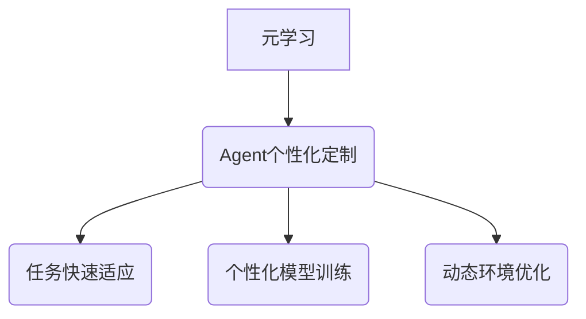
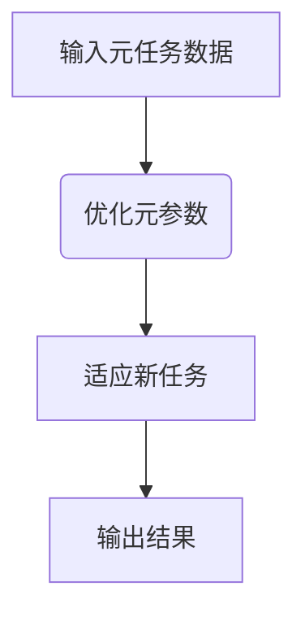
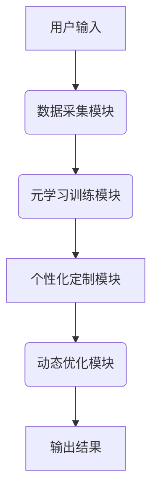

                 


# 元学习在AI Agent个性化定制中的应用

> 关键词：元学习，AI Agent，个性化定制，机器学习，人工智能

> 摘要：本文探讨了元学习在AI Agent个性化定制中的应用，详细分析了元学习的核心概念、算法原理、系统架构以及实际案例。通过结合理论与实践，展示了如何利用元学习提升AI Agent的适应性和智能化水平，为个性化定制提供了新的思路和方法。

---

## 第一部分：背景介绍

### 第1章：元学习与AI Agent概述

#### 1.1 元学习的基本概念

- **定义**：元学习是一种允许模型快速适应新任务的学习方法，通过在多个任务上预训练，模型能够快速调整以适应特定的新任务。
- **特点**：
  - 快速适应性：能够在少量数据下完成新任务的学习。
  - 通用性：适用于多种任务和领域。
  - 自适应性：能够根据环境变化动态调整模型参数。

#### 1.2 AI Agent的基本概念

- **定义**：AI Agent是一种智能实体，能够感知环境、自主决策并执行任务。
- **核心功能**：
  - 感知环境：通过传感器或接口获取环境信息。
  - 决策制定：基于感知信息做出决策。
  - 行动执行：根据决策执行具体操作。
- **分类与应用场景**：
  - 按智能水平：反应式Agent、认知式Agent。
  - 按应用场景：推荐系统、自动驾驶、智能助手等。

#### 1.3 元学习在AI Agent中的作用

- **问题背景**：AI Agent需要在动态变化的环境中适应不同任务，传统机器学习方法难以快速调整。
- **问题解决**：元学习通过预训练模型，使AI Agent能够快速适应新任务，提升个性化定制能力。
- **典型场景**：个性化推荐、动态环境中的任务切换。

---

### 第2章：个性化定制的需求与挑战

#### 2.1 用户需求的多样性

- **多样性**：不同用户的需求和偏好各不相同。
- **动态变化**：用户的偏好可能随时间变化。
- **高效性**：如何在短时间内满足个性化需求。

#### 2.2 环境的动态变化

- **环境复杂性**：环境中的变量和条件可能随时变化。
- **快速适应性**：AI Agent需要快速调整策略以应对环境变化。

#### 2.3 定制化模型的高效训练

- **数据稀疏性**：个性化数据可能不足。
- **计算效率**：如何在有限计算资源下完成高效训练。

---

## 第二部分：核心概念与联系

### 第3章：元学习的核心概念

#### 3.1 元学习的理论基础

- **元学习的数学模型**：
  - 元学习模型通常涉及两个层次：元任务和目标任务。
  - 元任务用于训练模型的元参数，目标任务用于调整模型以适应特定任务。

#### 3.2 元学习与传统机器学习的对比

| 对比维度 | 传统机器学习 | 元学习 |
|----------|---------------|---------|
| 数据需求 | 需要大量数据 | 可以在少量数据上快速适应新任务 |
| 适应性 | 固定模型参数 | 可以动态调整模型参数 |
| 任务多样性 | 适用于单一任务 | 适用于多个任务 |

#### 3.3 AI Agent的个性化定制需求

- **用户需求的多样性**：不同用户的个性化需求需要不同的模型。
- **环境的动态变化**：AI Agent需要快速适应环境变化。
- **高效性**：如何在有限数据和计算资源下完成高效训练。

---

### 第4章：元学习与AI Agent的结合

#### 4.1 元学习在AI Agent中的核心作用

- **快速适应性**：使AI Agent能够在新环境中快速适应。
- **个性化定制**：通过元学习，AI Agent可以根据用户需求进行个性化调整。
- **动态优化**：元学习模型可以实时优化AI Agent的行为策略。

#### 4.2 实体关系图



---

## 第三部分：算法原理

### 第5章：元学习算法

#### 5.1 MAML算法

- **定义**：MAML（Meta-Automated Learning）是一种基于梯度的元学习算法，通过优化元任务的梯度来适应新任务。
- **算法流程图**



- **数学模型**

$$\text{损失函数} = \sum_{i=1}^{n} (y_i - f(x_i))^2$$

---

### 第6章：算法实现

#### 6.1 Python代码实现

```python
import tensorflow as tf

def meta_learning_model(input_shape, num_classes):
    model = tf.keras.Sequential([
        tf.keras.layers.Conv2D(32, (3,3), activation='relu', input_shape=input_shape),
        tf.keras.layers.MaxPooling2D((2,2)),
        tf.keras.layers.Flatten(),
        tf.keras.layers.Dense(64, activation='relu'),
        tf.keras.layers.Dense(num_classes, activation='softmax')
    ])
    return model
```

---

## 第四部分：系统分析与架构设计

### 第7章：系统架构

#### 7.1 系统功能设计

| 功能模块 | 描述 |
|----------|------|
| 数据采集 | 采集环境数据和用户反馈 |
| 元学习训练 | 使用元学习算法训练模型 |
| 个性化定制 | 根据用户需求调整模型 |
| 动态优化 | 实时优化模型参数 |

#### 7.2 系统架构图



---

## 第五部分：项目实战

### 第8章：个性化推荐系统

#### 8.1 环境安装

```bash
pip install tensorflow keras numpy
```

#### 8.2 核心代码实现

```python
def train_meta_learning_model(model, optimizer, train_data, val_data, epochs=10):
    for epoch in range(epochs):
        for X, y in train_data:
            with tf.GradientTape() as tape:
                y_pred = model(X)
                loss = tf.keras.losses.sparse_categorical_crossentropy(y, y_pred)
            gradients = tape.gradient(loss, model.trainable_weights)
            optimizer.apply_gradients(zip(gradients, model.trainable_weights))
        # 验证
        val_loss = 0
        for X_val, y_val in val_data:
            y_val_pred = model(X_val)
            val_loss += tf.keras.losses.sparse_categorical_crossentropy(y_val, y_val_pred)
        print(f"Epoch {epoch}, Validation Loss: {val_loss/len(val_data)}")
```

---

## 第六部分：总结与展望

### 第9章：总结与展望

#### 9.1 总结

- 元学习在AI Agent个性化定制中具有重要作用，能够快速适应新任务和环境变化。
- 结合元学习的AI Agent在个性化推荐、动态优化等领域表现出色。

#### 9.2 展望

- **算法优化**：进一步优化元学习算法，提升适应速度和精度。
- **多领域应用**：将元学习应用于更多类型的AI Agent，如自动驾驶、智能医疗等。
- **用户体验**：结合用户反馈，进一步提升个性化定制的体验。

---

## 作者信息

作者：AI天才研究院/AI Genius Institute & 禅与计算机程序设计艺术 /Zen And The Art of Computer Programming

---

通过以上步骤，我们可以系统地撰写一篇关于元学习在AI Agent个性化定制中的应用的技术博客文章，涵盖从理论到实践的各个方面，帮助读者全面理解元学习的应用和优势。

