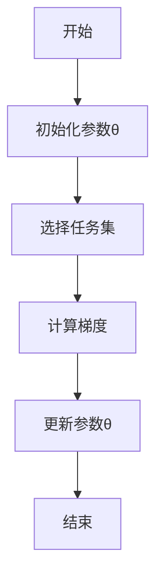
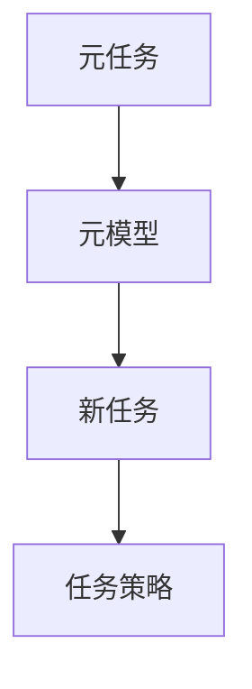
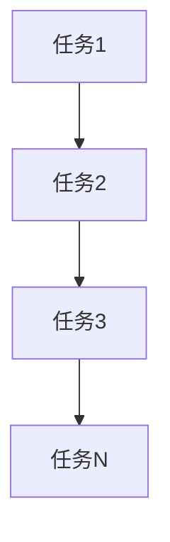
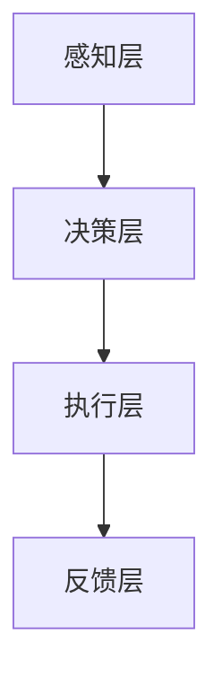
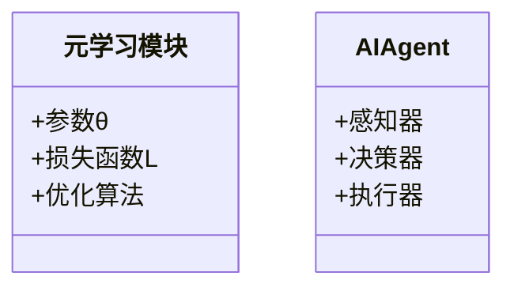
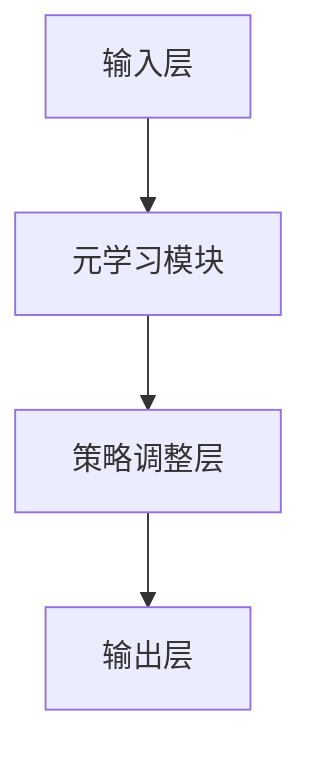
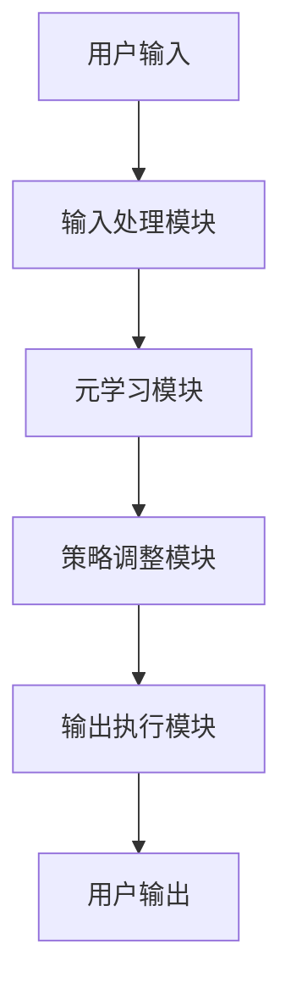

                 


# 元学习在AI Agent快速适应新任务中的实践

> 关键词：元学习，AI Agent，快速适应，任务迁移，算法优化

> 摘要：本文将详细探讨元学习（Meta-Learning）在AI Agent快速适应新任务中的应用与实践。通过结合理论与实践，本文旨在帮助读者理解如何利用元学习技术，使AI Agent能够在复杂多变的任务环境中实现快速适应和高效决策。文章将从元学习的基本概念、AI Agent的定义与分类、元学习与AI Agent的结合、元学习算法的数学模型与流程图、AI Agent系统架构设计、实际项目案例以及最佳实践等方面进行详细阐述。

---

## 第1章 元学习与AI Agent的背景与基础

### 1.1 元学习的基本概念

#### 1.1.1 元学习的定义与核心思想
元学习（Meta-Learning）是一种机器学习方法，旨在通过学习如何学习，从而在新任务中快速适应和表现。其核心思想是：模型在训练阶段不仅学习特定任务的知识，还学习如何从经验中提取通用策略，以便在新任务中快速调整和优化。

#### 1.1.2 元学习与传统机器学习的对比
- **传统机器学习**：针对特定任务进行训练，仅关注单任务的性能优化。
- **元学习**：学习跨任务的通用策略，能够在新任务中快速调整。

#### 1.1.3 元学习在AI Agent中的应用价值
AI Agent需要在动态环境中快速适应新任务，元学习通过减少对新任务数据的依赖，提升适应速度和效率。

### 1.2 AI Agent的基本概念与分类

#### 1.2.1 AI Agent的定义与特点
- **定义**：AI Agent是一个能够感知环境、执行任务并做出决策的智能体。
- **特点**：自主性、反应性、目标导向、社交能力。

#### 1.2.2 AI Agent的分类与应用场景
- **按智能水平**：简单反射型、基于模型型、目标驱动型、社会影响型。
- **应用场景**：游戏AI、自动驾驶、智能助手、机器人控制。

#### 1.2.3 元学习在AI Agent中的作用
元学习帮助AI Agent在新任务中快速调整策略，减少对大量新任务数据的依赖。

### 1.3 元学习与AI Agent的关系

#### 1.3.1 元学习如何赋能AI Agent
- 通过元学习，AI Agent能够快速适应新任务，提升任务切换的效率。

#### 1.3.2 元学习在AI Agent适应新任务中的优势
- 减少新任务数据需求。
- 提升多任务处理能力。

#### 1.3.3 元学习与AI Agent的结合案例
- 游戏AI：通过元学习快速适应新游戏规则。
- 机器人控制：在新环境中快速调整动作策略。

### 1.4 本章小结
本章介绍了元学习的基本概念、AI Agent的定义与分类，以及元学习在AI Agent中的应用价值。通过理解元学习与AI Agent的关系，读者可以进一步探索元学习在快速适应新任务中的具体应用。

---

## 第2章 元学习的核心概念与原理

### 2.1 元学习的核心概念

#### 2.1.1 元学习的定义与目标
- **定义**：学习如何从经验中提取通用策略。
- **目标**：在新任务中快速优化性能。

#### 2.1.2 元学习的数学模型与公式
元学习的核心公式可以表示为：
$$ \theta^{new} = \theta^{old} + \alpha \nabla_{\theta} \mathcal{L} $$
其中，$\alpha$ 是学习率，$\nabla_{\theta} \mathcal{L}$ 是损失函数关于参数 $\theta$ 的梯度。

#### 2.1.3 元学习的四个关键要素
- **元任务**：多个相关任务的集合。
- **元模型**：用于提取跨任务的通用策略。
- **元训练**：在多个任务上训练元模型。
- **快速适应**：在新任务中调整元模型以适应任务。

### 2.2 元学习的算法原理

#### 2.2.1 元学习算法的基本流程
1. 在多个任务上训练元模型。
2. 在新任务中，利用元模型快速调整策略。

#### 2.2.2 基于梯度的元学习算法（如MAML）

- **MAML算法流程图**：


- **MAML算法数学模型**：
$$ \theta^{new} = \theta^{old} - \alpha \nabla_{\theta} \mathcal{L} $$

#### 2.2.3 基于优化的元学习算法
- **优缺点对比**：
| 算法类型 | 优点 | 缺点 |
|--------|------|------|
| 基于梯度 | 计算高效 | 易受梯度干扰 |
| 基于优化 | 稳定性高 | 计算复杂 |

### 2.3 元学习的核心原理图
- **元学习的层次结构图**：


- **元学习的优化流程图**：


### 2.4 本章小结
本章详细讲解了元学习的核心概念、算法原理及其数学模型。通过理解这些内容，读者可以进一步掌握元学习在AI Agent中的具体应用方法。

---

## 第3章 AI Agent的快速适应机制

### 3.1 AI Agent的任务适应需求

#### 3.1.1 任务适应的核心问题
- **问题背景**：AI Agent需要在不同任务中快速调整策略。
- **核心挑战**：新任务数据不足、任务间差异大。

#### 3.1.2 快速适应的挑战与解决方案
- **挑战**：数据稀疏性、任务多样性。
- **解决方案**：利用元学习提取通用策略。

#### 3.1.3 元学习在任务适应中的应用
- **案例分析**：在多任务环境中，AI Agent通过元学习快速适应新任务。

### 3.2 元学习驱动的AI Agent

#### 3.2.1 元学习驱动的AI Agent系统架构
- **系统架构图**：


#### 3.2.2 元学习在AI Agent中的具体应用
- **任务切换**：AI Agent在不同任务之间快速切换。
- **策略调整**：基于元学习快速优化策略。

### 3.3 元学习在AI Agent中的优势

#### 3.3.1 减少新任务数据需求
元学习通过跨任务学习，减少对新任务数据的依赖。

#### 3.3.2 提高任务切换效率
通过元学习，AI Agent可以在新任务中快速调整策略，提高任务切换效率。

### 3.4 本章小结
本章重点探讨了AI Agent的任务适应需求及其实现机制，通过元学习的驱动，AI Agent可以在新任务中快速适应并优化性能。

---

## 第4章 元学习在AI Agent中的系统架构设计

### 4.1 系统功能设计

#### 4.1.1 领域模型设计
- **领域模型图**：


#### 4.1.2 系统功能模块
- **输入处理模块**：接收新任务输入。
- **策略调整模块**：基于元学习快速调整策略。
- **输出执行模块**：执行优化后的策略。

### 4.2 系统架构设计

#### 4.2.1 系统架构图


#### 4.2.2 系统接口设计
- **输入接口**：接收新任务数据。
- **输出接口**：输出优化后的策略。

### 4.3 系统交互设计

#### 4.3.1 系统交互流程图


### 4.4 本章小结
本章详细描述了基于元学习的AI Agent系统架构设计，包括功能模块、系统架构图及交互流程图。

---

## 第5章 项目实战：基于元学习的AI Agent快速适应新任务

### 5.1 项目背景与目标

#### 5.1.1 项目背景
- **项目名称**：基于元学习的AI Agent快速适应新任务。
- **项目目标**：实现一个能够在新任务中快速调整策略的AI Agent。

### 5.2 项目环境与安装

#### 5.2.1 环境要求
- **操作系统**：Linux/Windows/MacOS。
- **编程语言**：Python 3.8+。
- **依赖库**：TensorFlow/PyTorch、Mermaid、Matplotlib。

#### 5.2.2 环境安装步骤
```bash
pip install tensorflow==2.10.0
pip install pymermaid
pip install matplotlib
```

### 5.3 项目核心实现

#### 5.3.1 元学习模块实现
```python
import tensorflow as tf

class MetaLearningModel:
    def __init__(self):
        self.theta = tf.Variable(initial_value=tf.random.normal(shape=(10, 1)))

    def compute_loss(self, x, y):
        y_pred = tf.matmul(x, self.theta)
        loss = tf.reduce_mean(tf.square(y - y_pred))
        return loss

    def update_theta(self, loss, learning_rate=0.1):
        gradient = tf.gradients(loss, self.theta)
        self.theta = self.theta - learning_rate * gradient
```

#### 5.3.2 AI Agent实现
```python
class AIAgent:
    def __init__(self, meta_model):
        self.meta_model = meta_model

    def perceive(self, input_data):
        return input_data

    def decide(self, input_data):
        output = tf.matmul(input_data, self.meta_model.theta)
        return output

    def act(self, input_data):
        output = self.decide(input_data)
        return output
```

### 5.4 项目实战分析

#### 5.4.1 元学习模块的训练
```python
meta_model = MetaLearningModel()
optimizer = tf.keras.optimizers.Adam(learning_rate=0.01)

for _ in range(1000):
    x = tf.random.normal(shape=(10, 1))
    y = 2 * x + 1
    with tf.GradientTape() as tape:
        loss = meta_model.compute_loss(x, y)
    gradients = tape.gradient(loss, meta_model.theta)
    optimizer.apply_gradients(zip(gradients, meta_model.theta))
```

#### 5.4.2 AI Agent的任务适应
```python
agent = AIAgent(meta_model)
input_data = tf.random.normal(shape=(10, 1))
output = agent.act(input_data)
print(output)
```

### 5.5 项目小结
本章通过一个具体的项目案例，展示了如何利用元学习实现AI Agent的快速适应。通过代码实现和案例分析，读者可以更好地理解元学习在实际应用中的具体操作。

---

## 第6章 元学习在AI Agent中的最佳实践

### 6.1 最佳实践

#### 6.1.1 元学习算法选择
- **选择建议**：根据任务需求选择合适的元学习算法（如MAML、Reptile）。

#### 6.1.2 系统架构优化
- **优化建议**：合理设计系统架构，确保元学习模块与AI Agent的高效交互。

#### 6.1.3 模型训练技巧
- **训练技巧**：选择合适的超参数（如学习率、批量大小）。

### 6.2 小结

#### 6.2.1 本章总结
元学习在AI Agent中的应用前景广阔，通过合理选择算法和优化系统架构，可以进一步提升AI Agent的适应能力和性能。

### 6.3 注意事项

#### 6.3.1 元学习算法的收敛性
- **问题**：部分元学习算法在某些任务中可能难以收敛。
- **解决方案**：调整超参数或选择更稳定的算法。

#### 6.3.2 任务多样性的平衡
- **问题**：任务多样性过高可能导致元学习效果下降。
- **解决方案**：合理选择任务集，确保任务之间的相关性。

### 6.4 拓展阅读

#### 6.4.1 推荐书籍
- 《Deep Learning》（Ian Goodfellow）
- 《Meta-Learning: A Survey》（Yoon et al.）

#### 6.4.2 推荐论文
- “Meta-Learning via Automated Feature Selection”（ICML 2020）

### 6.5 本章小结
本章总结了元学习在AI Agent中的最佳实践，提出了注意事项和未来的发展方向，并推荐了相关的拓展阅读资料。

---

## 作者：AI天才研究院/AI Genius Institute & 禅与计算机程序设计艺术 /Zen And The Art of Computer Programming

---

### 总结
本文详细探讨了元学习在AI Agent快速适应新任务中的实践应用。通过结合理论与实践，本文为读者提供了从元学习的基本概念到实际项目实现的全面指导。希望本文能够帮助读者更好地理解元学习在AI Agent中的重要性，并为实际应用提供有价值的参考。

