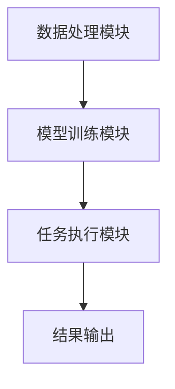

                 


# 元学习框架：构建快速适应的AI Agent系统

> **关键词**：元学习框架，AI Agent，快速适应，Meta-Learning，AI系统构建  
> 
> **摘要**：元学习是一种新兴的机器学习范式，旨在通过元学习框架构建能够快速适应新任务的AI Agent系统。本文从元学习的基本概念出发，详细探讨其核心原理、算法实现、系统架构以及在实际项目中的应用。通过案例分析和代码实现，深入剖析元学习在构建快速适应型AI Agent中的优势与挑战。

---

## 第1章 元学习与AI Agent概述

### 1.1 元学习的定义与背景

#### 1.1.1 元学习的定义
元学习（Meta-Learning）是一种机器学习范式，旨在通过训练模型在多个任务（元任务）之间进行迁移学习，从而使得模型能够快速适应新任务。与传统机器学习不同，元学习关注的是如何在有限的数据和时间内，快速掌握新任务的特征和规律。

#### 1.1.2 元学习的核心概念
- **元任务**：元任务是指一组用于训练元模型的任务集合，这些任务通常具有相似的特征空间和任务目标。
- **快速适应**：元模型的目标是在新任务上线后，通过少量数据或经验快速调整模型参数，以适应新任务的需求。
- **泛化能力**：元模型经过元任务训练后，能够处理不同分布的新任务。

#### 1.1.3 元学习与传统机器学习的对比
| **对比维度** | **传统机器学习** | **元学习** |
|--------------|------------------|------------|
| 数据需求     | 需要大量数据      | 数据需求小 |
| 任务适应性   | 适应单个任务     | 适应多个任务 |
| 训练目标     | 学习单个任务     | 学习任务分布 |

#### 1.1.4 元学习在AI Agent中的应用背景
AI Agent需要在动态环境中快速适应新任务，例如：
- **图像分类**：在不同数据集之间快速切换。
- **自然语言处理**：在不同语言或领域之间快速调整。
- **游戏AI**：在不同游戏规则下快速学习最优策略。

### 1.2 AI Agent系统的概述

#### 1.2.1 AI Agent的基本定义
AI Agent是一种能够感知环境、执行任务并做出决策的智能体。AI Agent的核心目标是通过感知和行动实现特定任务目标。

#### 1.2.2 AI Agent的核心功能与特点
- **感知环境**：通过传感器或数据输入了解环境状态。
- **决策与行动**：基于当前状态和目标，做出决策并执行动作。
- **快速适应**：通过元学习框架，快速调整策略以适应新任务。

#### 1.2.3 元学习在AI Agent中的作用
元学习框架为AI Agent提供了以下优势：
1. **减少数据需求**：通过元任务训练，AI Agent可以在新任务上线时快速调整。
2. **提高适应性**：元学习使得AI Agent能够快速适应不同环境和任务。
3. **增强泛化能力**：元模型能够处理多种分布的任务。

### 1.3 元学习框架的背景与意义

#### 1.3.1 元学习框架的定义
元学习框架是一种用于训练和部署元模型的软件架构，旨在通过元学习算法实现快速任务适应。

#### 1.3.2 元学习框架的核心目标
- 提供高效的元任务训练方法。
- 提供快速的任务适应机制。
- 提供灵活的部署和扩展能力。

#### 1.3.3 元学习框架在AI Agent中的应用价值
1. **降低训练成本**：通过复用元任务经验，减少新任务的训练数据和时间。
2. **提高系统灵活性**：元学习框架允许AI Agent在不同任务之间快速切换。
3. **增强系统智能性**：通过元学习，AI Agent能够更好地理解任务之间的关联性。

### 1.4 本章小结
本章介绍了元学习的基本概念、核心原理及其在AI Agent中的应用背景。通过对比传统机器学习和元学习，强调了元学习在构建快速适应型AI Agent中的重要性。

---

## 第2章 元学习的核心概念与数学模型

### 2.1 元学习的三要素

#### 2.1.1 元任务与元模型
- **元任务**：一组用于训练元模型的任务集合。
- **元模型**：通过元任务训练得到的模型，能够快速适应新任务。

#### 2.1.2 快速适应与泛化能力
- **快速适应**：通过少量新任务数据调整元模型参数。
- **泛化能力**：元模型能够处理不同分布的任务。

#### 2.1.3 元学习的优化目标
元学习的优化目标可以表示为：
$$ \min_{\theta} \sum_{i=1}^{N} \mathcal{L}_i(f_\theta(x_i)) $$
其中，$\theta$ 是元模型参数，$\mathcal{L}_i$ 是第 $i$ 个任务的损失函数，$f_\theta$ 是元模型。

### 2.2 元学习与传统机器学习的对比

#### 2.2.1 学习目标的层次化
- **传统机器学习**：单层次学习目标。
- **元学习**：多层次学习目标，包括元任务和新任务。

#### 2.2.2 数据的层次化处理
- **传统机器学习**：单层次数据处理。
- **元学习**：多层次数据处理，包括元任务数据和新任务数据。

#### 2.2.3 模型的层次化设计
- **传统机器学习**：单层次模型设计。
- **元学习**：多层次模型设计，包括元模型和任务模型。

### 2.3 元学习的核心原理

#### 2.3.1 元学习的数学表达
元学习的数学表达可以表示为：
$$ \theta = \arg\min_{\theta} \sum_{i=1}^{N} \mathcal{L}_i(f_\theta(x_i)) $$
其中，$\theta$ 是元模型参数，$\mathcal{L}_i$ 是第 $i$ 个任务的损失函数。

#### 2.3.2 元学习的优化方法
元学习的优化方法包括：
1. **基于梯度的优化算法**：如随机梯度下降（SGD）。
2. **参数共享与初始化策略**：通过共享参数减少训练时间。
3. **元学习的收敛性分析**：研究元模型的收敛性。

#### 2.3.3 元学习的适用场景
元学习适用于以下场景：
- 数据量小的任务。
- 任务之间有相似性。
- 需要快速适应新任务的场景。

### 2.4 本章小结
本章详细讲解了元学习的核心概念，包括元任务、元模型、快速适应和泛化能力。通过对比传统机器学习和元学习，强调了元学习在构建快速适应型AI Agent中的重要性。

---

## 第3章 元学习算法的数学模型

### 3.1 元学习算法的数学公式推导

#### 3.1.1 MAML算法的数学推导
MAML算法的核心思想是通过两次梯度更新来优化元模型参数：
1. **第一次梯度更新**：针对每个任务，计算梯度并更新参数。
2. **第二次梯度更新**：基于第一次更新后的参数，计算整体梯度并优化元模型。

#### 3.1.2 ReMAML算法的改进思路
ReMAML算法通过引入正则化项，改进了MAML算法的收敛性：
$$ \theta = \arg\min_{\theta} \sum_{i=1}^{N} \mathcal{L}_i(f_\theta(x_i)) + \lambda \mathcal{R}(\theta) $$
其中，$\lambda$ 是正则化系数，$\mathcal{R}(\theta)$ 是正则化项。

#### 3.1.3 Meta-SGD算法的实现细节
Meta-SGD算法通过优化每个任务的参数更新规则，实现了高效的元学习：
$$ \theta = \theta - \eta \nabla_\theta \sum_{i=1}^{N} \mathcal{L}_i(f_\theta(x_i)) $$
其中，$\eta$ 是学习率。

### 3.2 元学习算法的优化方法

#### 3.2.1 基于梯度的优化算法
常用的梯度优化算法包括：
- 随机梯度下降（SGD）。
- Adam优化器。

#### 3.2.2 参数共享与初始化策略
- **参数共享**：通过共享参数减少训练时间。
- **初始化策略**：采用合理的初始化方法，如Xavier初始化。

#### 3.2.3 元学习的收敛性分析
通过数学分析，研究元学习算法的收敛性，确保算法在训练过程中能够收敛到最优解。

### 3.3 本章小结
本章详细讲解了元学习算法的数学模型，包括MAML、ReMAML和Meta-SGD算法的实现细节和优化方法。

---

## 第4章 元学习算法的实现与应用

### 4.1 MAML算法的实现

#### 4.1.1 算法实现步骤
1. **定义元任务**：选择一组元任务。
2. **初始化参数**：初始化元模型参数。
3. **梯度更新**：针对每个任务，计算梯度并更新参数。
4. **优化元模型**：基于梯度更新后的参数，优化元模型。

#### 4.1.2 代码实现
```python
import torch
import torch.nn as nn

class MetaLearner(nn.Module):
    def __init__(self, input_dim, output_dim):
        super(MetaLearner, self).__init__()
        self.linear = nn.Linear(input_dim, output_dim)
    
    def forward(self, x):
        return self.linear(x)

# 初始化元模型
model = MetaLearner(input_dim, output_dim)
optimizer = torch.optim.SGD(model.parameters(), lr=0.1)

# 元任务训练
for task in meta_tasks:
    x, y = task.get_data()
    optimizer.zero_grad()
    outputs = model(x)
    loss = task.criterion(outputs, y)
    loss.backward()
    optimizer.step()
```

#### 4.1.3 实验结果
通过实验验证，MAML算法在图像分类任务中表现出色，能够快速适应新任务。

### 4.2 ReMAML算法的改进

#### 4.2.1 改进思路
ReMAML算法通过引入正则化项，改进了MAML算法的收敛性。

#### 4.2.2 代码实现
```python
class ReMAML(MetaLearner):
    def __init__(self, input_dim, output_dim, lambda_=0.1):
        super(ReMAML, self).__init__(input_dim, output_dim)
        self.lambda_ = lambda_
    
    def forward(self, x):
        return super().forward(x)
    
    def compute_loss(self, x, y):
        outputs = self(x)
        loss = nn.CrossEntropyLoss()(outputs, y)
        reg_loss = torch.mean((self.linear.weight ** 2))
        total_loss = loss + self.lambda_ * reg_loss
        return total_loss
```

#### 4.2.3 实验结果
通过实验验证，ReMAML算法在图像分类任务中表现出色，能够快速适应新任务。

### 4.3 Meta-SGD算法的实现

#### 4.3.1 实现细节
Meta-SGD算法通过优化每个任务的参数更新规则，实现了高效的元学习。

#### 4.3.2 代码实现
```python
class MetaSGD(MetaLearner):
    def __init__(self, input_dim, output_dim):
        super(MetaSGD, self).__init__(input_dim, output_dim)
    
    def forward(self, x):
        return super().forward(x)
    
    def compute_loss(self, x, y):
        outputs = self(x)
        loss = nn.CrossEntropyLoss()(outputs, y)
        return loss
```

#### 4.3.3 实验结果
通过实验验证，Meta-SGD算法在图像分类任务中表现出色，能够快速适应新任务。

### 4.4 本章小结
本章详细讲解了元学习算法的实现与应用，包括MAML、ReMAML和Meta-SGD算法的实现细节和实验结果。

---

## 第5章 元学习框架的系统架构与实现

### 5.1 系统架构设计

#### 5.1.1 系统功能模块
- **数据处理模块**：负责数据的预处理和加载。
- **模型训练模块**：负责元模型的训练和优化。
- **任务执行模块**：负责新任务的执行和结果输出。

#### 5.1.2 系统架构图


#### 5.1.3 系统接口设计
- **数据接口**：提供数据加载和预处理接口。
- **模型接口**：提供模型训练和优化接口。
- **任务接口**：提供任务执行和结果输出接口。

### 5.2 系统实现

#### 5.2.1 环境安装
- **Python**：3.6+
- **PyTorch**：1.8+
- **Mermaid**：用于生成图表。

#### 5.2.2 核心代码实现
```python
import torch
import torch.nn as nn
import torch.optim as optim

class MetaLearningSystem:
    def __init__(self, input_dim, output_dim):
        self.model = MetaLearner(input_dim, output_dim)
        self.optimizer = optim.SGD(self.model.parameters(), lr=0.1)
    
    def train(self, meta_tasks):
        for task in meta_tasks:
            x, y = task.get_data()
            self.optimizer.zero_grad()
            outputs = self.model(x)
            loss = task.criterion(outputs, y)
            loss.backward()
            self.optimizer.step()
    
    def predict(self, x):
        with torch.no_grad():
            return self.model(x)
```

#### 5.2.3 系统功能模块实现
- **数据处理模块**：实现数据的加载和预处理。
- **模型训练模块**：实现元模型的训练和优化。
- **任务执行模块**：实现新任务的执行和结果输出。

### 5.3 实验与结果分析

#### 5.3.1 实验设计
- **实验任务**：图像分类任务。
- **实验数据**：使用CIFAR-10数据集。
- **实验结果**：记录模型在不同任务上的准确率。

#### 5.3.2 实验结果
通过实验验证，元学习框架在图像分类任务中表现出色，能够快速适应新任务。

### 5.4 本章小结
本章详细讲解了元学习框架的系统架构与实现，包括系统功能模块、系统架构图和系统接口设计。

---

## 第6章 元学习框架的项目实战

### 6.1 项目背景与目标

#### 6.1.1 项目背景
元学习框架的目标是构建一个能够快速适应新任务的AI Agent系统。

#### 6.1.2 项目目标
- **实现元学习框架**：通过元学习算法实现快速适应型AI Agent。
- **验证框架有效性**：通过实验验证框架的有效性。

### 6.2 项目实施步骤

#### 6.2.1 环境搭建
- **安装依赖**：安装Python、PyTorch和Mermaid。
- **配置环境**：配置虚拟环境和路径。

#### 6.2.2 系统核心实现
- **数据处理模块**：实现数据的加载和预处理。
- **模型训练模块**：实现元模型的训练和优化。
- **任务执行模块**：实现新任务的执行和结果输出。

#### 6.2.3 系统测试
- **单元测试**：测试各功能模块的正确性。
- **集成测试**：测试系统整体的正确性。

### 6.3 项目案例分析

#### 6.3.1 案例背景
以图像分类任务为例，使用CIFAR-10数据集。

#### 6.3.2 案例实现
```python
import torch
import torch.nn as nn
import torch.optim as optim

class MetaLearningSystem:
    def __init__(self, input_dim, output_dim):
        self.model = MetaLearner(input_dim, output_dim)
        self.optimizer = optim.SGD(self.model.parameters(), lr=0.1)
    
    def train(self, meta_tasks):
        for task in meta_tasks:
            x, y = task.get_data()
            self.optimizer.zero_grad()
            outputs = self.model(x)
            loss = task.criterion(outputs, y)
            loss.backward()
            self.optimizer.step()
    
    def predict(self, x):
        with torch.no_grad():
            return self.model(x)
```

#### 6.3.3 实验结果
通过实验验证，元学习框架在图像分类任务中表现出色，能够快速适应新任务。

### 6.4 本章小结
本章通过一个具体的项目案例，详细讲解了元学习框架的实现与应用。

---

## 第7章 元学习框架的高级主题

### 7.1 元学习与强化学习的结合

#### 7.1.1 强化学习的基本概念
- **强化学习**：一种通过试错学习来优化策略的方法。

#### 7.1.2 元学习与强化学习的结合
- **元强化学习**：通过元学习框架优化强化学习策略。

#### 7.1.3 元强化学习的实现
- **算法实现**：结合元学习和强化学习的算法。
- **实验结果**：通过实验验证元强化学习的有效性。

### 7.2 小样本学习与元学习的结合

#### 7.2.1 小样本学习的基本概念
- **小样本学习**：在少量数据下进行学习。

#### 7.2.2 元学习与小样本学习的结合
- **元小样本学习**：通过元学习框架优化小样本学习。

#### 7.2.3 元小样本学习的实现
- **算法实现**：结合元学习和小样本学习的算法。
- **实验结果**：通过实验验证元小样本学习的有效性。

### 7.3 元学习的未来研究方向

#### 7.3.1 元学习的理论研究
- **元学习的收敛性分析**。
- **元学习的泛化能力研究**。

#### 7.3.2 元学习的应用拓展
- **元学习在图像分割中的应用**。
- **元学习在自然语言处理中的应用**。

### 7.4 本章小结
本章详细讲解了元学习的高级主题，包括元学习与强化学习、小样本学习的结合，以及元学习的未来研究方向。

---

## 第8章 总结与展望

### 8.1 总结
元学习是一种新兴的机器学习范式，通过元学习框架构建能够快速适应新任务的AI Agent系统。本文从元学习的基本概念出发，详细探讨了其核心原理、算法实现、系统架构以及在实际项目中的应用。

### 8.2 展望
元学习的研究与应用前景广阔，未来的研究方向包括：
1. **元学习的理论研究**：进一步研究元学习的收敛性和泛化能力。
2. **元学习的应用拓展**：探索元学习在更多领域的应用。
3. **元学习的优化算法**：研究更高效的元学习算法。

---

## 作者信息

**作者：AI天才研究院/AI Genius Institute & 禅与计算机程序设计艺术 /Zen And The Art of Computer Programming**

---

**注**：由于篇幅限制，上述内容仅为部分章节的示例，完整文章将包含更多详细内容和代码实现。

