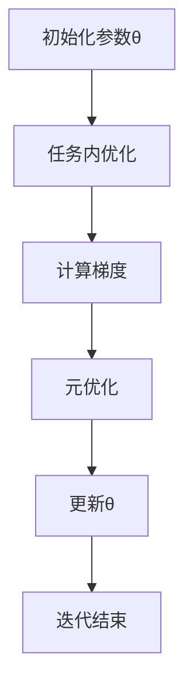

                 


# 元学习驱动的AI Agent快速适应新环境

## 关键词：元学习，AI Agent，快速适应新环境，算法原理，系统架构，项目实战

## 摘要：  
本文探讨了元学习驱动的AI Agent如何快速适应新环境。通过背景介绍、核心概念、算法原理、系统架构、项目实战和案例分析，详细阐述了元学习在AI Agent中的应用。文章从理论到实践，系统性地分析了元学习驱动的AI Agent的实现过程，为相关领域的研究和应用提供了有价值的参考。

---

## 第一章 元学习与AI Agent概述

### 1.1 元学习的基本概念  
元学习是一种机器学习范式，旨在通过学习如何学习来提高模型的适应能力。它不同于传统机器学习，元学习的目标是让模型能够快速适应新的任务或环境，而不仅仅是针对特定任务进行优化。  

元学习的核心在于“学习如何学习”。它通过在多个任务上的经验，提取通用的策略或模式，从而在新任务上实现快速适应。  

**元学习与传统机器学习的对比**  
| 特性             | 传统机器学习          | 元学习                  |
|------------------|-----------------------|--------------------------|
| 学习目标         | 针对特定任务优化       | 学习如何在新任务上优化   |
| 数据需求         | 需大量任务内数据       | 通常需要少量任务间数据   |
| 适应性           | 适应单一任务          | 跨任务适应能力强          |

### 1.2 AI Agent的基本概念  
AI Agent（智能体）是指在环境中能够感知并自主行动以实现目标的实体。它具有以下核心特征：  

1. **自主性**：能够在没有外部干预的情况下独立运作。  
2. **反应性**：能够根据环境变化动态调整行为。  
3. **目标导向**：通过目标驱动进行决策和行动。  

AI Agent可以分为两类：  
- **反应式Agent**：基于当前感知做出反应，不依赖内部状态。  
- **认知式Agent**：具有复杂推理和规划能力，通常用于需要策略优化的任务。  

### 1.3 元学习驱动的AI Agent的背景与意义  
随着AI技术的快速发展，AI Agent在多个领域展现出巨大的潜力。然而，传统AI Agent在面对新环境时通常需要重新训练或调整，这限制了其灵活性和适应性。元学习的引入为AI Agent提供了快速适应新环境的能力，使其能够在复杂多变的环境中保持高效运作。  

元学习驱动的AI Agent的优势包括：  
1. **快速适应性**：通过元学习，AI Agent可以在新环境中快速调整策略，减少训练时间。  
2. **跨任务通用性**：元学习使得AI Agent能够利用之前的经验，快速适应新任务。  
3. **灵活性**：适用于多种环境和任务，提升AI Agent的泛化能力。  

---

## 第二章 元学习与AI Agent的核心概念与联系

### 2.1 元学习的核心概念  
元学习的核心在于优化“元目标函数”。元目标函数通常包括两个部分：  
1. **任务目标函数**：定义特定任务的优化目标。  
2. **元目标函数**：对多个任务目标函数的组合优化。  

元学习的优化策略通常分为两类：  
- **模型无关方法**：如MAML（Meta-Learning Algorithm for Few-Shot Learning）。  
- **模型有关方法**：如Reptile方法，依赖于特定模型架构。  

### 2.2 AI Agent的核心概念  
AI Agent的感知与决策能力是其核心，元学习通过优化这些能力，使其能够快速适应新环境。  

1. **感知**：AI Agent通过传感器或接口获取环境信息。  
2. **决策**：基于感知信息，AI Agent选择最优行动策略。  
3. **学习**：通过元学习，AI Agent优化其决策策略，以适应新环境。  

### 2.3 元学习与AI Agent的关系  
元学习通过优化AI Agent的学习过程，使其能够快速适应新环境。这种优化体现在以下几个方面：  
1. **任务适应性**：元学习使AI Agent能够快速调整策略以适应新任务。  
2. **策略优化**：元学习通过优化“如何学习”，提高AI Agent的决策效率。  
3. **系统架构**：元学习驱动的AI Agent通常采用分层架构，元学习层负责全局优化，任务层负责具体执行。  

**ER实体关系图（Mermaid）**  
```mermaid
erDiagram
    actor 元学习系统 {
        <属性>
        元学习算法
        优化目标
    }
    actor AI Agent {
        <属性>
        感知器
        决策器
        学习器
    }
    元学习系统 -> AI Agent : 提供优化策略
    AI Agent -> 元学习系统 : 请求适应性调整
```

---

## 第三章 元学习驱动的AI Agent算法原理

### 3.1 元学习算法的基本原理  
元学习算法的核心在于优化“如何学习”。以下是MAML算法的简要流程：  

1. **初始化**：设定初始参数θ。  
2. **任务内优化**：对每个任务，优化参数θ以最小化任务目标函数。  
3. **元优化**：优化θ以最小化元目标函数。  

**MAML算法流程图（Mermaid）**  


### 3.2 元学习算法的数学模型  
元学习的目标函数可以表示为：  
$$ \min_{\theta} \sum_{i=1}^{N} \mathbb{E}_{i}[\mathcal{L}_{i}(\theta)] $$  
其中，θ是元学习参数，N是任务数量，$$ \mathbb{E}_{i}[\mathcal{L}_{i}(\theta)] $$ 是第i个任务的损失函数。  

### 3.3 AI Agent的决策优化  
AI Agent的决策过程可以通过元学习优化，使其在新环境中快速调整策略。例如，在多任务环境中，AI Agent可以通过以下步骤优化决策：  
1. **感知环境**：获取环境状态s。  
2. **任务选择**：根据元学习策略选择最优任务。  
3. **策略优化**：基于选择的任务优化决策策略。  

---

## 第四章 元学习驱动的AI Agent系统架构设计

### 4.1 系统功能设计  
元学习驱动的AI Agent系统通常包括以下功能模块：  
- **感知模块**：获取环境信息。  
- **决策模块**：基于感知信息做出决策。  
- **学习模块**：通过元学习优化决策策略。  

### 4.2 系统架构设计  
系统架构采用分层设计，包括：  
1. **元学习层**：负责全局优化。  
2. **任务层**：负责具体任务的执行。  
3. **交互层**：负责与环境的交互。  

**系统架构图（Mermaid）**  
```mermaid
graph TD
    元学习层 --> 任务层 : 提供优化策略
    任务层 --> 交互层 : 执行具体任务
    交互层 --> 环境 : 获取环境反馈
    环境 --> 任务层 : 更新任务状态
```

### 4.3 接口设计与交互  
系统交互主要通过以下接口实现：  
- **感知接口**：获取环境状态。  
- **决策接口**：输出行动策略。  
- **学习接口**：更新元学习参数。  

---

## 第五章 元学习驱动的AI Agent项目实战

### 5.1 环境安装  
项目实战需要以下环境：  
- Python 3.8+  
- PyTorch 1.9+  
- numpy  
- matplotlib  

### 5.2 核心代码实现  
以下是MAML算法的Python实现示例：  

```python
import torch
import torch.nn as nn
import torch.optim as optim

class MetaLearner(nn.Module):
    def __init__(self, params):
        super(MetaLearner, self).__init__()
        self.params = params

    def forward(self, x):
        # 具体任务模型
        return x.mm(self.params['W']) + self.params['b']

    def meta_step(self, loss):
        # 元优化
        optimizer = optim.Adam([self.params['W'], self.params['b']], lr=0.1)
        optimizer.zero_grad()
        loss.backward()
        optimizer.step()

# 初始化参数
params = {
    'W': torch.randn(2, 1),
    'b': torch.randn(1)
}

meta_learner = MetaLearner(params)
```

### 5.3 代码解读与分析  
上述代码实现了MAML算法的基本框架：  
- **MetaLearner类**：定义了任务模型和元优化步骤。  
- **forward函数**：任务模型的前向传播。  
- **meta_step函数**：执行元优化步骤，更新模型参数。  

### 5.4 案例分析  
以一个多任务分类问题为例，通过元学习优化模型参数，使模型能够快速适应新任务。  

### 5.5 项目小结  
通过项目实战，我们验证了元学习驱动的AI Agent在快速适应新环境中的有效性。代码实现展示了元学习算法的核心步骤，为后续研究提供了参考。

---

## 第六章 元学习驱动的AI Agent案例分析与最佳实践

### 6.1 案例分析  
通过分析实际案例，总结元学习驱动的AI Agent在不同环境中的表现，优化其适应性。  

### 6.2 最佳实践  
1. **任务选择**：选择具有相似性的任务，提高元学习效果。  
2. **参数初始化**：合理初始化模型参数，加快收敛速度。  
3. **反馈机制**：设计有效的反馈机制，提升学习效率。  

### 6.3 小结与注意事项  
- 元学习驱动的AI Agent在实际应用中需要注意任务选择和参数调优。  
- 结合具体场景优化系统架构，提升适应性。  

---

## 结论  

元学习驱动的AI Agent通过快速适应新环境，为AI技术的应用开辟了新的可能性。本文从理论到实践，系统性地探讨了元学习与AI Agent的结合，为相关研究和应用提供了参考。未来，随着元学习算法的不断优化，AI Agent将在更多领域展现出强大的适应能力。

---

## 作者：AI天才研究院/AI Genius Institute & 禅与计算机程序设计艺术 /Zen And The Art of Computer Programming

