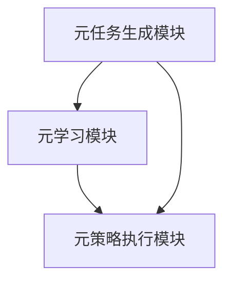

                 


# 元强化学习：快速适应新环境的AI Agent

> 关键词：元强化学习、快速适应、AI Agent、强化学习、机器学习

> 摘要：本文深入探讨了元强化学习（Meta Reinforcement Learning）的核心概念、算法原理、系统架构及实际应用。通过详细讲解元强化学习的背景、原理、算法实现、系统设计以及项目实战，本文旨在帮助读者全面理解如何利用元强化学习快速训练出能够在新环境中快速适应的AI Agent。文章内容涵盖理论推导、算法实现和实际案例分析，为读者提供了从基础到实践的全面指导。

---

## 第1章: 元强化学习概述

### 1.1 元强化学习的定义与背景

#### 1.1.1 强化学习的基本概念
强化学习（Reinforcement Learning, RL）是一种机器学习范式，其中智能体通过与环境交互，学习如何做出决策以最大化累积奖励。智能体通过试错的方式，逐步优化其策略，最终达到在特定任务上的最优性能。

#### 1.1.2 元强化学习的提出与意义
元强化学习（Meta Reinforcement Learning, Meta-RL）是在传统强化学习的基础上引入了“元学习”的概念。元学习的核心思想是让模型学会如何快速适应新任务，而无需从头开始训练。在实际应用中，许多场景要求AI Agent能够快速适应新环境，例如机器人在新环境中执行任务、自动驾驶在不同路况下的快速调整等。元强化学习通过预训练模型的快速泛化能力，显著提高了AI Agent的适应性。

#### 1.1.3 元强化学习的应用场景
元强化学习的应用场景包括但不限于：
- **机器人控制**：快速适应新的物理环境或任务目标。
- **自动驾驶**：在不同路况和驾驶条件下快速调整驾驶策略。
- **游戏AI**：快速适应新游戏规则或对手策略。
- **推荐系统**：快速适应用户偏好变化。

### 1.2 元强化学习的核心概念

#### 1.2.1 元学习与传统强化学习的对比
| 对比维度 | 传统强化学习 | 元强化学习 |
|----------|---------------|------------|
| 学习目标 | 单一任务优化 | 多任务快速适应 |
| 数据需求 | 需大量任务数据 | 需少量任务数据 |
| 适应性   | 低 | 高 |

#### 1.2.2 元强化学习的目标函数
元强化学习的目标函数通常由两部分组成：元目标函数和任务目标函数。元目标函数用于优化元策略，任务目标函数用于优化任务策略。

$$
\mathcal{L}_{\text{meta}} = \sum_{t=1}^{T} \mathcal{L}_{t}(\theta_{\text{meta}}, \theta_{t})
$$

其中，$\theta_{\text{meta}}$ 是元策略参数，$\theta_{t}$ 是任务策略参数，$T$ 是任务数量。

#### 1.2.3 元强化学习的元任务与目标
元任务（Meta-Task）是元强化学习中的关键概念，它定义了一组任务的分布。元策略的目标是在新的任务环境中快速调整其参数，以适应新任务。

---

## 第2章: 元强化学习的核心原理

### 2.1 元学习的目标函数与优化

#### 2.1.1 元学习的损失函数
元学习的损失函数通常包括两部分：任务损失和元损失。

$$
\mathcal{L}_{\text{meta}} = \mathcal{L}_{\text{task}} + \lambda \mathcal{L}_{\text{meta}}
$$

其中，$\mathcal{L}_{\text{task}}$ 是任务损失，$\mathcal{L}_{\text{meta}}$ 是元损失，$\lambda$ 是超参数。

#### 2.1.2 元优化算法的数学推导
元优化算法的目标是最小化元损失函数。假设元策略参数为$\theta_{\text{meta}}$，任务策略参数为$\theta_{t}$，则元优化的目标函数可以表示为：

$$
\min_{\theta_{\text{meta}}} \mathbb{E}_{t}[ \mathcal{L}_{t}(\theta_{\text{meta}}, \theta_{t}) ]
$$

其中，$\mathbb{E}_{t}$ 表示对所有元任务的期望。

#### 2.1.3 元学习的梯度计算
元学习的梯度计算需要考虑元策略和任务策略之间的关系。通常，元策略通过梯度下降优化，而任务策略则通过基于元策略的梯度优化。

$$
\theta_{\text{meta}} \leftarrow \theta_{\text{meta}} - \eta \nabla_{\theta_{\text{meta}}} \mathcal{L}_{\text{meta}}
$$

其中，$\eta$ 是学习率。

### 2.2 元强化学习的策略优化

#### 2.2.1 元策略的定义与更新
元策略（Meta-Policy）是一个参数化的函数，用于生成任务策略。任务策略可以通过元策略快速调整，以适应新任务。

$$
\pi_{t}(\cdot; \theta_{\text{meta}}) = \text{Function}(\theta_{\text{meta}})
$$

#### 2.2.2 基于梯度的元优化方法
基于梯度的元优化方法是元强化学习的核心技术之一。通过计算元损失函数的梯度，并更新元策略参数，可以实现元策略的优化。

$$
\nabla_{\theta_{\text{meta}}} \mathcal{L}_{\text{meta}} = \sum_{t=1}^{T} \nabla_{\theta_{\text{meta}}} \mathcal{L}_{t}(\theta_{\text{meta}}, \theta_{t})
$$

#### 2.2.3 元策略与目标策略的关系
元策略的目标是生成任务策略，任务策略通过元策略快速调整以适应新任务。元策略和任务策略之间的关系可以用以下公式表示：

$$
\theta_{t} = \text{Update}(\theta_{\text{meta}}, t)
$$

---

## 第3章: 元强化学习的算法原理

### 3.1 元学习算法的分类

#### 3.1.1 基于梯度的元学习算法
基于梯度的元学习算法通过计算任务损失对元策略参数的梯度，更新元策略。典型算法包括MAML（Meta-Anti梯度优化器）。

#### 3.1.2 基于参数共享的元学习算法
基于参数共享的元学习算法通过共享任务策略参数，减少参数数量，提高训练效率。典型算法包括ReMAML（Reparameterized Meta-Anti梯度优化器）。

#### 3.1.3 基于分布的元学习算法
基于分布的元学习算法通过学习任务分布，生成任务策略。典型算法包括Meta-SGD。

### 3.2 元强化学习的主流算法

#### 3.2.1 Meta-LSTM 算法
Meta-LSTM是一种基于LSTM的元强化学习算法，适用于序列任务。其核心思想是通过LSTM网络学习任务间的关系，快速生成任务策略。

#### 3.2.2 MAML 算法
MAML是一种基于梯度的元学习算法，通过计算任务损失对元策略参数的梯度，更新元策略。MAML在多个任务上的表现优异，尤其适用于小样本任务。

#### 3.2.3 ReMAML 算法
ReMAML是一种基于重参数化的元学习算法，通过重参数化技术，降低计算复杂度，提高训练效率。

---

## 第4章: 元强化学习的数学模型与公式

### 4.1 元学习的数学模型

#### 4.1.1 元任务的定义
元任务定义了一组任务的分布。假设我们有$T$个元任务，每个任务对应一个环境和奖励函数。

$$
\mathcal{T} = \{ (E_t, r_t) \}_{t=1}^{T}
$$

其中，$E_t$是环境，$r_t$是奖励函数。

#### 4.1.2 元学习的损失函数公式
元学习的损失函数通常由任务损失和元损失组成：

$$
\mathcal{L}_{\text{meta}} = \sum_{t=1}^{T} \mathcal{L}_{\text{task}}(t) + \lambda \mathcal{L}_{\text{meta}}(t)
$$

#### 4.1.3 元优化的数学推导
元优化的目标是最小化元损失函数。假设元策略参数为$\theta_{\text{meta}}$，任务策略参数为$\theta_{t}$，则元优化的目标函数可以表示为：

$$
\min_{\theta_{\text{meta}}} \mathbb{E}_{t}[ \mathcal{L}_{\text{task}}(t; \theta_{\text{meta}}, \theta_{t}) ]
$$

### 4.2 元强化学习的核心公式

#### 4.2.1 元策略的更新公式
元策略的更新公式可以通过梯度下降实现：

$$
\theta_{\text{meta}} \leftarrow \theta_{\text{meta}} - \eta \nabla_{\theta_{\text{meta}}} \mathcal{L}_{\text{meta}}
$$

#### 4.2.2 元任务的梯度计算公式
元任务的梯度计算公式可以通过链式法则实现：

$$
\nabla_{\theta_{\text{meta}}} \mathcal{L}_{\text{meta}} = \sum_{t=1}^{T} \nabla_{\theta_{\text{meta}}} \mathcal{L}_{\text{task}}(t; \theta_{\text{meta}}, \theta_{t})
$$

#### 4.2.3 元学习的收敛条件
元学习的收敛条件通常包括梯度消失、梯度爆炸和参数初始化等问题。通过合理的参数初始化和梯度截断，可以有效解决这些问题。

---

## 第5章: 元强化学习的系统架构设计

### 5.1 元强化学习系统的组成

#### 5.1.1 元任务生成模块
元任务生成模块负责生成一组元任务，包括环境和奖励函数。

#### 5.1.2 元学习模块
元学习模块负责训练元策略，使其能够快速适应新任务。

#### 5.1.3 元策略执行模块
元策略执行模块负责在新任务环境中执行元策略，生成任务策略。

### 5.2 元强化学习系统的架构图


### 5.3 系统接口设计

#### 5.3.1 元任务生成接口
元任务生成接口负责生成一组元任务，并返回给元学习模块。

#### 5.3.2 元学习模块接口
元学习模块接口负责接收元任务，并训练元策略。

#### 5.3.3 元策略执行接口
元策略执行接口负责接收新任务，并执行元策略，生成任务策略。

---

## 第6章: 元强化学习的项目实战

### 6.1 环境安装与配置

#### 6.1.1 安装依赖库
需要安装的依赖库包括TensorFlow、PyTorch、Gym等。

#### 6.1.2 配置开发环境
配置Python环境，并安装必要的库。

#### 6.1.3 下载数据集
下载所需的元任务数据集，包括任务环境和奖励函数。

### 6.2 系统核心实现

#### 6.2.1 元任务生成代码
```python
def generate_meta_tasks(num_tasks):
    tasks = []
    for _ in range(num_tasks):
        env = create_env()
        reward_fn = create_reward_fn(env)
        tasks.append((env, reward_fn))
    return tasks
```

#### 6.2.2 元学习算法实现
```python
def meta_learning(meta_policy, tasks):
    for task in tasks:
        env, reward_fn = task
        # 训练任务策略
        train_task_policy(meta_policy, env, reward_fn)
        # 更新元策略
        update_meta_policy(meta_policy)
```

#### 6.2.3 元策略执行代码
```python
def execute_meta_policy(meta_policy, new_task):
    env, reward_fn = new_task
    # 生成任务策略
    task_policy = generate_task_policy(meta_policy, env, reward_fn)
    # 执行任务
    execute_task(task_policy, env, reward_fn)
```

### 6.3 案例分析

#### 6.3.1 元强化学习在机器人控制中的应用
通过元强化学习训练一个元策略，使其能够快速适应不同的机器人控制任务，例如在不同地形上的行走和攀爬。

#### 6.3.2 元强化学习在自动驾驶中的应用
通过元强化学习训练一个元策略，使其能够快速适应不同的驾驶环境和路况。

### 6.4 项目小结
通过项目实战，我们可以看到元强化学习在实际应用中的强大能力。通过预训练的元策略，AI Agent可以在新环境中快速适应并执行任务。

---

## 第7章: 元强化学习的总结与展望

### 7.1 元强化学习的总结
元强化学习是一种新兴的机器学习技术，通过预训练模型的快速泛化能力，显著提高了AI Agent在新环境中的适应性。其核心思想是让模型学会如何快速适应新任务，而无需从头开始训练。

### 7.2 元强化学习的未来展望
元强化学习在未来的发展方向包括：
1. 更高效的元优化算法。
2. 更强大的元任务生成方法。
3. 更广泛的应用场景。

### 7.3 元强化学习的最佳实践

#### 7.3.1 数据预处理
在训练元策略时，需要对数据进行预处理，确保数据的多样性和代表性。

#### 7.3.2 模型调优
在训练元策略时，需要进行模型调优，包括学习率、批量大小等超参数的调整。

#### 7.3.3 系统优化
在系统设计时，需要进行系统优化，包括任务生成模块、元学习模块和元策略执行模块的高效协同。

---

## 作者

作者：AI天才研究院/AI Genius Institute & 禅与计算机程序设计艺术 /Zen And The Art of Computer Programming

