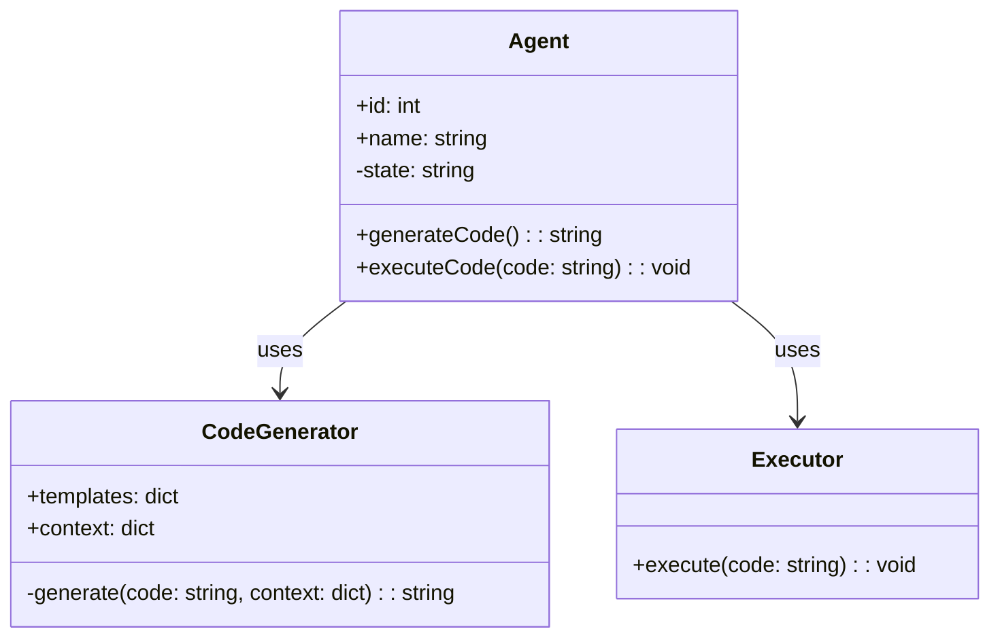
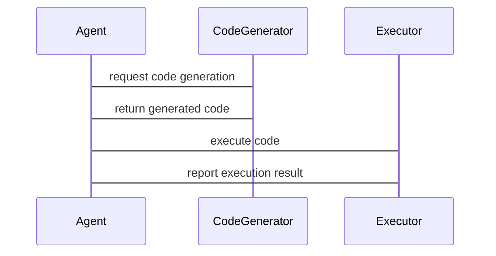

                 


# 元编程技术：使AI Agent具备代码生成能力

> 关键词：元编程，AI Agent，代码生成，生成式AI，系统架构

> 摘要：本文详细探讨了元编程技术如何赋予AI Agent代码生成能力，涵盖了元编程的基本概念、生成式AI的原理、系统架构设计、项目实战等内容。通过理论与实践结合的方式，深入分析了AI Agent在代码生成领域的应用潜力，并提供了具体的实现方案和优化建议。

---

# 第1章：元编程与AI Agent概述

## 1.1 元编程的基本概念

### 1.1.1 元编程的定义与特点
元编程是一种编写“程序的程序”的技术，它允许程序员编写能够生成或操作其他程序代码的工具。元编程的核心特点包括：
- **动态性**：能够根据运行时环境动态生成代码。
- **抽象性**：通过抽象语法和语义，实现代码的自动生成。
- **自适应性**：能够根据需求和上下文调整生成的代码。

### 1.1.2 元编程的历史与发展
元编程的概念可以追溯到20世纪60年代的Lisp语言。Lisp通过其强大的宏系统，使得程序员能够编写生成代码的函数。随着技术的发展，元编程在编译器构建、代码生成工具、DSL（领域特定语言）开发等领域得到了广泛应用。

### 1.1.3 元编程在软件开发中的作用
元编程通过自动化代码生成，显著提升了开发效率。它能够帮助开发者快速构建复杂的系统，减少重复性劳动，并提高代码质量。

## 1.2 AI Agent的基本概念

### 1.2.1 AI Agent的定义与类型
AI Agent是一种智能实体，能够感知环境、自主决策并执行任务。根据应用场景的不同，AI Agent可以分为：
- **反应式AI Agent**：基于当前感知做出反应。
- **认知式AI Agent**：具备推理、规划和学习能力。
- **协作式AI Agent**：能够与其他Agent或人类进行协作。

### 1.2.2 AI Agent的核心能力
AI Agent的核心能力包括：
- **感知能力**：通过传感器或接口获取环境信息。
- **决策能力**：基于感知信息做出决策。
- **学习能力**：通过经验或数据改进自身性能。

### 1.2.3 AI Agent的应用场景
AI Agent广泛应用于自动驾驶、智能助手、机器人控制、自动化系统等领域。它能够帮助人类完成复杂、重复或危险的任务。

## 1.3 元编程与AI Agent的结合

### 1.3.1 元编程如何赋予AI Agent代码生成能力
通过元编程，AI Agent可以动态生成代码，实现其决策和执行能力的自动化。例如，AI Agent可以根据任务需求生成特定的算法代码。

### 1.3.2 元编程与AI Agent的协同工作原理
元编程为AI Agent提供了生成代码的能力，而AI Agent则利用这些代码实现任务执行。两者结合，能够显著提升系统的智能化和自动化水平。

### 1.3.3 元编程在AI Agent中的应用前景
随着技术的发展，元编程与AI Agent的结合将推动智能化系统的发展，使其具备更强的自适应性和创造力。

---

# 第2章：元编程的核心概念与联系

## 2.1 元编程的核心概念

### 2.1.1 元编程的语法与语义
元编程通过操作抽象语法树（AST）或代码字符串，生成新的代码。它允许程序员在代码生成过程中，定义语法和语义规则。

### 2.1.2 元编程的动态性与自适应性
元编程能够根据运行时环境动态生成代码，具备高度的自适应性。这使得AI Agent能够在不同环境下灵活调整其行为。

### 2.1.3 元编程的抽象与泛化
元编程通过抽象语法和语义，实现了代码生成的泛化能力。这使得生成的代码能够适用于多种场景。

## 2.2 AI Agent的核心概念

### 2.2.1 AI Agent的感知与决策能力
AI Agent通过感知环境信息，利用内部算法做出决策。元编程可以生成这些算法代码，使其具备更强的决策能力。

### 2.2.2 AI Agent的自主性与协作性
AI Agent具备自主决策能力，并能够与其他Agent或人类进行协作。元编程可以生成协作所需的接口和协议代码。

### 2.2.3 AI Agent的学习与进化能力
AI Agent能够通过学习和进化，提升自身的性能。元编程可以生成适应性学习算法，加速进化过程。

## 2.3 元编程与AI Agent的联系

### 2.3.1 元编程如何增强AI Agent的能力
元编程通过生成代码，增强了AI Agent的感知、决策和执行能力。它使得AI Agent能够快速适应变化的环境。

### 2.3.2 元编程与AI Agent的协同设计
元编程与AI Agent的协同设计，需要考虑代码生成的语法、语义和执行环境。这需要在系统设计阶段进行详细的规划。

### 2.3.3 元编程在AI Agent中的创新应用
元编程为AI Agent提供了代码生成的能力，使其能够在复杂环境中自主解决问题。这在自动驾驶、智能助手等领域具有重要意义。

---

# 第3章：生成式AI与代码生成算法

## 3.1 生成式AI的基本原理

### 3.1.1 生成式AI的定义与分类
生成式AI是一种基于概率模型的AI技术，能够生成新的数据。常见的生成式AI模型包括GPT、BERT等。

### 3.1.2 基于概率的生成模型
生成式AI通过学习数据的分布，生成符合该分布的新数据。概率模型是其核心原理。

### 3.1.3 常见的生成式AI算法
- **GPT**：基于Transformer的生成模型，广泛应用于文本生成。
- **BERT**：基于Transformer的编码模型，用于文本理解。
- **GAN**：生成对抗网络，通过对抗训练生成数据。

## 3.2 代码生成算法

### 3.2.1 基于规则的代码生成
基于规则的代码生成通过预定义的规则，生成符合特定需求的代码。

### 3.2.2 基于模板的代码生成
基于模板的代码生成利用模板和参数，快速生成代码。这种方法简单易用，但灵活性有限。

### 3.2.3 基于生成式AI的代码生成
基于生成式AI的代码生成利用概率模型，生成多样化的代码。这种方法具有较高的灵活性和创造性。

## 3.3 元编程与生成式AI的结合

### 3.3.1 元编程在生成式AI中的应用
元编程可以生成生成式AI的模型代码，实现动态调整和优化。

### 3.3.2 生成式AI如何提升元编程能力
生成式AI能够生成复杂的代码模式，增强元编程的生成能力。

### 3.3.3 元编程与生成式AI的协同优化
通过协同设计，元编程与生成式AI能够实现代码生成的自动化和优化。

---

# 第4章：系统分析与架构设计方案

## 4.1 问题场景介绍

### 4.1.1 问题背景
随着AI Agent的应用越来越广泛，对代码生成能力的需求也日益增长。

### 4.1.2 问题描述
AI Agent需要具备动态生成代码的能力，以适应复杂多变的环境。

### 4.1.3 问题解决
通过元编程技术，AI Agent可以生成适应性代码，解决问题。

## 4.2 项目介绍

### 4.2.1 项目目标
本项目旨在实现一个具备代码生成能力的AI Agent。

### 4.2.2 项目需求
- **代码生成能力**：能够根据需求生成代码。
- **动态适应能力**：能够根据环境变化调整生成的代码。
- **高效执行能力**：生成的代码能够高效运行。

## 4.3 系统功能设计

### 4.3.1 领域模型（Mermaid类图）


### 4.3.2 系统架构设计（Mermaid架构图）


### 4.3.3 系统接口设计
- **生成代码接口**：`generateCode(template: string, context: dict) -> string`
- **执行代码接口**：`execute(code: string) -> void`

### 4.3.4 系统交互设计（Mermaid序列图）


---

# 第5章：项目实战

## 5.1 环境配置

### 5.1.1 安装Python
```bash
python --version
pip install --upgrade pip
```

### 5.1.2 安装依赖
```bash
pip install numpy
pip install matplotlib
```

## 5.2 核心代码实现

### 5.2.1 代码生成器实现
```python
class CodeGenerator:
    def __init__(self, templates):
        self.templates = templates
    
    def generate(self, template_name, context):
        template = self.templates[template_name]
        return template.format(**context)
```

### 5.2.2 执行器实现
```python
class Executor:
    def execute(self, code):
        exec(code)
```

## 5.3 代码解读与分析

### 5.3.1 代码生成器解读
代码生成器通过模板和上下文，生成具体的代码字符串。模板使用Python的`format`方法进行变量替换。

### 5.3.2 执行器解读
执行器通过`exec`函数执行生成的代码，实现代码的动态执行。

## 5.4 实际案例分析

### 5.4.1 案例描述
实现一个简单的AI Agent，能够生成并执行Hello World程序。

### 5.4.2 实现步骤
1. 安装依赖。
2. 编写模板文件。
3. 初始化代码生成器。
4. 调用生成方法。
5. 调用执行方法。

### 5.4.3 代码示例
```python
templates = {
    "hello": "print('Hello, World!')"
}
generator = CodeGenerator(templates)
code = generator.generate("hello", {})
executor = Executor()
executor.execute(code)
```

## 5.5 项目小结

### 5.5.1 实战总结
通过本项目，我们实现了具备代码生成能力的AI Agent，验证了元编程技术的应用。

### 5.5.2 项目成果
- 生成代码的能力。
- 动态执行代码的能力。
- 系统模块化设计的能力。

### 5.5.3 项目经验
- 元编程技术能够显著提升系统的智能化和自动化水平。
- 生成式AI的引入，能够增强代码生成的能力和多样性。

---

# 第6章：最佳实践、小结、注意事项、拓展阅读

## 6.1 最佳实践

### 6.1.1 元编程实践
- 使用成熟的元编程框架，如Lisp、Python等。
- 通过模板和上下文管理代码生成过程。
- 定期优化生成的代码质量。

### 6.1.2 生成式AI实践
- 使用开源生成式AI模型，如GPT、BERT等。
- 通过微调和优化提升生成代码的质量。
- 注意生成代码的安全性和可靠性。

## 6.2 小结

### 6.2.1 元编程与AI Agent的结合
元编程与AI Agent的结合，使得AI Agent具备代码生成能力，显著提升了系统的智能化和自动化水平。

### 6.2.2 元编程技术的未来
元编程技术将朝着更智能化、更自动化的方向发展，为AI Agent提供更强的代码生成能力。

## 6.3 注意事项

### 6.3.1 开发注意事项
- 注意代码生成的安全性，防止代码注入攻击。
- 定期维护和更新生成式AI模型，确保生成代码的质量。
- 处理好生成代码的依赖关系，确保系统的稳定性。

### 6.3.2 应用注意事项
- 在生产环境中使用元编程技术，需谨慎管理代码生成的过程。
- 定期监控生成代码的运行状态，及时处理异常情况。
- 遵守相关法律法规，确保生成代码的合法性。

## 6.4 拓展阅读

### 6.4.1 推荐书籍
- 《元编程》：深入浅出地讲解元编程的概念和应用。
- 《生成式AI》：系统介绍生成式AI的技术和实践。

### 6.4.2 推荐博客
- [AI与编程](https://example.com)：专注于AI与编程技术的结合。
- [元编程技术](https://example.com)：分享元编程技术的最新进展和应用案例。

### 6.4.3 推荐工具
- **Lisp**：经典的元编程语言。
- **Python**：支持元编程的脚本语言。
- **Transformers**：生成式AI的开源框架。

---

# 作者：AI天才研究院/AI Genius Institute & 禅与计算机程序设计艺术 /Zen And The Art of Computer Programming

