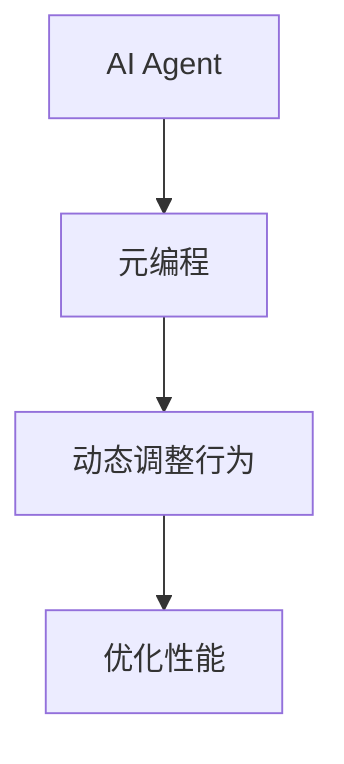
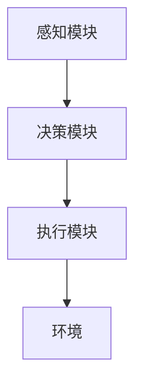
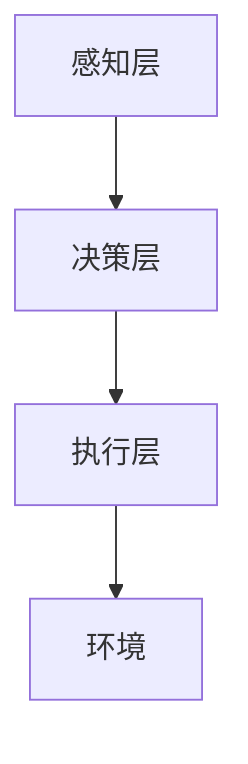
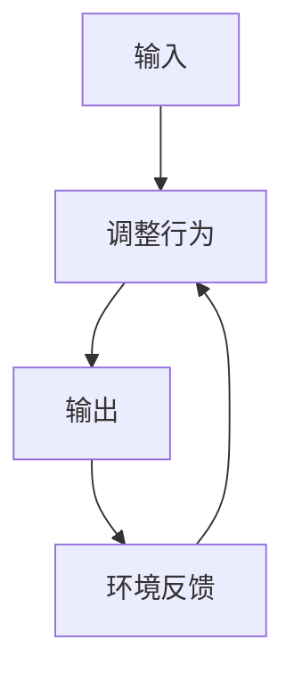

                 


# 元编程技术：赋予AI Agent自我改进的能力

> **关键词**：元编程，AI Agent，自我改进，算法原理，系统架构，项目实战

> **摘要**：  
> 元编程是一种高级的编程范式，通过生成或操作代码来实现程序的自我改进。本文将深入探讨元编程技术如何赋予AI Agent自我改进的能力，从背景介绍、核心概念、算法原理、系统架构设计到项目实战，逐步解析元编程在AI Agent中的应用。通过详细的技术分析和实例演示，本文将为读者提供一个全面的视角，理解元编程如何推动AI Agent的智能进化。

---

## 第1章: 元编程的基本概念与背景

### 1.1 元编程的定义与特点

#### 1.1.1 元编程的定义  
元编程（Metaprogramming）是一种编程范式，允许程序在运行时生成、分析或操作其他程序或代码。与传统编程不同，元编程的核心在于程序能够“思考”自己的结构和行为，从而实现动态调整和优化。

#### 1.1.2 元编程的核心特点  
1. **动态性**：程序能够在运行时生成或修改代码。
2. **抽象性**：元编程允许程序操作抽象的代码结构，而不仅仅是具体的数据。
3. **自适应性**：程序可以根据环境反馈动态调整自身行为。

#### 1.1.3 元编程与传统编程的区别  
| 特性 | 传统编程 | 元编程 |
|------|----------|--------|
| 执行方式 | 执行预定义代码 | 生成或操作代码 |
| 灵活性 | 有限 | 高度灵活 |
| 应用场景 | 固定逻辑 | 动态调整逻辑 |

### 1.2 AI Agent的自我改进机制

#### 1.2.1 AI Agent的基本概念  
AI Agent（智能体）是一种能够感知环境、自主决策并执行任务的实体。它可以是一个软件程序，也可以是物理设备。

#### 1.2.2 自我改进能力的定义  
自我改进能力是指AI Agent能够在运行过程中，通过元编程技术动态调整自身的算法、逻辑或行为，以适应环境的变化或优化性能。

#### 1.2.3 元编程在AI Agent中的作用  
元编程为AI Agent提供了以下能力：
1. 动态生成新算法。
2. 在运行时优化代码结构。
3. 根据反馈调整行为策略。

---

## 第2章: 元编程的核心概念与联系

### 2.1 元编程的原理

#### 2.1.1 元编程的实现机制  
元编程的核心机制包括：
1. **代码生成**：程序在运行时生成新的代码片段。
2. **代码分析**：程序分析自身或外部代码的结构。
3. **代码操作**：程序对代码进行修改或优化。

#### 2.1.2 元编程的核心要素  
| 要素 | 描述 |
|------|------|
| 元程序 | 用于生成或操作代码的程序 |
| 元数据 | 描述程序结构和行为的数据 |
| 元语法 | 元编程中使用的语法和语义规则 |

#### 2.1.3 元编程的数学模型  
元编程的数学模型通常涉及以下几个方面：
1. **代码表示**：用符号表示代码结构。
2. **操作符定义**：定义代码生成和修改的操作符。
3. **变换规则**：定义代码如何根据环境反馈进行变换。

### 2.2 AI Agent与元编程的关系

#### 2.2.1 AI Agent的行为模型  
AI Agent的行为模型可以分为以下三个层次：
1. **感知层**：接收环境输入。
2. **决策层**：基于输入做出决策。
3. **执行层**：执行决策并输出结果。

#### 2.2.2 元编程对AI Agent的影响  
元编程通过动态调整AI Agent的决策逻辑和执行策略，使其能够更好地适应复杂多变的环境。

#### 2.2.3 元编程与AI Agent的结合  
图2-1展示了元编程与AI Agent的结合关系：



---

## 第3章: 元编程的算法原理

### 3.1 元编程算法的数学模型

#### 3.1.1 元编程的目标函数  
元编程的目标函数通常用于衡量程序的性能和效果。例如：
$$ \text{目标函数} = f(\text{代码结构}, \text{环境反馈}) $$

#### 3.1.2 元编程的优化函数  
元编程的优化函数用于指导代码的生成和修改。例如：
$$ \text{优化函数} = g(\text{当前代码}, \text{目标函数输出}) $$

#### 3.1.3 元编程的收敛性分析  
元编程的收敛性分析涉及到算法的稳定性、收敛速度等问题。

### 3.2 元编程算法的实现

#### 3.2.1 元编程算法的步骤分解  
1. 接收环境反馈。
2. 分析当前代码结构。
3. 生成新代码片段。
4. 执行新代码并收集反馈。
5. 根据反馈优化代码。

#### 3.2.2 元编程算法的代码实现  
以下是一个简单的元编程算法示例：

```python
def generate_code(template):
    # 分析模板代码
    code = analyze(template)
    # 生成新代码
    new_code = optimize(code)
    return new_code

def main():
    initial_code = "def f(x): return x"
    new_code = generate_code(initial_code)
    print(new_code)

if __name__ == "__main__":
    main()
```

#### 3.2.3 元编程算法的性能分析  
分析元编程算法的性能时，需要考虑以下几个方面：
1. 时间复杂度。
2. 空间复杂度。
3. 执行效率。

---

## 第4章: 元编程的系统架构设计

### 4.1 系统功能设计

#### 4.1.1 系统功能模块划分  
AI Agent的系统功能模块可以划分为：
1. **感知模块**：接收环境输入。
2. **决策模块**：基于输入做出决策。
3. **执行模块**：执行决策并输出结果。

#### 4.1.2 系统功能的交互流程  
图4-1展示了系统功能的交互流程：



### 4.2 系统架构设计

#### 4.2.1 系统架构的分层设计  
AI Agent的系统架构通常分为三层：
1. **感知层**：接收输入数据。
2. **决策层**：处理数据并做出决策。
3. **执行层**：执行决策并输出结果。

#### 4.2.2 系统架构的实现  
图4-2展示了系统架构的分层设计：



### 4.3 系统接口设计

#### 4.3.1 系统接口的定义  
系统接口通常包括以下几种类型：
1. **输入接口**：接收环境输入。
2. **输出接口**：输出执行结果。
3. **反馈接口**：接收环境反馈。

#### 4.3.2 系统接口的实现  
以下是一个简单的系统接口实现示例：

```python
class AgentInterface:
    def receive_input(self, input_data):
        pass

    def send_output(self, output_data):
        pass

    def get_feedback(self):
        pass
```

### 4.4 系统交互过程

#### 4.4.1 系统交互的流程  
系统交互的流程包括以下步骤：
1. 接收输入。
2. 处理数据。
3. 输出结果。
4. 接收反馈。
5. 根据反馈调整行为。

#### 4.4.2 系统交互的实现  
图4-3展示了系统交互的流程：



---

## 第5章: 元编程的项目实战

### 5.1 环境安装

#### 5.1.1 系统要求  
确保安装了Python 3.8及以上版本。

#### 5.1.2 安装依赖  
安装必要的库，例如：
```bash
pip install numpy matplotlib
```

### 5.2 系统核心实现

#### 5.2.1 核心代码实现  
以下是元编程算法的核心代码实现：

```python
def metaprogramming_algorithm(code_template, feedback):
    # 分析当前代码
    analyzed_code = analyze(code_template)
    # 生成新代码
    new_code = optimize(analyzed_code, feedback)
    return new_code

def analyze(template):
    # 分析模板代码
    pass

def optimize(code, feedback):
    # 根据反馈优化代码
    pass
```

#### 5.2.2 代码解读  
1. `metaprogramming_algorithm`：元编程算法的核心函数。
2. `analyze`：分析模板代码。
3. `optimize`：根据反馈优化代码。

### 5.3 项目实战分析

#### 5.3.1 实际案例分析  
以下是一个实际案例的分析：

假设我们有一个AI Agent，其目标是优化搜索算法。通过元编程技术，AI Agent可以在运行时生成更高效的搜索算法。

#### 5.3.2 案例分析  
1. 初始代码：一个简单的搜索算法。
2. 元编程分析：分析当前搜索算法的性能。
3. 生成新代码：生成更高效的搜索算法。
4. 反馈优化：根据运行结果进一步优化代码。

### 5.4 项目小结

#### 5.4.1 项目实现的关键点  
1. 元编程算法的实现。
2. 系统架构的设计。
3. 代码生成与优化的实现。

#### 5.4.2 项目总结  
通过本项目，我们了解了元编程技术在AI Agent中的应用，掌握了元编程算法的实现方法，以及系统架构设计的要点。

---

## 第6章: 元编程技术的高级主题

### 6.1 元编程的优化技巧

#### 6.1.1 代码生成优化  
1. 使用代码生成工具。
2. 优化代码生成的效率。

#### 6.1.2 环境适应性优化  
1. 动态调整代码结构。
2. 根据环境反馈优化行为。

### 6.2 元编程的未来发展趋势

#### 6.2.1 元编程技术的发展方向  
1. 更加智能化的代码生成。
2. 自适应性更强的元编程算法。

#### 6.2.2 元编程技术的潜在应用  
1. 自动化软件开发。
2. 智能AI Agent的设计。

### 6.3 元编程技术的挑战与解决方案

#### 6.3.1 当前挑战  
1. 代码生成的复杂性。
2. 环境适应性的限制。

#### 6.3.2 解决方案  
1. 提高代码生成工具的智能化。
2. 加强环境反馈的实时性。

---

## 第7章: 总结与展望

### 7.1 小结

#### 7.1.1 核心内容回顾  
1. 元编程的基本概念。
2. 元编程在AI Agent中的应用。
3. 元编程算法的实现与优化。

### 7.2 注意事项

#### 7.2.1 开发中的注意事项  
1. 代码生成的正确性。
2. 环境适应性的验证。

#### 7.2.2 使用中的注意事项  
1. 确保代码的安全性。
2. 提高代码的可维护性。

### 7.3 拓展阅读

#### 7.3.1 推荐书目  
1. 《元编程的艺术》
2. 《人工智能与机器学习》

#### 7.3.2 网络资源  
1. 元编程技术的最新研究。
2. AI Agent的前沿应用。

---

## 作者信息

作者：AI天才研究院/AI Genius Institute  
联系邮箱：contact@aicourse.com  
官方网站：https://www.aicourse.com

---

以上是文章的完整目录大纲，具体内容可以根据上述结构逐步填充，确保每一部分都详细具体，逻辑清晰。

