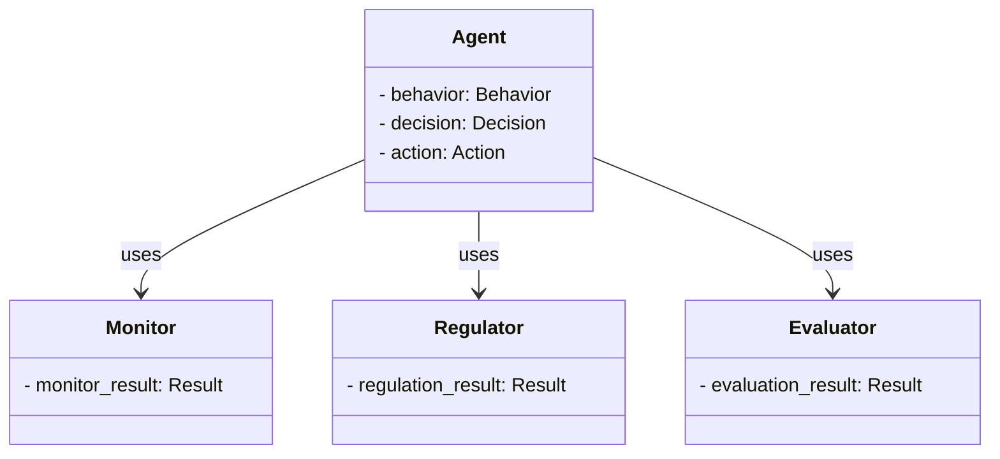
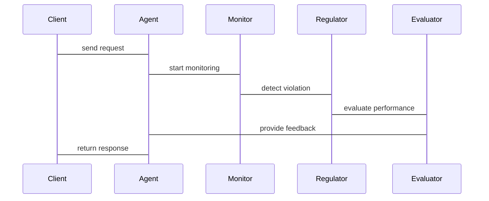

                 


# 元认知AI Agent：具备自我监控和调节能力

## 关键词：
元认知AI Agent，自我监控，智能调节，人工智能，AI Agent，元认知机制

## 摘要：
元认知AI Agent是一种结合了元认知理论与人工智能技术的新型智能体，具备自我监控和调节能力。本文将从元认知AI Agent的基本概念、核心原理、算法实现、系统设计、项目实战到未来展望等方面进行深入探讨，详细解析其技术实现和实际应用场景。

---

# 第一部分: 元认知AI Agent的背景与基础

## 第1章: 元认知AI Agent的背景与概念

### 1.1 元认知AI Agent的定义与背景
#### 1.1.1 元认知的基本概念
元认知（Metacognition）是指对自身认知过程的认知和调控能力，主要包括对认知过程的监控、调节和评价。元认知的核心在于“认知之上的认知”，能够帮助个体更高效地完成任务。

#### 1.1.2 元认知AI Agent的定义
元认知AI Agent是一种具备元认知能力的人工智能代理，能够对自身的认知过程进行监控、调节和优化，从而提高任务执行的效率和准确性。

#### 1.1.3 元认知AI Agent的发展背景
随着人工智能技术的快速发展，AI Agent（智能体）已经广泛应用于各个领域，但传统的AI Agent缺乏自我监控和调节能力，无法根据环境变化动态调整自身行为。元认知AI Agent的出现弥补了这一不足，成为人工智能领域的重要研究方向。

### 1.2 元认知AI Agent的核心问题
#### 1.2.1 元认知AI Agent的目标与任务
元认知AI Agent的目标是通过元认知机制实现对自身认知过程的监控和调节，从而优化任务执行效果。其核心任务包括：
1. 监控自身行为：实时跟踪AI Agent的决策过程。
2. 调节行为策略：根据监控结果动态调整行为策略。
3. 优化性能表现：通过反馈机制提升任务执行效率。

#### 1.2.2 元认知AI Agent的核心问题描述
元认知AI Agent的核心问题可以归结为以下几点：
- 如何实现对AI Agent认知过程的实时监控？
- 如何设计有效的调节机制以优化AI Agent的行为？
- 如何构建反馈机制以提升AI Agent的性能表现？

#### 1.2.3 元认知AI Agent的边界与外延
元认知AI Agent的边界在于其元认知能力的实现范围，外延则包括其在不同领域中的应用。元认知AI Agent不仅能够执行具体任务，还能通过元认知机制不断优化自身的执行策略。

### 1.3 元认知AI Agent的核心要素
#### 1.3.1 元认知机制的构成
元认知机制主要包括以下三个部分：
1. **监控模块**：负责对AI Agent的认知过程进行实时监控。
2. **调节模块**：根据监控结果动态调整AI Agent的行为策略。
3. **评价模块**：对AI Agent的执行效果进行评价和反馈。

#### 1.3.2 AI Agent的基本功能
AI Agent的基本功能包括：
1. **感知环境**：通过传感器或接口获取外部信息。
2. **决策与规划**：基于感知信息做出决策并制定执行计划。
3. **执行任务**：根据决策结果执行具体任务。
4. **反馈与学习**：根据执行结果进行反馈并优化自身行为。

#### 1.3.3 元认知与AI Agent的结合方式
元认知与AI Agent的结合方式主要体现在以下方面：
- 元认知机制对AI Agent的认知过程进行监控和调节。
- AI Agent通过元认知机制优化自身的决策策略。
- 元认知机制与AI Agent的执行模块协同工作，实现动态优化。

### 1.4 元认知AI Agent的潜在应用领域
#### 1.4.1 教育领域
在教育领域，元认知AI Agent可以用于个性化学习推荐、学习过程监控和学习效果评价。

#### 1.4.2 医疗领域
在医疗领域，元认知AI Agent可以用于辅助诊断、治疗方案优化和患者行为监控。

#### 1.4.3 金融领域
在金融领域，元认知AI Agent可以用于风险评估、投资决策优化和市场动态监控。

### 1.5 本章小结
本章从元认知AI Agent的定义、核心问题、边界与外延以及潜在应用领域等方面进行了详细阐述，为后续章节的深入探讨奠定了基础。

---

## 第2章: 元认知AI Agent的核心概念

### 2.1 元认知机制的原理
#### 2.1.1 元认知监控机制
元认知监控机制是元认知AI Agent的核心机制之一，负责对AI Agent的认知过程进行实时监控。其主要功能包括：
- 监控AI Agent的决策过程。
- 监控AI Agent的执行过程。
- 监控AI Agent的反馈过程。

#### 2.1.2 元认知调节机制
元认知调节机制是元认知AI Agent的另一个核心机制，负责根据监控结果动态调整AI Agent的行为策略。其主要功能包括：
- 动态调整决策策略。
- 动态优化执行策略。
- 动态更新行为参数。

#### 2.1.3 元认知评价机制
元认知评价机制是元认知AI Agent的第三个核心机制，负责对AI Agent的执行效果进行评价和反馈。其主要功能包括：
- 评价AI Agent的决策效果。
- 评价AI Agent的执行效果。
- 评价AI Agent的反馈效果。

### 2.2 AI Agent的基本原理
#### 2.2.1 AI Agent的定义与分类
AI Agent是一种能够感知环境、做出决策并执行任务的智能体。根据功能和应用场景的不同，AI Agent可以分为多种类型，包括：
- **简单反射型AI Agent**：基于简单的规则执行任务。
- **基于模型的AI Agent**：基于内部模型进行决策和规划。
- **基于学习的AI Agent**：通过学习优化自身行为。

#### 2.2.2 AI Agent的核心算法
AI Agent的核心算法包括：
- **基于规则的算法**：通过预定义规则进行决策。
- **基于模型的算法**：基于环境模型进行决策和规划。
- **基于学习的算法**：通过机器学习算法优化决策策略。

#### 2.2.3 AI Agent的执行流程
AI Agent的执行流程主要包括以下步骤：
1. **感知环境**：通过传感器或接口获取外部信息。
2. **决策与规划**：基于感知信息做出决策并制定执行计划。
3. **执行任务**：根据决策结果执行具体任务。
4. **反馈与学习**：根据执行结果进行反馈并优化自身行为。

### 2.3 元认知与AI Agent的结合原理
#### 2.3.1 元认知监控AI Agent的执行过程
元认知监控机制通过实时跟踪AI Agent的决策过程，确保其行为符合预期目标。

#### 2.3.2 元认知调节AI Agent的行为策略
元认知调节机制通过动态调整AI Agent的行为策略，优化其任务执行效果。

#### 2.3.3 元认知评价AI Agent的性能表现
元认知评价机制通过对AI Agent的执行效果进行评价和反馈，帮助其不断优化自身行为。

### 2.4 元认知AI Agent的核心属性特征对比
以下是对元认知AI Agent与传统AI Agent的核心属性特征对比：

| **属性**        | **元认知AI Agent**                          | **传统AI Agent**                              |
|-----------------|-------------------------------------------|--------------------------------------------|
| **自我监控能力** | 具备强大的自我监控能力                      | 缺乏自我监控能力                              |
| **行为调节能力** | 具备动态调节行为策略的能力                  | 行为策略固定或难以动态调整                    |
| **反馈机制**    | 具备高效的反馈机制                          | 反馈机制简单或缺乏                            |
| **适应性**      | 具备高度的环境适应性                        | 环境适应性有限                                |
| **决策优化**    | 具备动态优化决策能力                        | 决策优化能力有限                              |

### 2.5 元认知AI Agent的ER实体关系图
以下是元认知AI Agent的ER实体关系图：

```mermaid
er
actor(Agent) -[监控]-> monitor(Monitoring)
monitor -[调节]-> regulate(Regulation)
regulate -[评价]-> evaluate(Evaluation)
```

---

## 第3章: 元认知AI Agent的算法原理

### 3.1 元认知监控算法
#### 3.1.1 算法原理
元认知监控算法通过实时跟踪AI Agent的决策过程，识别潜在的问题并触发调节机制。

#### 3.1.2 算法流程
1. **初始化**：设定监控目标和监控规则。
2. **实时监控**：对AI Agent的决策过程进行实时跟踪。
3. **问题识别**：识别监控过程中发现的问题。
4. **触发调节**：根据问题严重程度触发调节机制。

#### 3.1.3 算法实现
以下是元认知监控算法的Python实现示例：

```python
class MetaCognitiveMonitor:
    def __init__(self):
        self.monitor_rules = []
    
    def add_monitor_rule(self, rule):
        self.monitor_rules.append(rule)
    
    def monitor(self, agent_action):
        for rule in self.monitor_rules:
            if rule.check_violation(agent_action):
                return rule.get_violation_info(agent_action)
        return None

# 示例规则
class MonitorRule:
    def __init__(self, condition, action):
        self.condition = condition
        self.action = action
    
    def check_violation(self, action):
        return self.condition(action)
    
    def get_violation_info(self, action):
        return f"Violation detected: {self.action(action)}"
```

### 3.2 元认知调节算法
#### 3.2.1 算法原理
元认知调节算法通过动态调整AI Agent的行为策略，优化其任务执行效果。

#### 3.2.2 算法流程
1. **初始化**：设定调节目标和调节规则。
2. **实时监控**：对AI Agent的决策过程进行实时跟踪。
3. **问题识别**：识别监控过程中发现的问题。
4. **动态调节**：根据问题类型和严重程度动态调整行为策略。

#### 3.2.3 算法实现
以下是元认知调节算法的Python实现示例：

```python
class MetaCognitiveRegulator:
    def __init__(self):
        self.regulation_rules = []
    
    def add_regulation_rule(self, rule):
        self.regulation_rules.append(rule)
    
    def regulate(self, violation_info):
        for rule in self.regulation_rules:
            if rule.match_violation(violation_info):
                return rule.get_regulation_action(violation_info)
        return None

# 示例规则
class RegulationRule:
    def __init__(self, condition, action):
        self.condition = condition
        self.action = action
    
    def match_violation(self, violation_info):
        return self.condition(violation_info)
    
    def get_regulation_action(self, violation_info):
        return f"Regulation action: {self.action(violation_info)}"
```

### 3.3 元认知评价算法
#### 3.3.1 算法原理
元认知评价算法通过对AI Agent的执行效果进行评价和反馈，帮助其不断优化自身行为。

#### 3.3.2 算法流程
1. **初始化**：设定评价目标和评价规则。
2. **执行任务**：AI Agent根据当前策略执行任务。
3. **评价结果**：对AI Agent的执行效果进行评价。
4. **反馈优化**：根据评价结果优化AI Agent的行为策略。

#### 3.3.3 算法实现
以下是元认知评价算法的Python实现示例：

```python
class MetaCognitiveEvaluator:
    def __init__(self):
        self.evaluation_rules = []
    
    def add_evaluation_rule(self, rule):
        self.evaluation_rules.append(rule)
    
    def evaluate(self, agent_performance):
        for rule in self.evaluation_rules:
            if rule.apply_rule(agent_performance):
                return rule.get_evaluation_result(agent_performance)
        return None

# 示例规则
class EvaluationRule:
    def __init__(self, condition, result):
        self.condition = condition
        self.result = result
    
    def apply_rule(self, performance):
        return self.condition(performance)
    
    def get_evaluation_result(self, performance):
        return f"Evaluation result: {self.result(performance)}"
```

---

## 第4章: 元认知AI Agent的系统分析与架构设计

### 4.1 系统分析
#### 4.1.1 问题场景介绍
本系统旨在设计一种具备自我监控和调节能力的元认知AI Agent，能够根据环境变化动态调整自身行为，提高任务执行效率。

#### 4.1.2 项目介绍
本项目将基于元认知理论和人工智能技术，设计并实现一种具备自我监控和调节能力的元认知AI Agent。

### 4.2 系统功能设计
#### 4.2.1 领域模型设计
以下是元认知AI Agent的领域模型类图：



### 4.3 系统架构设计
#### 4.3.1 系统架构图
以下是元认知AI Agent的系统架构图：


### 4.4 系统接口设计
#### 4.4.1 系统接口设计
1. **监控接口**：用于实现对AI Agent的实时监控。
2. **调节接口**：用于实现对AI Agent行为的动态调节。
3. **评价接口**：用于实现对AI Agent执行效果的评价和反馈。

#### 4.4.2 系统交互流程图
以下是元认知AI Agent的系统交互流程图：



---

## 第5章: 元认知AI Agent的项目实战

### 5.1 项目环境安装
#### 5.1.1 安装Python
安装Python 3.x及以上版本，确保环境支持Python开发。

#### 5.1.2 安装相关库
安装以下Python库：
- `numpy`
- `pandas`
- `scikit-learn`
- `matplotlib`

### 5.2 核心代码实现
#### 5.2.1 元认知监控模块
```python
class Monitor:
    def __init__(self):
        self.status = "active"
    
    def monitor_action(self, action):
        if self.status == "active":
            return f"Monitoring action: {action}"
        else:
            return "Monitoring is inactive"
```

#### 5.2.2 元认知调节模块
```python
class Regulator:
    def __init__(self):
        self.status = "active"
    
    def regulate_behavior(self, behavior):
        if self.status == "active":
            return f"Regulating behavior: {behavior}"
        else:
            return "Regulation is inactive"
```

#### 5.2.3 元认知评价模块
```python
class Evaluator:
    def __init__(self):
        self.status = "active"
    
    def evaluate_performance(self, performance):
        if self.status == "active":
            return f"Evaluating performance: {performance}"
        else:
            return "Evaluation is inactive"
```

#### 5.2.4 元认知AI Agent主程序
```python
class MetaCognitiveAgent:
    def __init__(self):
        self.monitor = Monitor()
        self.regulator = Regulator()
        self.evaluator = Evaluator()
    
    def execute_task(self, task):
        # 执行任务
        result = f"Executing task: {task}"
        print(result)
        
        # 调用监控模块
        monitor_result = self.monitor.monitor_action(task)
        print(monitor_result)
        
        # 调用调节模块
        regulate_result = self.regulator.regulate_behavior(task)
        print(regulate_result)
        
        # 调用评价模块
        evaluate_result = self.evaluator.evaluate_performance(task)
        print(evaluate_result)
    
    def run(self):
        while True:
            task = input("请输入任务：")
            self.execute_task(task)
```

### 5.3 代码解读与分析
#### 5.3.1 元认知监控模块
元认知监控模块负责对AI Agent的决策过程进行实时监控，确保其行为符合预期目标。

#### 5.3.2 元认知调节模块
元认知调节模块负责根据监控结果动态调整AI Agent的行为策略，优化其任务执行效果。

#### 5.3.3 元认知评价模块
元认知评价模块负责对AI Agent的执行效果进行评价和反馈，帮助其不断优化自身行为。

### 5.4 案例分析与详细讲解
以下是一个简单的案例分析：
1. **任务输入**：用户输入“搜索天气预报”。
2. **监控模块**：监控AI Agent的搜索过程，发现存在无效链接。
3. **调节模块**：动态调整搜索策略，优先选择权威来源。
4. **评价模块**：对搜索结果进行评价，确认优化效果。

### 5.5 项目小结
通过本章的项目实战，我们详细讲解了元认知AI Agent的核心代码实现及其在实际场景中的应用，帮助读者更好地理解和掌握其技术实现。

---

## 第6章: 元认知AI Agent的高级应用与未来发展

### 6.1 元认知AI Agent的高级应用
#### 6.1.1 元认知AI Agent在教育领域的应用
元认知AI Agent可以用于个性化学习推荐、学习过程监控和学习效果评价。

#### 6.1.2 元认知AI Agent在医疗领域的应用
元认知AI Agent可以用于辅助诊断、治疗方案优化和患者行为监控。

#### 6.1.3 元认知AI Agent在金融领域的应用
元认知AI Agent可以用于风险评估、投资决策优化和市场动态监控。

### 6.2 元认知AI Agent的未来发展
#### 6.2.1 元认知AI Agent的技术发展趋势
随着人工智能技术的不断发展，元认知AI Agent将更加智能化和自适应。

#### 6.2.2 元认知AI Agent的应用拓展
元认知AI Agent的应用场景将不断扩大，涵盖更多领域和更复杂的任务。

#### 6.2.3 元认知AI Agent的挑战与机遇
元认知AI Agent的发展面临诸多挑战，同时也带来了新的机遇。

---

## 第7章: 元认知AI Agent的最佳实践与注意事项

### 7.1 最佳实践 Tips
1. **持续学习**：元认知AI Agent需要不断学习和优化自身行为。
2. **动态调整**：根据环境变化动态调整行为策略。
3. **实时监控**：确保对AI Agent的认知过程进行实时监控。

### 7.2 注意事项
1. **数据隐私**：注意保护用户数据的隐私和安全。
2. **算法优化**：不断优化算法以提高任务执行效率。
3. **系统稳定性**：确保系统的稳定性和可靠性。

---

## 附录

### 附录 A: 元认知AI Agent的数学公式
以下是元认知AI Agent中常用的数学公式：

1. **监控概率公式**：
   $$ P(\text{monitor}(a)) = \frac{\text{count}(a)}{N} $$
   其中，$a$ 是行为，$\text{count}(a)$ 是该行为的出现次数，$N$ 是总行为数。

2. **调节因子公式**：
   $$ \alpha = \frac{\text{score}(a)}{\text{max\_score}} $$
   其中，$\alpha$ 是调节因子，$\text{score}(a)$ 是行为的得分，$\text{max\_score}$ 是最大得分。

3. **评价指标公式**：
   $$ \text{performance} = \sum_{i=1}^{n} w_i \cdot s_i $$
   其中，$w_i$ 是指标权重，$s_i$ 是指标得分。

### 附录 B: 元认知AI Agent的Python代码库
以下是元认知AI Agent的Python代码库：

```python
# 元认知AI Agent的核心代码库
class MetaCognitiveAgent:
    def __init__(self):
        self.monitor = Monitor()
        self.regulator = Regulator()
        self.evaluator = Evaluator()
    
    def execute_task(self, task):
        # 执行任务
        result = f"Executing task: {task}"
        print(result)
        
        # 调用监控模块
        monitor_result = self.monitor.monitor_action(task)
        print(monitor_result)
        
        # 调用调节模块
        regulate_result = self.regulator.regulate_behavior(task)
        print(regulate_result)
        
        # 调用评价模块
        evaluate_result = self.evaluator.evaluate_performance(task)
        print(evaluate_result)
    
    def run(self):
        while True:
            task = input("请输入任务：")
            self.execute_task(task)

# 示例运行
if __name__ == "__main__":
    agent = MetaCognitiveAgent()
    agent.run()
```

---

## 结语

元认知AI Agent作为一种具备自我监控和调节能力的智能体，将在未来的智能化系统中发挥重要作用。通过本文的详细讲解，我们希望能够为读者提供全面的技术指导，帮助他们在实际应用中更好地理解和掌握元认知AI Agent的核心技术和实现方法。

---

## 作者：AI天才研究院/AI Genius Institute & 禅与计算机程序设计艺术 /Zen And The Art of Computer Programming

