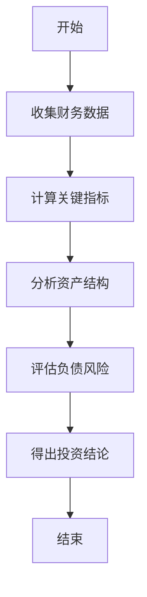

                 

# 克里斯托弗·布朗尼的隐蔽价值投资：发掘资产负债表的秘密

## 关键词
- 价值投资
- 资产负债表
- 克里斯托弗·布朗尼
- 财务分析
- 投资策略

## 摘要
克里斯托弗·布朗尼是一位以分析资产负债表著称的价值投资者，他通过深入分析公司的财务状况，发现那些被市场低估的投资机会。本文将探讨布朗尼的投资理念，详细介绍如何通过资产负债表的核心要素进行分析，提供数学模型和实际案例，帮助读者掌握这种投资方法。

---

## 第一部分: 价值投资与资产负债表分析基础

### 第1章: 价值投资的背景与重要性

#### 1.1 价值投资的基本概念
- 价值投资是一种以基本面分析为基础的投资策略，强调购买那些市场价格低于其内在价值的股票。
- 其核心理念是寻找市场先生的错误定价，通过长期持有优质资产实现收益。

#### 1.2 资产负债表的重要性
- 资产负债表是公司财务健康状况的晴雨表，反映了公司在某一特定时间点的资产、负债和所有者权益的状况。
- 通过分析资产负债表，投资者可以评估公司的偿债能力、资本结构和财务稳定性。

#### 1.3 克里斯托弗·布朗尼的投资理念
- 布朗尼强调资产负债表分析的重要性，认为公司的财务状况是判断其价值的关键。
- 他专注于寻找那些资产质量高、负债可控且所有者权益稳定的公司。

---

## 第2章: 资产负债表的核心要素分析

### 2.1 资产分析
- **流动资产**：现金、应收账款、存货等，反映了公司的短期偿债能力。
- **非流动资产**：长期投资、固定资产、无形资产等，反映了公司的长期发展潜力。
- **资产质量**：高质量的资产通常具有较强的变现能力和增值潜力。

### 2.2 负债分析
- **短期负债**：短期借款、应付账款等，反映了公司的短期债务压力。
- **长期负债**：长期借款、债券等，反映了公司的长期债务负担。
- **负债结构**：合理的负债结构可以降低财务风险，过高的负债可能导致公司破产风险增加。

### 2.3 所有者权益分析
- **所有者权益**：包括股本、资本公积、盈余公积等，反映了公司净资产的价值。
- **净资产收益率（ROE）**：衡量公司利用股东资产创造利润的能力，是评估公司盈利能力的重要指标。

---

## 第3章: 资产负债表分析的数学模型与公式

### 3.1 基本财务指标计算
- **市盈率（P/E）**：衡量股票价格是否合理，公式为：
  $$ P/E = \frac{Market\ Price}{Earnings\ Per\ Share} $$
- **市净率（P/B）**：衡量股票价格与账面价值的关系，公式为：
  $$ P/B = \frac{Market\ Price}{Book\ Value\ Per\ Share} $$
- **负债率**：衡量公司负债在总资产中的比例，公式为：
  $$ Debt\ Ratio = \frac{Total\ Liabilities}{Total\ Assets} $$

### 3.2 资产负债表分析的流程图

---

## 第二部分: 克里斯托弗·布朗尼的投资分析方法

### 第4章: 布朗尼的分析框架

#### 4.1 资产负债表分析的三步法
1. **第一步：分析资产结构**：评估公司资产的构成和质量。
2. **第二步：分析负债结构**：评估公司的债务风险。
3. **第三步：综合评估**：结合资产和负债分析，得出公司整体财务状况。

#### 4.2 布朗尼的资产质量分析
- 重点关注固定资产、无形资产和长期投资的质量和价值。
- 资产质量高的公司通常具有更强的市场竞争力和抗风险能力。

#### 4.3 布朗尼的负债管理策略
- 优先选择那些负债较低、偿债能力强的公司。
- 关注公司的现金流状况，确保公司有足够的资金偿还债务。

---

## 第5章: 实际案例分析

### 5.1 案例一：苹果公司
- **资产分析**：苹果的资产主要包括现金、应收账款和存货，资产质量高。
- **负债分析**：负债主要包括短期负债和长期负债，负债率较低。
- **结论**：苹果的资产负债表显示出强大的财务实力，具有较高的投资价值。

### 5.2 案例二：谷歌公司
- **资产分析**：谷歌的资产主要包括现金、应收账款和无形资产，资产质量较高。
- **负债分析**：负债主要包括短期负债和长期负债，负债率适中。
- **结论**：谷歌的资产负债表显示出健康的财务状况，具有较大的投资潜力。

---

## 第6章: 投资策略与风险管理

### 6.1 投资策略
- **价值投资**：寻找市场价格低于内在价值的公司。
- **长期投资**：坚持长期持有优质资产，避免短期市场波动的干扰。

### 6.2 风险管理
- **分散投资**：通过投资不同行业的公司，降低投资风险。
- **定期评估**：定期审视投资组合，及时调整投资策略。

---

## 第7章: 总结与展望

### 7.1 总结
- 克里斯托弗·布朗尼通过深入分析资产负债表，发现那些被市场低估的投资机会。
- 他的投资理念强调财务分析的重要性，帮助投资者做出更明智的投资决策。

### 7.2 展望
- 随着市场的变化，资产负债表分析的方法和工具也需要不断更新和完善。
- 未来，投资者需要更加注重财务数据的深度分析，以应对日益复杂的市场环境。

---

## 作者：AI天才研究院/AI Genius Institute & 禅与计算机程序设计艺术 /Zen And The Art of Computer Programming

---

通过以上思考过程，我可以系统地撰写这篇文章，确保每个部分都详细且有深度，同时保持逻辑清晰和语言简洁。

