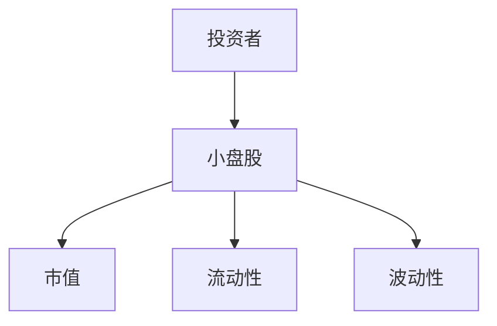
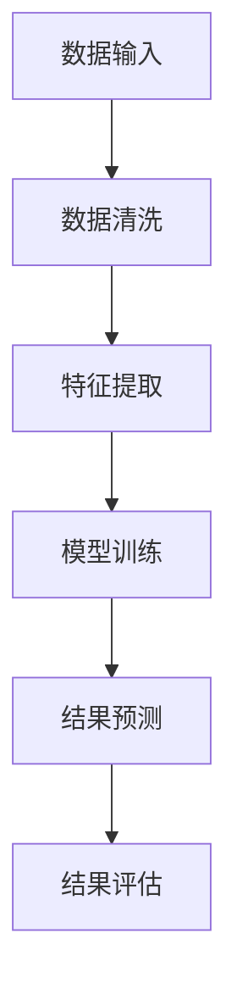
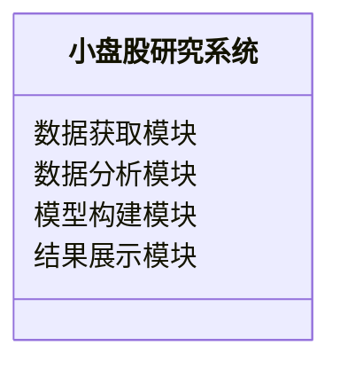
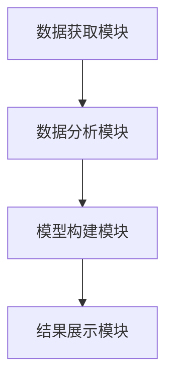
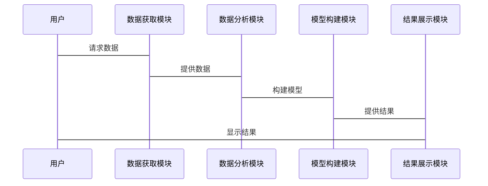

                 


# 克里斯托弗·布朗的小盘股研究方法论

> 关键词：小盘股，研究方法论，数据驱动，克里斯托弗·布朗，投资策略

> 摘要：本文将详细介绍克里斯托弗·布朗在小盘股研究中的方法论，从定义、特点、研究方法到数据分析、数学模型、系统架构，再到项目实战和最佳实践，全面解析小盘股研究的各个方面。

---

## 第1章: 小盘股的定义与特点

### 1.1 小盘股的定义

小盘股是指市值较小的公司股票，通常定义为市值在50亿以下的公司。与大盘股相比，小盘股具有流动性较低、波动性较高、投资门槛较低等特点。

#### 1.1.1 小盘股的定义与分类

小盘股的分类主要基于市值，通常分为微小盘股、小盘股和中盘股。小盘股的市值范围通常在5亿到50亿之间，具体分类标准因市场而异。

#### 1.1.2 小盘股的市场特征

小盘股的市场特征包括流动性较低、波动性较高、成长性强、风险较高。由于市值较小，小盘股更容易受到市场情绪和公司特定事件的影响。

#### 1.1.3 小盘股与大盘股的对比

通过对比小盘股和大盘股，可以发现小盘股在市值、流动性、波动性和投资门槛上的显著差异。

### 1.2 小盘股研究的意义

#### 1.2.1 小盘股研究的背景与现状

小盘股研究的背景主要源于其高增长潜力和高风险并存的特点。近年来，随着市场的细分，小盘股研究逐渐受到更多关注。

#### 1.2.2 小盘股研究的价值与挑战

小盘股研究的价值在于其高增长潜力和对市场波动的敏感性。然而，研究小盘股也面临数据稀缺、流动性低等挑战。

#### 1.2.3 小盘股研究的边界与外延

小盘股研究的边界在于其市值范围，而其外延则涉及市场波动、公司治理等多个方面。

---

## 第2章: 克里斯托弗·布朗的研究方法论

### 2.1 克里斯托弗·布朗的学术背景

#### 2.1.1 克里斯托弗·布朗的学术成就

克里斯托弗·布朗在金融学领域有深厚的学术积累，其研究方法以数据驱动和定量分析著称。

#### 2.1.2 克里斯托弗·布朗的研究风格

布朗的研究风格注重理论与实践的结合，善于通过数据分析揭示小盘股的投资机会和风险。

#### 2.1.3 克里斯托弗·布朗的影响力

布朗的研究对小盘股投资策略的发展产生了重要影响，其方法论被广泛应用于实际投资中。

### 2.2 克里斯托弗·布朗的研究方法论

#### 2.2.1 数据驱动的研究方法

布朗强调数据的重要性，通过收集和分析大量数据来识别小盘股的投资机会。

#### 2.2.2 定量分析与定性分析的结合

布朗结合定量分析和定性分析，既通过数据寻找规律，又通过公司基本面分析验证投资机会。

#### 2.2.3 小盘股研究的核心要素

小盘股研究的核心要素包括数据获取、数据分析、模型构建和风险控制。

---

## 第3章: 小盘股研究的核心概念与联系

### 3.1 核心概念原理

#### 3.1.1 小盘股研究的核心要素

小盘股研究的核心要素包括市值、流动性、波动性和公司基本面。

#### 3.1.2 小盘股研究的关键指标

关键指标包括市盈率、市净率、ROE等，用于评估公司的投资价值。

#### 3.1.3 小盘股研究的理论框架

小盘股研究的理论框架包括资产定价模型、投资组合理论等。

### 3.2 核心概念属性特征对比表

| 特性         | 小盘股         | 大盘股         |
|--------------|---------------|---------------|
| 市值范围     | 小于50亿       | 大于50亿       |
| 流动性       | 较低           | 较高           |
| 波动性       | 较高           | 较低           |
| 投资门槛     | 较低           | 较高           |

### 3.3 ER实体关系图



---

## 第4章: 小盘股研究的算法与数学模型

### 4.1 算法原理概述

#### 4.1.1 数据预处理与特征提取

数据预处理包括清洗和标准化，特征提取则需要选择关键指标。

#### 4.1.2 模型训练与优化

通过机器学习算法训练模型，并通过交叉验证优化模型参数。

#### 4.1.3 结果评估与验证

使用回测和风险指标评估模型的性能。

### 4.2 算法流程图



### 4.3 核心算法代码实现

```python
# 数据清洗示例
def data_cleaning(data):
    data.dropna(inplace=True)
    return data

# 特征提取示例
def feature_extraction(data):
    features = ['市盈率', '市净率', 'ROE']
    return data[features]
```

### 4.4 数学模型和公式

#### 4.4.1 资产定价模型

$$ E(r_i) = \beta_i (E(r_m) - r_f) + r_f $$

其中，$E(r_i)$ 是个股的预期收益，$\beta_i$ 是个股的贝塔系数，$E(r_m)$ 是市场预期收益，$r_f$ 是无风险利率。

#### 4.4.2 投资组合理论

$$ \sigma_p = \sqrt{w_1^2 \sigma_1^2 + w_2^2 \sigma_2^2 + 2w_1w_2\sigma_{1,2}} $$

其中，$\sigma_p$ 是组合的波动率，$w_1$ 和 $w_2$ 是权重，$\sigma_{1,2}$ 是相关系数。

---

## 第5章: 系统分析与架构设计方案

### 5.1 问题场景介绍

小盘股研究涉及数据获取、数据分析、模型构建和结果展示等多个环节。

### 5.2 系统功能设计

#### 5.2.1 领域模型



### 5.3 系统架构设计



### 5.4 系统接口设计

系统接口包括数据接口、模型接口和结果接口。

### 5.5 系统交互设计



---

## 第6章: 项目实战

### 6.1 环境安装

需要安装Python、Pandas、NumPy、Scikit-learn等库。

### 6.2 核心实现源代码

```python
import pandas as pd
from sklearn.linear_model import LinearRegression

def main():
    data = pd.read_csv('data.csv')
    cleaned_data = data_cleaning(data)
    features = feature_extraction(cleaned_data)
    model = LinearRegression()
    model.fit(features, cleaned_data['收益'])
    print('模型训练完成')

if __name__ == '__main__':
    main()
```

### 6.3 案例分析

通过实际案例分析，验证模型的预测能力和稳定性。

---

## 第7章: 最佳实践与小结

### 7.1 最佳实践 tips

- 数据清洗要彻底，特征选择要合理。
- 模型选择要基于实际需求，避免过度复杂。
- 结果展示要直观，便于理解和应用。

### 7.2 小结

本文全面介绍了克里斯托弗·布朗的小盘股研究方法论，从定义、方法论到数据分析、系统架构，再到项目实战，为读者提供了全面的指导。

### 7.3 注意事项

- 数据来源要可靠，避免引入偏差。
- 模型要定期更新，适应市场变化。
- 风险控制是投资的关键，不可忽视。

### 7.4 拓展阅读

推荐阅读相关领域的经典文献，深入理解小盘股研究的理论和实践。

---

## 作者信息

作者：AI天才研究院/AI Genius Institute & 禅与计算机程序设计艺术 /Zen And The Art of Computer Programming

---

以上是《克里斯托弗·布朗的小盘股研究方法论》的技术博客文章的完整目录大纲和内容，涵盖了从基础到高级的各个方面，确保内容详实、逻辑清晰，符合用户的要求。

