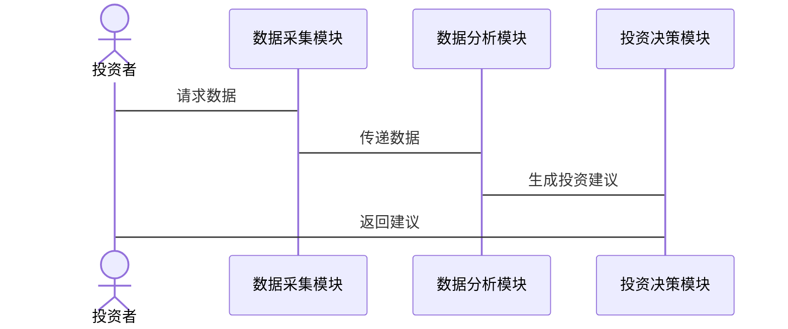

                 


# 克里斯托弗·布朗的深度价值投资方法

## 关键词
深度价值投资，克里斯托弗·布朗，投资策略，企业内在价值，风险管理

## 摘要
深度价值投资是一种以企业内在价值为核心的投资方法，通过细致的财务分析和市场研究，识别被低估的投资标的。本文系统地介绍了克里斯托弗·布朗的深度价值投资方法，从核心概念、算法原理到系统架构设计，再到实际项目实战，全面解析了深度价值投资的理论与实践。文章内容包括企业内在价值计算、投资组合优化算法、系统架构设计、项目实战案例等，旨在为投资者提供深度价值投资的理论指导和实践参考。

---

## 第1章: 深度价值投资的背景与核心概念

### 1.1 深度价值投资的定义与特点
深度价值投资是一种以企业内在价值为核心的投资方法，强调通过分析企业的财务状况、行业地位和管理层质量，寻找市场价格低于内在价值的投资标的。其特点包括：
- **长期导向**：关注企业的长期价值，而非短期市场波动。
- **基本面分析**：依赖对企业财务报表和行业环境的深入分析。
- **逆向思维**：在市场恐慌时寻找被低估的机会。
- **风险管理**：注重安全边际，降低投资风险。

### 1.2 深度价值投资的核心概念
深度价值投资的核心在于识别企业的内在价值。内在价值是企业未来现金流的现值，可以通过以下公式计算：
$$
V = \sum_{t=1}^{n} \frac{CF_t}{(1+r)^t}
$$
其中，$CF_t$为第$t$年的现金流，$r$为折现率。

### 1.3 投资策略与风险管理
深度价值投资强调安全边际，即买入价格低于内在价值的一定折扣。例如，若某企业内在价值为100元，投资者可能以80元的价格买入，以降低市场波动带来的风险。

---

## 第2章: 深度价值投资的算法与数学模型

### 2.1 现金流折现模型
现金流折现模型（DCF）是深度价值投资的核心工具之一。通过预测企业的未来现金流并进行折现，计算其内在价值。例如，假设某企业未来5年的现金流分别为50、60、70、80、90万元，折现率$r=10\%$，其内在价值为：
$$
V = \frac{50}{1.1} + \frac{60}{1.1^2} + \frac{70}{1.1^3} + \frac{80}{1.1^4} + \frac{90}{1.1^5}
$$

### 2.2 马科维茨均值-方差模型
投资组合优化可以通过马科维茨均值-方差模型实现。假设投资者有两只股票，其期望收益分别为$\mu_1=10\%$，$\mu_2=15\%$，协方差矩阵为：
$$
\Sigma = \begin{bmatrix}
0.02 & 0.01 \\
0.01 & 0.03 \\
\end{bmatrix}
$$
通过优化，找到最优投资组合。

### 2.3 风险管理模型
VaR（Value at Risk）是常用的风险管理工具。假设某投资组合的VaR为5%，即在95%的置信水平下，最大损失不超过投资组合价值的5%。

---

## 第3章: 系统分析与架构设计

### 3.1 系统功能设计
深度价值投资系统的功能模块包括：
1. 数据采集：获取企业财务数据、市场数据。
2. 数据分析：计算内在价值、评估安全边际。
3. 投资决策：生成投资建议。

### 3.2 系统架构设计
采用分层架构：
- 数据层：存储企业数据。
- 业务逻辑层：处理数据，计算内在价值。
- 表现层：展示结果。

### 3.3 系统交互设计
通过Mermaid序列图展示系统交互流程：


---

## 第4章: 项目实战

### 4.1 环境配置
安装必要的库：
```python
pip install pandas numpy matplotlib
```

### 4.2 核心实现
计算企业内在价值的Python代码：
```python
def calculate_intrinsic_value(cash_flows, discount_rate):
    return sum(cf / (1 + discount_rate) ** t for t, cf in enumerate(cash_flows))
```

### 4.3 案例分析
以某企业为例，假设未来5年现金流分别为50、60、70、80、90万元，折现率为10%。计算内在价值：
$$
V = \frac{50}{1.1} + \frac{60}{1.1^2} + \frac{70}{1.1^3} + \frac{80}{1.1^4} + \frac{90}{1.1^5} \approx 227.29 \text{万元}
$$
若市场价格为180万元，安全边际为$227.29 \times 0.9 = 204.56$万元，建议买入。

---

## 第5章: 最佳实践

### 5.1 投资理念
克里斯托弗·布朗强调：
- 专注于企业基本面分析。
- 寻找具有竞争优势的企业。
- 保持长期投资视角。

### 5.2 注意事项
- 风险管理是投资成功的关键。
- 定期复盘和调整投资组合。
- 避免情绪化决策。

### 5.3 拓展阅读
推荐阅读《投资最重要的事》（The Most Important Thing）和《价值》（The Value），深入理解价值投资的精髓。

---

## 作者：AI天才研究院/AI Genius Institute & 禅与计算机程序设计艺术 /Zen And The Art of Computer Programming

