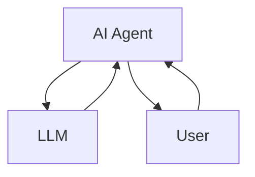
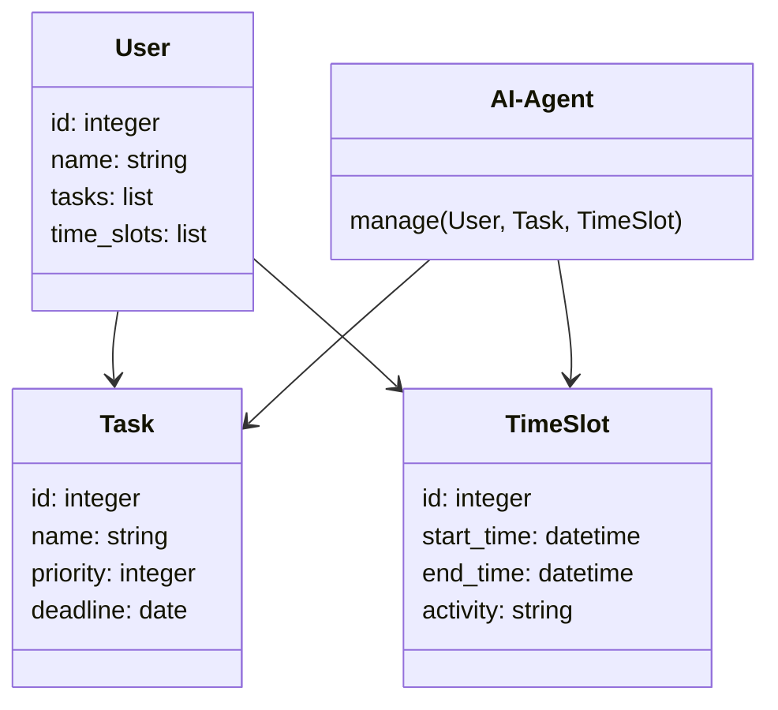
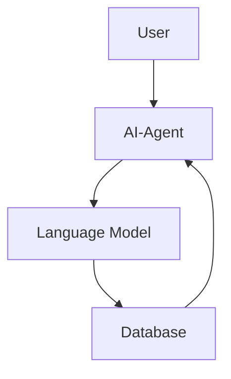
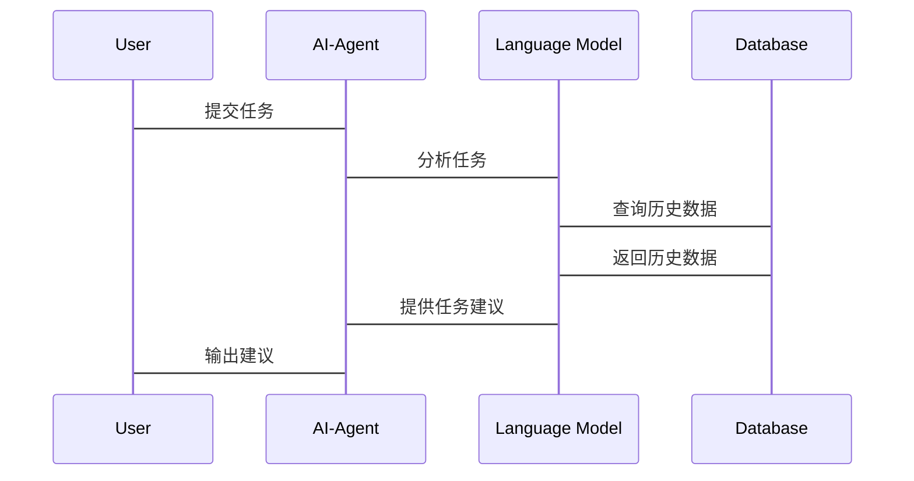

                 


# 全方位生活助手AI Agent：LLM驱动的个人管理系统

## 关键词：AI Agent, LLM, 个人管理系统, 生活助手, 人工智能, 任务管理

## 摘要：本文深入探讨了AI Agent与LLM驱动的个人管理系统的结合，分析了其在任务管理、时间管理、信息管理等多方面的应用，揭示了LLM在提升个人效率和生活质量中的巨大潜力。

---

# 第一部分: 全方位生活助手AI Agent概述

## 第1章: AI Agent与LLM驱动的个人管理概述

### 1.1 AI Agent的基本概念
#### 1.1.1 AI Agent的定义与特点
AI Agent（人工智能代理）是一种能够感知环境并采取行动以实现目标的智能实体。其特点包括：
- **自主性**：能够在没有外部干预的情况下运行。
- **反应性**：能够实时感知环境并做出响应。
- **目标导向**：以实现特定目标为导向。

#### 1.1.2 AI Agent的核心功能与应用场景
AI Agent的核心功能包括：
- **任务管理**：帮助用户分解和优先级排序任务。
- **时间管理**：优化时间分配，减少无效时间。
- **信息管理**：整合和分析信息，提供决策支持。

应用场景包括：
- 个人时间管理
- 工作任务优化
- 信息筛选与整合

#### 1.1.3 LLM在AI Agent中的作用
LLM（Large Language Model，大语言模型）通过自然语言处理技术，能够理解和生成人类语言，为AI Agent提供强大的语义理解和生成能力，使其能够更自然地与用户交互，并提供更智能的决策支持。

---

## 第2章: LLM驱动的个人管理系统的背景

### 2.1 当前个人管理工具的局限性
传统个人管理工具（如日历、任务列表）存在以下问题：
- **功能单一**：难以整合多方面的需求。
- **缺乏智能性**：无法主动提供决策支持。
- **交互复杂**：用户体验不够友好。

### 2.2 LLM如何解决传统个人管理工具的痛点
LLM通过自然语言处理能力，使AI Agent能够：
- **理解用户意图**：通过自然语言解析用户的请求。
- **生成个性化建议**：基于用户的偏好和习惯，提供定制化的建议。
- **持续学习**：通过与用户的交互不断优化自身的决策能力。

### 2.3 全方位生活助手AI Agent的目标与价值
AI Agent的目标是成为用户的全能助手，帮助用户高效管理时间、任务和信息，提升生活质量。其价值体现在：
- **提升效率**：通过智能化的管理，减少用户的时间浪费。
- **增强决策能力**：基于数据和分析，提供更明智的决策支持。
- **提升用户体验**：通过自然语言交互，提供更便捷的服务。

---

## 第3章: AI Agent的核心概念与联系

### 3.1 AI Agent的核心概念
AI Agent的核心概念包括：
- **实体关系**：AI Agent与用户、任务、时间的关系。
- **功能模块**：任务管理、时间管理、信息管理、决策支持。

### 3.2 AI Agent与LLM的关系
AI Agent通过集成LLM，实现了自然语言交互和智能决策。以下是AI Agent与LLM的关系图：



---

## 第4章: LLM驱动的个人管理系统的算法原理

### 4.1 LLM的算法流程
LLM的算法流程包括：
1. **输入处理**：接收用户的自然语言输入。
2. **语义解析**：通过语言模型理解用户的意图。
3. **任务分解**：将用户的需求分解为具体任务。
4. **优先级排序**：基于任务的重要性和紧急性进行排序。
5. **输出生成**：生成自然语言的建议或行动计划。

### 4.2 LLM的数学模型
#### 4.2.1 概率分布与损失函数
$$ P(y|x) = \frac{P(x,y)}{P(x)} $$
$$ \text{损失函数} = -\sum_{i=1}^{n} \log P(y_i|x) $$

#### 4.2.2 注意力机制
$$ \text{注意力权重} = \frac{\exp(\text{score})}{\sum \exp(\text{score})} $$

---

## 第5章: 系统分析与架构设计

### 5.1 问题场景介绍
AI Agent需要解决的任务管理、时间管理和信息管理等问题。

### 5.2 项目介绍
本项目旨在开发一个基于LLM的个人管理系统，帮助用户高效管理时间、任务和信息。

### 5.3 系统功能设计
以下是系统的领域模型类图：



### 5.4 系统架构设计
以下是系统的架构图：



### 5.5 系统接口设计
系统接口包括：
- **输入接口**：接收用户的自然语言输入。
- **输出接口**：生成自然语言的建议或行动计划。

### 5.6 系统交互流程图
以下是系统的交互流程图：



---

## 第6章: 项目实战

### 6.1 环境安装
需要安装以下工具：
- Python 3.8+
- LLM模型（如GPT-3）
- 依赖库（如transformers、numpy）

### 6.2 核心代码实现
以下是核心代码实现：

```python
import transformers
import numpy as np

class AI-Agent:
    def __init__(self):
        self.model = transformers.AutoModelForCausalLM.from_pretrained("gpt2")
        self.tokenizer = transformers.AutoTokenizer.from_pretrained("gpt2")

    def process_input(self, input_str):
        inputs = self.tokenizer.encode(input_str, return_tensors="np")
        outputs = self.model.generate(inputs, max_length=50)
        return self.tokenizer.decode(outputs[0])

    def manage_task(self, task_description):
        inputs = f"Please help me manage this task: {task_description}"
        return self.process_input(inputs)

# 示例用法
agent = AI-Agent()
result = agent.manage_task("完成项目报告")
print(result)
```

### 6.3 代码解读与分析
- **AI-Agent类**：初始化加载LLM模型和分词器。
- **process_input方法**：处理用户的输入，生成响应。
- **manage_task方法**：管理具体任务，调用process_input方法生成建议。

### 6.4 实际案例分析
假设用户输入“我需要完成项目报告”，AI-Agent会分析任务，提供任务分解和优先级排序的建议。

---

## 第7章: 最佳实践与注意事项

### 7.1 最佳实践
- **定期更新模型**：保持模型的最新性。
- **保护用户隐私**：确保用户数据的安全性。
- **提供反馈机制**：用户可以对AI-Agent的建议进行反馈，以优化其性能。

### 7.2 小结
通过本文的介绍，我们可以看到AI Agent在个人管理中的巨大潜力。通过与LLM的结合，AI Agent能够为用户提供更智能、更高效的管理工具。

### 7.3 注意事项
- **数据隐私**：用户数据的保护至关重要。
- **模型性能**：需要确保模型的准确性和响应速度。
- **用户体验**：界面设计和交互流程需要简洁易用。

### 7.4 拓展阅读
- 《The Algorithm Design Manual》
- 《Deep Learning》

---

# 作者：AI天才研究院/AI Genius Institute & 禅与计算机程序设计艺术 /Zen And The Art of Computer Programming

