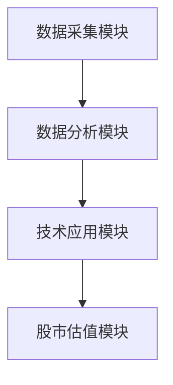
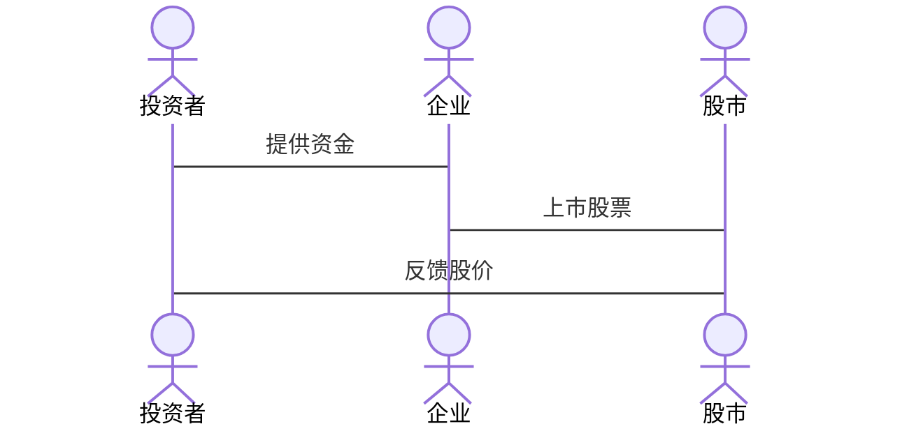

                 


# 全球股市估值与可持续时尚3D打印技术的关联

> 关键词：全球股市估值、可持续时尚、3D打印技术、技术创新、企业价值、投资分析、技术应用

> 摘要：本文探讨了全球股市估值与可持续时尚3D打印技术的关联，分析了3D打印技术如何通过改变生产方式和成本结构影响企业的可持续时尚能力，进而影响其股市估值。文章从背景介绍、核心概念、关联分析、数学模型、系统架构和项目实战等方面进行了详细阐述，并提供了丰富的案例分析和代码实现。

---

# 第一部分: 全球股市估值与可持续时尚的背景与关联

## 第1章: 全球股市估值与可持续时尚的背景概述

### 1.1 全球股市估值的基本概念

#### 1.1.1 股市估值的定义与方法
股市估值是通过分析企业的财务数据和市场环境，评估其股票的合理价格。常用的方法包括市盈率（P/E）、市净率（P/B）、股息率等。

#### 1.1.2 股市估值的核心指标
- 市盈率（P/E）= 股票价格 / 每股净利润
- 市净率（P/B）= 股票价格 / 每股净资产
- 股息率 = 每股股息 / 股票价格

#### 1.1.3 全球股市的整体趋势
全球股市受经济周期、政策环境和企业业绩等多种因素影响，呈现出波动性增长趋势。近年来，可持续发展理念的兴起对股市估值产生了重要影响。

### 1.2 可持续时尚的定义与发展

#### 1.2.1 可持续时尚的定义
可持续时尚是指在服装和纺织行业中，从设计、生产、消费到废弃的全生命周期中，减少对环境和资源的消耗，同时关注社会公平和伦理的时尚模式。

#### 1.2.2 可持续时尚的发展历程
随着环保意识的增强，可持续时尚从边缘概念逐渐成为行业主流。消费者对环保产品的需求增加，推动了企业采用可持续生产方式。

#### 1.2.3 可持续时尚的市场现状
当前，全球可持续时尚市场规模持续增长，消费者对环保品牌的偏好日益增强。然而，传统生产模式的高成本和低效率仍是主要挑战。

### 1.3 3D打印技术的基本原理与应用

#### 1.3.1 3D打印技术的定义
3D打印技术是一种基于数字模型，通过逐层叠加材料来构建三维物体的技术。

#### 1.3.2 3D打印技术的核心原理
3D打印的核心原理是将数字模型分解为薄层，逐层打印并粘合这些层，形成最终的三维物体。

#### 1.3.3 3D打印技术在制造业中的应用
- 快速原型设计
- 小批量定制生产
- 零件修复与再利用

### 1.4 本章小结
本章介绍了全球股市估值、可持续时尚和3D打印技术的基本概念和发展现状，为后续分析奠定了基础。

---

## 第2章: 全球股市估值与可持续时尚的关联性分析

### 2.1 可持续时尚对股市估值的影响

#### 2.1.1 可持续时尚企业的市场表现
可持续时尚企业因环保理念和高效生产模式，通常表现出较高的市场溢价。

#### 2.1.2 可持续时尚对投资者决策的影响
投资者越来越关注企业的社会责任和环保表现，可持续时尚企业更容易获得投资者青睐。

#### 2.1.3 可持续时尚企业的估值差异
与传统企业相比，可持续时尚企业在市盈率和市净率等估值指标上通常表现更优。

### 2.2 3D打印技术对可持续时尚的推动作用

#### 2.2.1 3D打印技术在可持续时尚中的应用
- 环保材料的使用
- 小批量定制生产
- 减少生产浪费

#### 2.2.2 3D打印技术对生产效率的提升
通过数字化设计和自动化生产，3D打印技术显著提高了生产效率。

#### 2.2.3 3D打印技术对成本的优化
3D打印技术减少了传统制造中的材料浪费，降低了生产成本。

### 2.3 3D打印技术对全球股市估值的间接影响

#### 2.3.1 技术创新对企业的价值提升
3D打印技术的应用提升了企业的生产效率和产品创新能力，进而提高企业估值。

#### 2.3.2 技术创新对行业竞争力的影响
采用3D打印技术的企业在市场竞争中更具优势，推动行业整体估值上升。

#### 2.3.3 技术创新对股市整体走势的推动
技术创新推动了产业升级，间接影响了股市的整体表现。

### 2.4 本章小结
本章分析了可持续时尚和3D打印技术对股市估值的直接影响和间接影响，强调了技术创新在提升企业价值中的作用。

---

## 第3章: 可持续时尚与3D打印技术的核心概念与联系

### 3.1 可持续时尚的核心概念

#### 3.1.1 可持续时尚的生命周期模型
- 设计阶段：采用环保材料和设计方法
- 生产阶段：减少资源消耗和环境污染
- 消费阶段：延长产品生命周期
- 废弃阶段：实现材料的循环利用

#### 3.1.2 可持续时尚的核心要素
- 环境友好
- 社会责任
- 经济效益

### 3.2 3D打印技术的核心原理

#### 3.2.1 3D打印的材料选择
- 生物基材料
- 再生材料
- 环氧树脂

#### 3.2.2 3D打印的生产流程
- 数字建模
- 打印准备
- 逐层打印
- 后处理

#### 3.2.3 3D打印的优势
- 高度定制化
- 减少库存
- 提高生产效率

### 3.3 可持续时尚与3D打印技术的联系

#### 3.3.1 可持续时尚推动3D打印技术的应用
- 环保理念促使企业采用新技术
- 消费者需求推动技术普及

#### 3.3.2 3D打印技术助力可持续时尚
- 降低生产成本
- 减少材料浪费
- 实现个性化定制

#### 3.3.3 两者共同目标
- 提高资源利用效率
- 减少环境影响
- 提升企业竞争力

### 3.4 本章小结
本章深入探讨了可持续时尚和3D打印技术的核心概念，强调了两者在推动可持续发展方面的协同作用。

---

## 第4章: 可持续时尚与3D打印技术的数学模型与关联分析

### 4.1 可持续时尚的估值模型

#### 4.1.1 模型构建
$$ V = P \times (1 + r)^{-n} $$
其中，$V$为股票价值，$P$为每年现金流，$r$为贴现率，$n$为时间跨度。

#### 4.1.2 模型假设
- 环境影响可量化为额外成本或收益
- 可持续时尚企业具有更高的品牌溢价

#### 4.1.3 案例分析
以某知名服装企业为例，计算其可持续时尚实践对估值的影响。

### 4.2 3D打印技术的经济影响模型

#### 4.2.1 模型构建
$$ C = a \times t + b \times d $$
其中，$C$为总成本，$a$为单位时间成本，$t$为时间，$b$为单位材料成本，$d$为材料用量。

#### 4.2.2 模型假设
- 3D打印技术可减少材料浪费
- 技术应用可提高生产效率

#### 4.2.3 案例分析
分析某企业采用3D打印技术后的成本下降情况。

### 4.3 可持续时尚与3D打印技术的关联模型

#### 4.3.1 综合模型
$$ V = \alpha \times S + \beta \times T $$
其中，$V$为股票价值，$S$为可持续时尚评分，$T$为3D打印技术应用程度。

#### 4.3.2 模型验证
通过实证分析验证模型的有效性。

### 4.4 本章小结
本章构建了可持续时尚与3D打印技术的数学模型，量化了两者对股市估值的影响。

---

## 第5章: 可持续时尚与3D打印技术的系统架构与项目实战

### 5.1 系统架构设计

#### 5.1.1 系统功能模块
- 数据采集模块：收集企业数据
- 数据分析模块：评估可持续性
- 技术应用模块：实施3D打印技术

#### 5.1.2 系统架构图


#### 5.1.3 系统交互流程


### 5.2 项目实战

#### 5.2.1 环境配置
- 操作系统：Windows 10
- 开发工具：Python 3.9，Jupyter Notebook
- 数据来源：公开企业数据和股市数据

#### 5.2.2 核心实现代码
```python
import pandas as pd
import numpy as np

# 示例数据
data = {
    '企业名称': ['A', 'B', 'C'],
    '可持续评分': [0.8, 0.6, 0.7],
    '3D打印应用': [0.5, 0.3, 0.4],
    '股价': [100, 80, 90]
}

df = pd.DataFrame(data)

# 计算综合评分
alpha = 0.4
beta = 0.6
df['综合评分'] = alpha * df['可持续评分'] + beta * df['3D打印应用']

# 可视化
import matplotlib.pyplot as plt
plt.scatter(df['综合评分'], df['股价'])
plt.xlabel('综合评分')
plt.ylabel('股价')
plt.title('可持续评分与股价的关系')
plt.show()
```

#### 5.2.3 实际案例分析
以某服装企业为例，分析其采用3D打印技术后的股价变化。

### 5.3 本章小结
本章通过系统架构和项目实战，展示了如何将可持续时尚与3D打印技术应用于实际投资分析。

---

## 第6章: 结论与展望

### 6.1 结论
本文深入分析了全球股市估值与可持续时尚3D打印技术的关联，得出以下结论：
1. 可持续时尚提升了企业的社会责任形象，增强了投资者信心。
2. 3D打印技术降低了生产成本，提高了企业的竞争力。
3. 两者共同推动了企业的估值提升，对股市整体走势产生了积极影响。

### 6.2 展望
未来，随着技术进步和环保意识的增强，可持续时尚与3D打印技术的结合将更加紧密，股市估值的关联性将进一步增强。

---

# 作者：AI天才研究院/AI Genius Institute & 禅与计算机程序设计艺术 /Zen And The Art of Computer Programming

