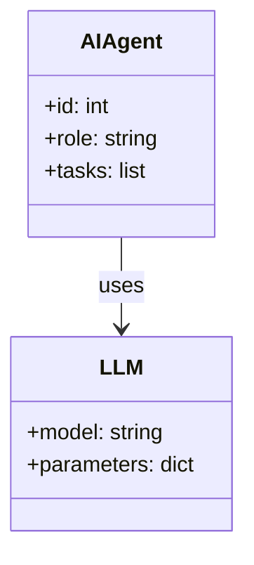
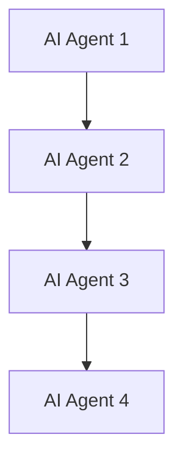
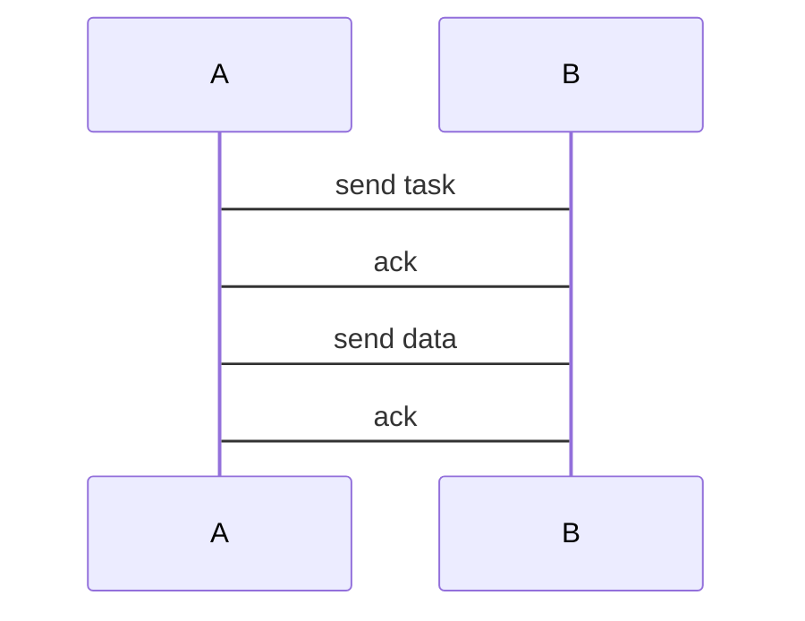

                 


# 分布式协作AI Agent：多LLM系统的群体智能

> 关键词：分布式协作AI Agent，多LLM系统，群体智能，分布式系统，人工智能，大语言模型

> 摘要：本文探讨了分布式协作AI Agent在多LLM系统中的应用，重点分析了群体智能在其中的作用。通过详细的技术背景分析、核心概念阐述、算法原理讲解、系统架构设计以及项目实战，本文为读者提供了一个全面了解分布式协作AI Agent的视角。文章最后总结了最佳实践和未来发展方向。

---

## 第一章: 分布式协作AI Agent的基本概念

### 1.1 分布式协作AI Agent的定义与特点

#### 1.1.1 分布式协作AI Agent的定义
分布式协作AI Agent是指多个AI Agent在分布式环境中通过协作完成特定任务的智能系统。与传统的集中式AI系统不同，分布式协作AI Agent强调各个节点之间的协作与通信，每个节点都具有一定的智能性和自主性。

#### 1.1.2 分布式协作AI Agent的核心特点
- **分布式计算**：AI Agent分布在不同的计算节点上，通过网络进行通信。
- **自主性**：每个AI Agent能够独立决策和行动。
- **协作性**：通过通信和协调完成复杂的任务。
- **容错性**：单个节点的故障不会导致整个系统崩溃。

#### 1.1.3 分布式协作AI Agent与传统AI的区别
- **计算模式**：传统AI通常集中在一个节点上，而分布式协作AI Agent分布在多个节点。
- **协作性**：传统AI强调单点解决问题，而分布式协作AI Agent强调多点协作。
- **扩展性**：分布式协作AI Agent可以轻松扩展，而传统AI扩展性较差。

### 1.2 多LLM系统的概念与优势

#### 1.2.1 多LLM系统的定义
多LLM系统是指多个大语言模型（Large Language Models，LLMs）协同工作的系统。每个LLM负责不同的任务或部分，通过协作完成更复杂的任务。

#### 1.2.2 多LLM系统的主要优势
- **任务分工**：多个LLM可以分别处理不同的子任务，提高整体效率。
- **多样性**：多个LLM可以提供不同的视角和解决方案。
- **容错性**：单个LLM的故障不会导致整个系统崩溃。

#### 1.2.3 多LLM系统的应用场景
- **分布式计算**：在分布式环境中处理大规模数据。
- **智能协作**：通过多个LLM协作完成复杂任务。
- **多模态处理**：结合不同模态的LLM进行综合处理。

### 1.3 群体智能的基本原理

#### 1.3.1 群体智能的定义
群体智能是指通过多个个体的协作完成复杂任务的智能形式。群体智能的核心在于个体之间的协作和信息共享。

#### 1.3.2 群体智能的核心特征
- **去中心化**：没有中央控制节点。
- **自主性**：个体能够自主决策。
- **协作性**：通过协作完成复杂任务。
- **适应性**：能够适应环境变化。

#### 1.3.3 群体智能与分布式协作AI Agent的关系
群体智能是分布式协作AI Agent的核心驱动力。通过群体智能，多个AI Agent可以协作完成复杂的任务。

---

## 第二章: 分布式协作AI Agent的技术背景

### 2.1 大语言模型（LLM）的发展历程

#### 2.1.1 LLM的起源与发展
大语言模型的发展始于20世纪末，经历了从简单模型到深度学习模型的演变。近年来，随着计算能力的提升，LLM的性能得到了极大的提升。

#### 2.1.2 多模态LLM的出现
多模态LLM能够处理多种数据类型，如文本、图像、音频等，进一步扩展了其应用范围。

#### 2.1.3 分布式LLM的兴起
随着计算资源的增加，分布式LLM逐渐成为研究的热点。分布式LLM能够更好地处理大规模数据和复杂任务。

### 2.2 分布式系统的基本概念

#### 2.2.1 分布式系统的定义
分布式系统是由多个计算节点通过网络连接，协同完成任务的系统。

#### 2.2.2 分布式系统的特点
- **分布式计算**：任务分布在多个节点上。
- **通信**：节点之间通过网络进行通信。
- **一致性**：确保数据在不同节点上的一致性。

#### 2.2.3 分布式系统的设计挑战
- **一致性**：如何保证数据的一致性。
- **容错性**：如何处理节点故障。
- **安全性**：如何保证数据的安全。

### 2.3 群体智能在分布式系统中的应用

#### 2.3.1 群体智能在分布式系统中的作用
群体智能可以提高分布式系统的协作性和效率，尤其是在任务分配和资源管理方面。

#### 2.3.2 群体智能与分布式协作AI Agent的结合
通过群体智能，分布式协作AI Agent可以更好地协作，完成复杂任务。

#### 2.3.3 群体智能在多LLM系统中的应用
群体智能可以帮助多LLM系统更好地分配任务和协作。

---

## 第三章: 分布式协作AI Agent的应用现状与挑战

### 3.1 分布式协作AI Agent的典型应用场景

#### 3.1.1 分布式协作AI Agent在自然语言处理中的应用
通过多个LLM协作，可以提高自然语言处理的准确性和效率。

#### 3.1.2 分布式协作AI Agent在智能客服中的应用
多个AI Agent可以协作处理客户的咨询，提高服务质量。

#### 3.1.3 分布式协作AI Agent在分布式计算中的应用
通过分布式协作，可以更好地处理大规模数据和复杂计算任务。

### 3.2 分布式协作AI Agent面临的主要挑战

#### 3.2.1 数据同步与一致性问题
如何保证多个节点之间的数据一致性是一个重要的挑战。

#### 3.2.2 系统性能与资源分配问题
如何优化系统性能和资源分配是另一个挑战。

#### 3.2.3 安全性与隐私保护问题
如何保证数据的安全性和隐私性是分布式协作AI Agent面临的重要问题。

### 3.3 群体智能在分布式协作AI Agent中的应用前景

#### 3.3.1 群体智能在分布式协作AI Agent中的潜力
群体智能可以进一步提高分布式协作AI Agent的协作效率和智能性。

#### 3.3.2 群体智能与多模态LLM的结合
通过多模态LLM和群体智能的结合，可以实现更复杂的任务。

#### 3.3.3 群体智能在分布式协作AI Agent中的未来发展方向
未来，群体智能将在分布式协作AI Agent中发挥更大的作用，尤其是在任务分配和协作优化方面。

---

## 第四章: 分布式协作AI Agent的核心概念与联系

### 4.1 多LLM系统的概念与属性

#### 4.1.1 多LLM系统的概念
多LLM系统是指多个大语言模型协同工作的系统。

#### 4.1.2 多LLM系统的属性
- **分布式计算**：任务分布在多个节点上。
- **协作性**：通过协作完成复杂任务。
- **多样性**：多个LLM提供不同的视角和解决方案。

### 4.2 群体智能与分布式协作AI Agent的关系

#### 4.2.1 群体智能在分布式协作AI Agent中的作用
群体智能是分布式协作AI Agent的核心驱动力，通过群体智能，多个AI Agent可以协作完成复杂的任务。

#### 4.2.2 群体智能与多LLM系统的结合
通过群体智能，多LLM系统可以更好地分配任务和协作。

#### 4.2.3 群体智能与分布式协作AI Agent的联系
群体智能通过分布式协作AI Agent实现多个LLM的协作，从而提高系统的智能性和效率。

---

## 第五章: 分布式协作AI Agent的算法原理

### 5.1 分布式协作AI Agent的基本原理

#### 5.1.1 分布式协作的基本原理
通过多个AI Agent的协作，完成复杂的任务。

#### 5.1.2 分布式协作的算法实现
使用分布式算法，如分布式一致性算法和分布式共识算法，实现多个节点的协作。

### 5.2 群体智能的算法实现

#### 5.2.1 群体智能的算法原理
通过群体智能算法，实现多个AI Agent的协作和优化。

#### 5.2.2 群体智能算法的实现步骤
- **初始化**：设置初始参数。
- **迭代**：通过迭代优化参数。
- **终止条件**：当满足终止条件时，停止迭代。

### 5.3 算法原理的数学模型

#### 5.3.1 分布式协作的数学模型
$$P(i) = \frac{1}{n}$$
其中，\(P(i)\) 表示第 \(i\) 个节点的概率，\(n\) 表示节点总数。

#### 5.3.2 群体智能的数学模型
$$f(x) = \sum_{i=1}^{n} x_i$$
其中，\(x_i\) 表示第 \(i\) 个节点的贡献。

---

## 第六章: 分布式协作AI Agent的系统分析与架构设计

### 6.1 问题场景介绍

#### 6.1.1 问题背景
在分布式环境中，如何通过多个AI Agent协作完成复杂任务。

#### 6.1.2 问题描述
多个AI Agent需要协作完成特定任务，同时需要保证数据的一致性和系统的稳定性。

### 6.2 项目介绍

#### 6.2.1 项目目标
实现一个多LLM系统的分布式协作AI Agent。

#### 6.2.2 项目需求
- **分布式计算**：任务分布在多个节点上。
- **协作性**：通过协作完成复杂任务。
- **容错性**：单个节点故障不影响整个系统。

### 6.3 系统功能设计

#### 6.3.1 领域模型图


#### 6.3.2 系统架构图


### 6.4 系统接口设计

#### 6.4.1 系统接口
- **通信接口**：节点之间的通信接口。
- **任务分配接口**：任务分配接口。
- **数据同步接口**：数据同步接口。

#### 6.4.2 交互序列图


---

## 第七章: 分布式协作AI Agent的项目实战

### 7.1 环境安装

#### 7.1.1 系统要求
- **操作系统**：Linux/Windows/MacOS
- **编程语言**：Python 3.8+
- **框架**：Django/Flask
- **依赖库**：requests, json

#### 7.1.2 安装依赖
```bash
pip install requests json
```

### 7.2 系统核心实现

#### 7.2.1 核心代码实现
```python
import requests
import json

class AI-Agent:
    def __init__(self, id):
        self.id = id
        self.role = "collaborator"
        self.tasks = []
    
    def send_request(self, url, data):
        response = requests.post(url, json=data)
        return response.json()
    
    def collaborate(self, other_agents):
        for agent in other_agents:
            self.send_request(agent.url, self.tasks)
```

#### 7.2.2 代码应用解读
通过上述代码，AI Agent可以与其他节点进行通信，协作完成任务。

### 7.3 实际案例分析

#### 7.3.1 案例背景
在分布式环境中，多个AI Agent协作完成自然语言处理任务。

#### 7.3.2 案例分析
通过协作，多个AI Agent可以分别处理不同的子任务，提高整体效率。

### 7.4 项目小结

#### 7.4.1 项目总结
通过本项目，我们实现了一个多LLM系统的分布式协作AI Agent，验证了群体智能在分布式系统中的应用。

#### 7.4.2 项目经验
- **协作性**：分布式协作AI Agent需要良好的协作机制。
- **容错性**：系统需要具备良好的容错性。
- **安全性**：需要保证数据的安全性。

---

## 第八章: 分布式协作AI Agent的最佳实践

### 8.1 小结

#### 8.1.1 核心观点总结
分布式协作AI Agent通过群体智能实现多个LLM的协作，提高了系统的智能性和效率。

### 8.2 注意事项

#### 8.2.1 关键注意事项
- **数据一致性**：确保数据的一致性。
- **系统性能**：优化系统性能。
- **安全性**：保证数据的安全性。

### 8.3 拓展阅读

#### 8.3.1 推荐读物
- 《分布式系统：原理与设计》
- 《群体智能：算法与应用》

---

作者：AI天才研究院 & 禅与计算机程序设计艺术

