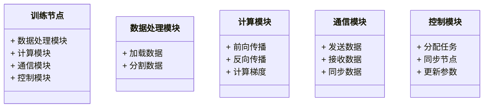
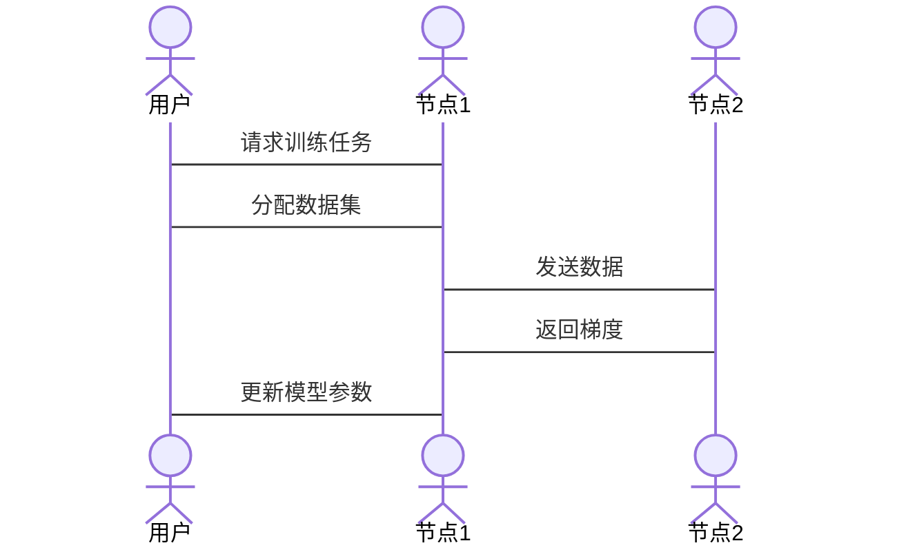

                 


# 分布式训练：加速大规模AI Agent的开发

## 关键词：分布式训练, AI Agent, 大规模模型, 并行计算, 分布式系统, 机器学习, 分布式算法

## 摘要：
随着人工智能技术的快速发展，训练大规模AI Agent的需求日益增长。为了提高训练效率和降低计算成本，分布式训练成为了一种重要的技术手段。本文将从分布式训练的基本概念出发，详细探讨其核心算法、系统架构设计以及实际项目中的应用。通过理论分析和实践案例的结合，本文旨在为读者提供一个全面理解分布式训练的视角，帮助他们更好地应用于大规模AI Agent的开发中。

---

# 第1章: 分布式训练的背景与概念

## 1.1 分布式训练的定义与特点

### 1.1.1 分布式训练的定义
分布式训练是一种通过将计算任务分配到多个计算节点上并行执行的训练方法。与传统的单机训练相比，分布式训练能够充分利用多台机器的计算能力，显著提高训练效率。

### 1.1.2 分布式训练的核心特点
- **并行计算**：将任务分解为多个子任务，分别在不同的计算节点上执行。
- **数据并行**：将数据集分割到不同的节点上，每个节点处理一部分数据。
- **模型并行**：将模型参数分割到不同的节点上，每个节点负责一部分参数的更新。

### 1.1.3 分布式训练与传统训练的区别
| 特性       | 分布式训练                        | 传统训练                          |
|------------|-----------------------------------|------------------------------------|
| 计算能力    | 利用多台机器的计算能力            | 单台机器的计算能力                |
| 数据处理    | 数据可以分布在多个节点上          | 数据集中于单台机器                |
| 训练时间    | 可以显著缩短训练时间              | 训练时间较长                      |
| 资源需求    | 需要多台机器和网络支持            | 单台机器即可                      |

## 1.2 分布式训练的背景与问题背景

### 1.2.1 大规模AI模型训练的需求
随着AI模型规模的增大，单机训练已经无法满足需求。分布式训练能够处理更大的数据集和更复杂的模型。

### 1.2.2 分布式训练的必要性
- **计算资源有限**：单台机器无法处理海量数据。
- **训练时间过长**：分布式训练可以显著缩短训练时间。
- **模型规模扩大**：分布式训练支持更大规模的模型。

### 1.2.3 分布式训练面临的挑战
- **网络通信开销**：节点之间的通信会增加额外的计算开销。
- **数据同步问题**：不同节点之间的数据同步需要精确控制。
- **资源分配问题**：如何合理分配计算资源是关键。

## 1.3 分布式训练的核心目标

### 1.3.1 提升训练效率
通过并行计算，分布式训练可以显著提高训练效率。

### 1.3.2 降低计算成本
分布式训练可以充分利用资源，降低单台机器的计算压力。

### 1.3.3 支持更大规模的模型训练
分布式训练能够处理更大规模的数据集和模型。

## 1.4 分布式训练的边界与外延

### 1.4.1 分布式训练的适用场景
- **大规模数据集**：数据量庞大，单机无法处理。
- **复杂模型结构**：模型参数过多，单机训练效率低下。
- **实时训练需求**：需要快速完成训练任务。

### 1.4.2 分布式训练的限制与不足
- **网络延迟**：节点之间的通信延迟会影响训练效率。
- **资源分配不均**：部分节点可能成为瓶颈。
- **维护成本**：分布式系统的维护成本较高。

### 1.4.3 分布式训练与其他技术的关系
- **云计算**：分布式训练可以利用云计算资源进行扩展。
- **容器化技术**：容器化技术可以方便地管理分布式训练的资源。

## 1.5 本章小结
本章介绍了分布式训练的基本概念、背景和核心目标，分析了其在大规模AI模型训练中的重要性，并探讨了其面临的挑战和适用场景。

---

# 第2章: 分布式训练的核心概念与联系

## 2.1 分布式训练的核心概念

### 2.1.1 分布式训练的原理
分布式训练通过将任务分解到多个计算节点上并行执行，每个节点负责一部分数据或模型参数的更新。最终，各节点的计算结果汇总，得到完整的模型。

### 2.1.2 分布式训练的关键技术
- **数据并行**：将数据集分割到不同的节点上，每个节点处理一部分数据。
- **模型并行**：将模型参数分割到不同的节点上，每个节点负责一部分参数的更新。
- **同步与异步**：同步训练需要所有节点完成当前步计算后才能进行下一步，异步训练则允许节点之间并行执行。

### 2.1.3 分布式训练的实现方式
- **数据并行**：适用于数据量较大的场景，每个节点处理不同的数据子集。
- **模型并行**：适用于模型参数较多的场景，每个节点处理不同的模型部分。

## 2.2 分布式训练的核心要素

### 2.2.1 计算资源分配
- **计算节点**：负责处理具体的训练任务。
- **通信网络**：节点之间通过网络进行数据交换。

### 2.2.2 数据并行与模型并行
- **数据并行**：数据集被分割成多个部分，每个节点处理一部分数据。
- **模型并行**：模型参数被分割成多个部分，每个节点负责一部分参数的更新。

### 2.2.3 同步与异步训练
- **同步训练**：所有节点在每一步计算完成后，同步更新模型参数。
- **异步训练**：节点之间可以并行执行，模型参数可以异步更新。

## 2.3 分布式训练的ER实体关系图

```mermaid
er
    actor 训练节点
    actor 集成商
    actor 分布式训练系统
    node 训练任务
    node 训练数据
    node 模型参数
    node 训练结果
    relation 训练节点 -> 分布式训练系统: 提供计算资源
    relation 分布式训练系统 -> 训练任务: 分配任务
    relation 训练任务 -> 训练数据: 加载数据
    relation 训练任务 -> 模型参数: 初始化参数
    relation 训练任务 -> 训练结果: 生成结果
    relation 集成商 -> 分布式训练系统: 集成系统
```

## 2.4 本章小结
本章详细讲解了分布式训练的核心概念，包括数据并行、模型并行、同步与异步训练等，并通过ER实体关系图展示了系统的组成部分和交互关系。

---

# 第3章: 分布式训练的算法原理

## 3.1 分布式训练的算法概述

### 3.1.1 分布式训练的算法分类
- **同步算法**：所有节点在每一步计算完成后，同步更新模型参数。
- **异步算法**：节点之间可以并行执行，模型参数可以异步更新。

### 3.1.2 常见的分布式训练算法
- **数据并行算法**：适用于数据量较大的场景。
- **模型并行算法**：适用于模型参数较多的场景。

### 3.1.3 算法选择的依据
- **数据量**：数据量较大的场景选择数据并行。
- **模型规模**：模型参数较多的场景选择模型并行。

## 3.2 分布式训练的同步与异步算法

### 3.2.1 同步算法的实现流程
1. 初始化模型参数。
2. 将数据集分割到多个节点上。
3. 每个节点独立计算梯度。
4. 将所有节点的梯度汇总，更新模型参数。

### 3.2.2 异步算法的实现流程
1. 初始化模型参数。
2. 将数据集分割到多个节点上。
3. 每个节点独立计算梯度，并异步更新模型参数。

## 3.3 分布式训练的算法实现

### 3.3.1 数据并行算法实现

```python
import numpy as np
from mpi4py import MPI

# 初始化MPI环境
comm = MPI.COMM_WORLD
size = comm.Get_size()
rank = comm.Get_rank()

# 模型参数
params = np.random.randn(100, 100)

# 分割数据集
data = np.random.randn(1000, 100)
data_per_rank = np.array_split(data, size)

# 训练过程
for epoch in range(num_epochs):
    # 分割数据
    train_data = data_per_rank[rank]
    # 计算梯度
    gradient = compute_gradient(train_data, params)
    # 汇总梯度
    comm.Allreduce(gradient, gradient_total, op=MPI.SUM)
    # 更新模型参数
    params -= learning_rate * gradient_total
```

### 3.3.2 模型并行算法实现

```python
import torch
import torch.nn as nn
import torch.distributed as dist

# 初始化模型
model = nn.Sequential(
    nn.Linear(100, 50),
    nn.ReLU(),
    nn.Linear(50, 10)
)

# 分割模型参数
module_list = list(model.modules())
rank = comm.Get_rank()
num_params = len(module_list)
params_per_rank = [module_list[i] for i in range(rank, num_params, size)]

# 分布式训练
for epoch in range(num_epochs):
    # 前向传播
    output = model(input)
    # 计算梯度
    loss.backward()
    # 同步梯度
    for param in params_per_rank:
        dist.all_reduce(param.grad.data, op=dist.Reduce.SUM)
    # 更新参数
    optimizer.step()
```

### 3.3.3 算法原理的数学模型
在数据并行中，每个节点计算梯度的平均值，然后将梯度汇总到主节点，主节点更新模型参数。数学模型如下：

$$
\text{梯度} = \frac{1}{N}\sum_{i=1}^{N}\text{梯度}_i
$$

在模型并行中，每个节点负责一部分模型参数的更新，最终将各部分参数汇总，得到完整的模型参数。

## 3.4 本章小结
本章详细讲解了分布式训练的算法原理，包括数据并行和模型并行的实现流程，并通过Python代码展示了具体的实现方式。

---

# 第4章: 分布式训练的系统架构设计

## 4.1 系统功能设计

### 4.1.1 系统功能模块
- **数据处理模块**：负责数据的分割和加载。
- **计算模块**：负责具体的训练任务。
- **通信模块**：负责节点之间的数据交换。
- **控制模块**：负责任务的分配和同步。

### 4.1.2 功能模块的交互流程
1. 数据处理模块将数据集分割成多个子集。
2. 计算模块在每个节点上执行训练任务。
3. 通信模块负责节点之间的数据同步。
4. 控制模块协调各节点的训练过程。

### 4.1.3 系统功能设计的ER图

```mermaid
er
    actor 节点A
    actor 节点B
    actor 节点C
    node 训练任务
    node 数据集
    node 模型参数
    relation 节点A -> 数据集: 加载数据
    relation 节点B -> 模型参数: 初始化参数
    relation 节点C -> 训练任务: 执行任务
    relation 数据集 -> 模型参数: 传递参数
```

## 4.2 系统架构设计

### 4.2.1 系统架构设计的类图



### 4.2.2 系统交互设计的序列图



## 4.3 系统接口设计

### 4.3.1 系统接口的定义
- **数据接口**：节点之间的数据交换接口。
- **通信接口**：节点之间的通信接口。
- **控制接口**：节点之间的任务分配和同步接口。

### 4.3.2 接口实现方式
- **数据接口**：使用 MPI 或其他通信库进行数据交换。
- **通信接口**：通过网络通信实现节点之间的交互。
- **控制接口**：通过任务队列实现节点之间的任务分配。

## 4.4 系统架构设计的注意事项

### 4.4.1 网络延迟的影响
网络延迟会增加通信开销，影响训练效率。

### 4.4.2 资源分配的均衡性
资源分配不均可能导致某些节点成为瓶颈。

### 4.4.3 系统的可扩展性
系统需要支持动态扩展，以应对更大的数据集和模型。

## 4.5 本章小结
本章详细讲解了分布式训练系统的架构设计，包括功能模块、类图、序列图以及接口设计，并探讨了系统设计中的注意事项。

---

# 第5章: 分布式训练的项目实战

## 5.1 项目介绍

### 5.1.1 项目背景
本项目旨在利用分布式训练技术，训练一个大规模的AI Agent模型，提升模型的训练效率和性能。

### 5.1.2 项目目标
- 提高训练效率。
- 降低计算成本。
- 支持更大规模的模型训练。

## 5.2 项目环境配置

### 5.2.1 硬件环境
- **计算节点**：多台GPU服务器。
- **网络环境**：高速网络连接。

### 5.2.2 软件环境
- **操作系统**：Linux。
- **编程语言**：Python。
- **深度学习框架**：TensorFlow或PyTorch。
- **分布式训练库**：MPI或Horovod。

## 5.3 项目核心代码实现

### 5.3.1 数据并行实现

```python
import horovod.tensorflow as hvd

# 初始化Horovod
hvd.init()

# 分割数据集
data = ... # 加载数据集
train_data = data[rank::size]

# 定义模型
model = ... # 定义模型

# 分布式训练
optimizer = hvd.DistributedOptimizer(...)

for epoch in range(num_epochs):
    for batch in train_data:
        with hvd.DistributedGradientTape() as tape:
            outputs = model(batch)
            loss = ... # 定义损失函数
        tape.backward(loss)
        optimizer.step()
```

### 5.3.2 模型并行实现

```python
import tensorflow as tf
from tensorflow.keras import layers

# 分割模型参数
model = tf.keras.Sequential([
    layers.Dense(512, activation='relu'),
    layers.Dense(10, activation='softmax')
])
model_weights = model.trainable_weights

# 分割参数到不同的节点
params_per_rank = [model_weights[i] for i in range(rank, len(model_weights), size)]

# 分布式训练
optimizer = tf.keras.optimizers.Adam()

for epoch in range(num_epochs):
    for batch in train_data:
        with tf.GradientTape() as tape:
            outputs = model(batch)
            loss = ... # 定义损失函数
        gradient = tape.gradient(loss, params_per_rank)
        # 同步梯度
        all_gradients = comm.gather(gradient, root=0)
        if rank == 0:
            total_gradient = sum(all_gradients)
        else:
            total_gradient = None
        # 更新参数
        if rank == 0:
            optimizer.apply_gradients(zip(total_gradient, model_weights))
```

## 5.4 项目实现的关键点

### 5.4.1 数据并行的实现细节
- 数据分割：确保每个节点的数据量大致相同。
- 梯度同步：使用Horovod进行梯度同步。

### 5.4.2 模型并行的实现细节
- 参数分割：确保每个节点负责的部分参数不重叠。
- 梯度汇总：将所有节点的梯度汇总到主节点。

### 5.4.3 网络通信的优化
- 使用高效的通信库，如MPI或Horovod。
- 减少通信次数，优化数据传输效率。

## 5.5 项目测试与调优

### 5.5.1 测试步骤
1. 初始化分布式环境。
2. 加载数据集。
3. 定义模型和优化器。
4. 执行训练任务。
5. 验证模型性能。

### 5.5.2 性能调优
- 调整批量大小。
- 优化网络通信。
- 并行计算优化。

## 5.6 项目总结

### 5.6.1 项目成果
通过分布式训练，显著提高了训练效率，降低了计算成本。

### 5.6.2 经验总结
- 数据分割要均匀。
- 梯度同步要高效。
- 网络通信要优化。

## 5.7 本章小结
本章通过一个实际的项目案例，详细讲解了分布式训练的实现过程，包括环境配置、代码实现和性能调优，并总结了项目经验。

---

# 第6章: 分布式训练的最佳实践与优化技巧

## 6.1 分布式训练的最佳实践

### 6.1.1 合理分配资源
- 根据任务需求，合理分配计算节点和资源。
- 确保网络带宽足够，减少通信开销。

### 6.1.2 优化数据加载
- 使用高效的数据加载方式，减少I/O瓶颈。
- 预加载常用数据，减少数据加载时间。

### 6.1.3 并行计算优化
- 使用高效的并行计算框架，如Horovod或MPI。
- 优化并行计算的粒度，减少同步次数。

## 6.2 分布式训练的性能调优

### 6.2.1 调整批量大小
- 增大批量大小可以提高计算效率。
- 避免批量大小过小导致的通信开销过大。

### 6.2.2 网络通信优化
- 使用低延迟的网络通信协议。
- 减少不必要的数据传输。

### 6.2.3 模型优化
- 简化模型结构，减少参数数量。
- 使用模型剪枝等技术优化模型。

## 6.3 分布式训练的资源分配策略

### 6.3.1 计算节点的选择
- 根据任务需求选择合适的计算节点数量。
- 确保节点之间的网络延迟较低。

### 6.3.2 数据存储优化
- 使用分布式存储系统，如HDFS或ceph。
- 优化数据分布策略，减少数据访问不均衡。

## 6.4 分布式训练的未来趋势

### 6.4.1 更高效的通信协议
- 开发更高效的通信协议，减少网络延迟。
- 使用RDMA等技术优化数据传输。

### 6.4.2 更智能的资源分配
- 使用AI技术优化资源分配策略。
- 动态调整资源分配，适应任务需求。

### 6.4.3 更先进的分布式算法
- 研究更先进的分布式算法，提升训练效率。
- 结合强化学习等技术优化分布式训练过程。

## 6.5 本章小结
本章总结了分布式训练的最佳实践和优化技巧，包括资源分配、数据加载、并行计算优化等方面，并展望了未来的发展趋势。

---

# 第7章: 总结与展望

## 7.1 本章总结
本文详细讲解了分布式训练的基本概念、算法原理、系统架构设计以及实际项目中的应用。通过理论分析和实践案例的结合，本文为读者提供了一个全面理解分布式训练的视角。

## 7.2 未来研究方向

### 7.2.1 更高效的分布式算法
- 研究更高效的分布式算法，如异步优化算法。
- 结合强化学习等技术优化分布式训练过程。

### 7.2.2 更智能的资源分配策略
- 使用AI技术优化资源分配策略。
- 动态调整资源分配，适应任务需求。

### 7.2.3 更先进的分布式系统架构
- 研究更先进的分布式系统架构，如基于容器化技术的分布式训练系统。
- 使用边缘计算等技术优化分布式训练环境。

## 7.3 本章小结
本文总结了分布式训练的核心内容，并展望了未来的研究方向，为读者提供了进一步学习和研究的方向。

---

# 作者：AI天才研究院/AI Genius Institute & 禅与计算机程序设计艺术 /Zen And The Art of Computer Programming

