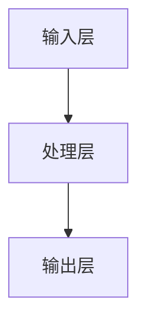

                 


# 创意写作 AI Agent：LLM 辅助内容创作与文案生成

**关键词**：创意写作，AI Agent，LLM，内容创作，文案生成

**摘要**：本文探讨了如何利用大语言模型（LLM）辅助创意写作和文案生成，涵盖背景介绍、核心概念、算法原理、系统架构设计和项目实战等内容，旨在为技术从业者提供深入的技术博客文章。

---

## 第1章：背景介绍

### 1.1 问题背景与描述

#### 1.1.1 创意写作的定义与特点

创意写作是一种通过创新思维和想象力创作文学、广告文案、技术文档等活动的过程。其特点包括多样化的需求、个性化表达和对创新性的追求。

#### 1.1.2 AI在创意写作中的潜力

AI，尤其是大语言模型（LLM），能够辅助生成文本、提供灵感，显著提升创作效率。LLM通过理解上下文，生成连贯且符合主题的内容。

#### 1.1.3 当前创意写作中的问题与挑战

创意写作面临效率低下、灵感枯竭和内容质量不一致等问题。LLM的引入能够部分解决这些问题，但也带来了模型控制和内容原创性的挑战。

### 1.2 LLM的基本概念与特点

#### 1.2.1 模型结构与训练方法

LLM采用Transformer架构，通过自注意力机制捕捉上下文信息。模型通常采用预训练策略，利用大规模文本数据进行无监督学习。

#### 1.2.2 注意力机制与Transformer架构

注意力机制允许模型关注输入中的重要部分，提升生成文本的质量。Transformer架构由编码器和解码器组成，支持并行处理，提高生成效率。

#### 1.2.3 LLM与传统NLP模型的区别

LLM在参数规模和生成能力上远超传统模型，支持长文本生成和多样化输出，但需要更多的计算资源。

### 1.3 LLM在内容创作中的应用前景

#### 1.3.1 应用领域

LLM可应用于文学创作、广告文案、技术文档等多个领域，帮助创作者提高效率和质量。

#### 1.3.2 企业采用的优势

企业通过LLM快速生成文案，优化营销策略，降低内容创作成本。

#### 1.3.3 挑战与机遇

挑战包括模型控制和内容原创性，机遇则在于效率提升和新创作形式的探索。

---

## 第2章：LLM的原理与机制

### 2.1 核心原理

#### 2.1.1 模型结构与训练方法

LLM采用自监督学习，通过预测下一个词的概率来优化模型参数。

#### 2.1.2 注意力机制

注意力机制通过加权计算输入序列中每个词的重要性，生成位置感知的表示。

#### 2.1.3 生成模型

生成模型采用解码器结构，通过自回归方式生成文本，支持多样化输出。

### 2.2 训练与优化

#### 2.2.1 预训练任务与目标函数

预训练任务包括掩码语言模型和因果语言模型，目标函数为交叉熵损失函数。

$$ \text{损失函数} = -\frac{1}{n}\sum_{i=1}^{n}\sum_{j=1}^{k} y_{i,j} \log p(y_{i,j}|y_{i,1},...,y_{i,j-1})} $$

#### 2.2.2 参数优化与模型压缩

使用Adam优化器进行参数优化，通过剪枝和量化技术进行模型压缩，降低计算资源消耗。

#### 2.2.3 模型调优与微调策略

微调策略包括参数初始化和学习率调整，确保模型在特定任务上表现更佳。

### 2.3 生成策略

#### 2.3.1 采样方法与多样性控制

采用贪婪采样和随机采样，通过温度和top-k采样控制生成的多样性和质量。

#### 2.3.2 解码策略

解码策略包括自回归解码和自注意力解码，支持实时生成和并行处理。

#### 2.3.3 可解释性与调试

通过可视化工具分析注意力权重，帮助理解模型决策过程。

---

## 第3章：LLM在创意写作中的应用

### 3.1 创意写作的多样化需求

#### 3.1.1 文学创作中的个性化风格

LLM能够生成符合特定风格的文本，帮助作家探索不同创作路径。

#### 3.1.2 商业文案的精准需求

通过LLM生成精准营销文案，提升广告效果和转化率。

#### 3.1.3 技术文档的规范性要求

LLM辅助生成技术文档，确保内容准确性和格式一致性。

### 3.2 应用场景

#### 3.2.1 故事生成与情节构思

LLM可以生成故事大纲和情节发展，激发创作灵感。

#### 3.2.2 文案创作与广告优化

通过LLM生成广告文案，并优化其吸引力和转化率。

#### 3.2.3 诗歌创作与创意激发

LLM辅助生成诗歌，探索新的创作形式和表达方式。

### 3.3 优缺点分析

#### 3.3.1 优势

LLM显著提升了创作效率，提供了多样化的创作思路，降低了创作门槛。

#### 3.3.2 局限

生成内容可能缺乏原创性，创意的独特性可能不如人类创作。

#### 3.3.3 解决方案

通过人机协作模式，结合人类的创意指导，优化LLM生成内容的质量和原创性。

---

## 第4章：系统架构设计

### 4.1 需求分析

系统需支持多种输入方式，生成高质量文本，并提供优化建议。

### 4.2 功能设计

#### 4.2.1 用户输入与输出界面

设计友好的输入界面，支持文本输入和输出展示。

#### 4.2.2 内容生成模块

集成LLM模型，实现文本生成功能。

#### 4.2.3 优化与编辑工具

提供编辑工具，帮助用户优化生成内容。

### 4.3 架构设计

#### 4.3.1 分层架构图

系统采用分层架构，包括数据层、业务逻辑层和表现层。



#### 4.3.2 模块交互流程

模块间通过接口进行交互，确保系统高效运行。

### 4.4 接口设计

#### 4.4.1 API定义

定义RESTful API接口，支持文本生成和模型调用。

#### 4.4.2 接口实现

实现API接口，确保与前端和后端的无缝连接。

---

## 第5章：项目实战

### 5.1 环境搭建

#### 5.1.1 安装Python

安装最新版本的Python，确保环境配置正确。

#### 5.1.2 安装库依赖

安装必要的库，如`transformers`和`torch`。

### 5.2 代码实现

#### 5.2.1 导入库

```python
from transformers import AutoTokenizer, AutoModelForCausalLM
import torch
```

#### 5.2.2 模型加载

```python
tokenizer = AutoTokenizer.from_pretrained('gpt2')
model = AutoModelForCausalLM.from_pretrained('gpt2')
```

#### 5.2.3 文本生成函数

```python
def generate_text(prompt, max_length=50):
    inputs = tokenizer.encode(prompt, return_tensors='pt')
    outputs = model.generate(inputs, max_length=max_length, do_sample=True)
    return tokenizer.decode(outputs[0])
```

### 5.3 功能实现

#### 5.3.1 用户输入

用户输入提示词，系统生成相应文本。

#### 5.3.2 生成文本

系统根据提示词生成连贯文本，支持多样化输出。

#### 5.3.3 反馈机制

用户可提供反馈，系统优化生成策略。

### 5.4 案例分析

#### 5.4.1 故事生成示例

输入：一个侦探故事的开头。

输出：生成符合情节发展的故事情节。

#### 5.4.2 文案优化示例

输入：广告文案初稿。

输出：优化后的广告文案，更具吸引力。

---

## 第6章：最佳实践与小结

### 6.1 最佳实践

#### 6.1.1 写作技巧的结合

将LLM生成的内容与传统写作技巧相结合，提升作品质量。

#### 6.1.2 模型优化策略

定期优化模型参数，确保生成内容的准确性和流畅性。

#### 6.1.3 用户体验设计

设计友好的用户界面，提升用户体验。

### 6.2 伦理与法律

#### 6.2.1 版权问题

需注意生成内容的版权归属，避免法律纠纷。

#### 6.2.2 信息真实性

确保生成内容的真实性，避免误导用户。

### 6.3 小结与展望

#### 6.3.1 本章总结

本文详细探讨了LLM在创意写作中的应用，分析了其优势与局限，并提出了优化策略。

#### 6.3.2 未来展望

未来，随着技术进步，LLM在创意写作中的应用将更加广泛，人机协作将更加深入。

---

**作者：AI天才研究院 & 禅与计算机程序设计艺术**

