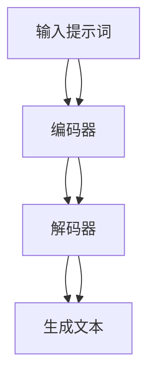
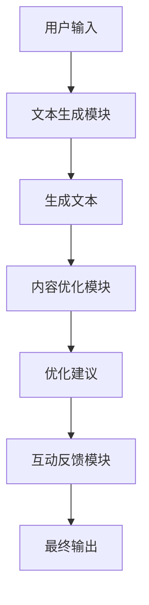
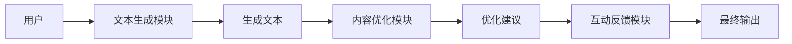

                 


# 创意写作AI Agent：LLM驱动的文学创作辅助系统

## 关键词：创意写作、AI Agent、LLM、文学创作、辅助系统

## 摘要：  
本文深入探讨了LLM（大语言模型）驱动的AI Agent在创意写作中的应用。通过分析文学创作的需求，结合AI技术的核心原理，提出了一套基于LLM的创意写作辅助系统架构。文章详细讲解了系统的工作原理、算法实现、系统架构设计以及实际项目案例，并展望了未来的发展方向。

---

# 第一部分: 创意写作与AI Agent的背景介绍

## 第1章: 创意写作与AI Agent的概述

### 1.1 创意写作的定义与特点

#### 1.1.1 创意写作的基本概念  
创意写作是指通过创造性思维和语言表达，将个人的思想、情感和想象力转化为文字作品的活动。它包括小说、诗歌、散文等多种文学形式，强调原创性和艺术性。

#### 1.1.2 创意写作的核心特点  
- **原创性**：作品需具有独特的思想和表达方式。  
- **情感性**：作品通常承载作者的情感和体验。  
- **多样性**：涵盖小说、诗歌、剧本等多种文体。  

#### 1.1.3 创意写作的受众与应用场景  
创意写作的受众广泛，包括文学爱好者、专业作家、教育工作者等。应用场景包括文学创作、教育、娱乐等领域。

### 1.2 AI Agent的基本概念

#### 1.2.1 AI Agent的定义  
AI Agent（人工智能代理）是指能够感知环境、执行任务并做出决策的智能系统。它通过算法和数据处理，帮助用户完成特定目标。

#### 1.2.2 AI Agent的核心特征  
- **自主性**：能够独立执行任务。  
- **反应性**：能够根据环境反馈调整行为。  
- **目标导向**：专注于完成特定目标。  

#### 1.2.3 AI Agent与传统软件的区别  
AI Agent具备学习和适应能力，能够处理复杂任务，而传统软件依赖固定的规则和流程。

### 1.3 LLM驱动的AI Agent在创意写作中的应用

#### 1.3.1 LLM的基本概念  
LLM（Large Language Model）是基于大规模数据训练的自然语言处理模型，能够生成人类水平的文本。

#### 1.3.2 LLM在创意写作中的优势  
- **文本生成**：快速生成高质量的文学内容。  
- **创意启发**：提供灵感和创作建议。  
- **风格匹配**：模仿特定作家的写作风格。  

#### 1.3.3 LLM驱动的AI Agent在文学创作中的潜力  
AI Agent可以通过分析用户需求，生成符合要求的文本，优化故事结构，并提供创作反馈。

---

## 第2章: 创意写作AI Agent的问题背景与需求分析

### 2.1 创意写作中的常见问题

#### 2.1.1 创作灵感枯竭  
作家在创作过程中常因缺乏灵感而停滞。

#### 2.1.2 文本质量提升  
需要不断修改和完善文本，提升文学价值。

#### 2.1.3 故事结构优化  
确保故事逻辑清晰，情节连贯。

### 2.2 AI Agent在创意写作中的需求分析

#### 2.2.1 用户需求分析  
- **用户类型**：新手作家、专业作家、教育工作者。  
- **核心需求**：生成高质量文本、优化故事结构、提供创作反馈。  

#### 2.2.2 功能需求分析  
- **文本生成**：根据输入生成创意文本。  
- **内容优化**：分析文本质量并提出改进建议。  
- **互动反馈**：提供实时创作反馈。  

#### 2.2.3 性能需求分析  
- **响应速度**：快速生成文本。  
- **准确性**：生成文本符合语法规则。  
- **可定制性**：支持个性化创作需求。  

---

# 第二部分: 创意写作AI Agent的核心概念与原理

## 第3章: LLM驱动的AI Agent原理

### 3.1 LLM的内部工作机制

#### 3.1.1 模型结构  
LLM通常基于Transformer架构，包含编码器和解码器。

#### 3.1.2 训练过程  
模型通过监督学习和无监督学习，优化参数以生成高质量文本。

#### 3.1.3 推理过程  
输入提示词，模型生成相应文本。

#### 3.1.4 LLM的训练与推理流程图  



### 3.2 创意写作AI Agent的核心算法

#### 3.2.1 文本生成算法  
基于LLM的生成算法，包括贪心搜索和随机采样。

#### 3.2.2 内容优化算法  
使用语言模型评估文本质量并提出优化建议。

#### 3.2.3 故事结构优化算法  
分析故事逻辑并建议情节安排。

---

## 第4章: 创意写作AI Agent的系统架构

### 4.1 系统功能模块设计

#### 4.1.1 文本生成模块  
根据用户输入生成创意文本。

#### 4.1.2 内容优化模块  
分析文本并提出优化建议。

#### 4.1.3 互动反馈模块  
提供实时创作反馈。

### 4.2 系统功能模块流程图  



---

## 第5章: 创意写作AI Agent的系统架构设计

### 5.1 项目介绍

#### 5.1.1 项目背景  
介绍创意写作AI Agent的开发背景和目标。

#### 5.1.2 项目目标  
实现一个基于LLM的创意写作辅助系统。

### 5.2 系统架构设计

#### 5.2.1 系统功能模块  
- 文本生成模块  
- 内容优化模块  
- 互动反馈模块  

#### 5.2.2 系统架构图  



### 5.3 系统接口设计

#### 5.3.1 API接口  
提供文本生成和优化的API。

#### 5.3.2 用户接口  
图形化界面供用户操作。

### 5.4 系统交互流程图  


---

## 第6章: 创意写作AI Agent的项目实战

### 6.1 环境搭建

#### 6.1.1 安装Python  
安装Python 3.8及以上版本。

#### 6.1.2 安装依赖库  
安装`transformers`和`torch`等库。

### 6.2 系统核心实现

#### 6.2.1 文本生成模块实现  

```python
from transformers import GPT2LMHeadModel, GPT2Tokenizer

tokenizer = GPT2Tokenizer.from_pretrained('gpt2')
model = GPT2LMHeadModel.from_pretrained('gpt2')

def generate_text(prompt, max_length=50):
    inputs = tokenizer.encode(prompt, return_tensors='pt')
    outputs = model.generate(inputs, max_length=max_length, do_sample=True)
    return tokenizer.decode(outputs[0], skip_special_tokens=True)
```

#### 6.2.2 内容优化模块实现  

```python
def evaluate_text(text):
    # 示例：计算文本的情感倾向
    # 这里仅展示基本实现，实际需要更复杂的模型
    pass
```

#### 6.2.3 互动反馈模块实现  

```python
def provide_feedback(text):
    # 示例：提供简单的语法检查反馈
    pass
```

### 6.3 案例分析与解读

#### 6.3.1 案例分析  
使用上述代码生成一个小说开头。

#### 6.3.2 代码实现解读  
解释代码的功能和实现细节。

---

## 第7章: 创意写作AI Agent的高级主题

### 7.1 模型优化与调优

#### 7.1.1 模型优化方法  
微调模型、调整生成参数。

#### 7.1.2 调优策略  
通过实验确定最佳生成参数。

### 7.2 用户反馈机制

#### 7.2.1 反馈收集  
收集用户对生成文本的评价。

#### 7.2.2 反馈分析  
分析反馈以改进系统。

### 7.3 多模态创作

#### 7.3.1 文本与图像结合  
生成与文本相关的图像。

#### 7.3.2 文本与其他形式结合  
生成视频、音频等内容。

---

## 第8章: 总结与展望

### 8.1 总结  
回顾文章内容，总结主要观点。

### 8.2 展望  
展望未来发展方向，包括技术进步和应用场景扩展。

---

## 作者信息  
作者：AI天才研究院 & 禅与计算机程序设计艺术  

---

这篇文章通过详细讲解创意写作AI Agent的背景、原理、系统架构和项目实战，全面探讨了LLM在文学创作中的应用。希望读者通过本文能够深入了解这一领域的技术细节，并为未来的创新提供参考。

