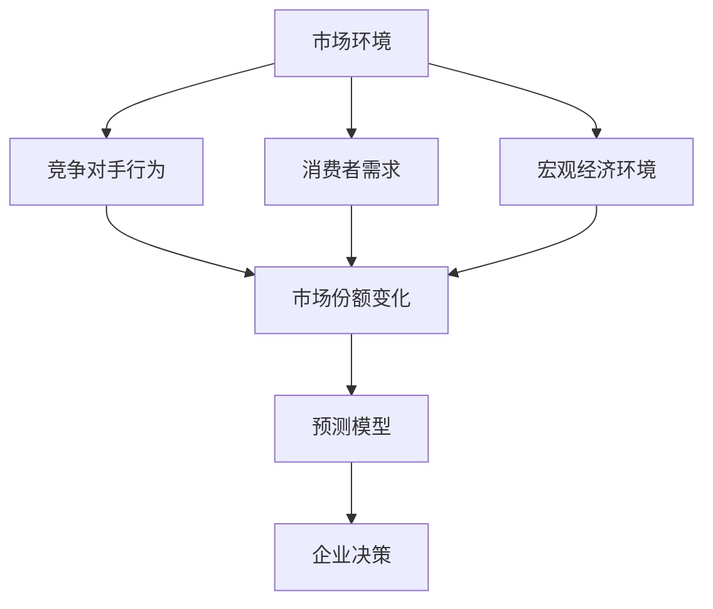
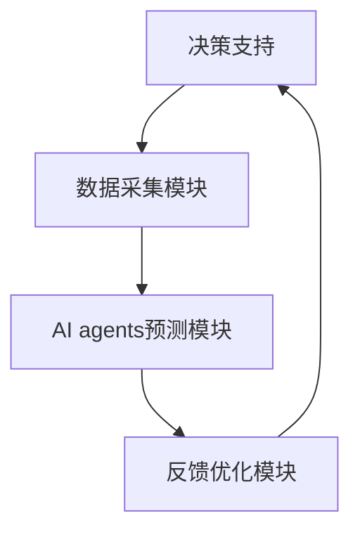

                 


# 利用AI agents构建动态市场份额预测模型：把握竞争态势

## 关键词：AI agents，市场份额预测，动态预测，竞争分析，强化学习，机器学习

## 摘要：在竞争激烈的市场环境中，准确预测市场份额是企业制定战略决策的关键。本文通过结合AI agents与动态预测模型，提出了一种创新的市场份额预测方法。该方法利用AI agents的强大学习能力和动态适应性，能够实时捕捉市场变化，帮助企业更好地把握竞争态势。文章详细阐述了AI agents的核心原理、动态预测模型的构建过程，以及如何通过强化学习算法优化预测模型。最后，本文通过实际案例分析，展示了该方法在实际应用中的优势和效果。

---

## 第一部分: 背景介绍与核心概念

### 第1章: 动态市场份额预测模型的背景与问题描述

#### 1.1 问题背景
##### 1.1.1 市场竞争分析的挑战
在现代商业环境中，市场竞争日益激烈，企业的市场份额受到多种因素的影响，包括竞争对手的策略调整、消费者需求变化、宏观经济环境波动等。传统的市场份额预测方法往往基于静态数据分析，难以捕捉市场的动态变化，导致预测结果的准确性不足。

##### 1.1.2 动态市场份额预测的重要性
动态市场份额预测能够帮助企业及时了解市场变化，优化产品策略、定价策略和营销策略，从而在竞争中占据优势。准确的预测结果可以帮助企业在市场波动中做出更明智的决策。

##### 1.1.3 AI agents在竞争分析中的应用潜力
AI agents（人工智能代理）是一种能够感知环境、自主决策的智能体。它们具有实时学习和适应能力，非常适合用于动态环境下的市场份额预测。通过AI agents，企业可以实时获取市场数据，快速调整预测模型，确保预测结果的准确性。

#### 1.2 问题描述
##### 1.2.1 市场份额预测的核心问题
市场份额预测的核心问题是如何准确预测企业在市场中的份额占比。这需要综合考虑市场环境、企业自身能力、竞争对手行为等多种因素。

##### 1.2.2 动态竞争环境的复杂性
动态竞争环境的复杂性主要体现在以下几点：
- **市场环境变化快**：消费者需求、政策法规等外部因素的变化会影响市场份额。
- **竞争对手行为多样化**：竞争对手可能随时调整价格、产品策略等，对市场份额预测构成挑战。
- **数据的实时性要求高**：动态预测需要实时更新数据，以反映市场变化。

##### 1.2.3 AI agents在动态预测中的优势
AI agents在动态预测中的优势主要体现在以下几点：
- **实时感知与反馈**：AI agents能够实时获取市场数据，并根据反馈调整预测模型。
- **自主学习能力**：通过强化学习等算法，AI agents能够从经验中学习，优化预测策略。
- **多维度数据处理**：AI agents能够整合多种数据源，全面分析市场环境，提高预测准确性。

#### 1.3 问题解决与边界
##### 1.3.1 AI agents在市场份额预测中的解决方案
AI agents通过实时数据收集、分析和决策，能够动态调整市场份额预测模型，确保预测结果的准确性。同时，AI agents可以通过多agent协作，综合考虑市场中多个因素的影响，提高预测的全面性。

##### 1.3.2 模型的边界与适用范围
动态市场份额预测模型的边界主要体现在以下几点：
- **数据来源限制**：模型依赖于实时数据，数据获取的及时性和准确性是模型性能的关键。
- **模型假设**：模型基于一定的假设条件，例如市场行为的理性假设、数据的完整性等。
- **适用范围**：模型适用于竞争性市场，对垄断市场或寡头市场可能需要调整模型参数。

##### 1.3.3 核心概念的结构与组成
动态市场份额预测模型的核心结构包括以下几个部分：
1. **数据采集与处理模块**：负责实时获取市场数据，并进行预处理。
2. **AI agents预测模块**：基于强化学习算法，进行市场份额预测。
3. **反馈与优化模块**：根据实际市场表现，优化预测模型。

---

## 第二部分: 核心概念与联系

### 第2章: AI agents与市场份额预测的核心概念

#### 2.1 AI agents的基本原理
##### 2.1.1 什么是AI agents
AI agents是一种能够感知环境、自主决策的智能体。它们可以基于环境反馈，采取相应的行动以实现目标。AI agents具有以下特点：
- **自主性**：能够在没有外部干预的情况下自主运行。
- **反应性**：能够根据环境反馈实时调整行为。
- **目标导向性**：通过目标驱动，优化决策过程。

##### 2.1.2 AI agents的分类与特点
AI agents可以根据功能和应用场景进行分类，常见的分类包括：
- **简单反射型agent**：基于当前输入直接生成输出，适用于简单的决策任务。
- **基于模型的反应型agent**：利用内部模型分析环境，生成决策。
- **目标驱动型agent**：基于目标进行决策，适用于复杂的动态环境。

##### 2.1.3 AI agents在动态预测中的作用
AI agents在动态预测中的作用主要体现在以下几点：
- **实时感知**：能够实时获取市场数据，快速响应环境变化。
- **自主学习**：通过强化学习等算法，不断优化预测模型。
- **多任务处理**：能够同时处理多个预测任务，提高预测效率。

#### 2.2 动态市场份额预测模型的构建
##### 2.2.1 模型的核心要素
动态市场份额预测模型的核心要素包括：
- **市场环境**：包括竞争对手行为、消费者需求、宏观经济环境等。
- **企业能力**：包括产品竞争力、品牌影响力、成本优势等。
- **预测模型**：基于AI agents的预测算法，动态调整预测结果。

##### 2.2.2 数据来源与特征
动态市场份额预测模型的数据来源包括：
- **内部数据**：企业的销售数据、成本数据、库存数据等。
- **外部数据**：竞争对手数据、市场调研数据、行业报告等。

数据特征包括：
- **时间序列性**：市场份额数据具有时间序列特征，适合时间序列分析。
- **多维性**：市场份额受多种因素影响，需要综合分析。
- **动态性**：市场份额随时间变化，需要动态预测。

##### 2.2.3 模型的输入输出关系
动态市场份额预测模型的输入包括市场环境数据和企业能力数据，输出为预测的市场份额占比。模型通过AI agents的学习算法，不断优化预测模型，提高预测准确率。

#### 2.3 核心概念的联系与对比
##### 2.3.1 AI agents与传统预测模型的对比
- **传统预测模型**：基于统计分析，适用于静态环境，预测结果可能存在滞后性。
- **AI agents预测模型**：基于强化学习，适用于动态环境，预测结果实时性强。

##### 2.3.2 动态预测与静态预测的差异
- **静态预测**：基于历史数据，预测未来某一时点的市场份额。
- **动态预测**：基于实时数据，动态调整预测模型，预测市场份额的变化趋势。

##### 2.3.3 模型的实体关系图（ER图）


---

## 第三部分: 算法原理与数学模型

### 第3章: AI agents的算法原理

#### 3.1 强化学习算法
##### 3.1.1 Q-learning算法
Q-learning是一种基于强化学习的算法，通过学习状态-动作值函数，优化决策策略。其核心公式为：
$$ Q(s, a) = Q(s, a) + \alpha [r + \gamma \max Q(s', a) - Q(s, a)] $$
其中，$$\alpha$$ 是学习率，$$\gamma$$ 是折扣因子。

##### 3.1.2 策略梯度算法
策略梯度算法通过优化策略函数，直接更新决策策略。其核心公式为：
$$ \theta_{t+1} = \theta_t + \alpha \nabla_\theta J(\theta) $$
其中，$$J(\theta)$$ 是目标函数，$$\nabla_\theta J(\theta)$$ 是梯度。

##### 3.1.3 算法的数学模型
动态市场份额预测模型中，AI agents通过Q-learning算法进行预测。模型的状态空间包括市场环境、竞争对手行为等，动作空间包括价格调整、产品策略调整等。奖励函数设计为预测准确率与实际市场份额的差距。

#### 3.2 联合学习算法
##### 3.2.1 联合学习的基本原理
联合学习是一种多agent协作学习方法，通过多个agent的协同工作，提高预测准确率。其核心思想是多个agent共同学习，共享知识，优化预测模型。

##### 3.2.2 联合学习的数学模型
联合学习的数学模型包括多个agent的参数更新公式，例如：
$$ \theta_i^{new} = \theta_i + \alpha \sum_{j \neq i} (\theta_j - \theta_i) $$
其中，$$\alpha$$ 是学习率，$$\theta_i$$ 是agent i的参数。

##### 3.2.3 算法的实现步骤
1. 初始化多个agent的参数。
2. 每个agent根据当前状态采取动作，获取奖励。
3. agent之间共享知识，更新参数。
4. 重复上述步骤，直到收敛。

#### 3.3 算法的流程图
```mermaid
graph TD
    A[初始化参数] --> B[设置状态]
    B --> C[选择动作]
    C --> D[执行动作]
    D --> E[获取奖励]
    E --> F[更新参数]
    F --> G[收敛判断]
    G --> H[结束] if收敛
    G --> B if未收敛
```

---

## 第四章: 动态市场份额预测的数学模型

#### 4.1 预测模型的数学基础
动态市场份额预测模型的数学基础包括时间序列分析、随机过程模型和贝叶斯网络模型。这些模型为AI agents提供了理论支持，帮助其更好地理解市场变化。

#### 4.2 动态市场份额预测的公式推导
动态市场份额预测的公式推导基于强化学习算法，核心公式为：
$$ \pi_t = \arg max_a Q(s_t, a) $$
其中，$$s_t$$ 是当前状态，$$a$$ 是可能的动作，$$Q(s_t, a)$$ 是状态-动作值函数。

#### 4.3 举例说明
假设某企业市场份额为20%，竞争对手市场份额为30%，市场环境稳定。通过AI agents的预测模型，企业能够预测到未来一个季度市场份额可能增加到25%，并根据预测结果调整产品策略。

---

## 第五部分: 系统分析与架构设计

### 第5章: 系统分析与架构设计

#### 5.1 问题场景介绍
动态市场份额预测系统需要实时处理市场数据，预测市场份额变化，并为企业提供决策支持。

#### 5.2 系统功能设计
系统功能包括数据采集、预测模型构建、结果展示和决策支持。

#### 5.3 系统架构设计
系统架构包括数据采集模块、AI agents预测模块、反馈优化模块和用户界面模块。

#### 5.4 系统接口设计
系统接口包括数据接口、算法接口和用户接口。

#### 5.5 系统交互序列图


---

## 第六部分: 项目实战

### 第6章: 项目实战

#### 6.1 环境安装与配置
安装Python、TensorFlow、Keras等工具，配置开发环境。

#### 6.2 核心代码实现
实现AI agents的强化学习算法，构建动态市场份额预测模型。

#### 6.3 代码解读与分析
通过代码解读，详细分析AI agents的预测过程和模型优化方法。

#### 6.4 实际案例分析
通过实际案例，展示动态市场份额预测模型的应用效果。

#### 6.5 项目总结
总结项目成果，提出改进建议，展望未来发展。

---

## 第七部分: 总结与展望

### 第7章: 总结与展望

#### 7.1 最佳实践 tips
- 数据质量是模型性能的关键，确保数据的准确性和及时性。
- 强化学习算法的参数设置对模型性能影响较大，需要进行充分的实验调优。

#### 7.2 小结
动态市场份额预测模型通过AI agents的强大能力，能够实时捕捉市场变化，提高预测准确率，为企业制定竞争策略提供有力支持。

#### 7.3 注意事项
- 模型的预测结果仅供参考，需结合实际情况进行调整。
- 模型的优化需要持续进行，以适应市场环境的变化。

#### 7.4 拓展阅读
推荐相关领域的书籍和论文，供读者进一步学习。

---

## 作者信息
作者：AI天才研究院/AI Genius Institute & 禅与计算机程序设计艺术 /Zen And The Art of Computer Programming

