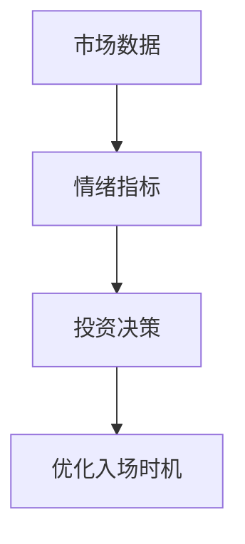
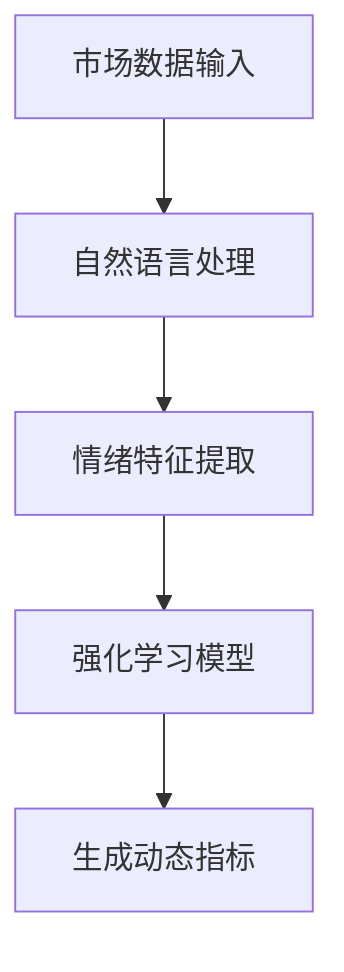
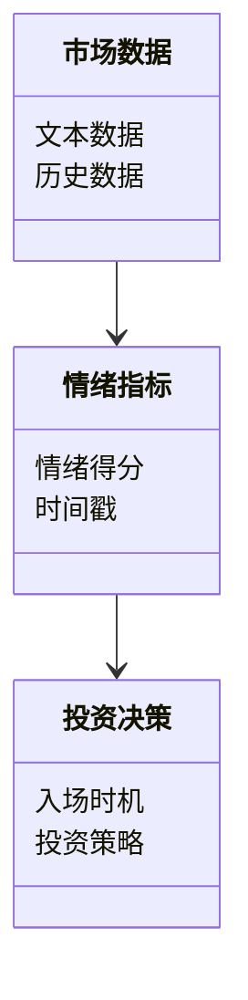
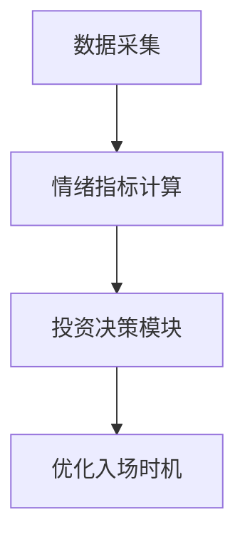
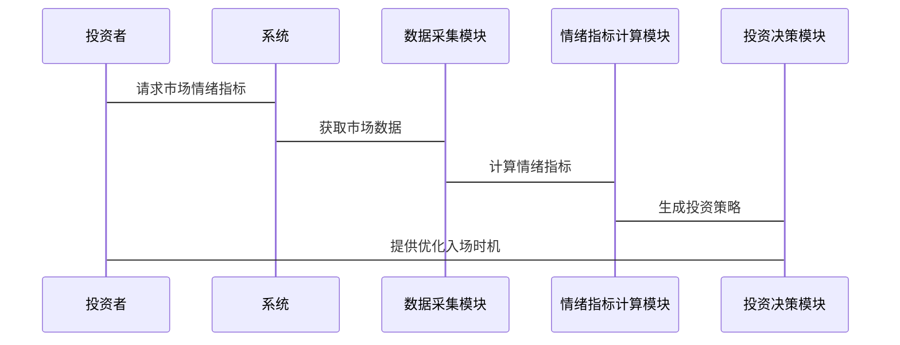

                 


# 利用AI agents构建动态市场情绪指标：优化入场时机

> 关键词：动态市场情绪指标，AI代理，投资决策，优化入场时机，自然语言处理，强化学习，时间序列分析

> 摘要：本文深入探讨如何利用AI代理构建动态市场情绪指标，优化投资入场时机。通过分析市场情绪的核心概念、AI代理的工作原理，结合自然语言处理和强化学习算法，提出了一种基于动态市场情绪指标的优化策略。本文从理论到实践，详细讲解了系统架构设计、项目实现以及实际案例分析，为投资者提供了科学的投资决策支持。

---

# 第一部分: 背景介绍与核心概念

## 第1章: 动态市场情绪指标与AI代理概述

### 1.1 市场情绪指标的重要性

#### 1.1.1 情绪指标的定义与作用
市场情绪指标是衡量市场参与者情绪状态的量化工具，能够反映市场的乐观或悲观程度。通过分析情绪指标，投资者可以更好地理解市场的行为模式，从而做出更明智的投资决策。

#### 1.1.2 情绪指标在投资决策中的应用
情绪指标在投资决策中具有重要作用。例如，当市场情绪过度乐观时，可能预示着市场即将回调；当市场情绪极度悲观时，可能预示着市场即将反弹。

#### 1.1.3 动态市场情绪指标的优势
传统的市场情绪指标通常是静态的，无法实时捕捉市场情绪的变化。动态市场情绪指标能够实时更新，反映市场的最新情绪状态，从而为投资者提供更及时的决策支持。

### 1.2 AI代理在金融领域的应用背景

#### 1.2.1 AI代理的核心概念
AI代理是一种能够感知环境并采取行动以实现目标的智能体。在金融领域，AI代理可以用于数据挖掘、预测分析和自动化交易等任务。

#### 1.2.2 AI代理在金融分析中的优势
AI代理具有高效性、准确性和实时性等优势。通过机器学习算法，AI代理能够快速处理大量数据，并提供精准的市场分析结果。

#### 1.2.3 动态市场情绪指标与AI代理的结合
通过结合动态市场情绪指标，AI代理能够更好地理解市场情绪的变化，并根据情绪状态优化投资策略。

### 1.3 问题背景与目标

#### 1.3.1 传统市场情绪分析的局限性
传统市场情绪分析通常基于历史数据，无法实时捕捉市场情绪的变化。此外，传统方法往往忽视了市场的动态特性，导致分析结果不够准确。

#### 1.3.2 动态市场情绪指标的构建目标
本文旨在构建一种动态市场情绪指标，能够实时反映市场情绪的变化，并为投资者提供及时的投资建议。

#### 1.3.3 优化入场时机的核心问题
优化入场时机的核心问题是如何在市场情绪变化的早期发现机会，从而在合适的时候进入市场，最大化投资收益。

### 1.4 本章小结
本章介绍了市场情绪指标的重要性及其在投资决策中的应用，探讨了AI代理在金融领域的优势，并明确了本文的核心目标：构建动态市场情绪指标，优化投资入场时机。

---

## 第2章: 核心概念与联系

### 2.1 动态市场情绪指标的定义与属性

#### 2.1.1 情绪指标的维度分析
市场情绪指标可以从多个维度进行分析，包括市场参与者的信心、市场波动性、市场交易量等。

#### 2.1.2 动态指标的核心属性
动态市场情绪指标具有实时性、动态性和可预测性等核心属性。

#### 2.1.3 指标的实时更新机制
动态市场情绪指标需要通过实时数据流进行更新，以反映市场的最新情绪状态。

### 2.2 AI代理的核心原理

#### 2.2.1 代理的定义与分类
AI代理可以根据任务类型分为监督学习代理、无监督学习代理和强化学习代理等。

#### 2.2.2 AI代理的决策机制
AI代理通过感知环境、分析数据并采取行动来实现目标。其决策机制通常基于机器学习算法。

#### 2.2.3 代理与动态指标的交互关系
AI代理通过分析动态市场情绪指标，优化投资策略。动态市场情绪指标则为代理提供实时的市场情绪数据。

### 2.3 核心概念的关系分析

#### 2.3.1 情绪指标与市场行为的关系
市场情绪指标能够反映市场的行为模式，帮助投资者预测市场的未来走势。

#### 2.3.2 AI代理与市场数据的关联
AI代理通过分析市场数据，生成动态市场情绪指标，从而优化投资决策。

#### 2.3.3 动态指标与投资决策的映射
动态市场情绪指标为投资决策提供实时反馈，帮助投资者在合适的时间进入或退出市场。

### 2.4 实体关系图


### 2.5 本章小结
本章详细介绍了动态市场情绪指标和AI代理的核心概念，并通过实体关系图展示了两者之间的关联。

---

## 第3章: 算法原理与数学模型

### 3.1 情绪指标的构建算法

#### 3.1.1 基于NLP的情绪分析
自然语言处理（NLP）技术可以用于分析新闻、社交媒体等文本数据，提取市场情绪信息。

#### 3.1.2 基于时间序列的动态调整
通过时间序列分析，可以对市场情绪指标进行动态调整，反映市场的实时变化。

#### 3.1.3 综合指标的加权计算
综合指标可以通过加权计算，将多个情绪维度的信息整合到一个指标中。

### 3.2 AI代理的强化学习机制

#### 3.2.1 强化学习的基本原理
强化学习是一种基于奖励机制的机器学习方法，代理通过与环境互动，学习最优策略。

#### 3.2.2 强化学习在情绪指标中的应用
通过强化学习，AI代理可以学习如何根据市场情绪指标优化投资策略。

#### 3.2.3 动态指标的实时更新
强化学习算法可以实时更新市场情绪指标，以反映市场的最新变化。

### 3.3 算法流程图


### 3.4 数学模型与公式

#### 3.4.1 情绪指标的计算公式
$$情绪指标 = \alpha \cdot \text{NLP情绪得分} + \beta \cdot \text{时间序列情绪得分}$$

其中，$\alpha$ 和 $\beta$ 是权重系数。

#### 3.4.2 强化学习的奖励函数
$$奖励 = r(s, a) = \gamma \cdot \text{投资收益} + (1-\gamma) \cdot \text{风险控制}$$

其中，$\gamma$ 是收益权重。

### 3.5 本章小结
本章详细讲解了动态市场情绪指标的构建算法和AI代理的强化学习机制，并通过流程图和数学公式展示了算法的核心思想。

---

## 第4章: 系统分析与架构设计

### 4.1 问题场景介绍
在金融市场中，投资者需要实时了解市场情绪的变化，以便做出最优的投资决策。传统的市场情绪分析方法通常基于静态数据，无法满足实时分析的需求。

### 4.2 项目介绍
本项目旨在构建一个基于AI代理的动态市场情绪指标系统，帮助投资者优化投资入场时机。

### 4.3 系统功能设计

#### 4.3.1 领域模型


#### 4.3.2 系统架构设计


### 4.4 系统接口设计
系统接口包括数据输入接口、指标计算接口和投资决策接口。

### 4.5 系统交互设计


### 4.6 本章小结
本章从系统角度分析了动态市场情绪指标的构建过程，设计了系统的功能模块和架构，并通过接口和交互设计展示了系统的运作流程。

---

## 第5章: 项目实战与案例分析

### 5.1 环境安装与配置
项目需要以下环境：
- Python 3.8+
- PyTorch
- Transformers库
- Plotly

### 5.2 核心代码实现

#### 5.2.1 情绪指标计算模块
```python
import torch
from transformers import AutoTokenizer, AutoModelForMaskedLM

class SentimentAnalyzer:
    def __init__(self):
        self.tokenizer = AutoTokenizer.from_pretrained('bert-base-uncased')
        self.model = AutoModelForMaskedLM.from_pretrained('bert-base-uncased')

    def get_sentiment_score(self, text):
        # 输入文本处理
        inputs = self.tokenizer.encode_plus(text, return_tensors='pt', padding=True, truncation=True)
        # 模型预测
        outputs = self.model(**inputs)
        # 计算情感得分
        sentiment_score = torch.mean(outputs.logits, dim=-1).item()
        return sentiment_score
```

#### 5.2.2 强化学习代理模块
```python
class RLAgent:
    def __init__(self):
        self.agent = DQN(n_states=..., n_actions=..., hidden_dim=64)

    def take_action(self, state):
        action = self.agent.act(state)
        return action

    def update(self, state, action, reward):
        self.agent.learn(state, action, reward)
```

### 5.3 代码应用解读与分析
通过上述代码，我们可以实现市场情绪指标的实时计算和优化。SentimentAnalyzer类用于分析市场文本数据，生成情绪得分；RLAgent类用于根据情绪指标优化投资策略。

### 5.4 实际案例分析
以某段时间的市场数据为例，分析系统如何根据市场情绪指标优化投资入场时机。

### 5.5 本章小结
本章通过项目实战，详细讲解了动态市场情绪指标的实现过程，并通过案例分析展示了系统的实际应用。

---

## 第6章: 最佳实践、小结与展望

### 6.1 最佳实践
- 定期更新模型，确保系统的实时性和准确性。
- 结合多种数据源，提高情绪指标的全面性。

### 6.2 本章小结
本文详细探讨了利用AI代理构建动态市场情绪指标的方法，优化了投资入场时机。通过理论分析、系统设计和项目实战，为投资者提供了科学的投资决策支持。

### 6.3 未来展望
未来的研究可以进一步优化AI代理的算法，引入更多的市场数据源，提高情绪指标的准确性和实时性。

---

# 作者：AI天才研究院/AI Genius Institute & 禅与计算机程序设计艺术 /Zen And The Art of Computer Programming

