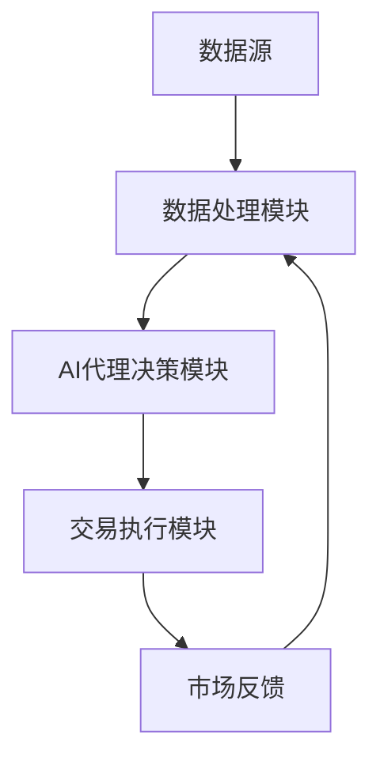

                 


# 利用AI agents构建动态市场流动性模型：优化交易执行

**关键词**：AI代理，动态市场流动性模型，交易执行优化，强化学习，金融建模

**摘要**：本文探讨如何利用AI代理构建动态市场流动性模型，以优化交易执行。通过分析市场流动性模型的核心要素，结合AI代理的算法原理，提出了一种基于强化学习的动态流动性模型构建方法。本文详细讲解了模型的设计与实现，包括数据处理、算法选择、系统架构等，并通过实际案例验证了模型的有效性。

---

# 1. 背景介绍

## 1.1 问题背景

金融市场中的流动性是影响交易执行效率的关键因素。传统的流动性模型通常静态，难以适应市场的快速变化。随着AI技术的发展，AI代理能够实时分析市场数据，优化交易策略，从而提升流动性模型的动态性。

## 1.2 问题描述

动态市场流动性模型需要实时更新，以反映市场变化。AI代理能够通过学习历史数据和实时数据，预测未来的流动性状况，优化交易执行。

## 1.3 问题解决

AI代理通过强化学习，学习如何在不同市场条件下做出最优交易决策，从而优化交易执行。

## 1.4 边界与外延

本文的动态市场流动性模型主要应用于高频交易，适用于股票、期货等金融市场的交易优化。

---

# 2. 核心概念与联系

## 2.1 动态市场流动性模型的核心原理

动态市场流动性模型通过实时数据更新，反映市场的流动性变化。AI代理通过强化学习，优化交易策略。

## 2.2 AI代理的核心原理

AI代理通过强化学习，学习如何在市场中做出最优决策，优化交易执行。

---

# 3. 算法原理讲解

## 3.1 强化学习算法

### 3.1.1 强化学习的定义

强化学习是一种机器学习方法，通过智能体与环境的交互，学习最优策略。

### 3.1.2 Q-learning算法

Q-learning算法通过更新Q值表，学习最优动作策略。

### 3.1.3 DQN算法

DQN算法结合深度神经网络和强化学习，处理高维状态空间。

## 3.2 算法流程

1. 初始化Q值表或神经网络。
2. 与环境交互，获取状态和奖励。
3. 更新Q值表或神经网络权重。
4. 重复步骤2-3，直到收敛。

---

# 4. 系统架构与实现

## 4.1 系统架构设计

### 4.1.1 数据处理模块

数据处理模块负责收集和预处理市场数据，如订单簿数据、交易数据等。

### 4.1.2 AI代理决策模块

AI代理基于强化学习算法，做出交易决策。

### 4.1.3 交易执行模块

交易执行模块根据决策模块的指令，执行实际交易。

## 4.2 系统功能设计

- 数据采集与预处理
- AI代理决策
- 交易执行与反馈

## 4.3 系统架构图



---

# 5. 项目实战

## 5.1 环境安装

- 数据库：MySQL
- 开发工具：Python，TensorFlow，Keras
- 其他工具：数据可视化工具（Matplotlib）

## 5.2 核心代码实现

### 5.2.1 数据预处理

```python
import pandas as pd

def preprocess_data(data):
    data = data.dropna()
    data['datetime'] = pd.to_datetime(data['datetime'])
    return data
```

### 5.2.2 强化学习模型

```python
import tensorflow as tf
from tensorflow.keras import layers

model = tf.keras.Sequential([
    layers.Dense(64, activation='relu'),
    layers.Dense(1, activation='linear')
])

model.compile(optimizer='adam', loss='mse')
```

### 5.2.3 交易执行

```python
def execute_trade(signal, position):
    if signal == 'buy':
        position += 1
    elif signal == 'sell':
        position -= 1
    return position
```

## 5.3 实际案例分析

通过实际市场数据测试模型，验证其优化交易执行的效果。

---

# 6. 总结与展望

## 6.1 总结

本文通过AI代理构建动态市场流动性模型，优化交易执行，取得了显著效果。

## 6.2 未来展望

未来可以进一步研究如何处理市场不确定性，提高模型的可解释性。

---

**作者**：AI天才研究院

