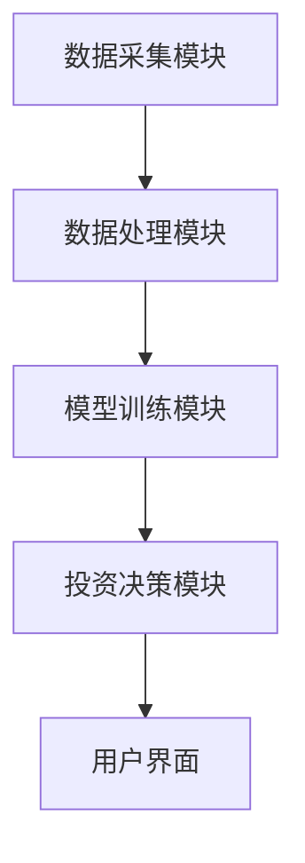
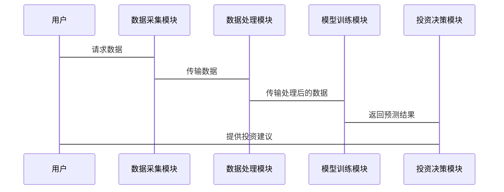

                 


# 利用AI agents构建动态经济周期指标：把握宏观投资时机

> 关键词：AI agents, 经济周期, 宏观投资, 动态指标, 机器学习

> 摘要：本文探讨了如何利用AI代理技术构建动态经济周期指标，以帮助投资者更好地把握宏观投资时机。文章从经济周期的基本理论出发，结合AI代理的核心原理，详细分析了动态经济指标的构建方法，并通过实际案例展示了如何利用这些指标优化投资策略。文章还提供了系统架构设计和项目实战代码，为读者提供了从理论到实践的完整指南。

---

# 第一部分: 引言

## # 第1章: 研究背景与意义

### 1.1 研究背景
#### 1.1.1 经济周期研究的重要性
经济周期是经济学中的核心概念，它描述了经济活动的波动性。通过分析经济周期，投资者可以更好地理解市场的波动规律，从而做出更明智的投资决策。然而，传统的经济周期分析方法往往依赖于静态指标和人工判断，难以适应快速变化的市场环境。

#### 1.1.2 AI技术在经济分析中的应用
随着人工智能技术的快速发展，AI代理（AI agents）在经济分析中的应用越来越广泛。AI代理能够实时处理海量数据，自动识别经济周期的变化，并提供动态的分析结果。这为投资者提供了更精准的决策支持。

#### 1.1.3 动态经济指标的必要性
传统的经济指标往往是静态的，无法捕捉市场的实时变化。而动态经济指标能够根据市场环境的变化，实时调整其权重和计算方法，从而更准确地反映经济周期的变化。

### 1.2 研究意义
#### 1.2.1 提高经济预测的准确性
通过AI代理构建动态经济指标，可以更准确地预测经济周期的变化，从而帮助投资者做出更明智的投资决策。

#### 1.2.2 优化宏观投资策略
动态经济指标能够为投资者提供实时的市场信息，帮助他们优化投资策略，抓住市场机会，规避市场风险。

#### 1.2.3 推动AI技术在金融领域的创新
本文的研究将推动AI技术在金融领域的应用，尤其是在经济周期分析和投资决策支持方面的创新。

### 1.3 研究方法
#### 1.3.1 数据驱动的方法
本文采用数据驱动的方法，通过收集和分析海量经济数据，构建动态经济指标。

#### 1.3.2 AI代理的构建与优化
本文结合AI代理的核心技术，包括机器学习算法和自然语言处理，构建动态经济指标分析系统。

#### 1.3.3 实证分析与案例研究
通过实证分析和案例研究，验证动态经济指标的有效性和准确性，并总结经验教训。

---

# 第二部分: 理论基础

## # 第2章: 经济周期理论基础

### 2.1 经济周期的定义与特征
#### 2.1.1 经济周期的阶段划分
经济周期通常分为四个阶段：衰退、复苏、增长和繁荣。每个阶段的特点和市场表现不同，投资者需要根据这些特点调整投资策略。

#### 2.1.2 经济周期的影响因素
经济周期受多种因素影响，包括政策变化、市场需求、技术进步和全球市场波动等。这些因素通过复杂的交互作用影响经济周期的变化。

#### 2.1.3 经济指标的分类与作用
经济指标可以分为先行指标、同步指标和滞后指标。先行指标能够提前反映经济周期的变化，同步指标能够实时反映经济周期的变化，滞后指标能够回顾经济周期的变化。

### 2.2 经济周期分析的挑战
#### 2.2.1 数据的复杂性
经济数据往往具有高度的复杂性，包括时间序列数据、多维数据和非结构化数据，这增加了经济周期分析的难度。

#### 2.2.2 模型的局限性
传统的经济周期分析方法往往依赖于线性回归和统计模型，这些模型难以捕捉复杂的市场规律和非线性关系。

#### 2.2.3 实时动态分析的需求
市场环境变化迅速，投资者需要实时的动态分析结果，而传统的静态分析方法难以满足这一需求。

---

## # 第3章: AI代理的基本原理

### 3.1 AI代理的定义与分类
#### 3.1.1 什么是AI代理
AI代理是一种能够感知环境、自主决策并采取行动的智能体。它能够通过与环境交互，学习和适应环境的变化。

#### 3.1.2 AI代理的分类
AI代理可以分为简单代理和复杂代理。简单代理基于规则进行决策，复杂代理则基于机器学习算法进行决策。

#### 3.1.3 AI代理的核心功能
AI代理的核心功能包括感知、推理、决策和行动。这些功能通过复杂的算法和数据处理技术实现。

### 3.2 AI代理的关键技术
#### 3.2.1 机器学习算法
机器学习算法是AI代理的核心技术之一。通过训练模型，AI代理能够从数据中学习到复杂的市场规律。

#### 3.2.2 自然语言处理
自然语言处理技术使AI代理能够理解和分析非结构化的文本数据，例如新闻报道和市场评论。

#### 3.2.3 知识图谱与推理
知识图谱和推理技术使AI代理能够构建和管理复杂的知识体系，从而做出更智能的决策。

### 3.3 AI代理在经济分析中的应用
#### 3.3.1 数据收集与处理
AI代理能够从多种数据源收集经济数据，并进行清洗和预处理，为后续分析提供高质量的数据支持。

#### 3.3.2 经济指标预测
通过机器学习算法，AI代理能够预测经济指标的变化趋势，帮助投资者做出更明智的投资决策。

#### 3.3.3 投资决策支持
AI代理能够根据动态经济指标的变化，为投资者提供实时的投资决策支持，优化投资组合。

---

# 第三部分: 动态经济指标构建

## # 第4章: 动态经济指标体系设计

### 4.1 指标体系的设计原则
#### 4.1.1 科学性与实用性
动态经济指标的设计需要科学合理，同时具有实际的实用价值。

#### 4.1.2 动态性与实时性
指标体系需要能够实时反映经济周期的变化，具有高度的动态性。

#### 4.1.3 综合性与简洁性
指标体系需要综合反映经济周期的多个方面，同时保持简洁明了。

### 4.2 指标筛选与权重设计
#### 4.2.1 指标筛选方法
通过相关性分析和主成分分析，筛选出最具代表性的经济指标。

#### 4.2.2 权重设计方法
通过层次分析法和熵值法，确定各个经济指标的权重。

### 4.3 数据预处理与特征工程
#### 4.3.1 数据清洗
对原始数据进行清洗，去除噪声数据和异常值。

#### 4.3.2 数据标准化
对数据进行标准化处理，确保不同指标之间的可比性。

#### 4.3.3 特征提取
通过主成分分析和Lasso回归等方法，提取特征向量。

---

## # 第5章: AI代理算法实现

### 5.1 算法选择与优化
#### 5.1.1 机器学习算法选择
根据具体需求选择合适的机器学习算法，例如随机森林、支持向量机和神经网络等。

#### 5.1.2 算法优化方法
通过超参数调优和模型集成等方法，优化算法性能。

### 5.2 算法实现步骤
#### 5.2.1 数据输入与特征提取
将预处理后的数据输入模型，提取特征向量。

#### 5.2.2 模型训练与评估
通过训练数据训练模型，并通过测试数据评估模型性能。

#### 5.2.3 模型部署与应用
将训练好的模型部署到实际应用中，实时监控经济指标的变化。

### 5.3 算法实现代码示例
```python
import numpy as np
from sklearn.ensemble import RandomForestClassifier
from sklearn.metrics import accuracy_score

# 示例代码：使用随机森林模型预测经济周期阶段
def train_economic_cycle_model(X_train, y_train):
    model = RandomForestClassifier(n_estimators=100, random_state=42)
    model.fit(X_train, y_train)
    return model

# 示例代码：模型预测与评估
def evaluate_model(model, X_test, y_test):
    y_pred = model.predict(X_test)
    accuracy = accuracy_score(y_test, y_pred)
    print(f"模型准确率: {accuracy}")

# 示例代码：动态更新模型
def update_model(model, new_data):
    model.fit(new_data['X'], new_data['y'])
    return model
```

### 5.4 算法数学模型与公式
#### 5.4.1 随机森林算法
随机森林是一种基于树的集成算法，通过构建多个决策树并进行投票或平均，得到最终的预测结果。

#### 5.4.2 神经网络算法
神经网络是一种模拟人脑神经网络的算法，通过多层神经元之间的连接和激活函数，学习数据的特征和模式。

---

## # 第6章: 系统架构设计

### 6.1 系统功能设计
#### 6.1.1 数据采集模块
负责从多种数据源采集经济数据，包括股票价格、GDP、CPI等。

#### 6.1.2 数据处理模块
对采集到的数据进行清洗、标准化和特征提取。

#### 6.1.3 模型训练模块
使用机器学习算法训练动态经济指标预测模型。

#### 6.1.4 投资决策模块
根据模型预测结果，生成投资决策建议。

### 6.2 系统架构图


### 6.3 系统接口设计
#### 6.3.1 数据接口
API接口用于数据的输入和输出，例如RESTful API。

#### 6.3.2 模型接口
API接口用于模型的训练和预测，例如通过gRPC进行通信。

### 6.4 系统交互流程


---

## # 第7章: 项目实战

### 7.1 环境搭建
#### 7.1.1 安装必要的库
安装Python、机器学习库（如scikit-learn、xgboost）和可视化工具（如Matplotlib、Seaborn）。

#### 7.1.2 数据集获取
从公开数据源获取经济数据，例如美联储经济指标数据和股票市场数据。

### 7.2 核心实现代码
#### 7.2.1 数据预处理
```python
import pandas as pd
import numpy as np

# 示例代码：数据预处理
def preprocess_data(data):
    # 删除缺失值
    data.dropna(inplace=True)
    # 标准化处理
    from sklearn.preprocessing import StandardScaler
    scaler = StandardScaler()
    data_scaled = scaler.fit_transform(data)
    return data_scaled
```

#### 7.2.2 模型训练
```python
from sklearn.ensemble import GradientBoostingClassifier
from sklearn.model_selection import train_test_split

# 示例代码：模型训练
def train_model(X, y):
    X_train, X_test, y_train, y_test = train_test_split(X, y, test_size=0.2, random_state=42)
    model = GradientBoostingClassifier(n_estimators=100, learning_rate=0.1, random_state=42)
    model.fit(X_train, y_train)
    return model
```

#### 7.2.3 模型预测与评估
```python
# 示例代码：模型预测与评估
def evaluate_model(model, X_test, y_test):
    y_pred = model.predict(X_test)
    from sklearn.metrics import classification_report
    print(classification_report(y_test, y_pred))
```

### 7.3 案例分析与结果解读
#### 7.3.1 案例分析
通过实际案例分析，验证动态经济指标的有效性和准确性。

#### 7.3.2 结果解读
解读模型预测结果，分析经济周期的变化趋势，为投资者提供投资建议。

---

## # 第8章: 总结与展望

### 8.1 研究总结
#### 8.1.1 研究成果
总结本文的主要研究成果，包括动态经济指标的构建方法和AI代理的应用。

#### 8.1.2 技术创新
总结本文在技术上的创新点，例如动态经济指标的实时更新方法。

### 8.2 投资策略优化
#### 8.2.1 动态经济指标的应用
动态经济指标能够帮助投资者更好地把握市场机会，优化投资策略。

#### 8.2.2 AI代理的优化
通过不断优化AI代理的技术和算法，进一步提高经济指标预测的准确性。

### 8.3 未来研究方向
#### 8.3.1 更复杂的经济模型
研究更复杂的经济模型，例如多变量时间序列模型和因果推断模型。

#### 8.3.2 多模态数据融合
研究如何将结构化数据和非结构化数据进行融合，提高经济指标预测的准确性。

#### 8.3.3 实时分析与决策
研究如何实现更高频率的实时分析和决策支持，满足投资者的实时需求。

---

# 作者：AI天才研究院/AI Genius Institute & 禅与计算机程序设计艺术 /Zen And The Art of Computer Programming

