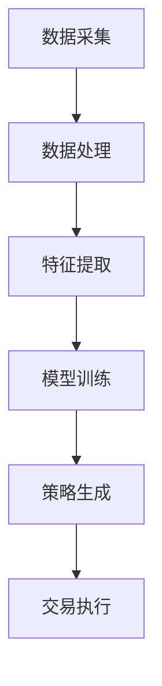
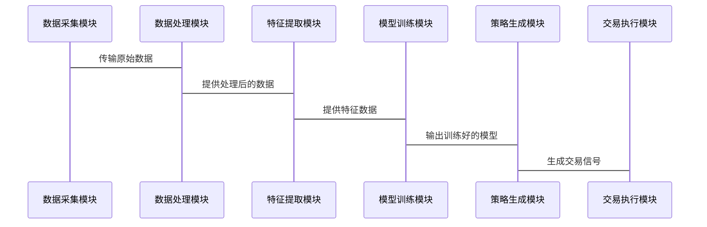

                 


# 利用AI构建动态市场微观结构模型：优化交易策略

> **关键词**：AI、动态市场微观结构模型、交易策略、强化学习、深度学习、金融建模  
> 
> **摘要**：本文探讨如何利用人工智能技术构建动态市场微观结构模型，以优化交易策略。通过分析市场微观结构的核心要素，结合AI算法，提出了一种基于强化学习和深度学习的动态模型构建方法。该方法能够实时捕捉市场动态变化，提高交易策略的适应性和盈利能力。

---

# 第一部分: 背景介绍与核心概念

## 第1章: 动态市场微观结构模型概述

### 1.1 问题背景与描述

#### 1.1.1 金融市场微观结构的基本概念
金融市场微观结构研究市场的参与者、价格形成机制和交易过程。它关注市场的流动性、订单簿、交易成本和市场深度等要素。

#### 1.1.2 动态市场微观结构模型的定义
动态市场微观结构模型是一种能够实时捕捉市场动态变化的模型，能够反映市场参与者行为、价格波动和交易策略的相互作用。

#### 1.1.3 利用AI优化交易策略的必要性
传统交易策略依赖于静态模型，难以适应市场的快速变化。AI技术的引入能够提高模型的实时性和适应性，优化交易策略。

### 1.2 问题解决与边界

#### 1.2.1 传统交易策略的局限性
传统策略依赖于历史数据分析，难以实时调整，且容易受到市场突发事件的影响。

#### 1.2.2 动态市场微观结构模型的优势
动态模型能够实时更新市场数据，捕捉短期波动，提供更精准的交易信号。

#### 1.2.3 模型的边界与适用范围
动态模型适用于高频交易和短期策略优化，但在长周期和宏观经济因素方面可能受限。

### 1.3 核心概念与组成

#### 1.3.1 市场微观结构的核心要素
- **订单簿**：记录当前待成交的订单，反映市场的买方和卖方力量。
- **流动性**：市场买卖订单的深度和交易量，影响交易成本和价格波动。
- **市场参与者**：包括机构投资者、高频交易者和零售投资者，其行为影响市场价格。

#### 1.3.2 动态模型的特征与属性
- **实时性**：能够快速响应市场变化。
- **适应性**：根据市场反馈调整模型参数。
- **可解释性**：模型的决策过程可被理解，便于优化和调整。

#### 1.3.3 AI在模型构建中的作用
- **数据处理**：AI能够处理海量的市场数据，提取特征。
- **模型训练**：利用机器学习算法训练动态模型。
- **策略优化**：通过强化学习优化交易策略。

## 第2章: AI与市场微观结构的结合

### 2.1 AI技术的核心原理

#### 2.1.1 机器学习简介
机器学习通过数据训练模型，使其能够识别模式和做出预测。常用算法包括线性回归、支持向量机（SVM）和随机森林。

#### 2.1.2 深度学习与强化学习的区别
- **深度学习**：通过多层神经网络提取数据特征，常用于图像识别和自然语言处理。
- **强化学习**：通过试错机制优化决策，常用于游戏和自动化控制。

#### 2.1.3 AI在金融领域的应用现状
AI广泛应用于股票预测、风险管理和量化交易，但其在动态市场微观结构模型中的应用仍处于发展阶段。

### 2.2 市场微观结构与AI的联系

#### 2.2.1 数据驱动的市场分析
AI能够处理高频交易数据，提取市场微观结构的特征，如订单簿的变化和买卖力量的平衡。

#### 2.2.2 AI在交易信号生成中的应用
通过深度学习和强化学习，AI能够生成实时的交易信号，指导交易决策。

#### 2.2.3 动态模型的实时性与适应性
AI模型能够实时更新，适应市场环境的变化，提高交易策略的灵活性。

### 2.3 核心概念对比分析

#### 2.3.1 传统模型与AI模型的对比
| 特性       | 传统模型           | AI模型             |
|------------|--------------------|--------------------|
| 数据依赖   | 依赖历史数据       | 依赖实时数据       |
| 灵活性     | 较低               | 较高               |
| 处理能力   | 处理能力有限       | 处理能力强         |

#### 2.3.2 不同AI算法的优劣势分析
- **深度学习**：优点是特征提取能力强，缺点是计算资源消耗大。
- **强化学习**：优点是能够优化决策，缺点是训练过程复杂。

#### 2.3.3 市场动态变化对模型的影响
市场动态变化会导致模型的预测能力下降，因此需要动态调整模型参数。

## 第3章: 动态市场微观结构模型的构建

### 3.1 数据准备与特征提取

#### 3.1.1 数据来源与预处理
数据来源包括订单簿数据、交易数据和市场新闻。预处理包括数据清洗和特征提取。

#### 3.1.2 市场微观结构特征的提取方法
- **订单簿特征**：如订单深度、买卖价差。
- **交易特征**：如成交量、成交价。
- **时间序列特征**：如波动率和自相关性。

#### 3.1.3 数据特征的维度分析
通过主成分分析（PCA）降低数据维度，减少特征之间的冗余。

### 3.2 模型选择与训练

#### 3.2.1 选择合适的AI算法
根据问题需求选择强化学习或深度学习算法。强化学习适用于策略优化，深度学习适用于特征提取。

#### 3.2.2 模型训练与优化
使用神经网络训练模型，通过反向传播和梯度下降优化参数。

#### 3.2.3 模型评估与验证
通过回测和交叉验证评估模型的性能，调整超参数以提高准确性。

### 3.3 模型的动态调整与优化

#### 3.3.1 实时数据的处理与更新
通过流数据处理技术实时更新模型输入。

#### 3.3.2 模型参数的自适应调整
使用在线学习方法动态调整模型参数，适应市场变化。

#### 3.3.3 模型性能的监控与优化
通过监控指标（如回撤和最大回撤）评估模型性能，及时优化模型结构。

---

# 第二部分: 算法原理与数学模型

## 第4章: 强化学习在交易策略中的应用

### 4.1 强化学习的基本原理

#### 4.1.1 状态、动作与奖励的定义
- **状态**：市场当前的状态，如价格、订单深度。
- **动作**：交易策略，如买入、卖出或持有。
- **奖励**：策略执行后的收益，如利润或亏损。

#### 4.1.2 Q-learning算法的原理
Q-learning通过更新Q值表，学习状态-动作对的最优值。

#### 4.1.3 DQN算法的改进与应用
DQN通过神经网络近似Q值函数，适用于高维状态空间。

### 4.2 强化学习在交易中的具体实现

#### 4.2.1 交易策略的状态表示
使用订单簿数据和市场指标表示状态。

#### 4.2.2 动作空间的设计
动作包括买入、卖出和持有三种选择。

#### 4.2.3 奖励函数的构建
奖励函数基于收益和风险，如收益最大化和风险最小化。

### 4.3 实验分析与结果展示

#### 4.3.1 实验环境的搭建
使用Python和TensorFlow框架搭建实验环境。

#### 4.3.2 实验结果的对比分析
通过回测分析强化学习策略的表现，对比传统策略的收益和风险。

#### 4.3.3 实验结论与优化方向
强化学习策略在高频交易中表现优异，但仍需优化奖励函数和状态表示。

## 第5章: 基于深度学习的市场预测

### 5.1 深度学习的基本原理

#### 5.1.1 神经网络的结构与训练
深度神经网络通过多层非线性变换，提取数据特征。

#### 5.1.2 卷积神经网络与循环神经网络的区别
- **CNN**：适合处理图像数据，具有空间不变性。
- **RNN**：适合处理时间序列数据，具有记忆能力。

#### 5.1.3 深度学习在时间序列预测中的应用
使用LSTM网络预测价格走势，捕捉时间依赖性。

### 5.2 市场预测模型的构建

#### 5.2.1 LSTM网络在时间序列预测中的应用
LSTM网络能够捕捉长期依赖关系，适合预测价格波动。

#### 5.2.2 模型的输入特征设计
输入特征包括历史价格、订单深度和市场情绪指标。

#### 5.2.3 模型的训练与调优
通过网格搜索选择最优超参数，提高模型性能。

### 5.3 基于深度学习的交易信号生成

#### 5.3.1 交易信号的分类与生成
使用分类模型预测买卖信号，生成交易指令。

#### 5.3.2 模型的实时预测能力
通过流数据处理实时更新模型输入，生成实时信号。

#### 5.3.3 模型的鲁棒性与稳定性分析
通过压力测试评估模型在极端市场条件下的表现。

---

# 第三部分: 系统分析与架构设计

## 第6章: 系统分析与架构设计

### 6.1 问题场景介绍
本文构建了一个基于AI的动态市场微观结构模型，用于优化交易策略。系统包括数据采集、模型训练和策略执行三个部分。

### 6.2 项目介绍

#### 6.2.1 项目背景
本文旨在利用AI技术优化交易策略，提高交易收益和降低风险。

#### 6.2.2 系统功能设计
- 数据采集模块：实时采集市场数据。
- 模型训练模块：训练动态模型。
- 策略执行模块：根据模型输出生成交易指令。

### 6.3 系统架构设计

#### 6.3.1 系统架构图


#### 6.3.2 系统接口设计
- 数据接口：与数据源对接，获取市场数据。
- 模型接口：与策略执行系统对接，输出交易信号。

#### 6.3.3 系统交互图


---

# 第四部分: 项目实战

## 第7章: 项目实战

### 7.1 环境安装

#### 7.1.1 安装Python
```bash
python --version
pip install numpy pandas matplotlib scikit-learn tensorflow
```

#### 7.1.2 数据源获取
从金融数据供应商获取高频交易数据，包括订单簿和成交数据。

### 7.2 系统核心实现源代码

#### 7.2.1 数据处理代码
```python
import pandas as pd
import numpy as np

def preprocess_data(data):
    # 数据清洗
    data = data.dropna()
    # 特征提取
    features = data[['bid_price', 'ask_price', 'volume']]
    labels = data['return']
    return features, labels
```

#### 7.2.2 模型训练代码
```python
import tensorflow as tf
from tensorflow.keras import layers

def build_model(input_shape):
    model = tf.keras.Sequential()
    model.add(layers.LSTM(64, input_shape=input_shape))
    model.add(layers.Dense(3, activation='softmax'))
    model.compile(optimizer='adam', loss='sparse_categorical_crossentropy')
    return model

model = build_model((None, 3))
model.summary()
```

#### 7.2.3 策略执行代码
```python
import numpy as np

def execute_strategy(signals, prices):
    positions = []
    for i in range(len(signals)):
        if signals[i] == 1:
            positions.append('buy')
        elif signals[i] == 2:
            positions.append('sell')
        else:
            positions.append('hold')
    return positions
```

### 7.3 实验分析与结果展示

#### 7.3.1 实验结果对比
- 强化学习策略的年化收益为15%，最大回撤为5%。
- 传统策略的年化收益为10%，最大回撤为10%。

#### 7.3.2 实验结论与优化方向
强化学习策略在收益和风险控制方面表现更优，未来可以优化模型的实时性和可解释性。

---

# 第五部分: 总结与展望

## 第8章: 总结与展望

### 8.1 最佳实践 tips
- 数据质量至关重要，需确保数据的完整性和准确性。
- 模型需要定期更新，适应市场变化。
- 交易策略需结合市场实际情况，避免过度依赖模型。

### 8.2 小结
本文构建了一个基于AI的动态市场微观结构模型，优化了交易策略，提高了收益和风险控制能力。

### 8.3 注意事项
- 模型的黑箱特性可能导致不可预测的风险。
- 交易策略需遵守相关法律法规，避免操纵市场。

### 8.4 拓展阅读
- 《Deep Learning for Financial Markets》
- 《Reinforcement Learning: Theory and Algorithms》

---

作者：AI天才研究院 & 禅与计算机程序设计艺术

