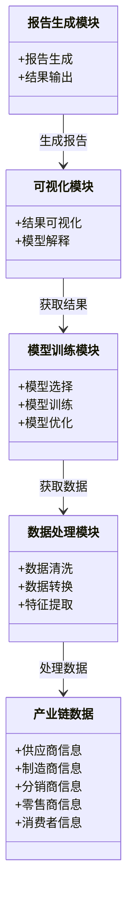
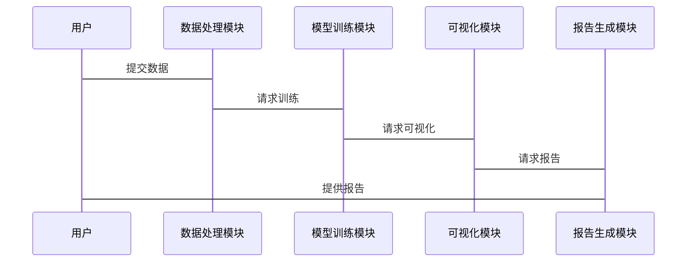

                 


# 利用AI构建自适应型产业链分析模型：全面把握公司地位

> 关键词：AI, 产业链分析, 自适应模型, 企业地位, 数据分析, 机器学习, 深度学习

> 摘要：本文详细探讨了如何利用人工智能技术构建自适应型产业链分析模型，全面把握企业的市场地位。文章从背景介绍、核心概念、算法原理、系统架构设计、项目实战到小结，层层递进，详细阐述了AI在产业链分析中的应用。通过丰富的图表和代码示例，帮助读者深入理解如何利用AI技术实现企业竞争力的提升。

---

## 第一部分: 产业链分析与AI的结合

### 第1章: 产业链分析的背景与意义

#### 1.1 产业链分析的基本概念

##### 1.1.1 产业链的定义与构成

产业链是指一系列相关的生产、分配和消费活动的链条。它由供应商、制造商、分销商、零售商和消费者组成，每个环节都相互关联，共同完成产品的生命周期。产业链分析的核心目标是理解各个环节之间的关系，以及每个环节对企业整体竞争力的影响。

##### 1.1.2 产业链分析的重要性

在现代商业环境中，企业需要面对复杂多变的市场环境。产业链分析能够帮助企业识别关键节点，优化资源配置，提升效率。传统的产业链分析依赖于人工经验和数据统计，但在数据量和复杂性日益增加的今天，这种方法已难以满足需求。因此，引入AI技术成为必然趋势。

##### 1.1.3 AI在产业链分析中的作用

AI技术可以通过大数据分析、机器学习和深度学习，快速识别产业链中的潜在问题和机会。例如，AI可以预测市场趋势、评估竞争对手的动向、优化供应链管理等。通过AI构建的自适应型产业链分析模型，企业能够实时调整策略，保持竞争优势。

#### 1.2 企业地位分析的挑战

##### 1.2.1 传统产业链分析的局限性

传统产业链分析主要依赖于经验判断和简单的数据统计，存在以下问题：

- 数据来源单一，难以全面覆盖产业链的各个环节。
- 分析结果缺乏动态性，无法实时反映市场变化。
- 分析深度不足，难以挖掘深层次的市场规律。

##### 1.2.2 数据量与复杂性的双重挑战

现代产业链涉及的环节众多，数据量庞大且复杂。企业需要处理结构化和非结构化数据，包括文本、图像、视频等多种形式。如何高效处理这些数据，是产业链分析面临的重大挑战。

##### 1.2.3 自适应型模型的必要性

自适应型模型能够根据市场变化动态调整分析策略，实时更新数据，提供更精准的分析结果。这种模型能够帮助企业在复杂多变的市场环境中保持竞争优势。

### 第2章: 自适应型产业链分析模型的核心概念

#### 2.1 产业链分析模型的类型

##### 2.1.1 基于规则的传统模型

基于规则的传统模型依赖于预先设定的规则和条件，适用于简单的场景。但在复杂多变的市场环境中，这种模型难以适应变化。

##### 2.1.2 基于机器学习的模型

基于机器学习的模型能够通过数据训练，自动提取特征，发现潜在规律。这种模型适用于复杂场景，能够提供更精准的分析结果。

##### 2.1.3 自适应型模型的特点

自适应型模型结合了规则和机器学习的优势，能够根据市场变化动态调整分析策略。这种模型具有高度的灵活性和适应性，适用于复杂的市场环境。

#### 2.2 模型构建的核心要素

##### 2.2.1 数据来源与处理

数据来源包括企业内部数据、公开数据、社交媒体数据等。数据处理包括清洗、转换、特征提取等步骤，确保数据质量。

##### 2.2.2 模型训练与优化

通过机器学习算法对数据进行训练，优化模型参数，提升模型性能。常用算法包括随机森林、支持向量机、神经网络等。

##### 2.2.3 结果可视化与解释

通过可视化工具将模型结果以图表形式展示，帮助用户理解分析结果。同时，模型需要具备可解释性，能够清晰地解释分析结果的原因。

#### 2.3 产业链分析的ER实体关系图

```mermaid
erDiagram
    actor 顾客
    actor 供应商
    actor 企业
    actor 政府机构
    actor 行业专家
    database 产业链数据
    database 市场动态
    database 企业绩效
    database 竞争对手分析
    boundary 产业链分析系统
    boundary 数据处理模块
    boundary 模型训练模块
    boundary 可视化模块
    boundary 报告生成模块
    顾客 --> 数据处理模块: 提供需求
    供应商 --> 数据处理模块: 提供数据
    企业 --> 数据处理模块: 提供内部数据
    政府机构 --> 数据处理模块: 提供政策数据
    行业专家 --> 数据处理模块: 提供专业知识
    数据处理模块 --> 产业链数据: 存储处理后的数据
    数据处理模块 --> 模型训练模块: 提供训练数据
    模型训练模块 --> 可视化模块: 提供分析结果
    可视化模块 --> 报告生成模块: 生成报告
    报告生成模块 --> 顾客: 提供分析报告
```

### 第3章: 自适应型模型的算法原理

#### 3.1 基于机器学习的模型构建

##### 3.1.1 机器学习算法的选择

常用的机器学习算法包括线性回归、逻辑回归、支持向量机、随机森林、梯度提升树等。选择合适的算法需要考虑数据类型、样本数量、计算资源等因素。

##### 3.1.2 模型训练与优化

通过数据训练模型，调整模型参数，提升模型性能。常用优化方法包括交叉验证、网格搜索、早停等。

##### 3.1.3 模型评估与部署

通过评估指标（如准确率、召回率、F1分数等）评估模型性能。部署模型到实际环境中，实时处理数据，提供分析结果。

#### 3.2 基于深度学习的模型构建

##### 3.2.1 深度学习的基本概念

深度学习是一种基于人工神经网络的机器学习方法，能够自动提取数据特征，适用于复杂场景。

##### 3.2.2 常用深度学习模型

常用的深度学习模型包括卷积神经网络（CNN）、循环神经网络（RNN）、长短时记忆网络（LSTM）、生成对抗网络（GAN）等。

##### 3.2.3 深度学习在产业链分析中的应用

深度学习可以应用于图像识别、自然语言处理、时间序列分析等领域，帮助企业发现潜在的市场机会和风险。

#### 3.3 算法实现的代码示例

##### 3.3.1 使用Python的机器学习实现

```python
import pandas as pd
from sklearn.model import LinearRegression

# 数据加载
data = pd.read_csv('产业链数据.csv')

# 特征选择
X = data[['供应商', '制造商', '分销商', '零售商']]
y = data['企业绩效']

# 模型训练
model = LinearRegression()
model.fit(X, y)

# 预测结果
predictions = model.predict(X)
print('预测值:', predictions)
print('真实值:', y)
```

##### 3.3.2 使用深度学习的实现

```python
import tensorflow as tf
from tensorflow.keras import layers

# 数据加载
data = pd.read_csv('产业链数据.csv')

# 特征选择
X = data[['供应商', '制造商', '分销商', '零售商']]
y = data['企业绩效']

# 数据预处理
X_train = X
y_train = y

# 深度学习模型构建
model = tf.keras.Sequential([
    layers.Dense(64, activation='relu'),
    layers.Dense(1, activation='sigmoid')
])

model.compile(optimizer='adam', loss='binary_crossentropy', metrics=['accuracy'])

# 模型训练
model.fit(X_train, y_train, epochs=10, batch_size=32)
```

### 第4章: 系统分析与架构设计方案

#### 4.1 问题场景介绍

企业需要实时监控市场动态，快速响应市场变化。传统的产业链分析方法无法满足实时性和动态性要求。

#### 4.2 系统功能设计

##### 4.2.1 领域模型



##### 4.2.2 系统架构设计


##### 4.2.3 系统接口设计

系统接口包括数据输入接口、模型训练接口、结果查询接口等。每个接口都需要定义明确的输入输出格式。

##### 4.2.4 系统交互流程



### 第5章: 项目实战

#### 5.1 环境安装

需要安装Python、TensorFlow、Keras、Pandas等库。安装命令如下：

```bash
pip install python
pip install tensorflow
pip install keras
pip install pandas
```

#### 5.2 系统核心实现源代码

##### 5.2.1 数据处理模块

```python
import pandas as pd

def data_cleaning(data):
    # 清洗数据
    data = data.dropna()
    data = data.drop_duplicates()
    return data

def data_transformation(data):
    # 数据转换
    data = data.astype('float32')
    return data

def feature_engineering(data):
    # 特征工程
    data = data.drop(['id'], axis=1)
    return data

# 数据加载
data = pd.read_csv('产业链数据.csv')

# 数据处理
cleaned_data = data_cleaning(data)
transformed_data = data_transformation(cleaned_data)
engineered_data = feature_engineering(transformed_data)
```

##### 5.2.2 模型训练模块

```python
from sklearn.model import LinearRegression

def model_training(data, target):
    # 模型训练
    X = data.drop(target, axis=1)
    y = data[target]
    model = LinearRegression()
    model.fit(X, y)
    return model

# 数据加载
data = pd.read_csv('产业链数据.csv')

# 模型训练
model = model_training(data, '企业绩效')
```

##### 5.2.3 可视化模块

```python
import matplotlib.pyplot as plt

def data_visualization(data):
    # 数据可视化
    plt.scatter(data['供应商'], data['企业绩效'])
    plt.xlabel('供应商')
    plt.ylabel('企业绩效')
    plt.title('供应商与企业绩效的关系')
    plt.show()

# 数据加载
data = pd.read_csv('产业链数据.csv')

# 数据可视化
data_visualization(data)
```

##### 5.2.4 报告生成模块

```python
def report_generation(data, model):
    # 报告生成
    predictions = model.predict(data.drop('企业绩效', axis=1))
    report = pd.DataFrame({'实际值': data['企业绩效'], '预测值': predictions})
    return report

# 数据加载
data = pd.read_csv('产业链数据.csv')

# 模型训练
model = model_training(data, '企业绩效')

# 报告生成
report = report_generation(data, model)
print(report)
```

#### 5.3 实际案例分析

以某制造企业为例，通过自适应型产业链分析模型，分析其在市场中的地位。首先，数据处理模块清洗和转换数据，提取关键特征。然后，模型训练模块选择合适的算法，训练模型。最后，可视化模块和报告生成模块提供分析结果和报告。

### 第6章: 最佳实践与小结

#### 6.1 最佳实践 tips

- 数据预处理是关键，确保数据质量和准确性。
- 选择合适的算法，结合业务需求进行模型优化。
- 可视化结果，帮助用户更好地理解和应用分析结果。

#### 6.2 小结

通过本文的详细讲解，读者可以全面了解如何利用AI构建自适应型产业链分析模型。从背景介绍到算法实现，从系统设计到项目实战，每一步都详细展开，帮助读者掌握核心技术和实践方法。

#### 6.3 注意事项

- 数据隐私和安全问题需要高度重视。
- 模型需要定期更新，以适应市场变化。
- 系统设计需要考虑可扩展性和可维护性。

#### 6.4 拓展阅读

- 《机器学习实战》
- 《深度学习》
- 《数据挖掘导论》

---

作者：AI天才研究院/AI Genius Institute & 禅与计算机程序设计艺术 /Zen And The Art of Computer Programming

