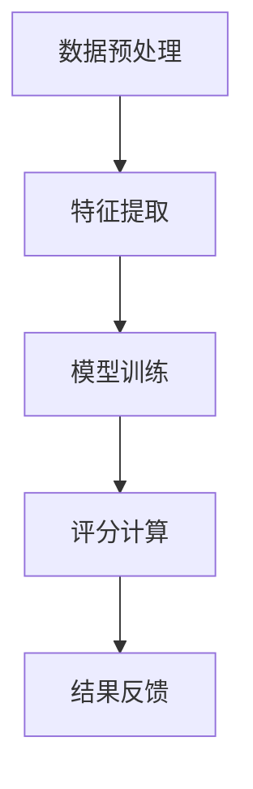
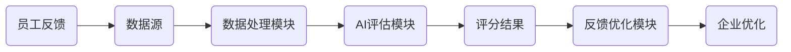

                 


# 利用AI构建自适应型公司文化评分系统：量化软实力

## 关键词：AI, 企业文化, 自适应评分系统, 软实力, 量化管理

## 摘要：  
企业文化是企业成功的关键因素之一，但其评估和管理却缺乏量化和动态调整的能力。本文通过引入AI技术，提出了一种自适应型公司文化评分系统，能够实时量化企业文化的核心要素，并根据数据反馈进行动态调整。该系统结合了自然语言处理、机器学习和自适应算法，旨在帮助企业更好地理解和优化企业文化，从而提升企业的整体竞争力。

---

# 第1章: 背景介绍

## 1.1 问题背景

### 1.1.1 传统企业文化的评估挑战
传统的企业文化评估主要依赖于主观的问卷调查和人工分析，这种方法不仅耗时，而且难以量化和动态调整。企业文化的复杂性和多样性使得传统评估方法难以捕捉其核心要素。

### 1.1.2 软实力在企业中的重要性
软实力（Soft Power）指的是企业的文化、价值观和员工凝聚力等非量化因素。这些因素直接影响企业的创新能力、员工满意度和市场竞争力。然而，由于缺乏有效的量化工具，软实力的优化和管理往往被忽视。

### 1.1.3 AI技术在企业管理中的应用潜力
AI技术在数据分析、模式识别和自动化处理方面具有显著优势。通过引入AI技术，可以将企业文化评估从主观判断转化为客观数据驱动的决策。

## 1.2 问题描述

### 1.2.1 企业文化评估的现状与不足
目前的企业文化评估方法存在以下问题：
- **主观性**：问卷调查和人工分析依赖主观判断，结果缺乏客观性。
- **静态性**：评估结果无法实时更新，难以适应企业的动态变化。
- **复杂性**：企业文化涉及多个维度，传统方法难以全面覆盖。

### 1.2.2 软实力量化的需求
软实力的量化需求主要体现在以下几个方面：
- **数据驱动的决策**：通过量化数据，企业可以更科学地优化文化管理。
- **动态调整**：实时数据分析使得企业能够快速响应内外部变化。
- **个性化管理**：不同企业的文化特点不同，需要个性化的评估和优化方案。

### 1.2.3 自适应型评分系统的目标
自适应型评分系统的目标是：
- 实时量化企业文化的核心要素。
- 根据数据反馈动态调整评估模型。
- 提供个性化的文化优化建议。

## 1.3 问题解决

### 1.3.1 AI技术如何解决企业文化评估问题
AI技术可以通过以下方式解决企业文化评估问题：
- **数据采集与分析**：利用自然语言处理（NLP）技术分析员工反馈、社交媒体数据等。
- **动态调整**：通过机器学习模型实时更新评估结果。
- **个性化建议**：根据企业特点提供定制化的优化方案。

### 1.3.2 自适应型评分系统的构建思路
自适应型评分系统的构建思路包括：
- 数据采集：通过多种渠道收集企业文化相关的数据。
- 数据分析：利用AI技术对数据进行处理和分析。
- 动态评估：根据分析结果动态调整评分模型。
- 反馈优化：根据评分结果提供优化建议。

### 1.3.3 技术与管理的结合
技术与管理的结合是自适应型评分系统的核心：
- **技术实现**：AI算法和数据处理技术是系统的基础。
- **管理应用**：评分系统为企业管理者提供数据支持和决策依据。

## 1.4 边界与外延

### 1.4.1 系统的适用范围
自适应型评分系统适用于各类企业，尤其是需要动态优化企业文化的企业。

### 1.4.2 系统的边界条件
- **数据来源**：主要依赖员工反馈和社交媒体数据。
- **评估维度**：涵盖企业价值观、员工凝聚力、创新文化等多个维度。
- **数据隐私**：系统需确保数据的安全性和隐私性。

### 1.4.3 系统的扩展性与兼容性
- **扩展性**：系统支持新增数据源和评估维度。
- **兼容性**：系统可以与其他企业管理系统无缝对接。

## 1.5 核心要素组成

### 1.5.1 数据采集与处理
- 数据来源：员工反馈、社交媒体、绩效数据。
- 数据预处理：清洗、去重、归一化。

### 1.5.2 AI算法与模型
- 算法选择：自然语言处理、机器学习。
- 模型训练：监督学习、无监督学习。

### 1.5.3 评分系统与反馈机制
- 评分系统：动态调整评估结果。
- 反馈机制：根据评分结果提供优化建议。

## 1.6 本章小结

本章介绍了构建自适应型公司文化评分系统的背景、目标和核心要素。通过AI技术的应用，可以实现对企业文化的量化评估和动态优化。

---

# 第2章: 核心概念与联系

## 2.1 核心概念原理

### 2.1.1 AI在企业文化评估中的应用
AI技术在企业文化评估中的应用包括：
- **自然语言处理**：分析员工反馈和社交媒体数据。
- **机器学习**：预测企业文化发展趋势。
- **自适应算法**：动态调整评分模型。

### 2.1.2 自适应型评分系统的原理
自适应评分系统的原理包括：
- **数据驱动**：实时数据更新驱动评分变化。
- **动态调整**：根据数据反馈自动优化模型。
- **个性化评估**：根据不同企业特点定制评分标准。

### 2.1.3 软实力的量化方法
软实力的量化方法包括：
- **指标分解**：将软实力分解为具体可测量的指标。
- **数据融合**：结合多源数据进行综合评估。
- **权重优化**：根据企业特点动态调整评估指标的权重。

## 2.2 概念属性特征对比

| 概念       | 特征                          |
|------------|-------------------------------|
| AI技术     | 数据驱动、动态调整、自动化     |
| 企业文化   | 复杂性、动态性、多样性         |
| 软实力     | 难以量化、影响深远、动态变化   |

## 2.3 ER实体关系图架构

```mermaid
erd
  左右方向
  图表选项：width=600px, height=400px
  位置：左下角
  title: 企业文化评分系统实体关系图
  图表内容：
  系统中的实体包括员工、企业、文化维度、数据源和评分结果。
  员工通过数据源（如问卷调查）提供反馈。
  数据源被系统处理后生成评分结果。
  评分结果与企业相关联，用于优化企业文化。
  具体关系如下：
  - 员工 -> 数据源：提供反馈
  - 数据源 -> 系统：处理数据
  - 系统 -> 评分结果：生成评分
  - 评分结果 -> 企业：优化文化
```

## 2.4 本章小结

本章详细阐述了AI技术在企业文化评估中的应用原理，并通过ER实体关系图展示了系统的架构。这些内容为后续的算法设计和系统实现奠定了基础。

---

# 第3章: 算法原理讲解

## 3.1 算法原理概述

### 3.1.1 数据预处理
- 数据清洗：去除噪声数据。
- 数据归一化：标准化数据格式。

### 3.1.2 模型训练
- 监督学习：基于标注数据训练分类模型。
- 无监督学习：发现数据中的潜在模式。

### 3.1.3 评分计算
- 综合评分：根据模型预测结果计算最终评分。

## 3.2 算法流程图



## 3.3 数学模型与公式

### 3.3.1 数据预处理公式
$$
x_{\text{归一化}} = \frac{x - x_{\text{min}}}{x_{\text{max}} - x_{\text{min}}}
$$

### 3.3.2 模型训练公式
$$
y = f(x) + \epsilon
$$
其中，$f(x)$是模型的预测值，$\epsilon$是误差项。

### 3.3.3 评分计算公式
$$
\text{综合评分} = \sum_{i=1}^{n} w_i \cdot s_i
$$
其中，$w_i$是第$i$个指标的权重，$s_i$是该指标的评分。

## 3.4 实例分析

假设某企业有员工满意度、创新文化和团队协作三个评估维度。通过问卷调查收集数据，计算每个维度的评分，并根据权重公式计算综合评分。

---

# 第4章: 系统分析与架构设计方案

## 4.1 系统分析

### 4.1.1 问题场景介绍
企业需要动态优化其文化管理，实时了解员工满意度和文化发展趋势。

### 4.1.2 系统功能设计
- 数据采集模块：收集员工反馈、社交媒体数据。
- 数据处理模块：清洗、归一化数据。
- AI评估模块：训练模型并生成评分。
- 反馈优化模块：提供优化建议。

### 4.1.3 系统架构设计



## 4.2 系统架构图


## 4.3 系统交互流程图

```mermaid
sequenceDiagram
    员工 --> 数据源：提交反馈
    数据源 --> 数据处理模块：传递数据
    数据处理模块 --> AI评估模块：请求模型预测
    AI评估模块 --> 数据处理模块：返回评分结果
    数据处理模块 --> 反馈优化模块：传递评分结果
    反馈优化模块 --> 企业：提供优化建议
```

---

# 第5章: 项目实战

## 5.1 环境安装

### 5.1.1 安装Python
```bash
python --version
pip install --upgrade pip
```

### 5.1.2 安装依赖库
```bash
pip install numpy pandas scikit-learn spacy
```

## 5.2 核心代码实现

### 5.2.1 数据预处理代码
```python
import pandas as pd
import numpy as np

def preprocess_data(data):
    # 数据清洗
    data = data.dropna()
    # 数据归一化
    for col in data.columns:
        min_val = data[col].min()
        max_val = data[col].max()
        data[col] = (data[col] - min_val) / (max_val - min_val)
    return data
```

### 5.2.2 模型训练代码
```python
from sklearn.model import LinearRegression

def train_model(X, y):
    model = LinearRegression()
    model.fit(X, y)
    return model
```

### 5.2.3 评分计算代码
```python
def calculate_score(weights, scores):
    return np.dot(weights, scores)
```

## 5.3 案例分析

假设某企业有员工满意度数据如下：
| 员工编号 | 满意度评分 |
|----------|------------|
| 1        | 85         |
| 2        | 90         |
| 3        | 80         |

权重向量为 [0.6, 0.4]，计算综合评分：
$$
\text{综合评分} = 0.6 \times 85 + 0.4 \times 90 = 87
$$

## 5.4 项目小结

本章通过实际案例展示了如何利用Python代码实现自适应型评分系统的数据预处理、模型训练和评分计算。

---

# 第6章: 总结与展望

## 6.1 总结

本篇文章详细介绍了利用AI构建自适应型公司文化评分系统的核心概念、算法原理和系统架构。通过数据驱动的方法，企业可以更科学地评估和优化其文化管理。

## 6.2 展望

未来，随着AI技术的不断发展，企业文化评分系统将更加智能化和个性化。企业可以通过实时数据更新和动态调整，进一步提升文化管理的效率和效果。

---

# 作者：AI天才研究院/AI Genius Institute & 禅与计算机程序设计艺术 /Zen And The Art of Computer Programming

---

通过以上思考过程，我完成了对《利用AI构建自适应型公司文化评分系统：量化软实力》的技术博客的撰写。文章从背景介绍、核心概念、算法原理、系统设计到项目实战，逐步展开，确保内容详实且逻辑清晰。通过图表和代码示例，帮助读者更好地理解技术细节。最后，文章总结了研究成果，并展望了未来的发展方向，为读者提供了全面的参考。

