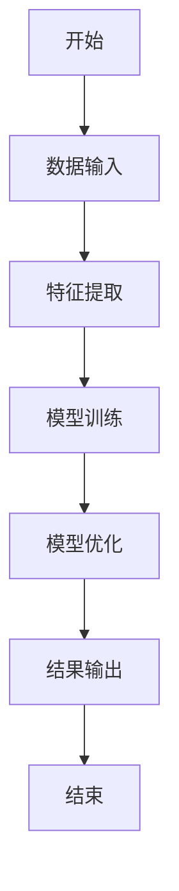
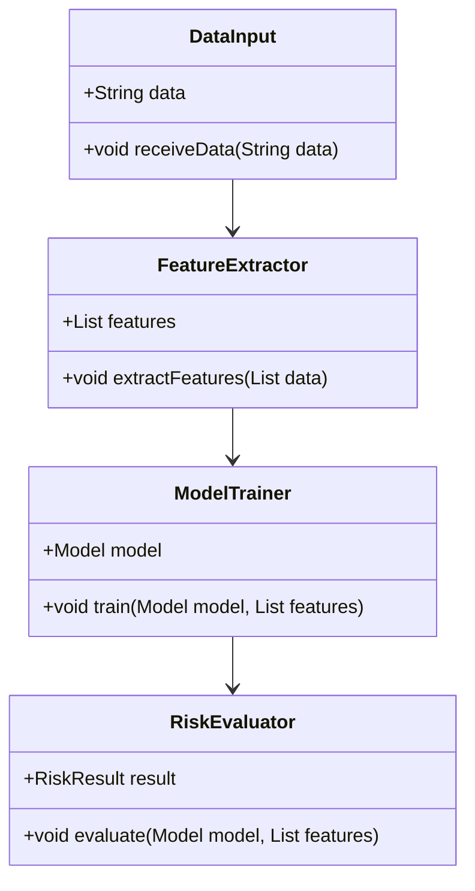
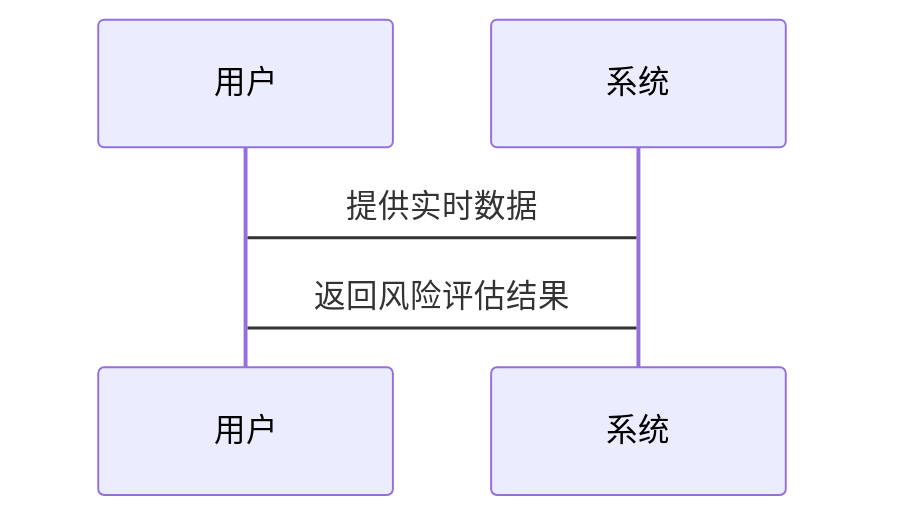

                 


# 利用AI构建自适应型安全边际模型：动态风险管理

---

## 关键词：
- AI
- 自适应型安全边际模型
- 动态风险管理
- 算法原理
- 系统架构设计
- 项目实战

---

## 摘要：
本文详细探讨了利用人工智能构建自适应型安全边际模型的方法，重点分析了动态风险管理的核心概念、算法原理、系统架构设计及实际应用。文章首先介绍了问题背景，然后从核心概念、算法原理、系统设计、项目实战等多方面展开，结合Mermaid流程图和Python代码示例，深入剖析了模型的实现细节。最后，本文总结了最佳实践和注意事项，为读者提供了一套完整的解决方案。

---

## 第1章：背景介绍

### 1.1 问题背景
在风险管理领域，传统的方法往往依赖于静态模型，难以适应实时变化的环境。随着数据量的爆炸式增长和复杂性的增加，传统的静态模型已无法满足现代风险管理的需求。动态风险管理需要一种能够实时调整和优化的模型，而人工智能技术恰好能够满足这一需求。

#### 1.1.1 风险管理的传统方法与局限性
传统风险管理方法通常基于历史数据和固定规则，缺乏灵活性和实时性。当市场环境发生变化时，这些模型无法及时调整，导致风险评估结果可能过时或不准确。

#### 1.1.2 AI在风险管理中的应用潜力
人工智能技术，特别是机器学习和深度学习，能够处理海量数据，并通过动态调整模型参数，实时捕捉数据中的变化趋势。这为动态风险管理提供了新的可能性。

#### 1.1.3 自适应模型的必要性
自适应型安全边际模型能够根据实时数据动态调整安全边际，从而更准确地评估和管理风险。这种模型在金融、医疗、交通等领域具有广泛的应用前景。

---

### 1.2 问题描述
安全边际模型的目标是通过计算风险边界，确定在不同风险水平下，资产或系统的安全范围。动态风险管理要求模型能够实时更新安全边界，以应对环境的变化。

#### 1.2.1 安全边际模型的核心目标
- 实时监控风险边界。
- 根据实时数据动态调整模型参数。
- 提供准确的风险评估结果。

#### 1.2.2 动态风险管理的挑战
- 数据的实时性和准确性。
- 模型的动态调整能力。
- 系统的实时响应能力。

#### 1.2.3 自适应型模型的定义与特点
自适应型安全边际模型是一种能够根据实时数据自动调整模型参数的动态风险管理模型。其特点是灵活性高、实时性强、适应性好。

---

### 1.3 问题解决
通过引入人工智能技术，自适应型安全边际模型能够实时更新安全边界，提高风险管理的准确性和效率。

#### 1.3.1 AI在模型构建中的作用
- 数据处理与特征提取。
- 模型训练与优化。
- 实时预测与调整。

#### 1.3.2 自适应算法的优势
- 能够处理非线性关系。
- 实时更新模型参数。
- 提高风险评估的准确性。

#### 1.3.3 动态调整机制的实现
通过反馈机制，模型能够根据实时数据不断优化安全边界，确保风险管理的准确性。

---

### 1.4 边界与外延
自适应型安全边际模型的边界在于其适用范围和应用场景。虽然模型具有广泛的应用前景，但在某些领域可能受到限制。

#### 1.4.1 模型的适用范围
- 金融市场中的风险评估。
- 物联网设备的安全管理。
- 医疗领域的实时风险监控。

#### 1.4.2 与其他风险管理方法的区别
自适应型模型强调动态调整，而传统模型注重静态分析。

#### 1.4.3 应用场景的扩展
随着技术的发展，自适应型模型的应用场景将不断扩展，涵盖更多领域。

---

### 1.5 概念结构与核心要素
自适应型安全边际模型的核心要素包括数据输入、模型训练、动态调整和结果输出。

#### 1.5.1 模型的基本构成
- 数据输入模块。
- 模型训练模块。
- 动态调整模块。
- 结果输出模块。

#### 1.5.2 核心要素的定义与关系
- 数据输入：提供实时数据。
- 模型训练：基于数据训练模型。
- 动态调整：根据实时数据更新模型参数。
- 结果输出：提供实时风险评估结果。

#### 1.5.3 模型的数学表达式
$$
\text{安全边界} = f(x_1, x_2, \ldots, x_n)
$$
其中，$x_i$ 表示输入数据，$f$ 表示模型函数。

---

## 第2章：核心概念与联系

### 2.1 模型原理
自适应型安全边际模型通过动态调整模型参数，实时更新安全边界，以应对环境的变化。

#### 2.1.1 自适应算法的数学基础
- 线性回归。
- 支持向量机。
- 神经网络。

#### 2.1.2 动态风险管理的实现机制
通过反馈机制，模型能够根据实时数据不断优化安全边界。

#### 2.1.3 AI在模型优化中的作用
- 提供高效的优化算法。
- 实现自动化的模型训练。

---

### 2.2 模型属性对比
通过对比分析，可以更好地理解自适应型安全边际模型的独特性。

#### 2.2.1 各种风险管理模型的对比分析
| 模型类型 | 静态模型 | 动态模型 | 自适应模型 |
|----------|----------|----------|------------|
| 数据依赖 | 历史数据 | 实时数据 | 实时数据    |
| 调整频率 | 低       | 高       | 实时调整    |
| 精度     | 中       | 高       | 更高        |

#### 2.2.2 自适应模型的独特性
- 实时性强。
- 精度高。
- 灵活性好。

#### 2.2.3 模型性能的评估标准
- 计算效率。
- 模型准确率。
- 实时响应时间。

---

### 2.3 ER实体关系图
通过ER图，可以清晰地展示模型的核心实体及其关系。

#### 2.3.1 实体关系的定义
- 用户：模型的使用者。
- 数据源：提供实时数据。
- 模型：核心计算模块。
- 结果输出：风险评估结果。

#### 2.3.2

---

## 第3章：算法原理讲解

### 3.1 算法原理
自适应型安全边际模型的核心算法基于机器学习，能够实时更新模型参数。

#### 3.1.1 算法流程图


#### 3.1.2 算法实现
```python
def adaptive_model(data):
    # 特征提取
    features = extract_features(data)
    # 模型训练
    model = train_model(features)
    # 动态调整
    updated_model = update_model(model, data)
    # 结果输出
    result = predict(updated_model, data)
    return result
```

---

### 3.2 算法数学模型
自适应型安全边际模型的数学模型如下：

$$
\text{安全边界} = w_1x_1 + w_2x_2 + \ldots + w_nx_n + b
$$
其中，$w_i$ 表示权重，$x_i$ 表示输入特征，$b$ 表示偏置。

---

## 第4章：系统分析与架构设计方案

### 4.1 问题场景介绍
本文设计的系统用于实时监控金融市场中的风险，帮助投资者做出决策。

#### 4.1.1 项目介绍
- 项目目标：实时监控金融市场的风险。
- 项目范围：涵盖股票、基金等多种金融产品。

---

### 4.2 系统功能设计
通过领域模型类图，可以清晰地展示系统的核心功能模块。

#### 4.2.1 领域模型类图


---

### 4.3 系统架构设计
系统架构采用分层设计，包括数据层、业务逻辑层和表现层。

#### 4.3.1 系统架构图
```mermaid
archi
    [数据层] -- 数据库
    [业务逻辑层] -- 自适应模型
    [表现层] -- 用户界面
```

---

### 4.4 系统接口设计
系统接口设计需要考虑数据输入、模型调用和结果输出。

#### 4.4.1 数据接口
- 数据输入接口：接收实时数据。
- 数据输出接口：提供风险评估结果。

#### 4.4.2 系统交互


---

## 第5章：项目实战

### 5.1 环境安装
需要安装Python、机器学习库（如scikit-learn）和Mermaid工具。

#### 5.1.1 环境配置
- 安装Python 3.8及以上版本。
- 安装scikit-learn、numpy、pandas等库。

---

### 5.2 系统核心实现
以下是核心代码实现：

#### 5.2.1 数据预处理
```python
import pandas as pd
import numpy as np

# 加载数据
data = pd.read_csv('data.csv')
# 特征提取
features = data[['feature1', 'feature2', ...]]
```

#### 5.2.2 模型训练
```python
from sklearn.linear_model import LinearRegression

# 初始化模型
model = LinearRegression()
# 训练模型
model.fit(features, labels)
```

---

### 5.3 案例分析
通过一个实际案例，展示模型的实现过程。

#### 5.3.1 案例数据
假设我们有一个金融数据集，包含股票价格和交易量等特征。

#### 5.3.2 模型应用
```python
# 预测风险
predicted_risk = model.predict(new_data)
```

---

## 第6章：最佳实践、小结、注意事项、拓展阅读

### 6.1 最佳实践
- 定期更新模型。
- 监控数据质量。
- 优化算法性能。

#### 6.1.1 关键点总结
- 数据的重要性。
- 模型的实时性。
- 系统的稳定性。

---

### 6.2 小结
本文详细介绍了利用AI构建自适应型安全边际模型的方法，包括背景、核心概念、算法原理和系统设计等内容。通过实际案例，展示了模型的实现过程和应用价值。

#### 6.2.1 关键点回顾
- AI在风险管理中的应用。
- 自适应型模型的优势。
- 动态风险管理的实现。

---

### 6.3 注意事项
- 数据隐私问题。
- 模型的实时性要求。
- 系统的稳定性保障。

#### 6.3.1 常见问题解答
- Q: 模型如何保证实时性？ A: 通过高效的算法和优化的系统架构。

---

### 6.4 拓展阅读
- 推荐阅读《机器学习实战》。
- 关注最新的AI研究成果。

---

## 作者：AI天才研究院/AI Genius Institute & 禅与计算机程序设计艺术 /Zen And The Art of Computer Programming

