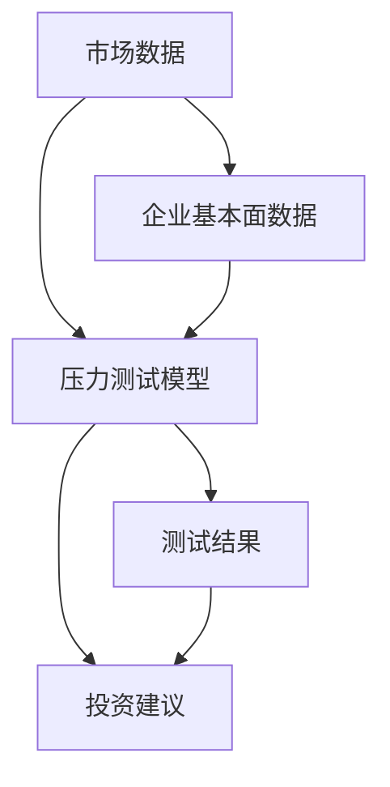
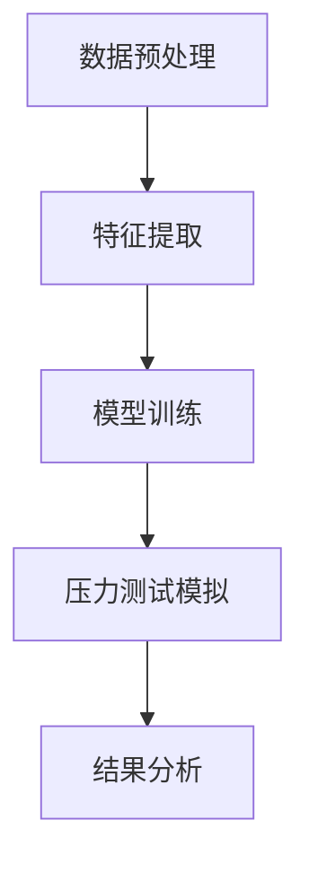
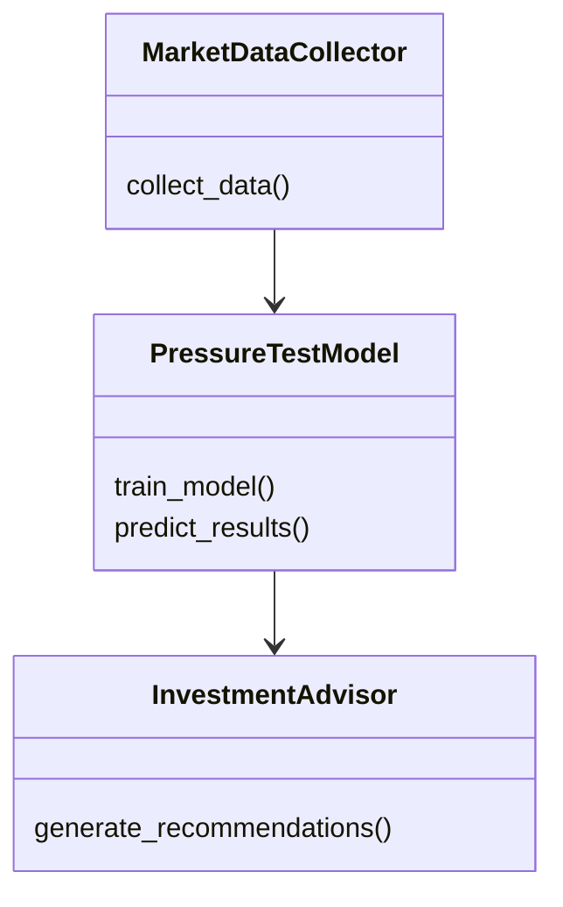
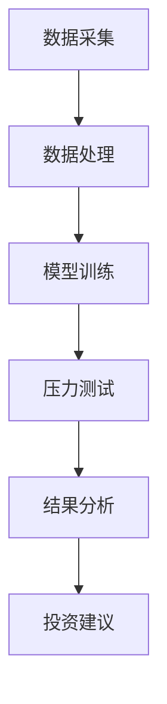
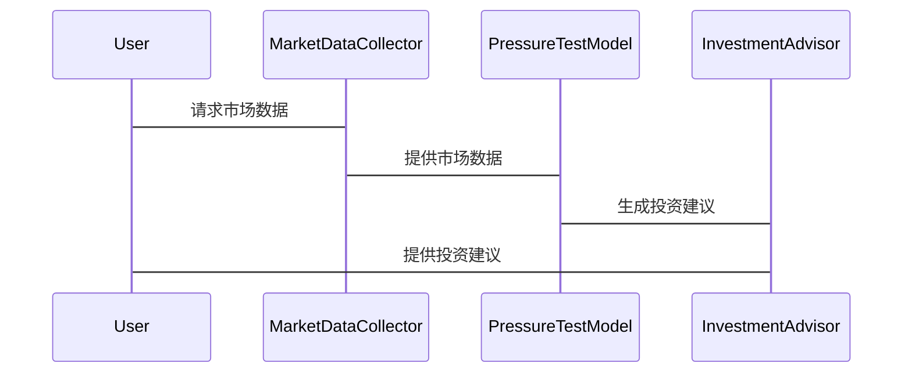

                 


# 利用AI进行动态财务压力测试：增强价值投资的安全性

> 关键词：动态财务压力测试, 人工智能, 价值投资, 风险管理, 股票市场, 财务模型

> 摘要：本文探讨了如何利用人工智能技术进行动态财务压力测试，以增强价值投资的安全性。通过分析传统压力测试的局限性，介绍AI在动态压力测试中的应用，包括算法原理、系统架构设计、项目实战等，展示AI如何帮助投资者在复杂市场环境中做出更安全的投资决策。

---

# 第1章: 动态财务压力测试概述

## 1.1 什么是动态财务压力测试

### 1.1.1 财务压力测试的定义与作用
财务压力测试是一种用于评估企业或投资组合在极端市场条件下表现的工具。传统的压力测试通常基于历史数据或假设情景，但这些方法在面对复杂、动态的市场环境时，往往显得不够灵活和准确。

### 1.1.2 动态压力测试的特点与优势
动态压力测试是一种实时、动态调整压力测试参数的方法。它能够根据市场变化、企业经营状况等因素，动态调整测试情景，从而更准确地反映投资组合在不同市场条件下的风险敞口。

### 1.1.3 动态压力测试的边界与外延
动态压力测试的边界包括测试的情景范围、测试的时间频率以及测试的粒度。外延则涉及压力测试的应用场景，如股票投资、债券投资、组合管理等。

## 1.2 AI在财务压力测试中的应用背景

### 1.2.1 传统财务压力测试的局限性
- 数据依赖性：传统压力测试依赖于历史数据，无法捕捉新的市场风险。
- 静态假设：测试情景通常是固定的，无法动态调整。
- 计算复杂性：复杂的投资组合需要大量计算资源。

### 1.2.2 AI技术在金融领域的潜力
- 数据处理能力：AI能够处理海量数据，发现数据中的复杂模式。
- 实时分析：AI可以实时更新模型，捕捉市场变化。
- 自动化决策：AI可以自动化生成压力测试结果，并提供投资建议。

### 1.2.3 结合AI的动态压力测试的必要性
- 提高测试的实时性和准确性。
- 增强投资决策的科学性。
- 降低人工操作的风险。

## 1.3 本章小结

---

# 第2章: AI驱动的动态压力测试核心概念

## 2.1 核心概念与原理

### 2.1.1 动态压力测试的数学模型
动态压力测试的核心在于构建一个能够动态调整参数的数学模型。模型需要考虑市场波动、企业基本面等因素。

$$
\text{模型公式：} \quad R = f(M, E, T)
$$

其中：
- \( R \) 表示投资组合在压力情景下的表现。
- \( M \) 表示市场数据。
- \( E \) 表示企业基本面数据。
- \( T \) 表示时间序列。

### 2.1.2 AI模型在压力测试中的作用
AI模型（如随机森林、神经网络）用于预测压力情景下的资产表现，帮助投资者提前识别潜在风险。

### 2.1.3 财务数据与AI模型的结合方式
- 数据输入：将财务数据（如股价、收益、现金流等）输入AI模型。
- 模型训练：利用历史数据训练模型，提取特征。
- 模型预测：根据实时数据预测压力情景下的资产表现。

## 2.2 核心概念对比表

| 对比维度 | 传统压力测试 | 动态压力测试（AI驱动） |
|----------|---------------|--------------------------|
| 数据来源 | 固定历史数据 | 实时更新数据             |
| 情景假设 | 固定情景     | 动态调整情景             |
| 计算效率 | 低            | 高                      |

## 2.3 实体关系图（ER图）



## 2.4 本章小结

---

# 第3章: AI动态压力测试的算法原理

## 3.1 算法流程



## 3.2 算法实现

### 3.2.1 数据预处理
```python
import pandas as pd
data = pd.read_csv('financial_data.csv')
# 删除缺失值
data.dropna(inplace=True)
# 标准化处理
from sklearn.preprocessing import StandardScaler
scaler = StandardScaler()
scaled_data = scaler.fit_transform(data[['revenue', 'profit', 'cash_flow']])
```

### 3.2.2 特征提取
```python
selected_features = ['market_value', 'volatility', 'liquidity']
```

### 3.2.3 模型训练
```python
from sklearn.ensemble import RandomForestRegressor
model = RandomForestRegressor(n_estimators=100)
model.fit(X_train, y_train)
```

### 3.2.4 压力测试模拟
```python
import numpy as np
def monte_carlo_simulation(n_simulations):
    results = []
    for _ in range(n_simulations):
        # 生成随机市场数据
        market_data = np.random.normal(loc=0, scale=1, size=len(selected_features))
        # 预测结果
        prediction = model.predict(market_data.reshape(1, -1))
        results.append(prediction)
    return results
```

## 3.3 数学模型与公式

### 3.3.1 蒙特卡洛模拟
$$
\text{预测结果} = f(\text{随机市场数据})
$$

### 3.3.2 随机森林模型
$$
\text{预测值} = \sum_{i=1}^{n} (\text{基尼指数} \times \text{权重})
$$

---

# 第4章: 系统分析与架构设计方案

## 4.1 问题场景介绍

### 4.1.1 项目背景
我们希望通过AI技术构建一个动态压力测试系统，帮助投资者在股票市场中做出更安全的投资决策。

### 4.1.2 项目目标
- 实现实时数据采集与处理。
- 构建动态压力测试模型。
- 提供实时压力测试结果和投资建议。

## 4.2 系统功能设计

### 4.2.1 领域模型（类图）



### 4.2.2 系统架构设计（架构图）



## 4.3 系统接口设计

### 4.3.1 API接口
- 数据接口：`GET /market-data`
- 模型接口：`POST /pressure-test`
- 结果接口：`GET /test-results`

## 4.4 系统交互设计（序列图）



---

# 第5章: 项目实战

## 5.1 环境安装

```bash
pip install numpy pandas scikit-learn
```

## 5.2 核心实现

### 5.2.1 数据预处理
```python
import pandas as pd
data = pd.read_csv('financial_data.csv')
data = data.dropna()
```

### 5.2.2 模型训练
```python
from sklearn.ensemble import RandomForestRegressor
model = RandomForestRegressor(n_estimators=100)
model.fit(data[['revenue', 'profit', 'cash_flow']], data['market_value'])
```

### 5.2.3 压力测试
```python
import numpy as np
market_data = np.random.normal(loc=0, scale=1, size=len(selected_features))
prediction = model.predict(market_data.reshape(1, -1))
print("预测市场价值：", prediction)
```

## 5.3 实际案例分析

### 5.3.1 案例背景
假设我们有一个股票投资组合，包含10只股票，我们需要评估它们在市场崩盘情况下的表现。

### 5.3.2 数据分析
通过AI模型预测，我们发现某些股票在极端市场条件下表现不佳，需要调整投资组合。

### 5.3.3 结果解读
根据模型预测结果，我们调整了投资组合，降低了风险敞口。

## 5.4 项目小结

---

# 第6章: 最佳实践与注意事项

## 6.1 最佳实践
- 数据质量：确保输入数据的准确性和完整性。
- 模型更新：定期更新模型，以反映市场变化。
- 结果验证：验证模型预测结果的准确性。

## 6.2 小结
AI驱动的动态压力测试是一种强大的工具，能够帮助投资者在复杂市场环境中做出更安全的投资决策。

## 6.3 注意事项
- 数据隐私：注意保护投资者的隐私数据。
- 模型局限：AI模型并非完美，需要结合人工判断。

## 6.4 拓展阅读
- 《机器学习在金融中的应用》
- 《动态压力测试方法论》

---

# 作者：AI天才研究院/AI Genius Institute & 禅与计算机程序设计艺术 /Zen And The Art of Computer Programming

