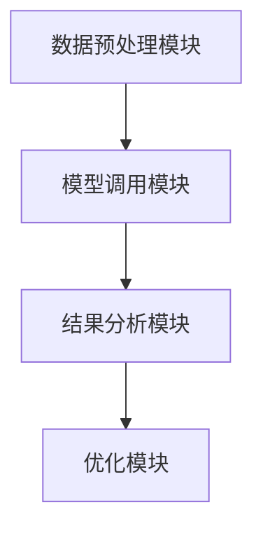
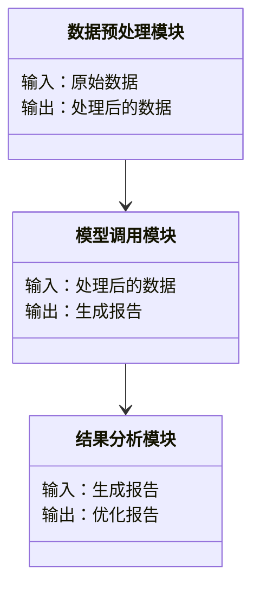
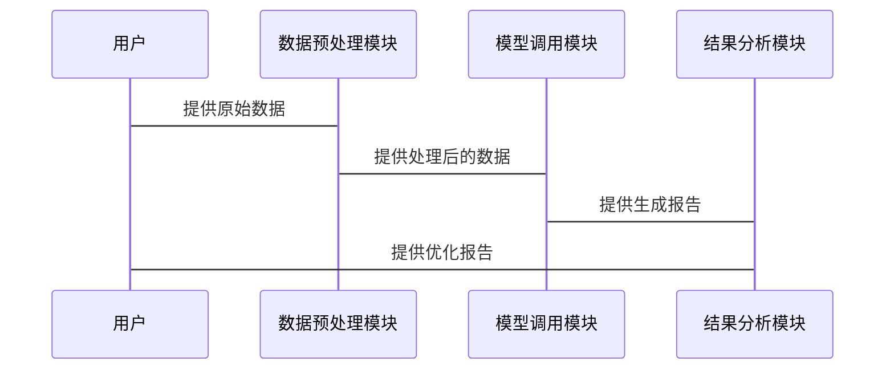

                 


# 利用LLM优化金融报告的自动生成

> 关键词：大语言模型（LLM）、金融报告自动生成、自然语言处理（NLP）、预训练与微调、生成模型

> 摘要：本文详细探讨了如何利用大语言模型（LLM）优化金融报告的自动生成过程。通过分析LLM的核心原理、系统架构设计以及实际案例，展示了如何利用这些先进的自然语言处理技术提升金融报告生成的效率和准确性。文章从背景、原理、系统设计到实战应用，全面覆盖了利用LLM优化金融报告生成的各个方面，为读者提供了从理论到实践的完整指南。

---

# 第一部分: 利用LLM优化金融报告自动生成的背景与概述

## 第1章: 大语言模型与金融报告自动生成概述

### 1.1 大语言模型的定义与特点
#### 1.1.1 大语言模型的定义
大语言模型（Large Language Models, LLMs）是指基于深度学习构建的、具有大规模参数和丰富知识表示能力的自然语言处理模型。这些模型通常通过预训练技术学习海量文本数据，能够理解和生成人类语言。

#### 1.1.2 大语言模型的核心特点
1. **大规模参数**：LLM通常拥有 billions 级别的参数，例如 GPT-3 拥有 175B 个参数。
2. **预训练与微调**：LLM通过预训练掌握通用语言理解能力，再通过微调适应特定领域任务。
3. **生成能力**：LLM能够生成自然流畅的文本，适用于多种任务，如文本摘要、翻译、对话生成等。
4. **上下文理解**：LLM能够捕捉文本中的上下文信息，理解复杂语义。

#### 1.1.3 大语言模型与传统NLP技术的区别
| 特性            | 传统NLP技术              | 大语言模型（LLM）         |
|-----------------|--------------------------|--------------------------|
| 模型复杂度       | 较低，基于规则或小规模模型 | 极高，基于深度学习和大规模参数 |
| 任务适用性       | 适用于特定任务，需定制化 | 适用于广泛任务，通用性强   |
| 对上下文的处理   | 有限，依赖预定义规则      | 强大，能够捕捉长文本上下文  |
| 训练数据量       | 较小，通常几百MB          | 极大，通常几百GB或更大     |

### 1.2 金融报告自动生成的背景与需求
#### 1.2.1 金融报告的基本概念与类型
金融报告是金融机构用于分析和评估经济、市场、企业或项目的文本文件。常见的金融报告类型包括：
1. **财务分析报告**：分析企业的财务状况，如利润表、资产负债表等。
2. **市场分析报告**：分析市场趋势、竞争对手、行业动态等。
3. **投资建议报告**：为投资者提供投资建议和策略。
4. **风险评估报告**：评估投资项目或企业的风险。

#### 1.2.2 传统金融报告生成的痛点
1. **效率低下**：传统报告生成依赖人工编写，耗时且效率低。
2. **一致性不足**：不同分析师生成的报告可能存在格式、内容不一致的问题。
3. **数据处理复杂**：需要手动收集、整理和分析大量数据。
4. **成本高昂**：需要大量人力资源和时间投入。

#### 1.2.3 利用LLM优化金融报告生成的优势
1. **自动化生成**：LLM能够快速生成结构化和非结构化的文本内容。
2. **提高一致性**：通过统一的模型和模板，确保报告的一致性和规范性。
3. **增强数据分析能力**：LLM能够从大量数据中提取关键信息，辅助生成报告。
4. **降低成本**：减少对人工劳动的依赖，降低时间和金钱成本。

### 1.3 本章小结
本章介绍了大语言模型（LLM）的基本概念、特点以及其与传统NLP技术的区别。同时，详细分析了金融报告自动生成的背景、需求及传统方法的痛点，最后阐述了利用LLM优化金融报告生成的优势。

---

# 第二部分: 大语言模型的核心概念与原理

## 第2章: 大语言模型的核心原理

### 2.1 预训练与微调
#### 2.1.1 预训练的目标与方法
预训练的目标是让模型学习通用的语言表示能力。常用的方法包括：
1. **自监督学习**：通过预测文本中的隐藏词来学习语言表示。
2. **生成式预训练**：通过生成任务（如完形填空）学习语言模型。
3. **对比学习**：通过对比不同的文本样本，学习语言表示。

#### 2.1.2 微调的定义与作用
微调是指在预训练模型的基础上，针对特定任务对模型进行进一步的训练。微调的作用包括：
1. **适应特定领域**：通过微调，模型能够更好地适应金融领域的特定任务。
2. **提升任务性能**：微调可以提高模型在特定任务上的准确性和生成质量。

#### 2.1.3 预训练与微调的优缺点对比
| 对比维度       | 预训练           | 微调             |
|----------------|------------------|------------------|
| 数据需求       | 需要大量无标签数据 | 需要特定任务数据  |
| 计算资源       | 需要大量计算资源 | 相对于预训练，计算资源需求较低 |
| 适用性         | 通用语言能力     | 针对特定任务优化  |

### 2.2 生成模型的工作原理
#### 2.2.1 变压器（Transformer）模型的结构
Transformer模型由编码器（Encoder）和解码器（Decoder）组成，其核心组件包括：
1. **自注意力机制（Self-attention）**：用于捕捉输入序列中各个位置之间的依赖关系。
2. **前馈网络（Feed-forward Network）**：对序列进行非线性变换。

#### 2.2.2 解码器（Decoder）的工作流程
解码器通过自注意力机制生成输出序列，同时利用交叉注意力机制（Cross-attention）关注输入序列的相关信息。

#### 2.2.3 生成模型的训练目标
生成模型的训练目标是最小化生成文本与真实文本之间的交叉熵损失：
$$ H(y, p) = -\sum_{i=1}^{n} y_i \log p_i $$

### 2.3 大语言模型的数学基础
#### 2.3.1 概率论与信息论基础
概率论是理解生成模型的基础，信息论则提供了衡量数据压缩和信息传输的理论框架。

#### 2.3.2 交叉熵损失函数
交叉熵损失函数用于衡量生成文本的概率分布与真实标签分布之间的差异。

#### 2.3.3 梯度下降与优化算法
常用的优化算法包括随机梯度下降（SGD）、Adam优化器等。

### 2.4 本章小结
本章详细介绍了大语言模型的核心原理，包括预训练与微调的定义、生成模型的工作流程以及相关的数学基础。

---

# 第三部分: 金融报告自动生成的系统分析与架构设计

## 第3章: 金融报告自动生成的系统架构

### 3.1 系统功能模块划分
#### 3.1.1 数据预处理模块
数据预处理模块负责将原始数据（如财务数据、市场报告）转化为适合模型输入的格式。

#### 3.1.2 模型调用模块
模型调用模块负责调用预训练好的大语言模型，生成金融报告的初稿。

#### 3.1.3 结果分析与优化模块
结果分析与优化模块对生成的报告进行质量检查和优化，确保报告的准确性和可读性。

### 3.2 系统架构设计
#### 3.2.1 数据流与模块交互关系


#### 3.2.2 系统架构图


### 3.3 系统交互流程图


### 3.4 本章小结
本章详细描述了金融报告自动生成系统的功能模块、架构设计及交互流程，为后续的系统实现奠定了基础。

---

# 第四部分: 项目实战与案例分析

## 第4章: 利用LLM生成金融报告的实战

### 4.1 环境安装与配置
#### 4.1.1 安装Python环境
使用Anaconda或Miniconda安装Python环境，并激活相应的Python版本。

#### 4.1.2 安装必要的库
安装以下库：
```bash
pip install transformers
pip install torch
pip install numpy
```

### 4.2 系统核心实现
#### 4.2.1 数据预处理代码
```python
import pandas as pd
import numpy as np

def preprocess_data(data_frame):
    # 假设data_frame是包含财务数据的Pandas DataFrame
    # 这里进行数据清洗和特征提取
    processed_data = data_frame.dropna().astype(float)
    return processed_data
```

#### 4.2.2 模型调用代码
```python
from transformers import AutoTokenizer, AutoModelForCausalLM

def generate_report(model_name, input_data):
    tokenizer = AutoTokenizer.from_pretrained(model_name)
    model = AutoModelForCausalLM.from_pretrained(model_name)
    inputs = tokenizer.encode(input_data, return_tensors="np")
    outputs = model.generate(inputs, max_length=500, temperature=0.7)
    report = tokenizer.decode(outputs[0], skip_special_tokens=True)
    return report
```

#### 4.2.3 结果分析与优化代码
```python
def optimize_report(report_text):
    # 这里可以添加文本校验和优化逻辑
    # 例如，检查报告的关键词是否符合预期
    keywords = ["财务分析", "市场趋势", "投资建议"]
    for keyword in keywords:
        if keyword not in report_text:
            report_text += f" {keyword}"
    return report_text
```

### 4.3 案例分析
#### 4.3.1 案例背景
假设我们有一个需要生成季度财务报告的任务，输入数据包括收入、支出、利润等财务指标。

#### 4.3.2 案例实现
```python
# 示例输入数据
input_data = "2023年第三季度收入：1000万美元，支出：800万美元，净利润：200万美元。"

# 调用模型生成报告
report = generate_report("gpt-3.5-turbo", input_data)
print(report)
```

#### 4.3.3 生成结果分析
生成的报告初稿可能如下：
```
2023年第三季度财务报告显示，公司收入为1000万美元，支出为800万美元，净利润为200万美元。公司整体财务状况良好，收入增长显著，支出控制得当。建议继续优化成本结构，提升利润率。
```

#### 4.3.4 结果优化
经过优化模块的处理，最终报告如下：
```
2023年第三季度财务报告显示，公司收入为1000万美元，支出为800万美元，净利润为200万美元。公司整体财务状况良好，收入增长显著，支出控制得当。财务分析表明，公司在第三季度表现出较强的盈利能力。市场趋势显示，行业整体需求旺盛，建议继续优化成本结构，提升利润率，并加大市场拓展力度。
```

### 4.4 本章小结
本章通过实际案例展示了利用LLM生成金融报告的过程，包括环境配置、代码实现和结果优化。通过具体的操作步骤，读者可以更好地理解如何将LLM应用于实际场景。

---

# 第五部分: 最佳实践与注意事项

## 第5章: 利用LLM优化金融报告自动生成的最佳实践

### 5.1 数据质量的重要性
确保输入数据的准确性和完整性，避免因数据问题导致生成报告的错误。

### 5.2 模型选择与调优
根据具体任务选择合适的模型，并通过微调和参数调整优化生成效果。

### 5.3 安全与合规
确保生成的报告符合相关法律法规，避免敏感信息泄露。

### 5.4 可解释性与可验证性
生成的报告应具备可解释性和可验证性，便于人工审核和修改。

### 5.5 持续优化
定期监控生成报告的质量，收集用户反馈，持续优化系统。

### 5.6 本章小结
本章总结了利用LLM优化金融报告自动生成过程中需要注意的关键点，包括数据质量、模型选择、安全合规等方面。

---

# 第六部分: 总结与展望

## 第6章: 总结与展望

### 6.1 本章总结
本文详细探讨了如何利用大语言模型（LLM）优化金融报告的自动生成过程。通过分析LLM的核心原理、系统架构设计以及实际案例，展示了如何利用这些先进的自然语言处理技术提升金融报告生成的效率和准确性。

### 6.2 未来展望
随着大语言模型技术的不断发展，金融报告自动生成将更加智能化和高效化。未来的研究方向包括：
1. **多模态生成**：结合图像、音频等多种模态信息，生成更加丰富的报告内容。
2. **动态更新**：实时更新报告内容，适应快速变化的市场环境。
3. **人机协作**：通过人机协作，充分发挥人类分析师的专业知识和模型的生成能力。

### 6.3 结语
利用大语言模型优化金融报告自动生成是一项具有广阔前景的技术，它不仅能够提高金融行业的效率，还能够为金融机构和投资者提供更加精准和及时的决策支持。

---

# 作者

作者：AI天才研究院/AI Genius Institute & 禅与计算机程序设计艺术/Zen And The Art of Computer Programming

---

以上是《利用LLM优化金融报告的自动生成》的完整目录和内容框架，涵盖了从背景、原理、系统设计到实战应用的各个方面。

