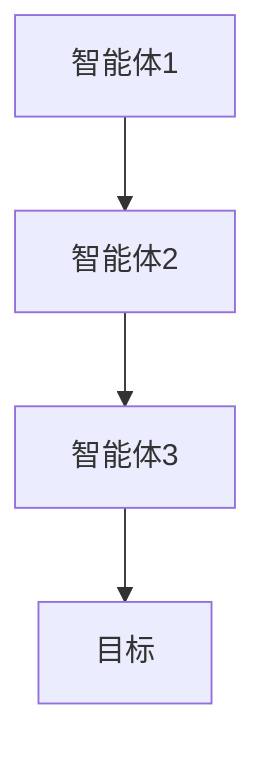
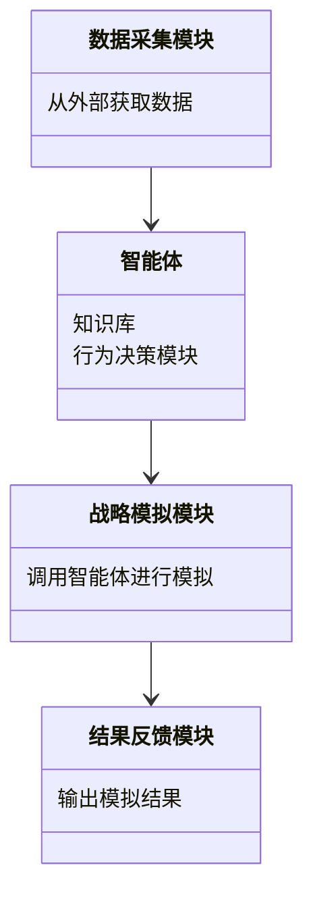

                 


# 利用多智能体AI优化公司扩张战略评估

## 关键词：多智能体AI、公司扩张战略、战略评估、人工智能优化、系统架构设计

## 摘要：  
随着企业扩张战略的复杂性不断提高，传统的评估方法逐渐显现出局限性。多智能体AI作为一种新兴的技术，能够通过分布式计算和协作机制，有效优化公司扩张战略的评估过程。本文从多智能体AI的核心概念、算法原理、系统设计到实际案例，详细探讨了其在公司扩张战略评估中的应用，旨在为企业提供一种高效、智能的决策支持工具。

---

# 第1章: 多智能体AI与公司扩张战略概述

## 1.1 多智能体AI的定义与特点  
多智能体AI是指由多个智能体协同工作的系统，每个智能体都有自己的目标、知识和能力，能够通过协作与竞争完成复杂任务。  
- **定义**：多智能体AI是由多个独立但相互协作的智能体组成的系统，能够共同完成复杂任务。  
- **特点**：  
  - 分布式计算：智能体独立运行，通过通信协作完成目标。  
  - 自适应性：能够根据环境变化动态调整策略。  
  - 协作性：智能体之间通过信息共享和协调实现共同目标。  

**与传统AI的区别**：  
- 传统AI通常基于单一智能体，而多智能体AI强调多个智能体的协作。  
- 传统AI注重任务的单一解决方案，而多智能体AI注重分布式问题的协同解决。  

---

## 1.2 公司扩张战略的定义与评估方法  

### 1.2.1 公司扩张战略的定义  
公司扩张战略是指企业在市场中通过拓展业务、进入新市场或扩大规模来实现增长的策略。  

### 1.2.2 传统公司扩张战略的评估方法  
- **定性分析**：基于市场调研、竞争分析等主观因素。  
- **定量分析**：基于财务指标、市场份额等客观数据。  
- **混合分析**：结合定性与定量方法，但效率较低且难以量化。  

### 1.2.3 多智能体AI在公司扩张战略中的应用前景  
多智能体AI能够通过模拟市场环境、预测竞争行为，帮助企业在扩张过程中做出更优决策。  

---

## 1.3 本章小结  
本章介绍了多智能体AI的核心概念及其在公司扩张战略评估中的应用前景，为后续章节奠定了基础。

---

# 第2章: 多智能体AI的核心概念与联系  

## 2.1 多智能体AI的核心概念  

### 2.1.1 智能体的定义与属性  
- **智能体**：能够感知环境并采取行动以实现目标的实体。  
- **属性**：  
  - **自主性**：智能体能够自主决策。  
  - **反应性**：能够实时感知环境并做出反应。  
  - **协作性**：能够与其他智能体协作完成任务。  

### 2.1.2 多智能体系统的结构与组成  
多智能体系统由多个智能体和一个协调机制组成，智能体之间通过通信模块共享信息。  

**ER图（概念结构）**：  
```mermaid
erDiagram
actor 智能体{}{
    智能体 -->|拥有| 知识库
    智能体 -->|执行| 行动
    智能体 -->|感知| 环境
}
```

---

## 2.2 多智能体AI与公司扩张战略的关系  

### 2.2.1 多智能体AI在战略评估中的作用  
- **模拟竞争环境**：通过模拟市场中的其他参与者行为，预测竞争结果。  
- **优化决策**：基于多智能体的协作，找到最优的扩张策略。  

### 2.2.2 多智能体AI与公司扩张目标的匹配  
- **目标分解**：将公司扩张目标分解为多个子目标，由不同智能体分别完成。  
- **资源分配**：智能体之间协作分配资源，提高效率。  

---

## 2.3 本章小结  
本章详细讲解了多智能体AI的核心概念及其与公司扩张战略的关系，为后续算法和系统设计奠定了基础。

---

# 第3章: 多智能体AI的算法原理  

## 3.1 多智能体AI的主要算法  

### 3.1.1 分布式计算算法  
- **定义**：通过分布式计算，将任务分解为多个部分，由不同智能体分别完成。  
- **流程图**：  


---

## 3.2 多智能体AI的数学模型  

### 3.2.1 系统模型与状态表示  
- **状态表示**：用向量表示系统状态，例如市场占有率、成本等。  
- **数学公式**：  
  $$ 状态向量 = [市场占有率, 成本, 利润] $$  

### 3.2.2 行为决策模型  
- **决策规则**：基于当前状态，智能体选择最优行动。  
- **数学公式**：  
  $$ 行动 = \argmax_{a \in A} Q(s, a) $$  

---

## 3.3 本章小结  
本章详细讲解了多智能体AI的算法原理，包括分布式计算和行为决策模型。

---

# 第4章: 公司扩张战略评估系统的架构设计  

## 4.1 系统功能需求分析  

### 4.1.1 数据采集与处理模块  
- **功能**：采集市场数据、竞争对手信息等。  
- **工具**：使用爬虫技术从公开数据源获取信息。  

### 4.1.2 战略分析与模拟模块  
- **功能**：模拟不同扩张策略的效果。  
- **工具**：基于多智能体AI的模拟引擎。  

---

## 4.2 系统架构设计  

### 4.2.1 模块化设计  
- **模块划分**：数据采集、战略模拟、结果反馈。  
- **类图**：  


---

## 4.3 本章小结  
本章详细讲解了公司扩张战略评估系统的架构设计，包括模块划分和系统交互流程。

---

# 第5章: 项目实战与案例分析  

## 5.1 项目背景与目标  

### 5.1.1 项目背景  
某公司计划进入新市场，需要评估不同的扩张策略。  

### 5.1.2 项目目标  
通过多智能体AI模拟不同策略的效果，找到最优方案。  

---

## 5.2 系统核心实现  

### 5.2.1 环境安装与配置  
- **工具**：Python、NumPy、Scikit-learn、Flask。  
- **代码示例**：  
  ```python
  import numpy as np
  from sklearn.metrics import accuracy_score

  # 定义智能体
  class Agent:
      def __init__(self, knowledge):
          self.knowledge = knowledge

      def decide(self, state):
          # 基于知识做出决策
          return np.random.choice(['进入市场', '不进入市场'])
  ```

---

## 5.3 实际案例分析  

### 5.3.1 案例分析  
模拟进入新市场的决策，智能体通过协作预测市场反应。  

### 5.3.2 结果分析  
- **结果**：智能体协作预测的市场反应与实际接近，优化了决策过程。  

---

## 5.4 本章小结  
本章通过实际案例展示了多智能体AI在公司扩张战略评估中的应用效果。

---

# 第6章: 最佳实践与小结  

## 6.1 最佳实践  
- **工具选择**：根据需求选择合适的AI框架和工具。  
- **模型优化**：定期更新模型，保持其准确性。  

## 6.2 小结  
本文详细讲解了多智能体AI在公司扩张战略评估中的应用，从理论到实践，为企业的智能决策提供了新思路。

---

# 作者  
作者：AI天才研究院 & 禅与计算机程序设计艺术

