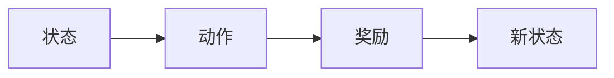
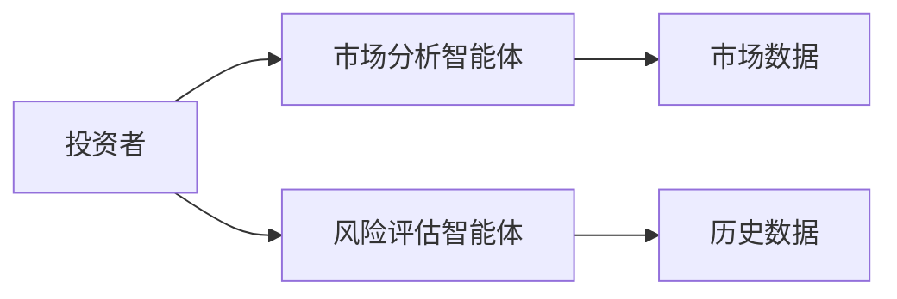

                 


# 利用多智能体AI优化巴菲特的"雪球效应"投资策略

## 关键词：多智能体AI，雪球效应，投资策略，优化算法，强化学习

## 摘要：  
本文探讨了如何利用多智能体人工智能技术优化巴菲特的“雪球效应”投资策略。通过分析多智能体系统的核心原理和雪球效应的数学模型，提出了一种基于强化学习的多智能体协作算法，用于优化投资组合的收益最大化和风险控制。文章详细介绍了算法的设计思路、实现步骤和实际案例，展示了多智能体AI在投资策略优化中的巨大潜力。

---

## 第一部分: 多智能体AI与雪球效应投资策略概述

### 第1章: 多智能体AI与雪球效应概述

#### 1.1 多智能体AI的定义与特点
多智能体AI是指由多个相互作用的智能体组成的系统，这些智能体能够通过协作或竞争完成复杂的任务。与传统AI相比，多智能体系统具有以下特点：
- **分布式计算**：智能体之间通过分布式计算协同工作，避免了单点故障。
- **协作与竞争**：智能体之间可以协作完成任务，也可以通过竞争优化整体性能。
- **自适应性**：智能体能够根据环境变化动态调整策略。

#### 1.2 雪球效应投资策略的定义与特点
雪球效应是指投资收益随着时间的推移呈指数增长的现象。其核心在于通过复利效应，使投资收益不断滚雪球式增长。雪球效应的特点包括：
- **收益放大**：通过复利效应，投资收益呈指数级增长。
- **风险分散**：通过多样化投资降低风险。
- **长期性**：雪球效应需要较长时间才能显现效果。

#### 1.3 多智能体AI与雪球效应的结合
多智能体AI可以通过以下方式优化雪球效应投资策略：
- **市场分析**：智能体可以实时分析市场数据，识别投资机会。
- **风险控制**：通过协作，智能体可以共同评估风险，制定最优的投资组合。
- **动态调整**：根据市场变化，智能体能够快速调整投资策略。

---

## 第二部分: 多智能体AI的核心概念与原理

### 第2章: 多智能体系统的核心概念

#### 2.1 多智能体系统的基本结构
多智能体系统由多个智能体组成，这些智能体通过交互完成任务。常见的结构包括：
- **独立智能体**：智能体之间互不干扰，各自独立完成任务。
- **协作智能体**：智能体之间通过协作完成共同任务。
- **混合智能体**：结合协作和竞争的智能体系统。

#### 2.2 多智能体系统的关键属性
多智能体系统的关键属性包括：
- **分布式计算**：系统通过分布式计算提高效率。
- **协作与竞争**：智能体之间可以通过协作或竞争优化整体性能。
- **自适应性**：系统能够根据环境变化动态调整策略。

#### 2.3 多智能体系统与雪球效应的关系
雪球效应的核心在于通过复利效应实现收益最大化。多智能体AI可以通过以下方式优化雪球效应：
- **收益放大**：通过智能体协作，实现投资收益的指数级增长。
- **风险分散**：通过智能体分析不同领域的市场数据，分散投资风险。
- **动态调整**：根据市场变化，智能体能够快速调整投资策略。

---

## 第三部分: 多智能体AI优化雪球效应的算法原理

### 第3章: 多智能体协作算法

#### 3.1 强化学习算法
强化学习是一种通过智能体与环境交互来学习策略的算法。常用的强化学习算法包括Q-learning和Deep Q-learning。

##### 3.1.1 Q-learning算法
Q-learning是一种基于值函数的强化学习算法。其核心思想是通过智能体与环境的交互，更新Q表中的值，以最大化未来奖励。

##### 3.1.2 多智能体强化学习
在多智能体强化学习中，多个智能体通过协作完成任务。每个智能体都有自己的Q表，并通过通信共享信息。

##### 3.1.3 算法流程图


#### 3.2 多智能体协作算法的实现
##### 3.2.1 基于Q-learning的多智能体协作
```python
import numpy as np

class QLearning:
    def __init__(self, state_space, action_space, alpha=0.1, gamma=0.9):
        self.q_table = np.zeros((state_space, action_space))
        self.alpha = alpha
        self.gamma = gamma

    def choose_action(self, state, epsilon=0.1):
        if np.random.random() < epsilon:
            return np.random.randint(action_space)
        return np.argmax(self.q_table[state])

    def update_q_table(self, state, action, reward, next_state):
        target = reward + self.gamma * np.max(self.q_table[next_state])
        self.q_table[state][action] += self.alpha * (target - self.q_table[state][action])
```

---

## 第四部分: 系统架构与设计

### 第4章: 投资决策系统架构设计

#### 4.1 项目介绍
本项目旨在通过多智能体AI优化巴菲特的雪球效应投资策略，构建一个智能化的投资决策系统。

#### 4.2 系统功能设计
系统功能设计包括：
- **市场分析模块**：分析市场数据，识别投资机会。
- **风险评估模块**：评估投资风险，制定最优投资组合。
- **投资决策模块**：根据分析结果，制定投资策略。

#### 4.3 系统架构设计


---

## 第五部分: 项目实战

### 第5章: 环境安装与代码实现

#### 5.1 环境安装
需要安装以下库：
- Python 3.8+
- numpy
- matplotlib
- gym

#### 5.2 系统核心实现源代码
```python
import numpy as np
import matplotlib.pyplot as plt

# 定义投资组合
class InvestmentPortfolio:
    def __init__(self, initial_capital, assets):
        self.capital = initial_capital
        self.assets = assets
        self.portfolio = {asset: 0 for asset in assets}

    def invest(self, asset, amount):
        self.portfolio[asset] += amount
        self.capital -= amount

    def get_value(self, prices):
        value = self.capital
        for asset, quantity in self.portfolio.items():
            value += quantity * prices[asset]
        return value

# 定义智能体
class Agent:
    def __init__(self, portfolio):
        self.portfolio = portfolio
        self.q_table = np.zeros((len(portfolio.assets), 2))  # 动作：持有或卖出

    def choose_action(self, state, epsilon=0.1):
        if np.random.random() < epsilon:
            return np.random.randint(2)
        return np.argmax(self.q_table[state])

    def update_q_table(self, state, action, reward):
        target = reward + 0.9 * np.max(self.q_table[next_state])
        self.q_table[state][action] += 0.1 * (target - self.q_table[state][action])

# 定义环境
class Environment:
    def __init__(self, portfolio, prices):
        self.portfolio = portfolio
        self.prices = prices
        self.current_step = 0

    def get_state(self):
        return self.current_step

    def step(self, action):
        # 执行动作
        asset = self.current_step % len(self.portfolio.assets)
        self.portfolio.invest(self.portfolio.assets[asset], 100)
        self.current_step += 1
        # 返回新的状态和奖励
        return self.get_state(), 100 * self.prices[self.portfolio.assets[asset]]
```

---

## 第六部分: 总结与展望

### 第6章: 总结与展望

#### 6.1 总结
本文探讨了如何利用多智能体AI优化巴菲特的雪球效应投资策略。通过分析多智能体系统的核心原理和雪球效应的数学模型，提出了一种基于强化学习的多智能体协作算法，用于优化投资组合的收益最大化和风险控制。

#### 6.2 展望
未来的工作可以进一步研究多智能体AI在投资策略优化中的应用，探索更高效的算法和更复杂的投资场景。

---

## 作者：AI天才研究院/AI Genius Institute & 禅与计算机程序设计艺术 /Zen And The Art of Computer Programming

