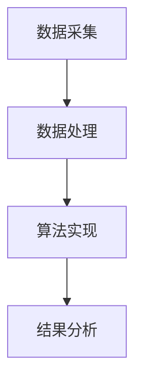
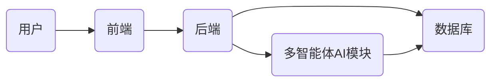
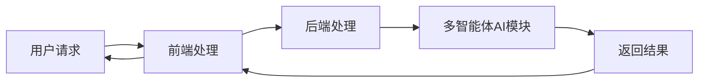

                 


```markdown
# 利用多智能体AI优化投资组合：价值投资新范式

> 关键词：多智能体AI，投资组合优化，价值投资，算法，系统架构设计

> 摘要：本文探讨了如何利用多智能体人工智能技术优化投资组合，提出了价值投资的新范式。通过分析多智能体AI的核心算法、系统架构设计及实际应用案例，展示了如何通过分布式计算和协作学习提升投资决策的效率和准确性。

---

## 第一部分：多智能体AI与投资组合优化的背景介绍

### 第1章：多智能体AI的基本概念

#### 1.1 多智能体AI的定义与特点
多智能体AI（Multi-Agent AI）是由多个相互作用的智能体组成的系统，每个智能体具有自主性、反应性和协作性。其特点包括：
- **自主性**：每个智能体能够独立感知环境并做出决策。
- **反应性**：智能体能够实时响应环境变化。
- **协作性**：多个智能体通过协作完成复杂任务。

#### 1.2 投资组合优化的基本原理
投资组合优化是指在给定风险偏好下，通过优化算法选择最优的资产配置。其核心目标是最大化收益或最小化风险。传统方法包括均值-方差优化和风险平价等，但存在以下问题：
- 计算复杂性高。
- 需要频繁调整以应对市场变化。
- 无法充分利用多源数据。

---

### 第2章：多智能体AI在金融投资中的应用

#### 2.1 多智能体AI在金融中的应用现状
多智能体AI在金融领域的应用包括：
- **金融数据分析**：通过分布式计算处理海量数据。
- **投资组合优化**：利用多智能体协作提高决策效率。
- **风险管理**：通过实时协作降低投资风险。

#### 2.2 多智能体AI在价值投资中的优势
多智能体AI能够通过以下方式优化投资组合：
- **提高决策效率**：多个智能体并行处理数据。
- **增强风险控制**：实时协作降低投资风险。
- **优化资产配置**：通过协作学习实现更优的资产组合。

---

## 第二部分：多智能体AI的核心算法与数学模型

### 第3章：种群算法在多智能体AI中的应用

#### 3.1 种群算法的基本原理
种群算法是一种基于自然选择和遗传机制的优化算法，主要包括以下步骤：
1. 初始化种群。
2. 计算适应度。
3. 选择优秀个体。
4. 进行交叉和变异。
5. 重复迭代。

种群算法的数学模型如下：
$$
f(x) = \text{适应度函数}
$$

#### 3.2 强化学习在多智能体AI中的应用
强化学习通过智能体与环境的交互来优化策略。在投资组合优化中，智能体通过试错学习最优的资产配置策略。多智能体强化学习的挑战在于协调多个智能体的动作。

---

### 第4章：分布式计算与多智能体协作

#### 4.1 分布式计算的基本原理
分布式计算将任务分解成多个子任务，由不同的计算节点并行处理。在投资组合优化中，多个智能体可以同时处理不同的数据源。

#### 4.2 多智能体协作的算法实现
多智能体协作算法通过通信协议共享信息，实现全局最优。例如，分布式遗传算法通过节点间共享基因信息优化投资组合。

---

## 第三部分：系统架构设计与实现

### 第5章：系统功能设计

#### 5.1 系统功能模块划分
系统功能模块包括：
- **数据采集模块**：获取市场数据。
- **数据处理模块**：清洗和预处理数据。
- **算法实现模块**：运行多智能体优化算法。
- **结果分析模块**：评估投资组合的收益和风险。

#### 5.2 系统功能流程图


### 第6章：系统架构设计

#### 6.1 系统架构图


#### 6.2 系统接口设计
系统接口包括：
- 数据接口：与数据源对接。
- 算法接口：与多智能体AI模块对接。
- 用户接口：与前端交互。

#### 6.3 系统交互流程图


---

## 第四部分：项目实战

### 第7章：环境安装与核心实现

#### 7.1 环境安装
安装所需的Python库：
```bash
pip install numpy pandas scikit-learn matplotlib
```

#### 7.2 核心代码实现
种群算法实现：
```python
import numpy as np

def fitness(x):
    return -x**2 + 4*x

population = np.random.rand(100)
fitness_values = [fitness(x) for x in population]
selected = population[np.argsort(fitness_values)]
```

---

## 第五部分：总结与展望

### 第8章：总结与展望

#### 8.1 最佳实践
- 定期更新模型参数。
- 监控市场数据变化。
- 优化算法效率。

#### 8.2 未来研究方向
- 研究更高效的多智能体协作算法。
- 探索多模态数据的应用。
- 提升系统的实时性和可扩展性。

---

作者：AI天才研究院 & 禅与计算机程序设计艺术
```

